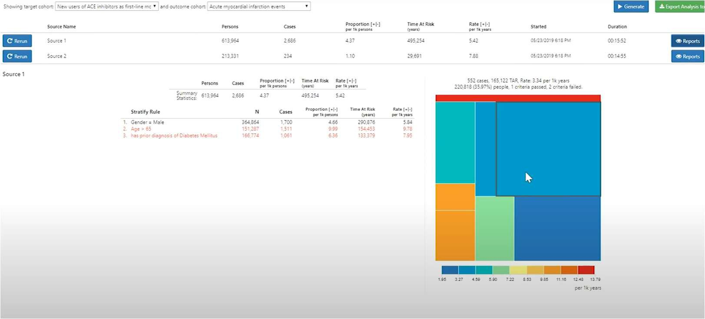

# **Atlas 機能調査補足資料**

 ### **目次**  
[1．本書について](#1本書について)  
[2．Atlas について](#2atlas-について)  
[3．患者一人当たりの分析](#3患者一人当たりの分析)  
　[3．1　Profiles とは](#31-profiles-とは)  
　[3．2　Profiles の使用方法](#32-profiles-の使用方法)  
[4．母集団当たりの分析](#4-母集団当たりの分析)  
　[4．1　Data Sources](#41-data-sources)  
　[4．2　Concept Sets](#42-concept-sets)  
　[4．3　Cohort Definitions](#43-cohort-definitions)  
　[4．4　Characterization（特性評価）](#44-characterization特性評価)  
　[4．5　Cohort Pathways（経路分析）](#45-cohort-pathways経路分析)  
　[4．6　Incidence Rates（発生率）](#46-incidence-rates発生率)  
　[4．7　Estimation（推定）](#47-estimation推定)  
　[4．8　Prediction（予測）](#48-prediction予測)  

 

---
# **1．本書について**
本書はAtlas の持つ各機能の概要をまとめたものであり、「The Book of OHDSI」やAtlasのGitHub ページの内容を抜粋して作成しています。  
下記の3 つの機能に関しては「Atlas 操作手順書」において具体的な操作方法を記載していますので、そちらも併せて参照してください。  
- Concept Sets
- Cohort Definitions
- Cohort Pathways  

より詳細な情報について知りたい場合は、以下のURL を参照してください。  
- 「The Book of OHDSI」  https://ohdsi.github.io/TheBookOfOhdsi/  
- 「OHDSI/Atlas – GitHub」  https://github.com/OHDSI/Atlas

 

---
# **2．Atlas について**
Atlas はOMOP 共通データモデル（CDM）に変換され標準化された観測データに対して科学的分析を実施するためのオープンソースソフトウェアツールであり、OHDSI（The Observational Health Data Sciences and Informatics）コミュニティによって開発されました。  
Atlas は患者コホートの定義、分析設計の選択、パラメータの設定、データに対する分析手法の実行を可能にします。  
Atlas には14 個のタブが表示されており、そのうち分析に関係する機能としては10 個挙げられます。  
全機能の関連図は以下の通りです。  

 

Profiles は、患者一人当たりの分析に適しています。患者個々の縦断的な観察データを調査し、特定の個人内で何が起こっているのか（病歴、薬歴など）を可視化することができます。  
一方、その他の機能は母集団当たりの分析に使用します。母集団の特性評価や発生率、推定、予測等の分析を実施することができます。  

 

---
# **3．患者一人当たりの分析**

## **3．1　Profiles とは**
Profiles は患者個々の縦断的な観察データを調査し、特定の個人内で何が起こっているのか（病歴、薬歴など）を集約・可視化する機能を持ちます。  
Profiles では、ある一人の患者のテーブルごとのデータが時系列に沿ってグラフ化されています。  
データが存在する箇所を灰色で示しており、横幅の⾧さで継続期間を表しています。  

 

---
## **3．2　Profiles の使用方法**
画面左の「Profiles」タブをクリックします。「Select a Data Source」をクリックすると登録されているデータソースが表示されるので、分析対象を含むデータソースを選択します。（①）  
右枠にはデータソース内の対象患者のPerson Id を入力して（②）「Enter」キーを押すと、患者のプロファイルが表示されます。  

 

入力したPerson Id の性別、イベント数、観察開始年齢と該当する全観察期間の全イベント（灰色のボックス）が表示されます。  
グラフの下には、全イベントのコンセプト一覧（赤枠）が表示され、観察開始日を0 日としたときの開始日と終了日が情報として記載されています。  

 

特定の期間を拡大表示することも可能です。  
グラフ上にカーソルを合わせると十字キーに変わります。対象の期間の範囲でドラッグアンドドロップをすると期間を絞ったイベントが表示されます。（赤枠内）  
グラフ下のコンセプト一覧についても絞った期間の範囲に発生するイベントのみの表示に変わります。  

 

グラフ上でダブルクリックをすると、全期間表示に戻ります。  
キーワードフィルタ（①）によって病名や薬品名、コンセプト等で絞り込みができ、それぞれの開始日と終了日がコンセプト一覧中に表示されます。画面左下のDomain フィルター（②）を使用しても同様に絞り込みが可能です。  
右上の筆マーク（③）でコンセプトを絞り込み、特定のコンセプトの灰色のドットの色を変えることができ（複数可）、差別化したいときに活用できます。  

 

---
# **4　母集団当たりの分析**
母集団当たりの分析における各機能の関係図を以下に示しています。  
分析の準備に使用する機能と、分析実施に使用する機能に分類することができます。  

準備：Data Sources、Search、Concept Sets、Cohort Definitions  
分析：Cohort Pathways、Characterization、Incidence Rate、Estimation、Prediction  

 

上図の「調査したい母集団に関する分析の前準備」は以下のようなフローで実施します。  
Atlas の機能を用いる手順をオレンジ色で示しています。  

 

---
## **4．1　Data Sources**
データベースのテーブル内情報を時間・分布の観点から説明し、集計してグラフ化する機能です。  
分析対象の母集団の特性を調査する前に、利用するデータベースの特性を理解する際に使用し、データベースで欠落している可能性のあるデータの発見や把握に役立ちます。  

＜使い方＞  
Atlas 画面の左タブの「Data Sources」をクリックして、Data Sources 画面を開きます。  
「Select a Source」（①）では、Atlas と紐づいているデータソース（PostgreSQL のスキーマ名）がプルダウンで表示されます。  
分析対象とするデータソースを選択します。  
次に、「Select a Report」（②）から表示させたいレポートを選択します。  

 

14 種類のレポートが表示されます。各レポートには特性があり、調査条件によって使い分けていく必要があります。  
以下に特性ごとに分類分けしたレポートと、各レポートで表示される情報を記載しています。  

- データソース全体
  - 　Dashboard：  
患者数、年齢、性別、累計観測年数、月ごとの観測人数  
  - Data Density：  
各レポートのレコード数経過、一人当たりの各レポートのレコード数の経緯  
  - Achilles Heel：  
メッセージ、通知（データエラーなど）  

- レポート全体
  - Person：  
生年月日の分布、性別、人種、民族性の割合  
  - Visit：  
入院、外来、その他  
  - Observation Period：  
最初の観測時の年齢、性別による年齢、観測の⾧さ、性別による観測期間、累積観測、年齢別の期間十分位数、年ごとの継続観測人数、一人当たりの観測期間、継続的観測人数（月ごと）  
  - Death：  
年齢、性別、年別の死亡率、月別の死亡率、タイプ別の死亡、死亡年齢  

- レポート全体、またはテーブル内の特定情報
  - Condition Occurrence：  
病名検索が可能。患者数（年齢別、月別）、患者属性、発症年齢  
  - Condition Era：  
病名検索が可能。患者数（年齢別、月別）、患者属性  
  - Procedure：  
病名検索が可能。患者数（年齢別、月別）、患者属性、発症年齢、処置回数と全患者数における割合  
  - Drug Exposure：  
薬品名検索が可能。患者数（年齢別、月別）、患者属性、発症年齢、処置回数と全患者数における割合  
  - Drug Era：  
薬品名検索が可能。患者数（年齢別、月別）  
  - Measurement：  
検査項目検索が可能。患者数（年齢別、月別）、患者属性、発症年齢、処置回数と全患者数における割合、下限分布、上限分布、通常の範囲に対する値、測定値の分布、コンセプト値、演算子コンセプト、ユニットによる測定レコード  
  - Observation：  
観察名検索（予防接種、透析など）が可能。患者数（年齢別、月別）、患者属性、発症年齢、処置回数と全患者数における割合、下限分布、上限分布、通常の範囲に対する値、測定値の分布、コンセプト値、演算子コンセプト、ユニットによる測定レコード  

本書では、Condition occurrence を例に使用例として紹介します。  

「Treemap」タブでは、ブロックと病名が対応しており、ブロックの大きさは有病率を示しており、ブロックが大きいほど高い有病率をもつ病名となります。  
また、色の濃さは一人当たりのレコード数を示しており、色が濃いほど一人当たりのレコード数が多いことが分かります。  

 

「Table」タブでは、Condition Occurrence 内のデータのコンセプト一覧が表示されます。  
フィルターでキーワード検索することで、目的とする病名を検索することができ、該当するコンセプトに絞り込まれた情報が表示されます。  

 

ここでは「hypertension」フィルターをかけ、「Malignant essential hypertension」のドリルダウンレポートを表示させる手順を紹介します。  
フィルターに「hypertension」と入力すると、「Malignant essential hypertension」が一番上に表示されます。  

 

「Malignant essential hypertension」をクリックすると、「Loading Drilldown Report」とメッセージが表示されます。  

 

メッセージが消えたら、「Treemap」タブに移動します。ツリーマップ下にドリルダウンレポートが作成されています。  

 

グラフにカーソルを合わせると情報が表示されます。  

レポートによって表示されるグラフの内容は異なりますが、他のレポートについても同様の操作でデータ調査を実施できます。  

 

---
## **4．2　Concept Sets**
分析で使用する独自のコードリストを作成する機能を持ちます。分析対象となるコンセプトのセットを特定して作成していき、再利用することも可能です。  
観察研究でよく使用されるコードリストに相当する、標準化されたコンピューター実行可能ファイルと考えることができます。  
コンセプトセットは、以下の属性を持つコンセプトのリストで構成します。  

- Exclude（除外）：
選択したコンセプト（Descendants にチェックを入れた場合はその派生も含めて）をコンセプトセットから除外する。  

- Descendants（派生）：  
選択した概念だけでなく、その派生の概念についても考慮する。  

- Mapped（検索）：  
非標準の概念を検索可能にする。  

「Book of OHDSI」では以下のように心筋梗塞を例に説明されています。  
|Concept ID|Concept Name|Exclude|Descendants|Mapped|
|:---|:---|:---:|:---:|:---:|
|4329847|心筋梗塞|×|○|×|
|314666|陳旧性心筋梗塞|○|○|×|

 

上表では、「心筋梗塞」とそのすべての派生を含めますが、「陳旧性心筋梗塞」とそのすべての派生は除外する、というコンセプトセットの作成を表しています。  
こちらを図解したものを下に示します。  

 

表において「4329847 心筋梗塞」のコンセプトでは、Descendants を「○」として含める設定にしているため、「4329847 心筋梗塞」とその配下のコンセプトもセットに含まれていきます。  
しかし同様に、表において「314666 陳旧性心筋梗塞」コンセプトはExclude とDescendants を「○」としています。  
よって、「314666 陳旧性心筋梗塞」とその配下のコンセプトは除外されます。  
よってここで提供された例では、赤線を境界として白抜きの項目は除外され、色付きの項目は含まれているコンセプトセットを作成することができます。  

このようにして分析したい母集団に合わせてコンセプトセットを作成していきます。  
属性は、Concept Sets の作成内でチェックを付け外しにより簡単に設定することができます。  

 

---
## **4．3　Cohort Definitions**
一定期間1 つ以上の基準を満たすすべての人物を構成する機能を持ちます。  
Cohort Definitions では、「Cohort entry event（コホートエントリーイベント）」、「Inclusion Criteria（包含基準）」、「Cohort exit event（コホート終了イベント）」を設定する必要があります。  
それぞれフォーマットが用意されており、分析対象とする母集団に応じて各々が作成したコンセプトセットをフォーマット内に当てはめていくことで、カスタマイズされた独自のコホートを作成します。  
ここで作成したコホートは、その後の特性評価や発生率などの分析入力のもととなります。  
以下にコホート作成のイメージ図を示しています。  

 

本書では、「The Book of OHDSI」に記載されていた「高血圧のコホート」を具体例として取り上げて、コホートの設計について説明します。  
コホート定義を作成する前に、後述のように構成図を作成することで条件を整理することができ、効率的な作業に役立つと考えられます。  
コホート定義を、「高血圧の第一選択治療としてACE 阻害薬の単剤療法を開始する患者」を定めます。  
このコホートをコンセプトセットの組み合わせで表現します。  
コンセプトセットによる定義決めの考え方は、下図のように表現することができます。  

 

- コホートエントリーイベント：  
CDM に記録された任意のイベント（薬物曝露、状態、測定など）を設定し、人々がコホートに入る時間を定義するものです。例えば、発生時の年齢、最初の診断・手順、開始日と終了日の指定、などを定義します。

- 包含基準：  
エントリーイベントで定義された人々をさらに絞り込むためのイベントを設定します。  
予選コホートは、すべての包括基準を満たす最初のイベントコホート内のすべての
人々を指します。  
全ての基準は包含基準として定式化されます。そのため除外基準「以前高血圧を発症した人を除外する」は、包含基準「以前に高血圧が０回発生した人を含む」として表現して定式化します。  

- コホート終了イベント：  
人々がコホートメンバーシップの資格を失うイベントのことです。例えば、観察期間の終了、最初の開始イベントに対する固定時間間隔、一連の関連する観察の最後のイベント（持続的な薬物曝露）、など複数の方法で定義可能です。  
コホートの出口戦略は、人が異なる時間間隔の間に複数回コホートに所属できるかどうかに影響します。  
より分かりやすくグラフとして表したものを以下に示します。  

 

まず、ACE 阻害薬の使用を条件1 でオレンジ星マークとして取り上げています。
条件2 としてACE 阻害薬を初めて投与した事例に絞り込むので、白抜きになった星は対象から除外されます。  
条件3 として、ACE 阻害薬の最初の投与からさかのぼって最低365 日前には継続的な観察を開始している事例に絞ります。365 日の点線より前に発生した事例は対象外となるため、星は白抜きとなっています。  
今回作成するコホート定義に含まれる患者としては、条件3 のグラフでオレンジ色の星となっている事例になります。  

 

---
## **4．4　Characterization（特性評価）**
Characterization では、コホートの特性評価の分析を実施します。  
ある1 つ以上のコホートを設定して、そのコホートに関与するコンセプトを共変量として特性分析されます。  
特徴選択も必要となります。  
OMOP CDM でモデル化された特性評価実行用のプリセット機能分析が付属しており、コホートを特徴づけるために機能のリストから選択していきます。  
また、サブグループを設定することもでき、性別の分析結果も同時に表示可能です。  
結果としては、コホートごとの各共変量のデータ数やデータの割合等が情報として提供されます。  

以下では、実行した結果を表示します。  
例として、2 つのコホートを使用します。  
最初のコホートは、高血圧の治療を開始する人を、前年に少なくとも1 回の高血圧の診断を受けた指標日として定義します。  
また、このコホートの人々は、高血圧薬を開始した後、少なくとも1 年間の観察が必要です。  
2 番目のコホートは、説明されている最初のコホートと同じですが、1 年ではなく少なくとも3 年の観察が必要です。  
サブグループとして、女性を設定しています。  
共変量としては高血圧薬が表示されて、各薬品のカウント数や割合がそれぞれ計算されて提供されます。  

 

「Explore」を開くことで単一のコンセプトに関する詳細を表示することができます。  
下図は「cardiac arrhythmia（不整脈）」の詳細ページです。  

 

選択したコンセプトの派生、または上位のコンセプトが一覧となり、分析結果が表示されます。  
この事例では、高血圧症の人に現れる可能性のある心臓病を調査することができます。  
さらにここでは血管浮腫などの一部の降圧治療に禁忌となる状態を見つけることも可能です。  
この事例では「Edema（浮腫）」に対して「Explore」で次々と探索し続けた結果を示しています。  
高血圧集団の浮腫の特徴を確認し、血管性浮腫の有病率を見つけます。  
「この集団の一部が降圧薬を開始する前の年に血管浮腫の記録を持っている」、ということが表から読み取ることができます。  

 

このほかにもAtlas では、ユーザー定義のカスタム機能を可能にする機能をサポートしています。  
（例：コホート開始後の履歴にACE 阻害薬のDrug Era が存在する各コホートの人数を特定）

 

---
## **4．5　Cohort Pathways（経路分析）**
Cohort Pathways では、1 つ以上の母集団内で発生する一連の臨床イベントを調べることが可能です。  
経路分析の目標は、関心のある1 つ以上のコホートに沿った医療の順序を理解することです。  
コホート経路では、ターゲットコホートのコホート開始日以降のイベントを要約する分析機能を提供し、経路を複数層の円状のグラフを用いて可視化します。  
ここでは実施例として、高血圧患者の薬歴分析を表示します。  
ここではターゲットとする母集団のコホートをセットし、イベントのコホートも別途セットする必要があります。  
本例においては、イベントコホートは円グラフ上で表示したい高血圧治療薬として想定される薬品のコホートを指します。  
下図は高血圧患者の薬歴に関する経路分析結果です。  

 

円の内側に1 回目に投与した薬品が配置され、円の外側に向けて2 回目、3 回目といったように投与された薬品が次々と表示されています。  
色が付いた箇所にカーソルを合わせるとコホート名と全体における割合が表示されます。  
また、2 周目以降にカーソルを合わせた場合には、それ以前の薬歴も併せて表示されます。  

 

---
## **4.6 Incidence Rates（発生率）**
発生率と割合は、リスク時の母集団における新しい結果の発生を評価するために公衆
衛生で使用される統計のことです。Incidence Rates では、対象となる対象母集団内の
結果の発生率を推定します。
下図では、個人レベルの発生率計算を図解しています。

 

上図では、リスク時間として、コホート開始の1 日後を設定し、コホート終了で同じく終了するように定義しています。  
以下で発生率の分析イメージを紹介します。  
発生率では、ターゲットとする患者母集団のコホートと結果コホートを選択し、リスク時間を設定します。  

 

下図に分析結果を示しています。  

 

面積と人数は比例しており、色付けは1000 年あたりの発生率を表しており、青から赤にかけて発生率が高くなっていきます。  
また、選択した領域に関するグラフの左側には性別や年齢などの条件ごとの結果が表示されます。選択した領域が満たしている基準については黒文字、満たしていない基準については赤字で表示されます。  

 

---
## **4．7　Estimation（推定）**
Estimation（推定）は、比較コホート設計を使用して母集団レベルの効果推定研究を実施することができます。  
1 つ以上のターゲットコホートとコンパレータコホートを比較し、一連の結果を得られます。ある特定の健康転帰に対する曝露（薬物曝露や手順などの医学的介入）の平均的な因果効果の推定を実施します。  

- 集団レベルの推定：  
人口レベルの効果推定のユースケースには、治療法の選択、安全性の監視、および比較効果が含まれます。  
メソッドは、特定の仮説を一度に1 つずつテストするか（「信号評価」など）、複数の仮説を一度に調査する（「信号検出」など）ことができます。  
すべての場合において、目的は因果効果の高品質な推定値を生成することです。  

母集団レベルの推定はHADES にR パッケージとして実装されています。Atlas では条件設定を実施して、R での分析を支援するためソースコードを生成します。  
分析自体はR で実施します。  

 

---
## **4．8　Prediction（予測）**
Prediction（予測）は、機械学習アルゴリズムを適用して患者レベルの予測分析を実行できるようにする機能です。  
これにより特定のターゲット曝露内の結果を予測することができます。  
人口統計情報、病歴、治療歴などの患者の特徴の組み合わせに基づいて、診断または予後の結果を予測します。  
Prediction についても、分析はR で実施し、Atlas では条件設定を行い、Ｓ􀊷スコードを生成してR での分析を支援します。  
HADES のPatientLevelPrediction パッケージを実装して、開発・検証を実施します。  