# **Atlas 操作手順**

### **目次**
[1　本手順について](#1-本手順について)  
[2　Atlas 操作の流れ](#2-atlas-操作の流れ)  
[3　Eunomia テストデータのセットアップについて](#3-eunomia-テストデータのセットアップについて)  
　[3．1　Eunomia からデータのエクスポート](#31-eunomia-からデータのエクスポート)  
　[3．2　データベースへのインポート](#32-データベースへのインポート)  
[4　Achilles の実行](#4-achilles-の実行)  
[5　Concept Sets の作成](#5-concept-sets-の作成)  
[6　Cohort Definitions の作成](#6-cohort-definitions-の作成)  
[7　Cohort Pathways（経路分析）](#7-cohort-pathways経路分析)  

<br>

---
# **1　本手順について**
Atlas の操作手順について説明します。  
本操作手順は、以下のAtlas 動作環境が整備されていることを前提としています。  
- Windows10（64 ビット）
- Java 8 Java Development Kit (JDK)
- Atlas セットアップ（「Atlas セットアップ手順」参照）

<br>

---
# **2　Atlas 操作の流れ**
本操作手順では、Cohort Pathways を用いた分析を対象にして手順を記載しています。  


<br>

本手順では、Eunomia のテストデータを使用してAtlas で分析を実施します。  

＜病名＞
- 消化管出血（Gastrointestinal hemorrhage）  

＜薬剤＞
- セレコキシブ（celecoxib）
- ジクロフェナク（diclofenac）

上記の例に従って各機能の操作手順を説明します。  

<br>

---
# **3　Eunomia テストデータのセットアップについて**
本章ではインストールしたEunomia のテストデータをデータベースへインポートする手順を記載します。  

<br>

---
## **3．1　Eunomia からデータのエクスポート**
以下の手順に従い、インポートするデータをEunomia からエクスポートします。  
まず、エクスポートするテストデータを格納するフォルダを作成しておきます。  


<br>

※以降の記述は「D:\tmp\output」フォルダを作成した前提の内容となっています。  

続いてR コンソールを起動し、以下のコマンドを入力します。  
```
> library(Eunomia)
```


<br>

```
> folder <- "D:\\tmp\\output"
> exportToCsv(folder)
```


<br>

下図のメッセージが表示されたら実行は完了です。  

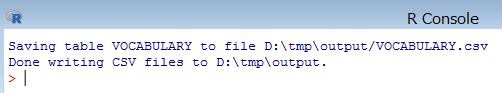

<br>

作成したフォルダを表示し、エクスポートしたデータが格納されている事を確認します。  

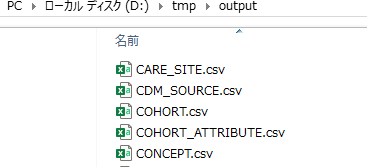

<br>

---
## **3．2　データベースへのインポート**
インポートを始める前に、エクスポートしたデータの内容を一部修正します。  

- CONCEPT_ANCESTOR.csv  
ファイルを開き「3.60e+07」を「36000000」に、「3.70e+07」を「37000000」に置き換えます。

- DRUG_EXPOSURE.csv  
ファイルをエクセルで開きＡ列（drug_exposure_id）の内容を１からの連番に
置き換えます。  

- MEASUREMENT.csv  
ファイルをエクセルで開きＡ列（mesurement_id）の内容を１からの連番に
置き換えます。  

- OBSERVATION.csv  
ファイルをエクセルで開きＡ列（observation_id）の内容を１からの連番に
置き換えます。  
ファイルの修正が完了したら、以下の手順に従いEunomia からエクスポートした
データをインポートします。  

psql を起動し、データベース「OHDSI」へ接続します。  
コマンドプロンプトを起動し以下のコマンドを入力します。  
```
psql -U ohdsi_admin_user -d OHDSI
```

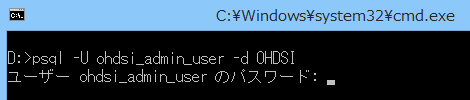  
※パスワードはセットアップ時に設定したパスワードを入力します。  

データベースへ接続したら、参照スキーマを設定します。  
```
# set search_path to "cdmv5";
```

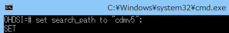

<br>

以下のコマンドを入力し、データをインポートします。  
```
# \copy CDM_SOURCE from 'D:\\tmp\output\\CDM_SOURCE.csv' with delimiter ',' csv header
```

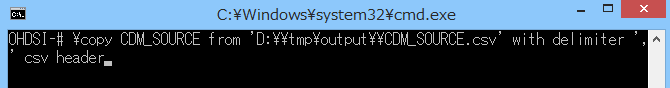

<br>

実行が成功すると、インポートした件数が表示されます。  


<br>

同様に以下のコマンドを入力して、データをインポートします。  

```
# \copy CONCEPT from 'D:\\tmp\output\\CONCEPT.csv' with delimiter ',' csv header
# \copy CONCEPT_ANCESTOR from 'D:\\tmp\output\\CONCEPT_ANCESTOR.csv' with delimiter ',' csv header
# \copy CONCEPT_RELATIONSHIP from 'D:\\tmp\output\\CONCEPT_RELATIONSHIP.csv' with delimiter ',' csv header
# \copy CONCEPT_SYNONYM from 'D:\\tmp\output\\CONCEPT_SYNONYM.csv' with delimiter ',' csv header
# \copy CONDITION_ERA from 'D:\\tmp\output\\CONDITION_ERA.csv' with delimiter ',' csv header
# \copy CONDITION_OCCURRENCE from 'D:\\tmp\output\\CONDITION_OCCURRENCE.csv' with delimiter ',' csv header
# \copy DOMAIN from 'D:\\tmp\output\\DOMAIN.csv' with delimiter ',' csv header
# \copy DRUG_ERA from 'D:\\tmp\output\\DRUG_ERA.csv' with delimiter ',' csv header
# \copy DRUG_EXPOSURE from 'D:\\tmp\output\\DRUG_EXPOSURE.csv' with delimiter ',' csv header
# \copy MEASUREMENT from 'D:\\tmp\output\\MEASUREMENT.csv' withdelimiter ',' csv header
# \copy OBSERVATION from 'D:\\tmp\output\\OBSERVATION.csv' withdelimiter ',' csv header
# \copy OBSERVATION_PERIOD from 'D:\\tmp\output\\OBSERVATION_PERIOD.csv' with delimiter ',' csv header
# \copy PERSON from 'D:\\tmp\output\\PERSON.csv' with delimiter ',' csv header
# \copy PROCEDURE_OCCURRENCE from 'D:\\tmp\output\\PROCEDURE_OCCURRENCE.csv' with delimiter ',' csv header
# \copy RELATIONSHIP from 'D:\\tmp\output\\RELATIONSHIP.csv' with delimiter ',' csv header
# \copy VISIT_OCCURRENCE from 'D:\\tmp\output\\VISIT_OCCURRENCE.csv' with delimiter ',' csv header
# \copy VOCABULARY from 'D:\\tmp\output\\VOCABULARY.csv' with delimiter ',' csv header FORCE NOT NULL vocabulary_version,vocabulary_reference
```

性別CONCEPT の登録コマンドを実行します。  
```
# insert into cdmv5.concept values (8532,'FEMALE','Gender','Gender','Gender','S','F','1900-01-01','2099-12-31',NULL);
# insert into cdmv5.concept values (8507,'MALE','Gender','Gender','Gender','S','M','1900-01-01','2099-12-31',NULL);
```
以上でデータセットアップは完了です。

<br>

---
# **4　Achilles の実行**
Achilles は、Atlas 内でData Source で表示されるデータの分析とレポート提供を実行しているツールです。  
Data Source 機能を使用するためにAchilles の実行が必要となります。（Data Source の機能については、「Atlas 機能調査補足資料」を参照してください）  
データベースにデータをインポートした際や、登録されているデータを変更した場合に、Achilles を実行してください。  
R コンソールを起動し、以下のコマンドを入力し、Achilles を実行します。  
```
> library(Achilles)
```


<br>

```
> Sys.setenv("DATABASECONNECTOR_JAR_FOLDER"="C:\\tomcat\\webapps\\WebAPI\\WEB-INF\\lib")
```

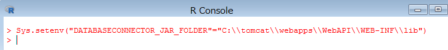

<br>

```
> connectionDetails <- createConnectionDetails(
dbms="postgresql",
server="127.0.0.1/OHDSI",
user="ohdsi_app_user",
password="設定したパスワード",
port="5432")
```


<br>

```
> achilles(
connectionDetails,
cdmDatabaseSchema="cdmv5",
resultsDatabaseSchema="webapi",
vocabDatabaseSchema="cdmv5",
numThreads=1,
sourceName="CDM V5 Database",
cdmVersion="5.3.1",
optimizeAtlasCache=TRUE)
```

<br>

下記のメッセージが表示されたら実行完了です。

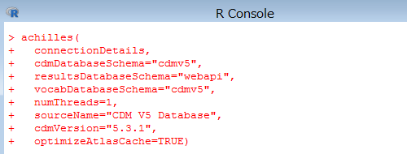

<br>

---
# **5　Concept Sets の作成**
Concept Sets では、分析で使用する独自のコードリストを作成します。  
分析対象の用語のセットを特定して作成し、再利用することも可能です。  
観察研究でよく使用されるコードリストに相当する、標準化されたコンピューター実行可能ファイルと考えることができます。  
コンセプトセットは、以下の属性を持つコンセプトのリストで構成します。  

- Exclude：  
選択したコンセプト（Descendants にチェックを入れた場合はその派生も含めて）をコンセプトセットから除外する。  

- Descendants：  
選択したコンセプトだけでなく、その派生のコンセプトについても考慮する。  

- Mapped：  
非標準のコンセプトを検索可能にする。  

以下で作成方法を示します。  
本手順では、「Gastrointestinal hemorrhage（消化管出血）」のコンセプトセットの作成を例として取り上げます。  

<br>

Atlas 画面左の「Concept Sets」をクリックすると、Atlas プラットフォーム内ですでに作成されたコンセプトセットが表示されます。


<br>

新たにコンセプトセットを作成するので、画面右の「New Concept Set」をクリックして作成画面に遷移します。  

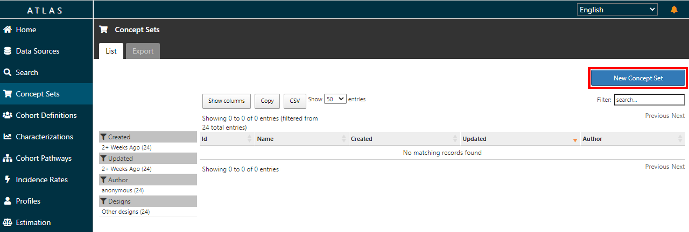

<br>

画面上部に新規に作成するコンセプトセットの名前を入力します。  


<br>

「Concept Set Expression」タブの「Add Concepts」をクリックするとSearch 画面に遷移します。  


<br>

Search では、キーワードやコンセプトID を入力することで対象とするコンセプトを探すことができます。  

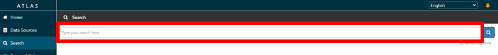

<br>

追加する以下のコンセプトの左側のボックスにチェックを入れていきます。  
|Id|Code|Name|Class|Domain|Vocabulary|
|:---|:---|:---|:---|:---|:---|
|192671|74474003|Gastrointestinal hemorrhage|Clinical Finding|Condition|SNOMED|

<br>

ページ下の「Select Concept Set」で先ほど入力した「Gastrointestinal hemorrhage」を選択し、「Add to Concept Set」をクリックします。  
「Gastrointestinal hemorrhage」セットにコンセプトが追加され、独自のコンセプトセットが形成されたことを確認します。  

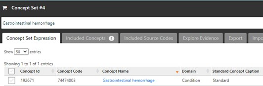

<br>

各コンセプトについて、「Exclude」、「Descendants」、「Mapped」が設定できます。  
派生するコンセプトも分析に含める想定のため、以下のように「Descendants」にチェックを入れます。  

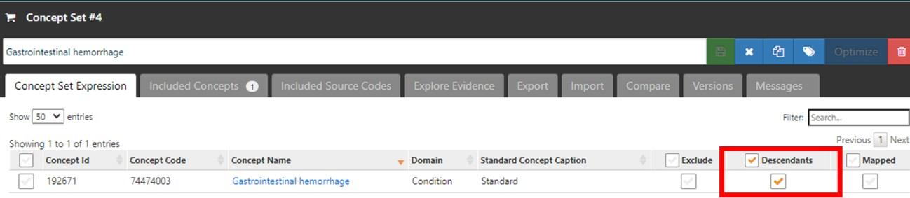

<br>

画面右上の緑の保存ボタンをクリックすると、「Concept Sets」のトップ画面の一覧に作成したコンセプトセットが追加されています。  
以上でコンセプトセット「Gastrointestinal hemorrhage」の作成が完了しました。  

同様の操作で、以下のコンセプトセットについても作成します。

- diclofenac

|Concept Id|Concept Code|Concept Name|Domain|Standard Concept Caption|Exclude|Descendants|Mapped|
|:---:|:---:|:---:|:---:|:---:|:---:|:---:|:---:|
|1124300|3355|Diclofenac|Drug|Standard||✓||

<br>

- celecoxib

|Concept Id|Concept Code|Concept Name|Domain|Standard Concept Caption|Exclude|Descendants|Mapped|
|:---:|:---:|:---:|:---:|:---:|:---:|:---:|:---:|
|1118084|140587|celecoxib|Drug|Standard||✓||

<br>

- cohort drug set

|Concept Id|Concept Code|Concept Name|Domain|Standard Concept Caption|Exclude|Descendants|Mapped|
|:---:|:---:|:---:|:---:|:---:|:---:|:---:|:---:|
|1124300|3355|Diclofenac|Drug|Standard||✓||
|1118084|140587|celecoxib|Drug|Standard||✓||

以上でコンセプトセットの作成は完了です。

<br>

---
# **6　Cohort Definitions の作成**
コホートとは、「一定期間1 つ以上の基準を満たす一連の人物」と定義され、Cohort Definitions はコホートを構築する機能を持ちます。  
作成されたコホートは、その後のCohort Pathways など各機能での分析における母集団設定に使用されます。  

コホート定義では、「Cohort entry event（コホート開始イベント）」、「Inclusion Criteria（包含基準）」、「Cohort exit event（コホート終了イベント）」を設定する構成となっており、各項目の詳細を以下に記載しています。  

- コホート開始イベント：  
CDM に記録された任意のイベント（薬物曝露、状態、測定など）を設定し、人々がコホートに入る時間を定義するものです。  
例えば、発生時の年齢、最初の診断・手順、開始日と終了日の指定、などを定義します。  

- 包含基準：  
開始イベントで定義された人々をさらに絞り込むためのイベントを設定します。  
予選コホートは、すべての包括基準を満たす最初のイベントコホート内のすべての人々を指します。  

- コホート終了イベント：  
人々がコホートメンバーシップの資格を失うイベントのことです。  
例えば、観察期間の終了、最初の開始イベントに対する固定時間間隔、一連の関連する観察の最後のイベント（持続的な薬物曝露）、など複数の方法で定義可能です。  
コホートの出口戦略は、人が異なる時間間隔の間に複数回コホートに所属できるかどうかに影響します。  

ここでは、「消化管出血を患い、ジクロフェナクとセレコキシブを服用している患者」を例にCohort Definitions の使用方法を説明します。  

Atlas 画面の左タブから「Cohort Definitions」画面を開くと、Atlas プラットフォーム内ですでに作成されたコホートが表示されます。  
コホートを新規作成するので、「New Cohort」をクリックします。  

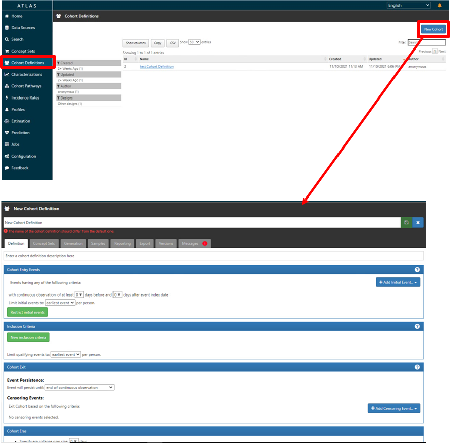

<br>

コホート作成画面が表示されます。画面上部にコホート名を入力する欄があるので、「Test Cohort Definition」と入力します。  


<br>

初めに、コホートエントリーイベントを設定していきます。  

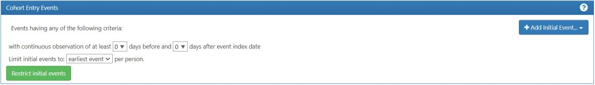

<br>

「Cohort entry event」欄右側の「Add Initial Event」をクリックして、「Add Drug Exposure」を選択します。  

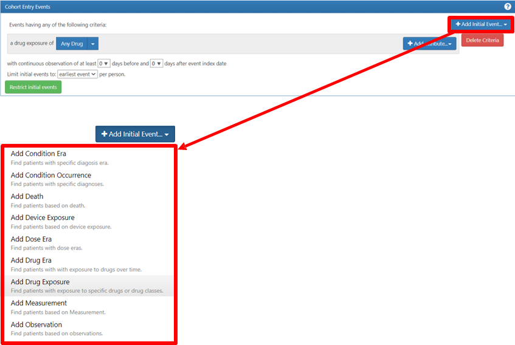

<br>

「Any Drug」で対象とする薬品のコンセプトセットの選択が必要になります。  
「Any Drug」をクリックし、「Import Concept Set」を開くと作成されているコンセプトセットの一覧が表示されるので、「cohort drug set」をクリックして選択します。  
（誤ったコンセプトセットをインポートした場合は、「Clear Concept Set」をクリックすると、選択が解除されます。）  


<br>

治療薬の投与前後の観察期間については、特に指定しないのでデフォルトのままにします。  
対象イベントは「all events」を選択します。  
以上で「Cohort Entry Event」の設定は完了です。  

次に、「Inclusion Criteria」欄の設定を実施します。  


<br>

緑色ボタンの「New inclusion criteria」をクリックし、横の空欄内に包含基準名として「Gastrointestinal hemorrhage」を入力します。  
左側に入力した名前が反映されます。  


<br>

病名の診断を基準としているので、「Add criteria to group...」から「Add Condition Occurrence」を選択します。  


<br>

選択後、欄内に図のような詳細設定画面が表示されます。  

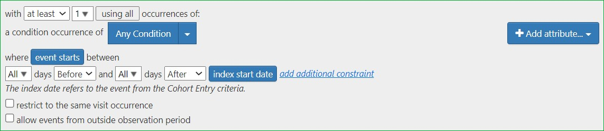

<br>

「Any Condition」に対象のCondition のコンセプトセットを設定します。  
「Any Condition」をクリックすると、コンセプトセットの一覧が表示されるので、前章で作成したコンセプトセット「Gastrointestinal hemorrhage」をクリックして選択します。  
対象イベントは「all events」を選択します。  


以上で包含基準「Gastrointestinal hemorrhage」の作成は完了です。  

<br>

最後に、「Cohort Exit」欄の設定について説明します。


<br>

コホートの終了条件は、「薬物曝露の継続的観察の終了」となるため、「Event Persistence」は「end of a continuous drug exposure」を選択します。  


<br>

コホートエントリーイベントで選択した薬品を対象としているので、「Select DrugConcept Set」ではコンセプトセット「Cohort drug set」を設定します。  

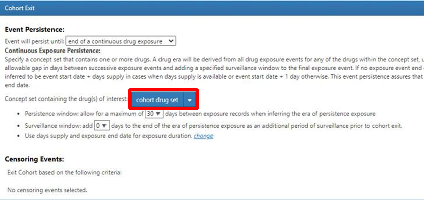

<br>

その他、以下の２つのウィンドウ（空白期間）について設定することができます。  
- Persistence window（永続性ウィンドウ）  
持続性曝露期を推測する場合に、曝露記録間に見込む最大日数

- Surveillance window（監視ウィンドウ）  
コホート終了前の追加の観察期間として、持続性曝露期の終了時に追加する日数
持続性の設定も可能です。  
今回は、Persistence window の曝露記録の間に最大30 日を見込んだデータを指定します。  


「Cohort Exit」の設定は完了です。  

以上で「Test Cohort Definition」のコホートの作成は完了です。  
同様にして、以下の2 つのコホートについても作成していきます。  

<br>

- コホート名「Celeco Test Def」  
  - ＜Cohort Entry Event＞  
「Add Initial Event」をクリックして「Add Drug Exposure」を選択  
「Any Drug」→「Import Concept Set」→「celecoxib」を選択  

  - ＜Inclusion Criteria＞  
設定なし  

  - ＜Cohort Exit Event＞  
「Event Persistence」では「end of a continuous drug exposure」を選択  
「Select Drug Concept Set」で「celecoxib」を選択  
Persistence window を「30」に設定  

<br>

- コホート名「Diclofenac Test Def」  
  - ＜Cohort Entry Event＞  
「Add Initial Event」をクリックして「Add Drug Exposure」を選択  
「Any Drug」→「Import Concept Set」→「diclofenac」を選択  

  - ＜Inclusion Criteria＞  
設定なし  

  - ＜Cohort Exit Event＞  
「Event Persistence」では「end of a continuous drug exposure」を選択  
「Select Drug Concept Set」で「diclofenac」を選択  
Persistence window を「30」に設定  

<br>

---
# **7　Cohort Pathways（経路分析）**
Cohort Pathways では、1 つ以上の母集団内で発生する一連の臨床イベントを調べることが可能です。  
経路分析の目標は、関心のある1 つ以上のコホートに沿った医療の順序を理解することです。  
コホート経路では、ターゲットコホートのコホート開始日以降のイベントを要約する分析機能を提供し、経路を複数層の円状のグラフを用いて可視化します。  

コホート経路分析の設計において、下記の項目を設定する必要があります。  
- 1 つ以上のターゲットコホート
- 1 つ以上のイベントコホート

ターゲットコホートでは分析対象とする母集団を設定します。  
一方でイベントコホートでは、ターゲットとする母集団（ターゲットコホート）で発生する可能性のある経路ステップを定義します。  
ターゲットコホートに設定したコホートの患者割合が円状のグラフとなって表示されます。  
それゆえ、患者割合を可視化したいコホートはすべてイベントコホートに設定する必要があります。  

<br>

本分析では、以下の薬品をグラフ可視化対象とします。  
- セレコキシブ（celecoxib）
- ジクロフェナク（diclofenac）

本章の流れとしては、ターゲットコホートとして、「Test Cohort Definition」コホート、イベントコホートとして「Celeco Test Def」、「Diclofenac Test Def」コホートを設定し、その後分析を実施していきます。  

<br>

以下Cohort Pathways の操作方法を記載します。  

Atlas の画面左側の「Cohort Pathways」タブをクリックすると、既にAtlas プラットフォーム内で設計されたコホート経路分析が表示されます。  


<br>

以下、新たにコホートを作成する方法を記載します。  
画面右上の「New Cohort Pathways」（青ボタン）をクリックすると、コホート経路分析の条件設定画面が表示されます。  


<br>

画面上部にコホート分析名「Gastrointestinal hemorrhage Cohort」を入力します。  

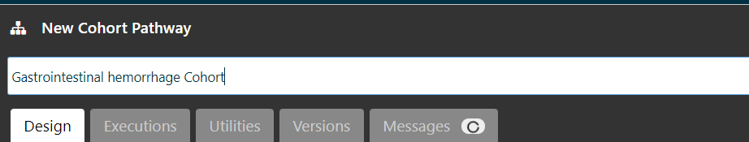

<br>

「Target Cohort」の「Import」ボタンをクリックすると、作成した全コホートが表示されるので、「Test Cohort Definition」のチェック欄にチェックを入れて画面最下部の「Import」をクリックするとコンセプトが反映されます。  


<br>

続いて「Event Cohort」を設定します。  
「Event Cohort」の「Import」ボタンをクリックして、経路ステップで表示したいコホートにチェックを入れ、画面下部の「Import」をクリックします。  

本例では、２つのコホート「diclofenac」、「celecoxib」を設定します。  

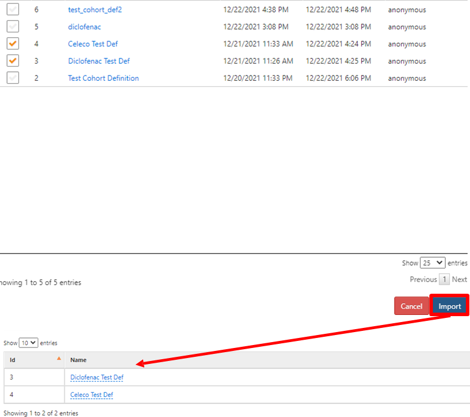

<br>

その他、分析実行時にパラメータを設定したい場合は、「Analysis Setting」を用います。  

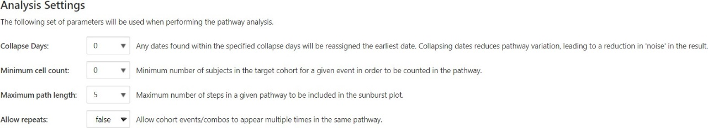

<br>

パラメータの内容としては以下の通りです。  

- Collapse Days  
指定日以内に見つかった日付は、最も早い日付に再割り当てされる。  
0～30 日まで指定可能。  
日付を折りたたむと、経路の変動が減少し、結果のノイズが減少する。  

- Minimum cell count  
経路でカウントされるための、特定のイベントのターゲットコホート内の被験者の
最小数を設定する。  

- Maximum path length  
サンバーストプロットに含まれる特定の経路の最大ステップ数を設定する。  

- Allow repeats  
コホートイベント／コンボが同じ経路に複数回出現することを許可する。  

<br>

コホートを設計し終えたら、画面右上の保存ボタン（緑ボタン）をクリックします。  


<br>

分析実施のため、「Execution」タブに移動します。  

「Execution」タブでは、Atlas で構成されている全データソースが表示されています。（今回はEunomia を用いた検証のため、CDM V5 Database が表示されます）

対象とするデータソース欄の「Generate」ボタンをクリックするとAtlas での分析を実行します。  
結果が生成されたら、「All executions」をクリックして、「View reports」から結果を表示します。  


<br>

結果画面では、ターゲットコホートのカウント数等を見ることができ、設定したイベントコホートごとに、患者が可能な様々なオプションを表すために色分けされています。  
画面中央のサンバースト図（階層化されたデータをドーナツ状のグラフで表示）では、治療の順序と順序を通して各ステップを踏んでいる患者の割合を示しています。  

今回の結果では、ターゲットコホートの対象となった484 件の中で、経路を持つ患者は479 名であることが分かります。  

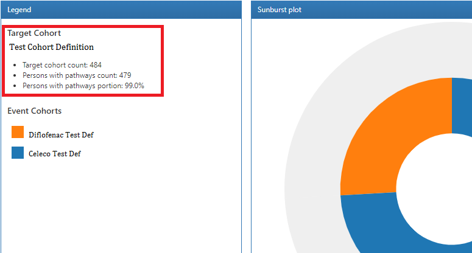

<br>

色付けされた箇所にカーソルを合わせると、そのコホート名が表示されて、クリックすることで画面右側に追加のパスの詳細が表示されます。  
表示された内容から経路持つ患者の74.1%はセレコキシブの薬剤を服用していることが分かります。  

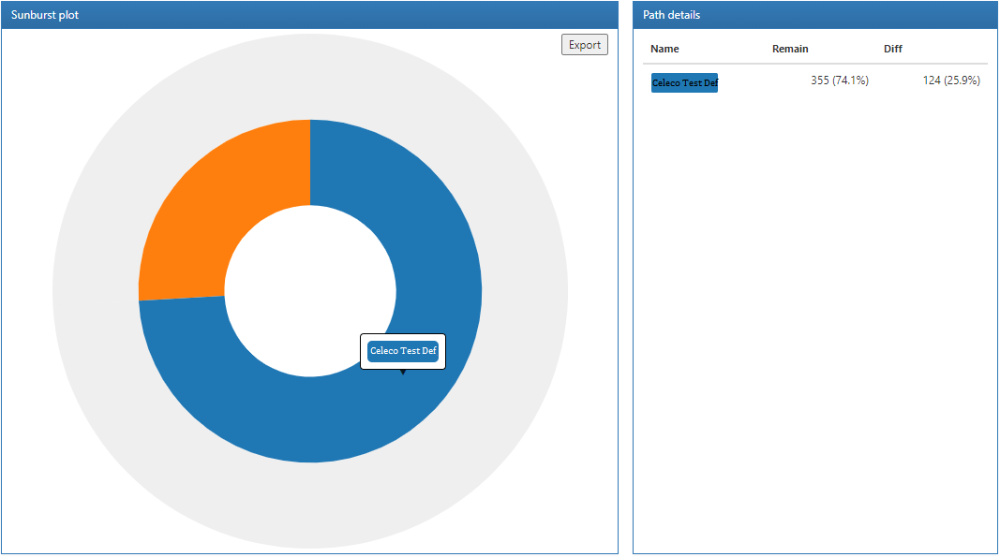

Cohort Pathways を用いた分析の操作は以上になります。