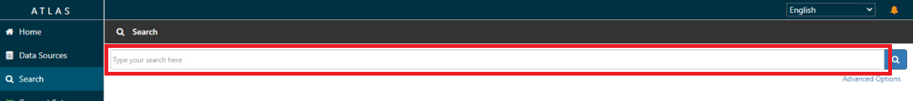
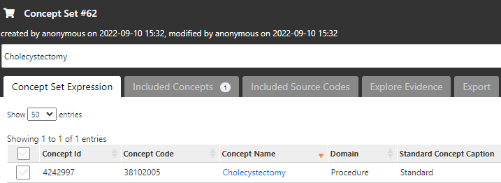
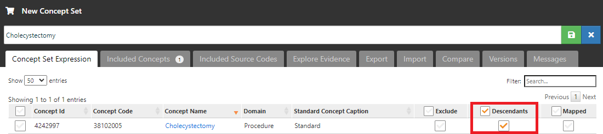

# **Atlas 操作手順 ～Characterizations～**

### **目次**
1　本手順について  
2　Characterizations 操作の流れ  
3　Concept Sets の作成  
4　Cohort Definitions の作成  
5　Feature Analyses （特徴分析）の作成  
6　Characterizations （特性評価）  
7　補足資料  

 

---
# **1　本手順について**
Atlas の Characterizations 操作手順について説明します。  
本操作手順は、以下の Atlas 動作環境が整備されていることを前提としています。  

- Windows10（64 ビット）  
- Java 8 Java Development Kit (JDK)  
- Atlas セットアップ（「Atlas セットアップ手順」参照）  
- Eunomia テストデータのセットアップ（「Atlas 操作手順 Eunomia のテストデータセットアップについて」参照）  

 

---
# **2　Characterizations 操作の流れ**
本操作手順書では、以下に示す Characterizations を用いた分析を対象にした手順を記載しています。  

本書では、Eunomia のテストデータを使用して Atlas の Characterizations による分析を実施します。  
Characterizations による分析の操作手順では、次の事例を取り上げて説明します。  
- 「胆嚢摘出手術」と「腹腔鏡下 胆嚢摘出術」の術式を母集団とし、該当の手術を受けた患者における診断された病名、処方された薬剤、受けた検査項目の人数と発生率を統計します。  

 

Characterizations による分析は、上記事例に従い、以下のテストデータを用いて説明します。  
1）Cohort Definitions - 調査項目（母集団）  
- ＜術式＞  
  - Laparoscopic cholecystectomy（腹腔鏡下 胆嚢摘出術）  
  - Cholecystectomy（胆嚢摘出術）  

 

2）Feature analyses - 分析項目（レポート）  
- ＜診断された病名＞  
  - Gallstone（胆石）  
  - Acute cholecystitis（急性胆嚢炎）  

 

- ＜処方された薬剤＞  
  - 1 ML Morphine Sulfate 5 MG/ML Injection (1 ML モルヒネ硫酸塩 5 MG/ML 注射)  
  - 100 ML Propofol 10 MG/ML Injection (100 ML プロポフォール 10 MG/ML 注射)  
  - 2 ML Ondansetron 2 MG/ML Injection (2 ML オンダンセトロン 2 MG/ML インジェクション)  
  - Acetaminophen 160 MG Oral Tablet (アセトアミノフェン 160 MG 経口錠剤)  
  - heparin (ヘパリン)  
  - Isoflurane 999 MG/ML Inhalant Solution (イソフルラン 999 MG/ML 吸入剤溶液)  
  - Meperidine Hydrochloride 50 MG Oral Tablet (メペリジン塩酸塩50 MG 経口錠剤)  
  - Midazolam 1 MG/ML Injectable Solution (ミダゾラム 1 MG/ML 注射液)  
  - Piperacillin 4000 MG/tazobactam 500 MG Injection (ピペラシリン 4000 MG/タゾバクタム 500 MG 注射)  
  - remifentanil (レミフェンタニル)  
  - rocuronium bromide 10 MG/ML Injectable Solution (臭化ロクロニウム 10 MG/ML 注射液)  
  - sevoflurane 1000 MG/ML Inhalant Solution (セボフルラン 1000 MG/ML 吸入剤溶液)  
  - Sodium Chloride 9 MG/ML Injectable Solution (塩化ナトリウム 9 MG/ML 注射液)  
  - Fentanyl (スフェンタニル)  

   

  - ＜受けた検査＞  
  - Globulin [Mass/volume] in Serum by calculation（血清中のグロブリン [質量/体積] ）  
  - Hematocrit（ヘマトクリット（血中赤血球容積））  
  - Hemoglobin（ヘモグロビン（Hb））

 

---
# **3　Concept Sets の作成**
「Concept Sets」では、分析で使用する独自のリストを作成します。  
分析対象の用語のセットを特定して作成し、再利用することも可能です。  
コンセプトセットは、以下の属性を持つコンセプトのリストで構成します。  

- Exclude：  
選択したコンセプト（Descendantsにチェックを入れた場合はその派生も含めて）をコンセプトセットから除外する。  

- Descendants：  
選択したコンセプトだけでなく、その派生のコンセプトについても考慮する。  

- Mapped：  
非標準のコンセプトを検索可能にする。  

 

Characterizations による分析では、事前に「Cohort Definitions - 調査項目」と「Feature analyses - 分析項目」の詳細項目を Concept Sets に登録します。  
前章に取り上げた＜術式＞、＜病名＞、＜薬剤＞および＜検査項目＞は、すべて登録対象になります。  

 

以下で作成方法を示します。  
本手順では、「Cholecystectomy（胆嚢摘出術）」のコンセプトセットの作成を例として取り上げます。  

 

Atlas 画面左の「Concept Sets」をクリックすると、Atlas プラットフォーム内ですでに作成されたコンセプトセットが表示されます。  

 

新たにコンセプトセットを作成するので、画面右の「New Concept Set」をクリックして作成画面に遷移します。  

 

画面上部に新規に作成するコンセプトセットの名前を入力します。  

 

「Concept Set Expression」タブの「Add Concepts」をクリックすると Search 画面に遷移します。  

 

Search 画面では、キーワードやコンセプトIDを入力することで対象とするコンセプトを探すことができます。  

 

追加する以下のコンセプトの左側のボックスにチェックを入れていきます。  

|Id|Code|Name|Class|Domain|Vocabulary|
|:---|:---|:---|:---|:---|:---|
|4242997|38102005|Cholecystectomy|Procedure|Procedure|SNOMED|

 

ページ下の「Select Concept Set」で先ほど入力した「Cholecystectomy」を選択し、「Add to Concept Set」をクリックします。  
「Cholecystectomy」セットにコンセプトが追加され、独自のコンセプトセットが形成されたことを確認します。  

 

各コンセプトについて、「Exclude」、「Descendants」、「Mapped」が設定できます。  
派生するコンセプトも分析に含める想定のため、以下のように「Descendants」にチェックを入れます。  

 

画面右上の緑の保存ボタンをクリックすると、「Concept Sets」のトップ画面の一覧に作成したコンセプトセットが追加されています。  

以上でコンセプトセット「Cholecystectomy」の作成が完了しました。  
同様の操作で、以下のコンセプトセットについても作成します。  