# **Atlas 操作手順 ～Characterizations～**

### **目次**
1　本手順について  
2　Characterizations 操作の流れ  
3　Concept Sets の作成  
4　Cohort Definitions の作成  
5　Feature Analyses （特徴分析）の作成  
6　Characterizations （特性評価）  
7　補足資料  

 

---
# **1　本手順について**
Atlas の Characterizations 操作手順について説明します。  
本操作手順は、以下の Atlas 動作環境が整備されていることを前提としています。  

- Windows10（64 ビット）  
- Java 8 Java Development Kit (JDK)  
- Atlas セットアップ（「Atlas セットアップ手順」参照）  
- Eunomia テストデータのセットアップ（「Atlas 操作手順 Eunomia のテストデータセットアップについて」参照）  

 

---
# **2　Characterizations 操作の流れ**
本操作手順書では、以下に示す Characterizations を用いた分析を対象にした手順を記載しています。  

本書では、Eunomia のテストデータを使用して Atlas の Characterizations による分析を実施します。  
Characterizations による分析の操作手順では、次の事例を取り上げて説明します。  
- 「胆嚢摘出手術」と「腹腔鏡下 胆嚢摘出術」の術式を母集団とし、該当の手術を受けた患者における診断された病名、処方された薬剤、受けた検査項目の人数と発生率を統計します。  

 

Characterizations による分析は、上記事例に従い、以下のテストデータを用いて説明します。  
1）Cohort Definitions - 調査項目（母集団）  
- ＜術式＞  
  - Laparoscopic cholecystectomy（腹腔鏡下 胆嚢摘出術）  
  - Cholecystectomy（胆嚢摘出術）  

 

2）Feature analyses - 分析項目（レポート）  
- ＜診断された病名＞  
  - Gallstone（胆石）  
  - Acute cholecystitis（急性胆嚢炎）  

 

- ＜処方された薬剤＞  
  - 1 ML Morphine Sulfate 5 MG/ML Injection (1 ML モルヒネ硫酸塩 5 MG/ML 注射)  
  - 100 ML Propofol 10 MG/ML Injection (100 ML プロポフォール 10 MG/ML 注射)  
  - 2 ML Ondansetron 2 MG/ML Injection (2 ML オンダンセトロン 2 MG/ML インジェクション)  
  - Acetaminophen 160 MG Oral Tablet (アセトアミノフェン 160 MG 経口錠剤)  
  - heparin (ヘパリン)  
  - Isoflurane 999 MG/ML Inhalant Solution (イソフルラン 999 MG/ML 吸入剤溶液)  
  - Meperidine Hydrochloride 50 MG Oral Tablet (メペリジン塩酸塩50 MG 経口錠剤)  
  - Midazolam 1 MG/ML Injectable Solution (ミダゾラム 1 MG/ML 注射液)  
  - Piperacillin 4000 MG/tazobactam 500 MG Injection (ピペラシリン 4000 MG/タゾバクタム 500 MG 注射)  
  - remifentanil (レミフェンタニル)  
  - rocuronium bromide 10 MG/ML Injectable Solution (臭化ロクロニウム 10 MG/ML 注射液)  
  - sevoflurane 1000 MG/ML Inhalant Solution (セボフルラン 1000 MG/ML 吸入剤溶液)  
  - Sodium Chloride 9 MG/ML Injectable Solution (塩化ナトリウム 9 MG/ML 注射液)  
  - sufentanil (スフェンタニル)  

   

- ＜受けた検査＞  
  - Globulin [Mass/volume] in Serum by calculation（血清中のグロブリン [質量/体積] ）  
  - Hematocrit（ヘマトクリット（血中赤血球容積））  
  - Hemoglobin（ヘモグロビン（Hb））

 

---
# **3　Concept Sets の作成**
「Concept Sets」では、分析で使用する独自のリストを作成します。  
分析対象の用語のセットを特定して作成し、再利用することも可能です。  
コンセプトセットは、以下の属性を持つコンセプトのリストで構成します。  

- Exclude：  
選択したコンセプト（Descendantsにチェックを入れた場合はその派生も含めて）をコンセプトセットから除外する。  

- Descendants：  
選択したコンセプトだけでなく、その派生のコンセプトについても考慮する。  

- Mapped：  
非標準のコンセプトを検索可能にする。  

 

Characterizations による分析では、事前に「Cohort Definitions - 調査項目」と「Feature analyses - 分析項目」の詳細項目を Concept Sets に登録します。  
前章に取り上げた＜術式＞、＜病名＞、＜薬剤＞および＜検査項目＞は、すべて登録対象になります。  

 

以下で作成方法を示します。  
本手順では、「Cholecystectomy（胆嚢摘出術）」のコンセプトセットの作成を例として取り上げます。  

 

Atlas 画面左の「Concept Sets」をクリックすると、Atlas プラットフォーム内ですでに作成されたコンセプトセットが表示されます。  

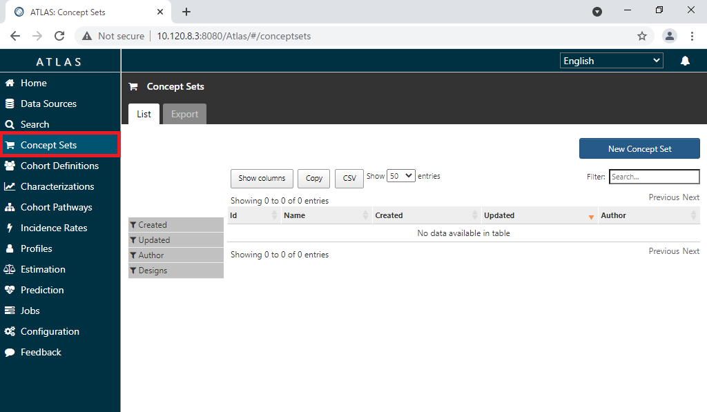

 

新たにコンセプトセットを作成するので、画面右の「New Concept Set」をクリックして作成画面に遷移します。  

 

画面上部に新規に作成するコンセプトセットの名前を入力します。  

 

「Concept Set Expression」タブの「Add Concepts」をクリックすると Search 画面に遷移します。  

 

Search 画面では、キーワードやコンセプトIDを入力することで対象とするコンセプトを探すことができます。  
下記のコンセプトを検索し、Concept Sets へ登録します。  

|Id|Code|Name|Class|Domain|Vocabulary|
|:---|:---|:---|:---|:---|:---|
|4242997|38102005|Cholecystectomy|Procedure|Procedure|SNOMED|

 

➀Search 画面のテキスト入力欄へ  「Cholecystectomy」 と入力します。  
②検索ボタンをクリックすると、対象のリストが表示されます。  
③表示されたリストから「4242997：Cholecystectomy」にチェックを入れます。  
④Select Concept Set に「Cholecystectomy」が選択されていることを確認します。  
⑤Descendants にチェックを入れます。  
⑥Add To Concept Set をクリックします。(ConceptSetsに組み込まれます)  

 

左メニューの「Concept Sets」をクリックします。  
「Cholecystectomy」セットにコンセプトが追加され、独自のコンセプトセットが形成されたことを確認します。  

 

画面右上の緑の保存ボタンをクリックすると、「Concept Sets」のトップ画面の一覧に作成したコンセプトセットが追加されます。  
※派生するコンセプトも分析に含める想定のため、「Descendants」を有効にしています。  
（各コンセプトについて、「Exclude」、「Descendants」、「Mapped」をこの画面からも設定できます）  

 

以上でコンセプトセット「Cholecystectomy」の作成が完了しました。  
×ボタンをクリックして、コンセプトセット「Gastrointestinal hemorrhage」の画面を閉じます。  

 

同様の操作で、以下のコンセプトセットについても作成します。  

＜術式＞
- Laparoscopic cholecystectomy

|Concept Id|Concept Code|Concept Name|Domain|Standard Concept Caption|Exclude|Descendants|Mapped|
|:---:|:---:|:---:|:---:|:---:|:---:|:---:|:---:|
|4163971|45595009|Laparoscopic cholecystectomy|Procedure|Standard||✓||

 
 

＜病名＞  
- Gallstone

|Concept Id|Concept Code|Concept Name|Domain|Standard Concept Caption|Exclude|Descendants|Mapped|
|:---:|:---:|:---:|:---:|:---:|:---:|:---:|:---:|
|196456|235919008|Gallstone|Condition|Standard||✓||

 

- Acute cholecystitis

|Concept Id|Concept Code|Concept Name|Domain|Standard Concept Caption|Exclude|Descendants|Mapped|
|:---:|:---:|:---:|:---:|:---:|:---:|:---:|:---:|
|198809|65275009|Acute cholecystitis|Condition|Standard||✓||

 
 

＜薬剤＞  
- 1 ML Morphine Sulfate 5 MG/ML Injection

|Concept Id|Concept Code|Concept Name|Domain|Standard Concept Caption|Exclude|Descendants|Mapped|
|:---:|:---:|:---:|:---:|:---:|:---:|:---:|:---:|
|35605858|1732136|1 ML Morphine Sulfate 5 MG/ML|Drug|Standard||✓||

 

- 2 ML Ondansetron 2 MG/ML Injection

|Concept Id|Concept Code|Concept Name|Domain|Standard Concept Caption|Exclude|Descendants|Mapped|
|:---:|:---:|:---:|:---:|:---:|:---:|:---:|:---:|
|35605482|1740467|2 ML Ondansetron 2 MG/ML Injection|Drug|Standard||✓||

 

- 100 ML Propofol 10 MG/ML Injection

|Concept Id|Concept Code|Concept Name|Domain|Standard Concept Caption|Exclude|Descendants|Mapped|
|:---:|:---:|:---:|:---:|:---:|:---:|:---:|:---:|
|40220386|1808217|100 ML Propofol 10 MG/ML Injection|Drug|Standard||✓||

 

- Acetaminophen 160 MG Oral Tablet

|Concept Id|Concept Code|Concept Name|Domain|Standard Concept Caption|Exclude|Descendants|Mapped|
|:---:|:---:|:---:|:---:|:---:|:---:|:---:|:---:|
|1127078|282464|Acetaminophen|160 MG Oral Tablet|Drug|Standard||✓||

 

- heparin

|Concept Id|Concept Code|Concept Name|Domain|Standard Concept Caption|Exclude|Descendants|Mapped|
|:---:|:---:|:---:|:---:|:---:|:---:|:---:|:---:|
|1367571|5224|heparin|Drug|Standard||✓||

 

- Isoflurane 999 MG/ML Inhalant Solution

|Concept Id|Concept Code|Concept Name|Domain|Standard Concept Caption|Exclude|Descendants|Mapped|
|:---:|:---:|:---:|:---:|:---:|:---:|:---:|:---:|
|782047|542347|Isoflurane 999 MG/ML Inhalant Solution|Drug|Standard||✓||

 

- Meperidine Hydrochloride 50 MG Oral Tablet

|Concept Id|Concept Code|Concept Name|Domain|Standard Concept Caption|Exclude|Descendants|Mapped|
|:---:|:---:|:---:|:---:|:---:|:---:|:---:|:---:|
|40165015|861467|Meperidine Hydrochloride 50 MG Oral Tablet|Drug|Standard||✓||

 

- Midazolam 1 MG/ML Injectable Solution

|Concept Id|Concept Code|Concept Name|Domain|Standard Concept Caption|Exclude|Descendants|Mapped|
|:---:|:---:|:---:|:---:|:---:|:---:|:---:|:---:|
|19078924|311700|Midazolam 1 MG/ML Injectable Solution|Drug|Standard||✓||

 

- Piperacillin 4000 MG/tazobactam 500 MG

|Concept Id|Concept Code|Concept Name|Domain|Standard Concept Caption|Exclude|Descendants|Mapped|
|:---:|:---:|:---:|:---:|:---:|:---:|:---:|:---:|
|46275444|1659149|Piperacillin 4000 MG/tazobactam 500 MG|Drug|Standard||✓||

 

- remifentanil

|Concept Id|Concept Code|Concept Name|Domain|Standard Concept Caption|Exclude|Descendants|Mapped|
|:---:|:---:|:---:|:---:|:---:|:---:|:---:|:---:|
|19016749|73032|remifentanil|Drug|Standard||✓||

 

- rocuronium bromide 10 MG/ML Injectable Solution

|Concept Id|Concept Code|Concept Name|Domain|Standard Concept Caption|Exclude|Descendants|Mapped|
|:---:|:---:|:---:|:---:|:---:|:---:|:---:|:---:|
|42707627|1234995|rocuronium bromide 10 MG/ML Injectable Solution|Drug|Standard||✓||

 

- sevoflurane 1000 MG/ML Inhalant Solution

|Concept Id|Concept Code|Concept Name|Domain|Standard Concept Caption|Exclude|Descendants|Mapped|
|:---:|:---:|:---:|:---:|:---:|:---:|:---:|:---:|
|19023398|200243|sevoflurane 1000 MG/ML Inhalant Solution|Drug|Standard||✓||

 

- Sodium Chloride 9 MG/ML Injectable Solution

|Concept Id|Concept Code|Concept Name|Domain|Standard Concept Caption|Exclude|Descendants|Mapped|
|:---:|:---:|:---:|:---:|:---:|:---:|:---:|:---:|
|19079524|313002|Sodium Chloride 9 MG/ML Injectable Solution|Drug|Standard||✓||

 

- sufentanil

|Concept Id|Concept Code|Concept Name|Domain|Standard Concept Caption|Exclude|Descendants|Mapped|
|:---:|:---:|:---:|:---:|:---:|:---:|:---:|:---:|
|19078219|56795|sufentanil|Drug|Standard||✓||

 
 

＜検査項目＞  
- Globulin [Mass/volume] in Serum by calculation

|Concept Id|Concept Code|Concept Name|Domain|Standard Concept Caption|Exclude|Descendants|Mapped|
|:---:|:---:|:---:|:---:|:---:|:---:|:---:|:---:|
|3027970|10834-0|Globulin [Mass/volume] in Serum by calculation|Measurement|Standard||✓||

 

- Hematocrit

|Concept Id|Concept Code|Concept Name|Domain|Standard Concept Caption|Exclude|Descendants|Mapped|
|:---:|:---:|:---:|:---:|:---:|:---:|:---:|:---:|
|3009542|20570-8|Hematocrit|Measurement|Standard||✓||

 

- Hemoglobin

|Concept Id|Concept Code|Concept Name|Domain|Standard Concept Caption|Exclude|Descendants|Mapped|
|:---:|:---:|:---:|:---:|:---:|:---:|:---:|:---:|
|3000963|718-7|Hemoglobin|Measurement|Standard||✓||

 

以上でコンセプトセットの作成は完了です。  

 

---
# **4　Cohort Definitionsの作成**

コホートとは、「一定期間1つ以上の基準を満たす一連の人物」と定義され、Cohort Definitions はコホートを構築する機能を持ちます。  
作成されたコホートは、その後の Characterizations 機能での分析における母集団設定に使用されます。

コホート定義では、「Cohort entry events（コホート開始イベント）」、「Inclusion Criteria（包含基準）」、「Cohort exit event（コホート終了イベント）」を設定する構成となっており、各項目の詳細を以下に記載しています。  

- コホート開始イベント：  
共通データモデルに記録された任意のイベント（薬物曝露、疾病、検査など）を設定し、人々がコホートに入る時間を定義するものです。  
例えば、発生時の年齢、最初の診断・手順、開始日と終了日の指定、などを定義します。

- 包含基準：  
開始イベントで定義された人々をさらに絞り込むためのイベントを設定します。  
予選コホートは、すべての包括基準を満たす最初のイベントコホート内のすべての人々を指します。  

- コホート終了イベント：  
人々がコホートメンバーシップの資格を失うイベントのことです。  
例えば、観察期間の終了、最初の開始イベントに対する固定時間間隔、一連の関連する観察の最後のイベント（持続的な薬物曝露）、など複数の方法で定義可能です。  
コホートの出口戦略は、人が異なる時間間隔の間に複数回コホートに所属できるかどうかに影響します。  

 

ここでは、「腹腔鏡下 胆嚢摘出術と胆嚢摘出術の手術を受けている患者」を例に Cohort Definitions の使用方法を説明します。  

 

以下の２つの術式についてのコンセプトセットを登録します。  
- Laparoscopic cholecystectomy
- Cholecystectomy

 

Atlas 画面の左タブから「Cohort Definitions」画面を開くと、Atlas プラットフォーム内ですでに作成されたコホートが表示されます。  
コホートを新規作成するので、「New Cohort」をクリックします。  

 

コホート作成画面が表示されます。  
画面上部にコホート名を入力する欄があるので、「Cholecystectomy Definition」と入力します。  

 

初めに、コホートエントリーイベントを設定していきます。  

 

「Cohort Entry Events」欄右側の「+Add Initial Event...」をクリックして、「Add Procedure Occurrence」を選択します。  

 

「Any Procedure」で対象とする手術のコンセプトセットの選択が必要になります。  
「Any Procedure」の▼をクリックし、「Import Concept Set」を開くと作成されているコンセプトセットの一覧が表示されるので、「Cholecystectomy」をクリックして選択します。  
※もし、誤ったコンセプトセットをインポートしてしまった場合は、「Clear Concept Set」を選択することで、インポートを解除することが出来ます  

 

手術前後の観察期間については、特に指定しないのでデフォルトのままにします。  
※「0 days」の選択で全期間のデータが対象となります  
対象イベントは「all events」を選択します。  

以上で、術式Cholecystectomyの「Cohort Entry Events」の設定は完了です。  

 

次に、「Inclusion Criteria」欄の設定を実施します。  

 

緑色ボタンの「New inclusion criteria」をクリックし、横の空欄内に包含基準名として「Cholecystectomy」を入力します。  
左側に入力した名前が反映されます。  

 

術式の診断を基準としているので、「+Add Initial Event...」から「Add Procedure Occurrence」を選択します。  

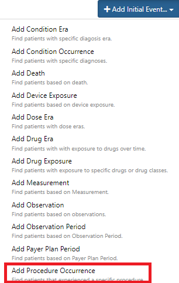

 

選択後、欄内に図のような詳細設定画面が表示されます。  

 

「Any Procedure」に対象のProcedureのコンセプトセットを設定します。  
「Any Procedure」の▼をクリックすると、コンセプトセットの一覧が表示されるので、前章で作成したコンセプトセット「Cholecystectomy」をクリックして選択します。  
対象イベントは「all events」を選択します。  

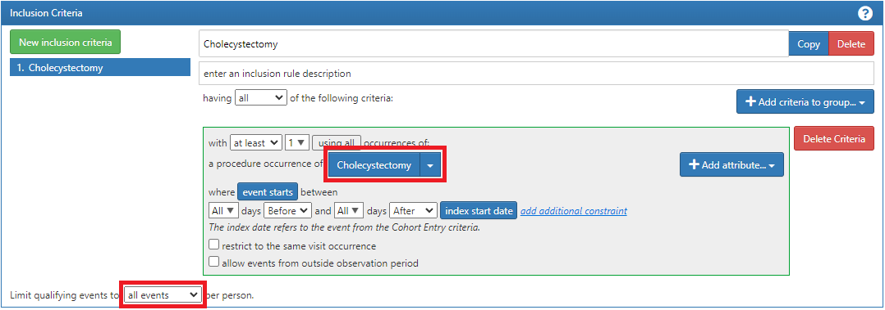

 

以上で包含基準「Cholecystectomy」の作成は完了です。  

 

最後に、「Cohort Exit」欄の設定について説明します。  

 

本手順では、コホートの終了条件は、「継続的観察の終了」として設定するため、「Event Persistence」は「end of continuous observation」を選択します。  

 

「Cohort Exit」の設定は完了です。  

以上の操作が完了したら、画面右上の緑の保存ボタンをクリックして「Cholecystectomy Definition」を保存します。  

 

以上で「Cholecystectomy Definition」のコホートの作成は完了です。  

 

同様にして、以下の術式 Laparoscopic cholecystectomy のコホートについても作成します。  

Cohort Definitions 名：Laparoscopic cholecystectomy Definition  
- ＜Cohort Entry Events＞  
「+Add Initial Event...」をクリックして「Add Procedure Occurrence」を選択  
「Any Procedure」→「Import Concept Set」→「Laparoscopic cholecystectomy」を選択  
手術前後の観察期間は設定しない  
対象イベントは「all events」を選択  

- ＜Inclusion Criteria＞  
New inclusion criteria 名：Laparoscopic cholecystectomy  
「+Add criteria to group...」から「Add Procedure Occurrence」を選択  
「Any Procedure」→「Import Concept Set」→「Laparoscopic cholecystectomy」を選択  
対象イベントは「all events」を選択  

- ＜Cohort Exit Event＞  
「Event Persistence」では「end of continuous observation」を選択  

以上でCohort Definitionsの作成は完了です。  

 

---
# **5　Feature Analyses（特徴分析）の作成**

Feature Analyses とは、Characterizations による分析で調査したい項目として登録し、調査項目ごとの患者統計や発生率を結果としてレポートに出力します。  
作成された Feature Analyses は、他の Characterizations 機能での分析における出力項目として設定することができます。  

Atlasでは、標準で利用できる Feature Analyses が 100 件以上あります。（表1）  
標準の Feature Analyses を選択することで、簡単に Characterizations の調査項目を設定できます。  
標準以外でも、新規に Feature Analyses を作成できますので、観察研究のニーズに合わせて、特定の Characterizations 調査項目を作成することができます。  

|Domain|ドメイン|件数|
|:---|:---|:---|
|CONDITION|病名|32|
|DRUG|薬剤|23|
|MEASUREMENT|検査|15|
|Demographics|人口統計|11|
|Observation|観察|7|
|Procedure|手術|7|
|Visit|通院歴|6|
|Device|機材|4|

*表１：標準化 Feature Analyses のドメイン別件数*  
*※ Feature Analyses 項目は「７章　補足資料」で説明します*  

 

新規の Feature Analyses 定義では、1つまたは1つ以上の「Criteria Feature（特徴疾病）」を設定することができます。  

本章では、新規の Feature Analyses 定義の作成方法について説明します。  
2章で作成した＜病名＞、＜薬剤＞および＜検査項目＞の Concept Sets を用いて、Feature Analyses 定義を作成します。  
ここでは、＜薬剤＞の Concept Sets を例に Feature Analyses 定義の作成手順を説明します。  

Feature Analyses 定義を新規作成するので、「New Feature Analysis」をクリックします。  

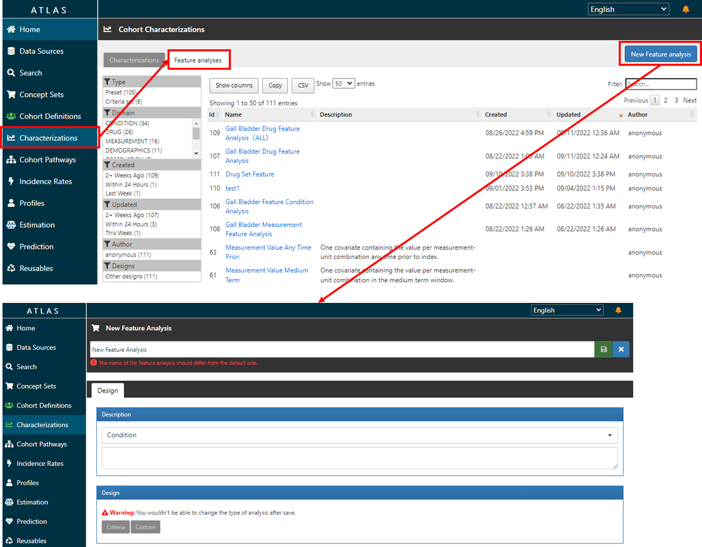

 

Feature Analyses 作成画面が表示されます。  
画面上部に Feature Analyses の名称を入力する欄があるので、「Gall Bladder Drug Feature Analysis」と入力します。  

 

次に、Feature Analyses の種別を選択します。  
ここでは、薬剤の項目を設定するので、Description は「Drug」を選択します。  
※Characterizations 画面に、Feature Analyses 定義をインポートする際に、「Drug」分類から選択できます。  

 

次に、薬剤の Concept Sets を「Criteria Feature」に設定します。  
Design のグレーボタン「Criteria」をクリックします。  
クリックすると設定画面が表示されます。  

 

「Analysis type」は、「Prevalence（発生率）」と「Distribution（分布）」があります。  
ここでは、「Design」の「Analysis type」のプルダウンから「Prevalence（発生率）」を選択します。  

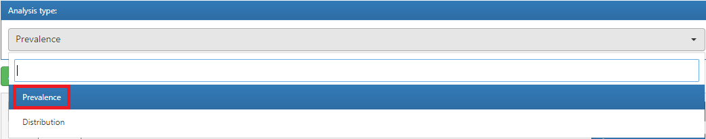

 

次に、薬剤のConcept Setsを「Criteria Feature」に設定します。  

1つ目の薬剤の Concept Sets を追加します。  
Criteria 名を入力する欄があるので、薬剤名「1 ML Morphine Sulfate 5 MG/ML Injection」と入力します。  

 

「+Add criteria to group …」をクリックして、「Add Drug Exposure」を選択します。  

 

「Any Drug」で対象とする薬品のコンセプトセットの選択が必要になります。  
「Any Drug」の▼をクリックし、「Import Concept Set」を開くと作成されているコンセプトセットの一覧が表示されるので、「1 ML Morphine Sulfate 5 MG／ML Injection」をクリックして選択します。  
※もし、誤ったコンセプトセットをインポートしてしまった場合は、「Clear Concept Set」を選択することで、インポートを解除することが出来ます。  

 

2つ目以降の薬剤のコンセプトセットを追加します。  
緑ボタン「Add Criteria Feature」をクリックすると、新規の「Criteria Feature」の入力項目が表示されます。  

 
 

以下、同様の作成手順で、薬剤のコンセプトセットを追加します。  

- 100 ML Propofol 10 MG/ML Injection  

 

- 2 ML Ondansetron 2 MG/ML Injection

 

- Acetaminophen 160 MG Oral Tablet

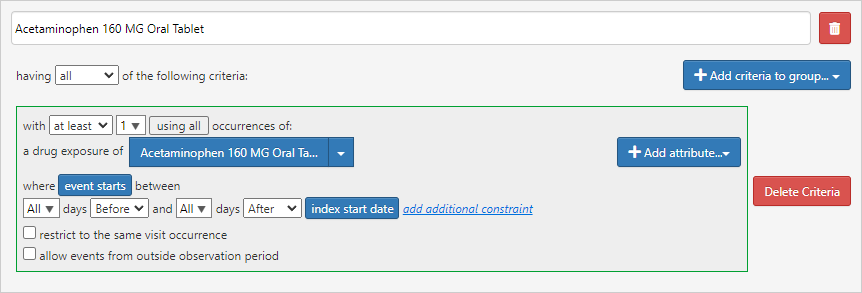

 

- heparin

 

- Isoflurane 999 MG/ML Inhalant Solution

 

- Meperidine Hydrochloride 50 MG Oral Tablet

 

- Midazolam 1 MG/ML Injectable Solution

 

- Piperacillin 4000 MG / tazobactam 500 MG Injection

 

- remifentanil

 

- rocuronium bromide 10 MG/ML Injectable Solution

 

- sevoflurane 1000 MG/ML Inhalant Solution

 

- Sodium Chloride 9 MG/ML Injectable Solution

 

- sufentanil

 

すべての薬剤のコンセプトセットを追加した後、画面上部の緑「保存」ボタンをクリックし、定義内容を保存します。  

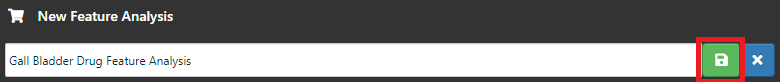

 

以上で、Feature Analysesの「Gall Bladder Drug Feature Analysis」の設定は完了です。  

同様に、＜病名＞の Concept Sets を用いて、新規の Feature Analyses 定義を作成します。
「New Feature Analysis」をクリックして Feature Analyses 作成画面を表示します。  
画面上部に Feature Analyses 名を入力する欄があるので、「Gall Bladder Condition Feature Analysis」と入力します。  

 

次に、Feature Analyses の種別を選択します。  
ここでは、病名の項目を設定するので、Description は「Condition」を選択します。  

 

次に、病名のConcept Setsを「Criteria Feature」に設定します。  
グレーボタン「Criteria」をクリックすると、設定画面が表示されます。  

 

「Analysis type」は、「Prevalence（発生率）」と「Distribution（分布）」があります。  
ここでは、「Design」の「Analysis type」のプルダウンから「Prevalence（発生率）」を選択します。  

 

次に、病名のConcept Setsを「Criteria Feature」に設定します。  

１つ目の病名のConcept Setsを追加します。  
Criteria名を入力する欄があるので、病名「Acute cholecystitis」と入力します。  

 

「+Add criteria to group …」をクリックして、「Add Condition Occurrence」を選択します。  

 

「Any Condition」で対象とする病名のコンセプトセットの選択が必要になります。  
「Any Condition」の▼をクリックし、「Import Concept Set」を選択します。  

  
※もし、誤ったコンセプトセットをインポートしてしまった場合は、「Clear Concept Set」を選択することで、インポートを解除することが出来ます。  

「Import Concept Set」を選択すると、作成されているコンセプトセットの一覧が表示されます。  
「Filter」欄に病名のコンセプトセット「Acute cholecystitis」を入力し、一覧から「Acute cholecystitis」を選択します。  

  

 

「Acute cholecystitis」のコンセプトセットが設定されます。  

  

 

続いて、2つ目以降の病名の Concept Sets を追加します。  
緑ボタン「Add Criteria Feature」をクリックすると、新規の「Criteria Feature」の入力項目が表示されます。  

  

 

以下、同様の手順で、病名のコンセプトセット（Gallstone）を追加します。  

 

- Gallstone

  

すべての病名のコンセプトセットを追加した後、画面上部の緑「保存」ボタンをクリックし、定義内容を保存します。  

  

 

以上で、Feature Analysesの「Gall Bladder Condition Feature Analysis」の設定は完了です。  

 
 

同様に、＜検査項目＞の Concept Sets を用いて、新規の Feature Analyses 定義を作成します。  
「New Feature Analysis」をクリックして、Feature Analyses 作成画面が表示します。  
画面上部に Feature Analyses 名を入力する欄があるので、「Gall Bladder Measurement Feature Analysis」と入力します。  

  

 

次に、Feature Analyses の種別を選択します。  
ここでは、検査項目を設定するので、Description は「Measurement」を選択します。

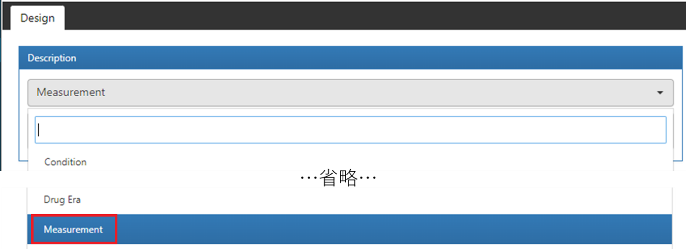  

 

次に、検査項目の Concept Sets を「Criteria Feature」に設定します。  
グレーボタン「Criteria」をクリックします。  
設定画面が表示されます。  

  

 

「Analysis type」は、「Prevalence（発生率）」と「Distribution（分布）」があります。  
ここでは、「Design」の「Analysis type」のプルダウンから「Prevalence（発生率）」を選択します。  

  

 

次に、検査項目の Concept Sets を「Criteria Feature」に設定します。  

1つ目の検査項目の Concept Sets を追加します。  
Criteria 名を入力する欄があるので、検査項目名「Hemoglobin」と入力します。  

  

 

「+Add criteria to group …」をクリックして、「Add Measurement」を選択します。  

  

 

「Any Measurement」で対象とする検査項目のコンセプトセットの選択が必要になります。  
「Any Measurement」の▼をクリックし、「Import Concept Set」を選択します。  

  

※もし、誤ったコンセプトセットをインポートしてしまった場合は、「Clear Concept Set」を選択することで、インポートを解除することが出来ます。  

 

「Import Concept Set」を選択すると、作成されているコンセプトセットの一覧が表示されます。  
「Filter」欄に検査項目のコンセプトセット「Hemoglobin」を入力し、一覧から「Hemoglobin」を選択します。  

  

 

「Hemoglobin」のコンセプトセットが設定されます。  

  

 

続いて、2つ目以降の検査項目のConcept Setsを追加します。  
緑ボタン「Add Criteria Feature」をクリックすると、新規の「Criteria Feature」の入力項目が表示されます。

  

 
 

以下、同様の作成手順で、検査項目のコンセプトセットを追加します。  

 

- Hematocrit

  

 

- Globulin

  

 

すべての検査項目のコンセプトセットを追加した後、画面上部の緑「保存」ボタンをクリックし、定義内容を保存します。  

 

ここまで、Feature Analysesの「Gall Bladder Measurement Feature Analysis」の設定は完了です。  

以上でFeature Analyses定義の作成は完了です。  

 

---
# **6　Characterizations（特性評価）**

本章では、Characterizations による分析の操作手順を説明します。  
Characterizations による分析では、1つ以上の Cohort definition と1つ以上の Feature Analyses を必須項目として設定します。  

操作手順については、「6.1 Characterizations の作成と実行」、「6.2 Characterizations の結果画面構成」、「6.3 Characterizations の分析結果」と順を追って説明します。  
また、任意設定項目となる Subgroup analyses という設定をすることもできます。  
より細かな分析結果を知りたい場合は、この Subgroup analyses 機能を使用し、サブグループの条件を定義します。（例えば、分析結果に女性の患者数を出力したい場合、Subgroup analysesに「女性」の定義を設定する事で実現できます）  
こちらは「6.4 Subgroup analyses の作成と分析」において説明します。  
まず、Characterizations 機能における、「作成画面」と「分析結果画面」について説明します。  

Characterizations の作成手順は、「6.1 Characterizations の作成と実行」から説明します。  

 

１）Characterizationsの作成画面  
作成画面には「Cohort definition」と「Feature Analyses」の設定項目があります。  
「Cohort definition」項目には、分析対象とする母集団を設定します。  

 

「Feature Analyses」項目には、特徴分析で統計したい出力項目を定義します。  

 

２）Characterizationsの分析結果画面  
Characterizations の分析結果は、表形式で表示されます。  
集計表には、統計された患者人数と発生率が表示されます。  

 

また、「Cohort definition」を２つ選択していた場合、分散図が表示されます。  
分析結果は青い点で描画され、カーソルを合わせると対象の発生率を確認できます。  

 

続いて、操作手順について説明します。  
本手順書の分析では、Cohort Definitions の定義は4章で設定した項目を使用します。  
Feature Analyses の定義は5章で設定した項目、および Atlas 標準の分析項目を使用します。（以下の内容となります）  

- Cohort Definitions  
  - Cholecystectomy Definition（胆嚢摘出術）  
  - Laparoscopic cholecystectomy Definition（腹腔鏡下 胆嚢摘出術）  

- Feature Analyses
  - Gall Bladder Drug Feature Analysis（薬剤）
  - Gall Bladder Condition Feature Analysis（病名）
  - Gall Bladder Measurement Feature Analysis（検査項目）
  - Demographics Gender （年齢別統計）　→　Atlas標準化の分析項目

手順としては、Cohort Definitions に上記2つの調査項目を設定、Feature Analyses に上記4つの分析項目を設定し、分析を実施します。  

 

---
## **6．1　Characterizations の作成と実行**

Atlasの画面左側の「Characterizations」タブをクリックすると、既に Atlas プラットフォーム内で設計された特徴評価一覧が表示されます。  

 

「Characterizations」に新規特性評価を作成します。  
画面左上の「Characterizations」タブをクリックし、画面右上の「New Characterization」をクリックすると、特性評価の疾病設定画面が表示されます。  

 

画面上部に Characterizations 名称「Gall Bladder Characterization」を入力します。  

 

１）Cohort Definitionの設定  
「Cohort Definition」に「Cholecystectomy Definition」と「Laparoscopic cholecystectomy Definition」を設定します。  

- Cholecystectomy Definition のインポート  
「Cohort Definition」の「Import」ボタンをクリックします。  

 

「Choose a Cohort Definition」画面が表示され、Cohort Definition の一覧が表示されます。  
「Filter」欄に「Cholecystectomy Definition」と入力し、表示された「Cholecystectomy Definition」にチェックを入れ、「Import」をクリックします。  

 

Cohort Definition の一覧に、インポートされた「Cholecystectomy Definition」が表示されます。  

 

- Laparoscopic cholecystectomy Definition のインポート  
引き続き、「Cohort Definition」の「Import」ボタンをクリックします。  

 

「Choose a Cohort Definition」画面が表示され、Cohort Definition の一覧が表示されます。  
「Filter」欄に「Laparoscopic cholecystectomy Definition」と入力し、表示された「Laparoscopic cholecystectomy Definition」にチェックを入れ、「Import」をクリックします。  

 

Cohort Definition の一覧に、インポートされた「Laparoscopic cholecystectomy Definition」が表示されます。  

 

２）Feature Analysesの設定  
「Feature Analyses」に、「Gall Bladder Drug Feature Analysis」、「Gall Bladder Condition Feature Analysis」、「Gall Bladder Measurement Feature Analysis」、「Demographics Gender」を設定します。  

- Gall Bladder Drug Feature Analysis のインポート  
「Feature Analyses」の「Import」ボタンをクリックします。  

 

「Choose a Feature Analyses…」の画面が表示され、Feature analysesの一覧が表示されます。  
「Filter」欄に「Gall Bladder Drug Feature Analysis」と入力し、表示された「Gall Bladder Drug Feature Analysis」にチェックを入れ、「Import」をクリックします。  

 

Feature analyses の一覧に、インポートされた「Gall Bladder Drug Feature Analysis」が表示されます。  

 

- Gall Bladder Condition Feature Analysis のインポート  
「Feature Analyses」の「Import」ボタンをクリックします。  

 

「Choose a Feature Analyses…」画面が表示され、Feature analyses の一覧が表示されます。  
「Filter」欄に「Gall Bladder Condition Feature Analysis」と入力し、「Gall Bladder Condition Feature Analysis」にチェックを入れ、「Import」をクリックします。  

 

Feature analyses の一覧に、インポートされた「Gall Bladder Condition Feature Analysis」が表示されます。  

 

- Gall Bladder Measurement Feature Analysisのインポート  
「Feature Analyses」の「Import」ボタンをクリックします。  

 

「Choose a Feature Analyses…」画面が表示され、Feature analyses の一覧が表示されます。  
「Filter」欄に「Gall Bladder Measurement Feature Analysis」と入力し、表示された「Gall Bladder Measurement Feature Analysis」にチェックを入れ、「Import」をクリックします。  

 

Feature analyses の一覧に、インポートされた「Gall Bladder Measurement Feature Analysis」が表示されます。  

 

- Demographics Gender のインポート
「Feature Analyses」の「Import」ボタンをクリックします。  

 

「Choose a Feature Analyses…」画面が表示され、Feature analyses の一覧が表示されます。
「Filter」欄に「Demographics Gender」と入力し、表示された「Demographics Gender」にチェックを入れ、「Import」をクリックします。  

 

Feature analyses の一覧に、インポートされた「Demographics Gender」が表示されます。

 

コホートを選択し終えたら、画面右上の保存ボタン（緑のボタン）をクリックします。  

 

保存が完了したら、分析実施のため、「Execution」タブに移動します。

「Execution」タブでは、Atlas で構成されている全データソースが表示されています。（今回はEunomiaを用いた検証のため、CDM V5 Databaseが表示されます）  

対象とするデータソース欄の「Generate」ボタンをクリックすると分析が実行されます。  

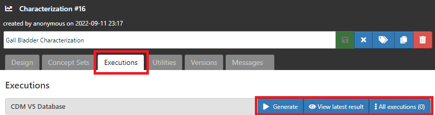

 

結果が生成されたら、「Executions」の「All executions」タブをクリックして、「View reports」から結果を表示します。  

 

以上で、Characterizations の作成は完了です。

 

---
## **6．2　Characterizations の結果画面構成（View reports の画面構成）**

結果画面では、Cohort Definitions ごとの分析結果が表形式で表示されます。  
選択した全ての Feature Analyses の結果一覧表と、個々の Feature Analyses の結果一覧表が表示されます。  
結果画面には、フィルタ（Filter panel）機能が提供されています。  
フィルタを使用して結果を絞り込んで表示することができます。  

１）フィルタ（Filter panel）機能
- Cohorts  
コホートの表示切替ができます。  
複数のコホートを選択することもできます。  

 

- Analyses  
特徴分析（Feature Analyses）の表示切替ができます。  
複数の特徴分析を選択することができます。  

 

- Domains  
ドメインの切替表示ができます。  
複数のドメインを選択することができます。  

 

２）分析結果の一覧表  
- All prevalence covariates  
「Filter panel」で選択したCohortsについて、特徴分析の結果が表示されます。  

 

- 「Feature Analyses 名称」  
各 Feature Analyses 毎の結果が表示されます。  
※下記の例は「Gall Bladder Drug Feature Analysis」の表示例となります。  

 

---
## **6．3　Characterizations の分析結果**

本書における分析結果では、「胆嚢摘出手術」と「腹腔鏡下 胆嚢摘出術」の手術を受けた患者に関連する診断病名、処方薬、検査項目について、患者数と発生率が統計され、表形式で表示されます。  

１）男女の患者数統計  
- Laparoscopic cholecystectomy の手術を受けた患者について、性別毎の人数と発生率が確認できます。  

Laparoscopic cholecystectomy Definition
|項目|人数|発生率|
|:---:|:---:|:---:|
|MALE|6|17.14%|
|FEMALE|29|82.86%|

 

- Cholecystectomy の手術を受けた患者について、性別毎の人数と発生率が確認できます。  

Cholecystectomy Definition
|項目|人数|発生率|
|:---:|:---:|:---:|
|MALE|0|0.00%|
|FEMALE|3|100.00%|

 

Characterizations 分析結果画面では、男女の患者数統計の一覧表が下表のように表示されます。  

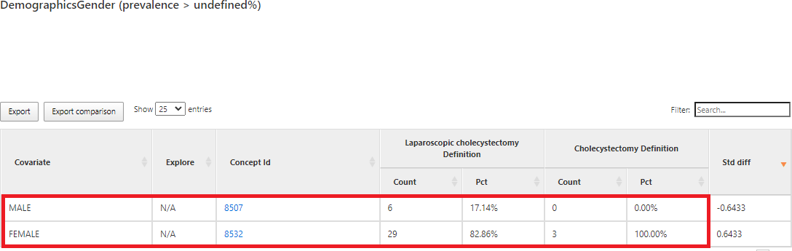

 

２）薬剤別の患者数統計  
- Laparoscopic cholecystectomy の手術を受けた患者に処方された薬剤について、薬剤別の患者数と発生率が確認できます。  

Laparoscopic cholecystectomy Definition
|項目|人数|発生率|
|:---:|:---:|:---:|
|1 ML Morphine Sulfate 5 MG/ML Injection|35|100.00%|
|100 ML Propofol 10 MG/ML Injection|35|100.00%|
|2 ML Ondansetron 2 MG/ML Injection|35|100.00%|
|Acetaminophen 160 MG Oral Tablet|16|45.71%|
|heparin|35|100.00%|
|Isoflurane 999 MG/ML Inhalant Solution|27|77.14%|
|Meperidine Hydrochloride 50 MG Oral Tablet|12|34.29%|
|Midazolam 1 MG/ML Injectable Solution|33|94.29%|
|Piperacillin 4000 MG/tazobactam 500 MG Injection|35|100.00%|
|remifentanil|16|45.71%|
|rocuronium bromide 10 MG/ML Injectable Solution|35|100.00%|
|sevoflurane 1000 MG/ML Inhalant Solution|3|8.57%|
|Sodium Chloride 9 MG/ML Injectable Solution|35|100.00%|
|sufentanil|0|0.00%|

 

- Cholecystectomy の手術を受けた患者に処方された薬剤について、薬剤別の患者数と発生率が確認できます。  

Cholecystectomy Definition
|項目|人数|発生率|
|:---:|:---:|:---:|
|1 ML Morphine Sulfate 5 MG/ML Injection|3|100.00%|
|100 ML Propofol 10 MG/ML Injection|3|100.00%|
|2 ML Ondansetron 2 MG/ML Injection|3|100.00%|
|Acetaminophen 160 MG Oral Tablet|3|100.00%|
|heparin|3|100.00%|
|Isoflurane 999 MG/ML Inhalant Solution|2|66.67%|
|Meperidine Hydrochloride 50 MG Oral Tablet|3|100.00%|
|Midazolam 1 MG/ML Injectable Solution|3|100.00%|
|Piperacillin 4000 MG/tazobactam 500 MG Injection|3|100.00%|
|remifentanil|0|0.00%|
|rocuronium bromide 10 MG/ML Injectable Solution|3|100.00%|
|sevoflurane 1000 MG/ML Inhalant Solution|1|33.33%|
|Sodium Chloride 9 MG/ML Injectable Solution|3|100.00%|
|sufentanil|0|0.00%|

 

Characterizations分析結果画面では、処方された薬剤別の患者数統計の一覧表が下表のように表示されます。  

 

また、2つの手術を選択して分析結果を表示した場合、分散図も表示されます。  
分散図の青い点にカーソルを合わせると、そのコホートの発生率が表示されます。  
この例では、X軸は「Laparoscopic cholecystectomy 術式」、Ｙ軸は「Cholecystectomy 術式」の発生率を表します。  
「Isoflurane 999 MG/ML Inhalant Solution」の青い点にカーソルを合わせると、薬剤を処方した患者の発生率が表示されます。  
「Laparoscopic cholecystectomy術式」で「Isoflurane 999 MG/ML Inhalant Solution」の薬剤の発生率は77.14%、「Cholecystectomy術式」で「Isoflurane 999 MG/ML Inhalant Solution」の薬剤の発生率は66.6％であることが確認できます。  

 

３）病名別の患者数統計  
- Laparoscopic cholecystectomy の手術を受けた患者について、診断された病名別の患者数と発生率が確認できます。  

Laparoscopic cholecystectomy Definition
|項目|人数|発生率|
|:---:|:---:|:---:|
|MALE|35|100.00%|
|FEMALE|35|100.00%|

- Cholecystectomy の手術を受けた患者について、診断された病名別の患者数と発生率が確認できます。  

Cholecystectomy Definition
|項目|人数|発生率|
|:---:|:---:|:---:|
|MALE|3|100.00%|
|FEMALE|3|100.00%|

 

Characterizations 分析結果画面では、診断された病名別の患者数統計の一覧表が下表のように表示されます。  

 

４）検査項目別の患者数統計  
・Laparoscopic cholecystectomy の手術を受けた患者について、受けた検査項目別の患者数と発生率が確認できます。  

Laparoscopic cholecystectomy Definition
|項目|人数|発生率|
|:---:|:---:|:---:|
|Hematocrit|35|100.00%|
|Globulin|35|100.00%|
|Hemoglobin|35|100.00%|

 

- Cholecystectomy の手術を受けた患者について、受けた検査項目別の患者数と発生率が確認できます。  

Cholecystectomy Definition
|項目|人数|発生率|
|:---:|:---:|:---:|
|Hematocrit|3|100.00%|
|Globulin|3|100.00%|
|Hemoglobin|3|100.00%|

Characterizations 分析結果画面では、受けた検査項目別の患者数統計の一覧表が下表のように表示されます。  

 

---
## **6．4　Subgroup analysesの作成と分析**

本節では、Subgroup analyses の作成方法と分析結果について説明します。  
この例では、更に女性の患者数を分析結果に出力するために、女性の「Subgroup analyses」定義を追加し、女性の患者数を統計する操作方法を説明します。  
この例では、「女性」のサブグループ条件を定義します。  

「Subgroup analyses」の青いボタン「New subgroup」をクリックし、新規 Subgroup analyses が表示されます。  

 

「Subgroup analyses」のタイトル欄に、「Female」を入力します。  

 

「+Add criteria to group…」タイトル欄に「Female」を入力します。  

 

右側の青いボタン「+Add criteria to group…」をクリックして、「Add Demographic」を選択します。  

 

「with the following event criteria」の青いボタン「Add attribute…」をクリックして、「Add Gender Criteria」を選択します。  

 

「Add」ボタンをクリックして、条件の選択画面が表示されます。  

 

「FEMALE」条件の列の先頭にある黒い✔をクリックします。  
オレンジの✔が選択された状態となります。  

 

「Add Selected」ボタンをクリックします。  
最後に「Close」をクリックし、条件選択画面を閉じます。

 

「女性」のサブグループ条件は、下図のように定義されます。  

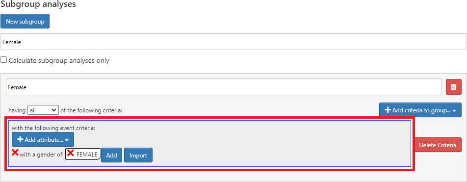

 

Subgroup analyses の条件を作成し終えたら、画面右上の保存ボタン（緑ボタン）をクリックします。  

 

分析実施のため、「Execution」タブに移動します。  
「Execution」タブでは、Atlas で構成されている全データソースが表示されています。（今回は Eunomia を用いた検証のため、CDM V5 Database が表示されます）  
対象とするデータソース欄の「Generate」ボタンをクリックすると Atlas での分析が実行されます。  

 

結果が生成されたら、「All executions」をクリックして、「View reports」から結果を表示します。  

 

Characterizations 分析結果の一覧表には、「女性」の患者数と発生率の情報が出力されます。  
下表のように、「薬剤別の患者数統計」の一覧表に全患者の統計情報と女性の統計情が表示されていることが分かります。  

 

Characterizations を用いた分析の操作は以上になります。

 

---
# **7　補足資料**
## **7．1　標準の Feature Analyses 項目**

Atlas では、105件の Feature Analyses 項目が標準で提供されています。  
OMOP CDM モデルの特性分析（Characterizations）を行う際に利用できます。  
「Demographics」の名称で始まる特徴分析項目は、コホート開始日における患者の人口統計情報を計算します。  
ドメイン名で始まる特徴分析項目(Visit、Procedure、Condition、Drugなど) については、ドメイン内に記録されたすべてのレコード観察値を統計します。  
また、各ドメインの特徴分析項目には、下記4つのコホート開始前の観察期間オプションがあります。  
- Any Time Prior（より前任意時間）: 人の観察期間内におけるコホート開始前
のすべての時間  
- Long Term（長期）: コホート開始日を含む 365 日前  
- Medium Term（中期）: コホート開始日を含む 180 日前  
- Short Term（短期）: コホート開始日を含む 30 日前  

下記表が標準のFeature Analyses項目の一覧となります。  
|ID|項目名（英語）|項目名（日本語訳）|ドメイン|
|:---|:---|:---|:---|
|2|Condition Group Era Start Long Term|疾病グループ歴開始 長期（365日）|CONDITION|
|4|Condition Era Short Term|疾病歴 短期（30日）|CONDITION|
|6|Condition Group Era Overlapping|疾病グループ歴 重複期間|CONDITION|
|9|Condition Era Start Long Term|疾病歴開始 長期（365日）|CONDITION|
|10|Condition Era Any Time Prior|疾病歴 任意期間|CONDITION|
|11|Condition Group Era Start Medium Term|疾病グループ歴の開始 中期（180日）|CONDITION|
|16|Condition Era Medium Term|疾病歴 中期（180日）|CONDITION|
|17|Condition Era Overlapping|疾病歴 重複期間|CONDITION|
|18|Condition Era Start Short Term|疾病歴開始 短期（30日）|CONDITION|
|20|Condition Group Era Short Term|疾病グループの歴 短期（30日）|CONDITION|
|21|Condition Era Start Medium Term|疾病歴開始 中期（180日）|CONDITION|
|23|Condition Era Long Term|疾病歴 長期（365日）|CONDITION|
|27|Condition Group Era Any Time Prior|疾病グループ歴 任意期間|CONDITION|
|29|Condition Group Era Start Short Term|疾病グループ歴開始 短期（30日）|CONDITION|
|30|Condition Group Era Long Term|疾病群の歴 長期（365日）|CONDITION|
|32|Condition Group Era Medium Term|疾病群の歴 中期（180日）|CONDITION|
|36|Dcsi|DCSI|CONDITION|
|41|Distinct Condition Count Long Term|個別疾病カウント 長期（365日）|CONDITION|
|48|Distinct Condition Count Short Term|個別疾病カウント 短期（30日）|CONDITION|
|49|Charlson Index|チャールソン指数|CONDITION|
|54|Distinct Condition Count Medium Term|個別疾病カウント 中期（180日）|CONDITION|
|67|Condition Occurrence Long Term|疾病発生 長期（365日）|CONDITION|
|69|Condition Occurrence Any Time Prior|疾病発生前 任意期間|CONDITION|
|76|Condition Occurrence Medium Term|疾病発生 中期（180日）|CONDITION|
|78|Chads 2|Chads 2|CONDITION|
|82|Chads 2 Vasc|Chads 2 Vasc|CONDITION|
|83|Condition Occurrence Primary Inpatient Long Term|疾病発生 初回入院患者 長期（365日）|CONDITION|
|85|Condition Occurrence Primary Inpatient Any Time Prior|疾病発生 初回入院患者 任意期間|CONDITION|
|90|Condition Occurrence Short Term|疾病発生 短期（30日）|CONDITION|
|102|Occurrence Primary Inpatient Short Term|初回入院患者 短期（30日）|CONDITION|
|104|Occurrence Primary Inpatient Medium Term|初回入院患者 中期（180日）|CONDITION|
|105|Hospital Frailty Risk Score|入院患者フレイルリスクスコア|CONDITION|

 

|ID|項目名（英語）|項目名（日本語訳）|ドメイン|
|:---|:---|:---|:---|
|68|Demographics Index Month|人口統計 月別|Demographics |
|70|Demographics Ethnicity|人口統計 民族別|Demographics |
|71|Demographics Gender|人口統計 年齢別|Demographics |
|72|Demographics Race|人口統計 人種別|Demographics |
|73|Demographics Prior Observation Time|人口統計 事前観察期間|Demographics |
|74|Demographics Gender|人口統計 性別|Demographics |
|75|Demographics Index Year Month|人口統計 指数年月|Demographics |
|77|Demographics Age|人口統計 年齢別|Demographics |
|79|Demographics Time In Cohort|人口統計 コホート内の時間|Demographics |
|80|Demographics Index Year|人口統計指数年|Demographics |
|81|Demographics Post Observation Time|人口統計 観察後の時間|Demographics |

 

|ID|項目名（英語）|項目名（日本語訳）|ドメイン|
|:---|:---|:---|:---|
|52|Device Exposure Any Time Prior|デバイスの暴露 任意期間|Device|
|57|Device Exposure Long Term|デバイス暴露 長期（365日）|Device|
|59|Device Exposure Medium Term|デバイス暴露 中期（180日）|Device|
|65|Device Exposure Short Term|デバイス暴露 短期（30日）|Device|

 

|ID|項目名（英語）|項目名（日本語訳）|ドメイン|
|:---|:---|:---|:---|
|3|Drug Group Era Start Medium Term|薬剤グループ歴の開始 中期（180日）|DRUG|
|5|Drug Group Era Long Term|薬剤グループ歴 ​​長期（365日）|DRUG|
|7|Drug Group Era Short Term|薬剤グループ歴 ​​短期（30日）|DRUG|
|8|Drug Group Era Medium Term|薬剤グループ歴 中期（180日）|DRUG|
|12|Drug Exposure Long Term|薬物暴露 長期（365日）|DRUG|
|15|Drug Group Era Any Time Prior|薬物グループ歴 任意期間前|DRUG|
|19|Drug Group Era Start Short Term|薬剤グループ歴の開始 短期（30日）|DRUG|
|24|Drug Group Era Start Long Term|薬剤グループ歴の開始 長期（365日）|DRUG|
|25|Drug Group Era Overlapping|薬物群歴の重複期間|DRUG|
|28|Drug Exposure Any Time Prior|任意期間の薬物暴露|DRUG|
|31|Drug Exposure Short Term|薬物曝露 短期（30日）|DRUG|
|33|Drug Exposure Medium Term|薬物曝露 中期（180日）|DRUG|
|35|Drug Era Start Long Term|薬物歴の開始 長期（365日）|DRUG|
|37|Drug Era Start Short Term|薬物歴の開始 短期（30日）|DRUG|
|38|Distinct Ingredient Count Medium Term|個別成分カウント 中期（180日）|DRUG|
|43|Drug Era Short Term|薬剤歴の短期（30日）|DRUG|
|44|Drug Era Overlapping|薬剤歴 重複期間|DRUG|
|46|Distinct Ingredient Count Long Term|個別成分カウント 長期（365日）|DRUG|
|62|Drug Era Start Medium Term|薬物歴の開始 中期（180日）|DRUG|
|64|Distinct Ingredient Count Short Term|個別成分カウント 短期（30日）|DRUG|
|86|Drug Era Long Term|薬剤歴 長期（365日）|DRUG|
|88|Drug Era Medium Term|薬剤歴 中期（180日）|DRUG|
|89|Drug Era Any Time Prior|薬剤歴 任意期間|DRUG|

 

|ID|項目名（英語）|項目名（日本語訳）|ドメイン|
|:---|:---|:---|:---|
|1|Measurement Range Group Short Term|検査範囲 グループ 短期（30日）|MEASUREMENT|
|13|Measurement Range Group Long Term|検査範囲 グループ 長期（365日）|MEASUREMENT|
|14|Measurement Range Group Medium Term|検査範囲 グループ 中期（180日）|MEASUREMENT|
|26|Measurement Range Group Any Time Prior|検査範囲グループ 任意期間|MEASUREMENT|
|39|Measurement Any Time Prior|検査 任意期間|MEASUREMENT|
|40|Measurement Medium Term|検査 中期（180日）|MEASUREMENT|
|42|Measurement Value Long Term|検査値 長期（365日）|MEASUREMENT|
|50|Measurement Short Term|検査 短期（30日）|MEASUREMENT|
|58|Measurement Value Short Term|検査値 短期（30日）|MEASUREMENT|
|60|Measurement Long Term|検査 長期（365日）|MEASUREMENT|
|61|Measurement Value Medium Term|検査値 中期（180日）|MEASUREMENT|
|63|Measurement Value Any Time Prior|検査値 任意期間|MEASUREMENT|
|91|Distinct Measurement Count Short Term|個別検査カウント 短期（30日）|MEASUREMENT|
|95|Distinct Measurement Count Long Term|個別検査カウント長期（365日）|MEASUREMENT|
|96|Distinct Measurement Count Medium Term|個別検査カウント中期（180日）|MEASUREMENT|

 

|ID|項目名（英語）|項目名（日本語訳）|ドメイン|
|:---|:---|:---|:---|
|34|Observation Short Term|観察期間 短期（30日）|Observation |
|45|Observation Any Time Prior|観察期間 任意期間|Observation |
|53|Observation Long Term|観察期間 長期（365日）|Observation |
|56|Observation Medium Term|観察期間 中期（180日）|Observation |
|93|Distinct Observation Count Medium Term|観察期間カウント 中期（180日）|Observation |
|94|Distinct Observation Count Long Term|観察期間カウント 長期（365日）|Observation |
|97|Distinct Observation Count Short Term|観察期間カウント 短期（30日）|Observation |

 

|ID|項目名（英語）|項目名（日本語訳）|ドメイン|
|:---|:---|:---|:---|
|22|Procedure Occurrence Medium Term|手術処置発生 中期（180日）|Procedure|
|47|Distinct Procedure Count Short Term|手術処置発生カウント 短期（30日）|Procedure|
|51|Distinct Procedure Count Medium Term|手術処置発生カウント 中期（180日）|Procedure|
|55|Procedure Occurrence Short Term|手術処置発生 短期（30日）|Procedure|
|66|Distinct Procedure Count Long Term|手術処置発生カウント 長期（365日）|Procedure|
|84|Procedure Occurrence Long Term|手術処置発生 長期（365日）|Procedure|
|87|Procedure Occurrence Any Time Prior|手術処置発生 任意期間|Procedure|

 

|ID|項目名（英語）|項目名（日本語訳）|ドメイン|
|:---|:---|:---|:---|
|92|Visit Concept Count Short Term|訪問コンセプトカウント 短期（30日）|Visit|
|98|Visit Concept Count Long Term|訪問コンセプトカウント 長期（365日）|Visit|
|99|Visit Concept Count Medium Term|訪問コンセプトカウント 中期（180日）|Visit|
|100|Visit Count Medium Term|訪問回数 中期（180日）|Visit|
|101|Visit Count Short Term|訪問回数 短期（30日）|Visit|
|103|Visit Count Long Term|訪問回数 長期（365日）|Visit|
