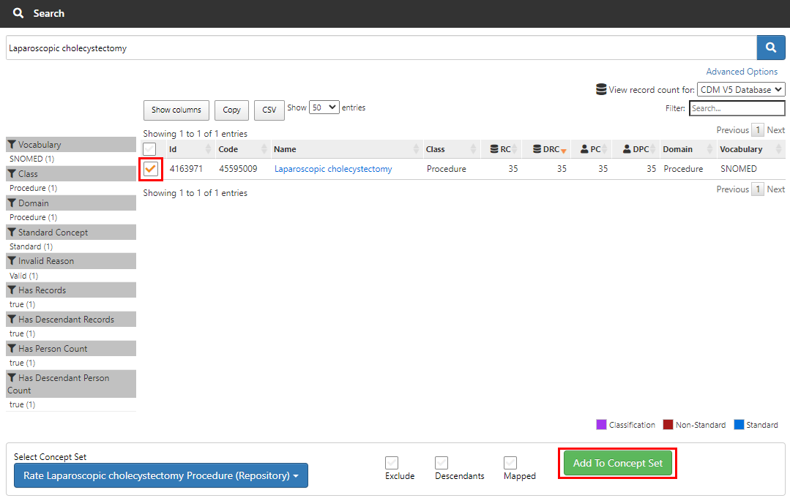

# **Atlas 操作手順 ～Incidence Rates～**

### **目次**
1　本手順書について  
2　Incidence Rates操作の流れ  
3　Concept Setsの作成  
4　Cohort Definitionsの作成  
5　Incidence Rates（発生率）の分析  
6　Incidence Rates（発生率）の分析実行  
7　補足資料  

---
# **1　本手順書について**
AtlasのIncidence Rates 操作手順について説明します。  
本操作手順は、以下の Atlas 動作環境が整備されていることを前提としています。

- Windows10（64 ビット）  
- Java 8 Java Development Kit (JDK)  
- Atlas セットアップ（[「Atlas セットアップ手順」](https://github.com/RWD-data-environment-in-Hospital/Documents/blob/main/Atlas_setup.md)参照）  
- Eunomia テストデータのセットアップ（[「Atlas 操作手順 Eunomia のテストデータセットアップについて」](https://github.com/RWD-data-environment-in-Hospital/Documents/blob/main/Atlas_operation_CohortPathways.md)(参照）  

 

---
# **2　Incidence Rates操作の流れ**

本操作手順では、以下に示す Incidence Rates を用いた分析を対象にした手順を記載しています。  

 

本書では、Eunomia のテストデータを使用して Atlas の Incidence Rates による分析を実施します。  
Incidence Rates による分析の操作手順では、下記の事例を取り上げて説明します。  

- Target Cohorts ：Acute cholecystitis（急性胆嚢炎）の治療を受けている患者集団
- Outcome Cohorts：Laparoscopic cholecystectomy（腹腔鏡下 胆嚢摘出術）の手術を受けた患者

上記のコホートを使用し、「急性胆嚢炎」の治療を受けている患者集団が、「腹腔鏡下 胆嚢摘出術」の手術を受けるリスクある患者の発生率を分析します。

Incidence Rates による分析は、上記事例に従い、下記のテストデータを用いて説明します。  

 

１）Target Cohorts  

＜診断された病名＞
|病名（英語名称）|病名（日本語名称）|
|:---|:---|
|Acute cholecystitis|急性胆嚢炎|

 

＜処方された薬剤＞
|薬剤（英語名称）|薬剤（日本語名称）|
|:---|:---|
|1 ML Morphine Sulfate 5 MG/ML Injection|1 ML モルヒネ硫酸塩 5 MG/ML 注射|
|100 ML Propofol 10 MG/ML Injection|100 MLプロポフォール 10 MG/ML注射|
|2 ML Ondansetron 2 MG/ML Injection|2 ML オンダンセトロン 2 MG/ML インジェクション|
|Acetaminophen 160 MG Oral Tablet|アセトアミノフェン160 MG経口錠剤|
|Heparin|ヘパリン|
|Midazolam 1 MG/ML Injectable Solution|ミダゾラム1 MG/ML注射液|
|Piperacillin 4000 MG/tazobactam 500 MG Injection|ピペラシリン 4000 MG/タゾバクタム 500 MG注射|
|rocuronium bromide 10 MG/ML Injectable Solution|臭化ロクロニウム 10 MG/ML注射液|
|sevoflurane 1000 MG/ML Inhalant Solution|セボフルラン 1000 MG/ML吸入剤溶液|
|Sodium Chloride 9 MG/ML Injectable Solution|塩化ナトリウム 9 MG/ML 注射液|
|Sufentanil|スフェンタニル|

 

２）Outcome Cohorts  

＜術式＞
|術式（英語名称）|術式（日本語名称）|
|:---|:---|
|Laparoscopic cholecystectomy|腹腔鏡下 胆嚢摘出術|

 

---
# **3	Concept Setsの作成**

本章では、コンセプトセットの登録方法を説明します。  
登録したコンセプトセットは、4章でコホート定義の登録に使用します。  

コンセプトセットには、以下の属性を設定します。  

- Exclude：  
選択したコンセプトをコンセプトセットから除外します。（コンセプトセットに含めない）  
なお、下記の Descendants にチェックを入れている場合は、選択したコンセプトに関係するコンセプトも除外します。  

- Descendants：  
選択したコンセプトに加えて、選択したコンセプトに関係するコンセプトについてもコンセプトセットに含めます。  

- Mapped：  
非標準に設定されているコンセプトもコンセプトセットに含めます。  

Incidence Rates による分析では、事前に「Target Cohorts」と「Outcome Cohorts」で使用する項目をコンセプトセットに登録します。  

コンセプトセットの作成方法を次章より示します。  

 

## **3．1　病名コンセプトセットの登録**
Atlas 画面左の「Concept Sets」をクリックすると、Atlas プラットフォーム内で既に作成されているコンセプトセットが表示されます。  

 

ここでは、新しくコンセプトセットを作成するので、画面右の「New Concept Set」をクリックして作成画面に遷移します。  

 

画面上部に、新規に作成する病名のコンセプトセットの名称「Rate Acute cholecystitis Condition」を入力します。  

 

名称の入力後、コンセプト情報の選択をします。  
「Concept Set Expression」タブの「Add Concepts」をクリックすると「Search」画面に遷移します。  

 

「Search」画面では、キーワードやコンセプトIDを入力することで対象とするコンセプト情報を検索することができます。  

 

下記のコンセプト情報をコンセプトセットに登録するため、「Search」画面で検索します。  

|Id|Code|Name|Class|Domain|Vocabulary|
|:---|:---|:---|:---|:---|:---|
|198809|65275009|Acute cholecystitis|Clinical Finding|Condition|SNOMED|

 

➀Search 画面のテキスト入力欄へ id 「198809」 を入力します。  
②検索ボタンをクリックすると、対象のリストが表示されます。  
③表示されたリストから「198809：Acute cholecystitis」にチェックを入れます。  
④Select Concept Set に「Rate Acute cholecystitis Condition」が選択されていることを確認します。  
⑤Descendants にチェックを入れます。  
⑥Add To Concept Set をクリックします。(ConceptSetsに組み込まれます)  

 

左メニューの「Concept Sets」をクリックします。  
「Rate Acute cholecystitis Condition」セットにコンセプトが追加され、独自のコンセプトセットが形成されたことを確認します。  

 

画面右上の緑の保存ボタンをクリックすると、「Concept Sets」のトップ画面の一覧に作成したコンセプトセットが追加されます。  
※派生するコンセプトも分析に含める想定のため、「Descendants」を有効にしています。  
（各コンセプトについて、「Exclude」、「Descendants」、「Mapped」をこの画面からも設定できます）  

 

以上でコンセプトセット「Rate Acute cholecystitis Condition」の作成が完了しました。  
×ボタンをクリックして、コンセプトセット「Rate Acute cholecystitis Condition」の画面を閉じます。  

 

---
## **3．2　薬剤コンセプトセットの登録**

薬剤のコンセプトセットを作成します。  
画面上部に、新規に作成する薬剤のコンセプトセットの名称「Rate Gallstone Drug」を入力します。  

 

「Concept Set Expression」タブの「Add Concepts」をクリックすると「Search」画面に遷移します。  

 

「3．1　病名コンセプトセットの登録」と同様の操作で、「Rate Gallstone Drug」のコンセプトセットに、下記の薬剤群のコンセプトセットを追加して登録します。  

- 1 ML Morphine Sulfate 5 MG/ML Injection

|Concept Id|Concept Code|Concept Name|Domain|Standard Concept Caption|Exclude|Descendants|Mapped|
|:---:|:---:|:---:|:---:|:---:|:---:|:---:|:---:|
|35605858|1732136|1 ML Morphine Sulfate 5 MG/ML	Injection|Drug|Standard||✓||

 

- 100 ML Propofol 10 MG/ML Injection

|Concept Id|Concept Code|Concept Name|Domain|Standard Concept Caption|Exclude|Descendants|Mapped|
|:---:|:---:|:---:|:---:|:---:|:---:|:---:|:---:|
|40220386|1808217|100 ML Propofol 10 MG/ML Injection|Drug|Standard||✓||

 

- 2 ML Ondansetron 2 MG/ML Injection

|Concept Id|Concept Code|Concept Name|Domain|Standard Concept Caption|Exclude|Descendants|Mapped|
|:---:|:---:|:---:|:---:|:---:|:---:|:---:|:---:|
|35605482|1740467|2 ML Ondansetron 2 MG/ML Injection|Drug|Standard||✓||

 

- Acetaminophen 160 MG Oral Tablet

|Concept Id|Concept Code|Concept Name|Domain|Standard Concept Caption|Exclude|Descendants|Mapped|
|:---:|:---:|:---:|:---:|:---:|:---:|:---:|:---:|
|1127078|282464|Acetaminophen 160 MG Oral Tablet|Drug|Standard||✓||	

 

- heparin

|Concept Id|Concept Code|Concept Name|Domain|Standard Concept Caption|Exclude|Descendants|Mapped|
|:---:|:---:|:---:|:---:|:---:|:---:|:---:|:---:|
|1367571|5224|heparin|Drug|Standard||✓||

 

- Midazolam 1 MG/ML Injectable Solution

|Concept Id|Concept Code|Concept Name|Domain|Standard Concept Caption|Exclude|Descendants|Mapped|
|:---:|:---:|:---:|:---:|:---:|:---:|:---:|:---:|
|19078924|311700|Midazolam 1 MG/ML Injectable Solution|Drug|Standard||✓||

 

- Piperacillin 4000 MG/tazobactam 500 MG Injection

|Concept Id|Concept Code|Concept Name|Domain|Standard Concept Caption|Exclude|Descendants|Mapped|
|:---:|:---:|:---:|:---:|:---:|:---:|:---:|:---:|
|46275444|1659149|Piperacillin 4000 MG/tazobactam 500 MG Injection|Drug|Standard||✓||

 

- rocuronium bromide 10 MG/ML Injectable Solution

|Concept Id|Concept Code|Concept Name|Domain|Standard Concept Caption|Exclude|Descendants|Mapped|
|:---:|:---:|:---:|:---:|:---:|:---:|:---:|:---:|
|42707627|1234995|rocuronium bromide 10 MG/ML Injectable Solution|Drug|Standard||✓||

 

- sevoflurane 1000 MG/ML Inhalant Solution

|Concept Id|Concept Code|Concept Name|Domain|Standard Concept Caption|Exclude|Descendants|Mapped|
|:---:|:---:|:---:|:---:|:---:|:---:|:---:|:---:|
|19023398|200243|sevoflurane 1000 MG/ML Inhalant Solution|Drug|Standard||✓||

 

- Sodium Chloride 9 MG/ML Injectable Solution

|Concept Id|Concept Code|Concept Name|Domain|Standard Concept Caption|Exclude|Descendants|Mapped|
|:---:|:---:|:---:|:---:|:---:|:---:|:---:|:---:|
|19079524|313002|Sodium Chloride 9 MG/ML Injectable Solution|Drug|Standard||✓||

 

- Sufentanil

|Concept Id|Concept Code|Concept Name|Domain|Standard Concept Caption|Exclude|Descendants|Mapped|
|:---:|:---:|:---:|:---:|:---:|:---:|:---:|:---:|
|19078219|56795|Sufentanil|Drug|Standard||✓||

 

検索した内容から、追加するコンセプト情報の左側のボックスにチェックを入れ、ページ下の「Select Concept Set」から「Add to Concept Set」をクリックし、コンセプトセットへ追加します。  

 

薬剤のコンセプトセット「Rate Gallstone Drug」にコンセプト情報が追加されたことを確認します。  

 

このコンセプトセットも、関係するコンセプト情報を分析に含める想定のため、以下のように「Descendants」にチェック入っていることを確認します。  

 

画面右上の緑の保存ボタンをクリックすると、コンセプトセットが保存されます。  
「Concept Sets」のトップ画面に戻ると、一覧に作成したコンセプトセットが表示されています。  

 

以上で薬剤のコンセプトセット「Rate Gallstone Drug」の作成が完了しました。  

 

---
## **3.3　術式コンセプトセットの登録**
同様の操作で、術式のコンセプトセットについても作成します。  
画面上部に新規に作成する術式のコンセプトセットの名称「Rate Laparoscopic cholecystectomy Procedure」を入力します。  

 

「Concept Set Expression」タブの「Add Concepts」をクリックすると「Search」画面に遷移します。  

 

「Rate Laparoscopic cholecystectomy Procedure」のコンセプトセットに、下記の術式のコンセプト情報を追加して登録します。  

- Laparoscopic cholecystectomy

|Concept Id|Concept Code|Concept Name|Domain|Standard Concept Caption|Exclude|Descendants|Mapped|
|:---:|:---:|:---:|:---:|:---:|:---:|:---:|:---:|
|4163971|45595009|Laparoscopic cholecystectomy|Procedure|Standard||✓||

 

検索した内容から、追加するコンセプト情報の左側のボックスにチェックを入れ、ページ下の「Select Concept Set」から「Add to Concept Set」をクリックし、コンセプトセットへ追加します。  

 

術式のコンセプトセット「Rate Laparoscopic cholecystectomy Procedure」にコンセプト情報が追加されたことを確認します。

 

このコンセプト情報も、派生するコンセプトを分析に含める想定のため、以下のように「Descendants」にチェックが入っていることを確認します。  

 

画面右上の緑の保存ボタンをクリックすると、コンセプトセットが保存されます。
「Concept Sets」のトップ画面に戻ると、一覧に作成したコンセプトセットが表示されています。

 

以上で術式のコンセプトセット「Rate Laparoscopic cholecystectomy Procedure」の作成が完了しました。  

以上でコンセプトセットの作成は完了です。  

---
# **4　Cohort Definitionsの作成**