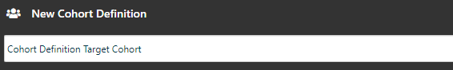
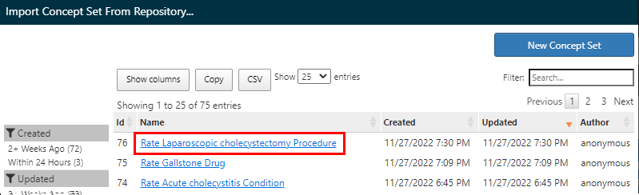
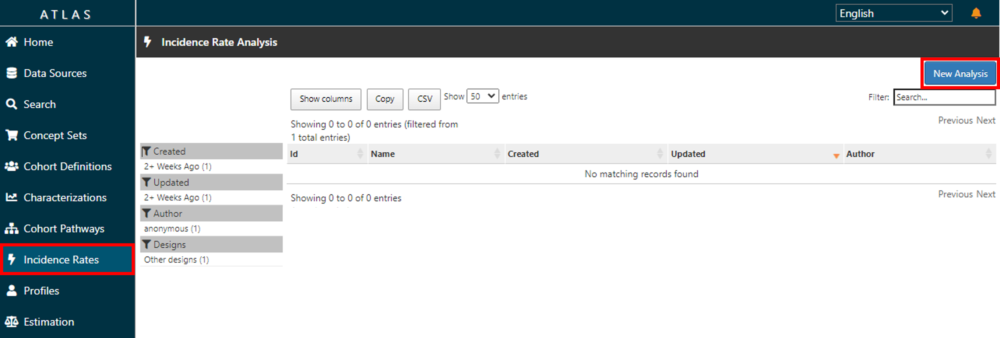
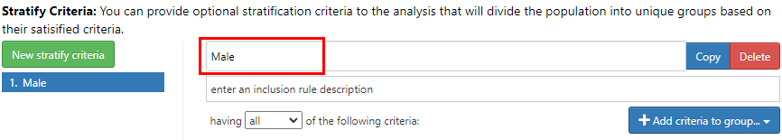
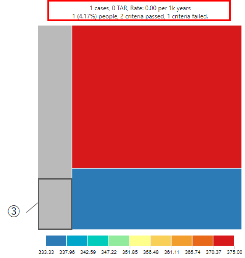

# **Atlas 操作手順 ～Incidence Rates～**

### **目次**
[1　本手順書について](#1-本手順書について)  
[2　Incidence Rates操作の流れ](#2-incidence-rates操作の流れ)  
[3　Concept Setsの作成](#3-concept-setsの作成)  
[4　Cohort Definitionsの作成](#4-cohort-definitionsの作成)  
[5　Incidence Rates（発生率）の分析](#5-incidence-rates発生率の分析)  
[6　Incidence Rates（発生率）の分析実行](#6-incidence-rates発生率の分析実行)  
[7　補足資料](#7-補足資料)  

 

---
# **1　本手順書について**
Atlas の Incidence Rates 操作手順について説明します。  
本操作手順は、以下の Atlas 動作環境が整備されていることを前提としています。

- Windows10（64 ビット）  
- Java 8 Java Development Kit (JDK)  
- Atlas セットアップ（[「Atlas セットアップ手順」](https://github.com/RWD-data-environment-in-Hospital/Documents/blob/main/Atlas_setup.md)参照）  
- Eunomia テストデータのセットアップ（[「Atlas 操作手順 Eunomia のテストデータセットアップについて」](https://github.com/RWD-data-environment-in-Hospital/Documents/blob/main/Atlas_operation_CohortPathways.md)(参照）  

 

---
# **2　Incidence Rates操作の流れ**

本操作手順では、以下に示す Incidence Rates を用いた分析を対象にした手順を記載しています。  

 

本書では、Eunomia のテストデータを使用して Atlas の Incidence Rates による分析を実施します。  
Incidence Rates による分析の操作手順では、下記の事例を取り上げて説明します。  

- Target Cohorts ：Acute cholecystitis（急性胆嚢炎）の治療を受けている患者集団
- Outcome Cohorts：Laparoscopic cholecystectomy（腹腔鏡下 胆嚢摘出術）の手術を受けた患者

 

上記のコホートを使用し、「急性胆嚢炎」の治療を受けている患者集団が、「腹腔鏡下 胆嚢摘出術」の手術を受けるリスクある患者の発生率を分析します。

Incidence Rates による分析は、上記事例に従い、下記のテストデータを用いて説明します。  

 

### **１）Target Cohorts**  

＜診断された病名＞
|病名（英語名称）|病名（日本語名称）|
|:---|:---|
|Acute cholecystitis|急性胆嚢炎|

 

＜処方された薬剤＞
|薬剤（英語名称）|薬剤（日本語名称）|
|:---|:---|
|1 ML Morphine Sulfate 5 MG/ML Injection|1 ML モルヒネ硫酸塩 5 MG/ML 注射|
|100 ML Propofol 10 MG/ML Injection|100 MLプロポフォール 10 MG/ML注射|
|2 ML Ondansetron 2 MG/ML Injection|2 ML オンダンセトロン 2 MG/ML インジェクション|
|Acetaminophen 160 MG Oral Tablet|アセトアミノフェン160 MG経口錠剤|
|Heparin|ヘパリン|
|Midazolam 1 MG/ML Injectable Solution|ミダゾラム1 MG/ML注射液|
|Piperacillin 4000 MG/tazobactam 500 MG Injection|ピペラシリン 4000 MG/タゾバクタム 500 MG注射|
|rocuronium bromide 10 MG/ML Injectable Solution|臭化ロクロニウム 10 MG/ML注射液|
|sevoflurane 1000 MG/ML Inhalant Solution|セボフルラン 1000 MG/ML吸入剤溶液|
|Sodium Chloride 9 MG/ML Injectable Solution|塩化ナトリウム 9 MG/ML 注射液|
|Sufentanil|スフェンタニル|

 

### **２）Outcome Cohorts**  

＜術式＞
|術式（英語名称）|術式（日本語名称）|
|:---|:---|
|Laparoscopic cholecystectomy|腹腔鏡下 胆嚢摘出術|

 

---
# **3	Concept Setsの作成**

本章では、コンセプトセットの登録方法を説明します。  
登録したコンセプトセットは、4章でコホート定義の登録に使用します。  

コンセプトセットには、以下の属性を設定します。  

- Exclude：  
選択したコンセプトをコンセプトセットから除外します。（コンセプトセットに含めない）  
なお、下記の Descendants にチェックを入れている場合は、選択したコンセプトに関係するコンセプトも除外します。  

- Descendants：  
選択したコンセプトに加えて、選択したコンセプトに関係するコンセプトについてもコンセプトセットに含めます。  

- Mapped：  
非標準に設定されているコンセプトもコンセプトセットに含めます。  

 

Incidence Rates による分析では、事前に「Target Cohorts」と「Outcome Cohorts」で使用する項目をコンセプトセットに登録します。  

コンセプトセットの作成方法を次章より示します。  

 

---
## **3．1　病名コンセプトセットの登録**
Atlas 画面左の「Concept Sets」をクリックすると、Atlas プラットフォーム内で既に作成されているコンセプトセットが表示されます。  

 

ここでは、新しくコンセプトセットを作成するので、画面右の「New Concept Set」をクリックして作成画面に遷移します。  

 

画面上部に、新規に作成する病名のコンセプトセットの名称「Rate Acute cholecystitis Condition」を入力します。  

 

名称の入力後、コンセプト情報の選択をします。  
「Concept Set Expression」タブの「Add Concepts」をクリックすると「Search」画面に遷移します。  

 

「Search」画面では、キーワードやコンセプトIDを入力することで対象とするコンセプト情報を検索することができます。  

 

下記のコンセプト情報をコンセプトセットに登録するため、「Search」画面で検索します。  

|Id|Code|Name|Class|Domain|Vocabulary|
|:---|:---|:---|:---|:---|:---|
|198809|65275009|Acute cholecystitis|Clinical Finding|Condition|SNOMED|

 

➀Search 画面のテキスト入力欄へ id 「198809」 を入力します。  
②検索ボタンをクリックすると、対象のリストが表示されます。  
③表示されたリストから「198809：Acute cholecystitis」にチェックを入れます。  
④Select Concept Set に「Rate Acute cholecystitis Condition」が選択されていることを確認します。  
⑤Descendants にチェックを入れます。  
⑥Add To Concept Set をクリックします。(ConceptSetsに組み込まれます)  

 

左メニューの「Concept Sets」をクリックします。  
「Rate Acute cholecystitis Condition」セットにコンセプトが追加され、独自のコンセプトセットが形成されたことを確認します。  

 

画面右上の緑の保存ボタンをクリックすると、「Concept Sets」のトップ画面の一覧に作成したコンセプトセットが追加されます。  
※派生するコンセプトも分析に含める想定のため、「Descendants」を有効にしています。  
（各コンセプトについて、「Exclude」、「Descendants」、「Mapped」をこの画面からも設定できます）  

 

以上でコンセプトセット「Rate Acute cholecystitis Condition」の作成が完了しました。  
×ボタンをクリックして、コンセプトセット「Rate Acute cholecystitis Condition」の画面を閉じます。  

 

---
## **3．2　薬剤コンセプトセットの登録**

薬剤のコンセプトセットを作成します。  
画面上部に、新規に作成する薬剤のコンセプトセットの名称「Rate Gallstone Drug」を入力します。  

 

「Concept Set Expression」タブの「Add Concepts」をクリックすると「Search」画面に遷移します。  

 

「3．1　病名コンセプトセットの登録」と同様の操作で、「Rate Gallstone Drug」のコンセプトセットに、下記の薬剤群のコンセプトセットを追加して登録します。  

- 1 ML Morphine Sulfate 5 MG/ML Injection

|Concept Id|Concept Code|Concept Name|Domain|Standard Concept Caption|Exclude|Descendants|Mapped|
|:---:|:---:|:---:|:---:|:---:|:---:|:---:|:---:|
|35605858|1732136|1 ML Morphine Sulfate 5 MG/ML	Injection|Drug|Standard||✓||

 

- 100 ML Propofol 10 MG/ML Injection

|Concept Id|Concept Code|Concept Name|Domain|Standard Concept Caption|Exclude|Descendants|Mapped|
|:---:|:---:|:---:|:---:|:---:|:---:|:---:|:---:|
|40220386|1808217|100 ML Propofol 10 MG/ML Injection|Drug|Standard||✓||

 

- 2 ML Ondansetron 2 MG/ML Injection

|Concept Id|Concept Code|Concept Name|Domain|Standard Concept Caption|Exclude|Descendants|Mapped|
|:---:|:---:|:---:|:---:|:---:|:---:|:---:|:---:|
|35605482|1740467|2 ML Ondansetron 2 MG/ML Injection|Drug|Standard||✓||

 

- Acetaminophen 160 MG Oral Tablet

|Concept Id|Concept Code|Concept Name|Domain|Standard Concept Caption|Exclude|Descendants|Mapped|
|:---:|:---:|:---:|:---:|:---:|:---:|:---:|:---:|
|1127078|282464|Acetaminophen 160 MG Oral Tablet|Drug|Standard||✓||	

 

- heparin

|Concept Id|Concept Code|Concept Name|Domain|Standard Concept Caption|Exclude|Descendants|Mapped|
|:---:|:---:|:---:|:---:|:---:|:---:|:---:|:---:|
|1367571|5224|heparin|Drug|Standard||✓||

 

- Midazolam 1 MG/ML Injectable Solution

|Concept Id|Concept Code|Concept Name|Domain|Standard Concept Caption|Exclude|Descendants|Mapped|
|:---:|:---:|:---:|:---:|:---:|:---:|:---:|:---:|
|19078924|311700|Midazolam 1 MG/ML Injectable Solution|Drug|Standard||✓||

 

- Piperacillin 4000 MG/tazobactam 500 MG Injection

|Concept Id|Concept Code|Concept Name|Domain|Standard Concept Caption|Exclude|Descendants|Mapped|
|:---:|:---:|:---:|:---:|:---:|:---:|:---:|:---:|
|46275444|1659149|Piperacillin 4000 MG/tazobactam 500 MG Injection|Drug|Standard||✓||

 

- rocuronium bromide 10 MG/ML Injectable Solution

|Concept Id|Concept Code|Concept Name|Domain|Standard Concept Caption|Exclude|Descendants|Mapped|
|:---:|:---:|:---:|:---:|:---:|:---:|:---:|:---:|
|42707627|1234995|rocuronium bromide 10 MG/ML Injectable Solution|Drug|Standard||✓||

 

- sevoflurane 1000 MG/ML Inhalant Solution

|Concept Id|Concept Code|Concept Name|Domain|Standard Concept Caption|Exclude|Descendants|Mapped|
|:---:|:---:|:---:|:---:|:---:|:---:|:---:|:---:|
|19023398|200243|sevoflurane 1000 MG/ML Inhalant Solution|Drug|Standard||✓||

 

- Sodium Chloride 9 MG/ML Injectable Solution

|Concept Id|Concept Code|Concept Name|Domain|Standard Concept Caption|Exclude|Descendants|Mapped|
|:---:|:---:|:---:|:---:|:---:|:---:|:---:|:---:|
|19079524|313002|Sodium Chloride 9 MG/ML Injectable Solution|Drug|Standard||✓||

 

- Sufentanil

|Concept Id|Concept Code|Concept Name|Domain|Standard Concept Caption|Exclude|Descendants|Mapped|
|:---:|:---:|:---:|:---:|:---:|:---:|:---:|:---:|
|19078219|56795|Sufentanil|Drug|Standard||✓||

 

薬剤のコンセプトセット「Rate Gallstone Drug」にコンセプト情報が追加されたことを確認します。  

 

このコンセプトセットも、関係するコンセプト情報を分析に含める想定のため、以下のように「Descendants」にチェック入っていることを確認します。  

 

画面右上の緑の保存ボタンをクリックすると、コンセプトセットが保存されます。  
「Concept Sets」のトップ画面に戻ると、一覧に作成したコンセプトセットが表示されています。  

 

以上で薬剤のコンセプトセット「Rate Gallstone Drug」の作成が完了しました。  

 

---
## **3．3　術式コンセプトセットの登録**
同様の操作で、術式のコンセプトセットについても作成します。  
画面上部に新規に作成する術式のコンセプトセットの名称「Rate Laparoscopic cholecystectomy Procedure」を入力します。  

 

「Concept Set Expression」タブの「Add Concepts」をクリックすると「Search」画面に遷移します。  

 

「Rate Laparoscopic cholecystectomy Procedure」のコンセプトセットに、下記の術式のコンセプト情報を追加して登録します。  

- Laparoscopic cholecystectomy

|Concept Id|Concept Code|Concept Name|Domain|Standard Concept Caption|Exclude|Descendants|Mapped|
|:---:|:---:|:---:|:---:|:---:|:---:|:---:|:---:|
|4163971|45595009|Laparoscopic cholecystectomy|Procedure|Standard||✓||

 

術式のコンセプトセット「Rate Laparoscopic cholecystectomy Procedure」にコンセプト情報が追加されたことを確認します。

 

このコンセプト情報も、派生するコンセプトを分析に含める想定のため、以下のように「Descendants」にチェックが入っていることを確認します。  

 

画面右上の緑の保存ボタンをクリックすると、コンセプトセットが保存されます。
「Concept Sets」のトップ画面に戻ると、一覧に作成したコンセプトセットが表示されています。

 

以上で術式のコンセプトセット「Rate Laparoscopic cholecystectomy Procedure」の作成が完了しました。  

以上でコンセプトセットの作成は完了です。  

 

---
# **4　Cohort Definitionsの作成**

Incidence Rates による分析では、前章で登録したコンセプトセットを用いて、「Target Cohorts」と「Outcome Cohorts」の Cohort Definitions（コホート定義）を登録する必要があります。  

- Target Cohorts ：Acute cholecystitis（急性胆嚢炎）の治療を受けている患者集団  
- Outcome Cohorts：Laparoscopic cholecystectomy（腹腔鏡下 胆嚢摘出術）の手術を受けた患者

 

本章では、Incidence Rates 機能で分析に使用する「Target Cohorts」と「Outcome Cohorts」について、コホート定義の登録方法を説明します。  

 

本書において、「Target Cohorts」には、以下の２つのコンセプトセットを登録します。  

- 病名のコンセプトセット  
Rate Acute cholecystitis Condition  

- 薬剤のコンセプトセット  
Rate Gallstone Drug  

 

「Outcome Cohorts」には、以下の１つのコンセプトセットを登録します。  

- 術式のコンセプトセット  
Rate Laparoscopic cholecystectomy Procedure  

 

---
## **4．1　「Target Cohorts」のコホート定義の登録**

Atlas 画面の左タブから「Cohort Definitions」画面を開くと、Atlas プラットフォーム内で既に作成されているコホート定義が表示されます。  
ここでは、コホート定義を新規作成するので、「New Cohort」をクリックします。  

 

「New Cohort」をクリックすると、「New Cohort Definition」画面（コホート定義作成画面）が表示されます。  

 

コホート定義作成画面の上部に、コホート名を入力する欄があるので、目標コホート名称「Cohort Definition Target Cohort」と入力します。  

 

### **１）「Cohort Entry Events（コホート開始イベント）」の設定**

「Cohort Entry Events」欄右側の「＋Add Initial Event...」をクリックして、「Add Drug Exposure」を選択します。  

 

「Any Drug」の▼をクリックし、「Import Concept Set」を選択します。  

  
※もし、誤ったコンセプトセットをインポートしてしまった場合は、「Clear Concept Set」を選択することで、インポートを解除することが出来ます。

 

「Import Concept Set」を選択すると、作成されているコンセプトセットの一覧が表示されるので、薬剤のコンセプトセット「Rate Gallstone Drug」を選択します。  

 

観察期間については指定の必要がないので、デフォルトのままにします。  
※「0」daysの選択で全期間のデータが対象となります。  
対象イベントは「all events」を選択します。  

 

### **２）「Inclusion Criteria（組み入れ基準）」の設定**

緑色ボタンの「New inclusion criteria」をクリックし、ボタン横に表示される空欄内に組み入れ基準名として「Rate Acute cholecystitis Condition」を入力します。  

 

病名を基準とするので、「＋Add criteria to group...」から「Add Condition Occurrence」を選択します。  

 

「Add Condition Occurrence」を選択すると、欄内に図のような詳細設定画面が表示されます。  

 

「Any Condition」に組み入れ基準とする病名のコンセプトセットを設定します。
「Any Condition」の▼をクリックし、「Import Concept Set」を選択します。

  
※もし、誤ったコンセプトセットをインポートしてしまった場合は、「Clear Concept Set」を選択することで、インポートを解除することが出来ます。  

 

「Import Concept Set」を開くと作成されているコンセプトセットの一覧が表示されるので、病名のコンセプトセット「Rate Acute cholecystitis Condition」をクリックして選択します。  

 

対象イベントは「all events」を選択します。  

 

### **３）「Cohort Exit（コホート終了条件）」の設定**

本章では、コホートの終了条件を、「薬剤の継続的観察の終了」として設定します。  
このため、「Event Persistence」は「end of a continuous drug exposure」を選択します。  

 

「Select Drug Concept Set」の▼をクリックし、薬剤のコンセプトセット「Rate Gallstone Drug」を選択します。  

 

薬剤のコンセプトセット「Rate Gallstone Drug」を設定した後、以下の設定を行います。  

- Persistence window（持続性ウィンドウ）  
持続性ウィンドウのExposure Recordsの最大日数は、「０」daysを設定します。  
※「0」daysを設定する事で、全期間の日数となります。  

- Surveillance window（監視ウィンドウ）  
監視ウィンドウの終了期間に追加する日数は、「０」daysを設定します。  

 

### **４）「Cohort Eras（コホート歴）」の設定**

「Specify era collapse gap size」に、「1095」daysを設定します。  

 

以上の操作が完了したら、画面右上の緑の保存ボタンをクリックして「Cohort Definition Target Cohort」を保存します。  

 

以上で、目標コホートのコホート定義「Cohort Definition Target Cohort」の作成は完了です。  

 

---
## **4．2　「Outcome Cohorts」のコホート定義の登録**

同様に「Cohort Definitions」より、「New Cohort」をクリックします。  
コホート定義作成画面が表示されるので、画面上部のコホート名入力欄に「Cohort Definition Outcome Cohort」と入力します。  

 

### **１）「Cohort Entry Events（コホート開始イベント）」の設定**

「Cohort Entry Events」欄右側の「＋Add Initial Event...」をクリックして、「Add Procedure Occurrence」を選択します。

 

「Any Procedure」の▼をクリックし、「Import Concept Set」を選択します。  

  
※もし、誤ったコンセプトセットをインポートしてしまった場合は、「Clear Concept Set」を選択することで、インポートを解除することが出来ます。  

 

「Import Concept Set」を選択すると、作成されているコンセプトセットの一覧が表示されるので、術式のコンセプトセット「Rate Laparoscopic cholecystectomy Procedure」をクリックして選択します。  

 

観察期間については、特に指定しないのでデフォルトのままにします。  
※「0」daysの選択で全期間のデータが対象となります。  
対象イベントは「all events」を選択します。  

 

### **２）Inclusion Criteria（組み入れ基準）の設定**

「Inclusion Criteria」には、条件を追加せず、デフォルトのままにします。  

 

### **３）Cohort Exit（コホート終了条件）の設定**

「Event Persistence」に、「end of continuous observation」を設定します。  

 

### **４）Cohort Eras（コホート歴）の設定**

「Specify era collapse gap size」に、「0」daysを設定します。  

 

以上の操作が完了したら、画面右上の緑の保存ボタンをクリックして、「Cohort Definition Outcome Cohort」を保存します。  

 

以上で、結果コホートのコホート定義「Cohort Definition Outcome Cohort」の作成は完了です。  

 

---
# **5　Incidence Rates（発生率）の分析**

本章では、新規の Incidence Rates 定義の作成方法について説明します。  
4章で作成した「Target Cohorts」と「Outcome Cohorts」の Cohort Definitions を用いて、Incidence Rates 定義を作成します。  

Incidence Rates による分析では、1つ以上の「Target Cohorts」と1つ以上の「Outcome Cohorts」を設定します。  
Atlas 画面の左タブから「Incidence Rates」メニューをクリックします。  
画面を開くと、Atlas プラットフォーム内で既に作成された Incidence Rates の分析定義一覧が表示されます。  
Incidence Rates の分析定義を新規作成するので、「New Analysis」をクリックします。  

 

「Incidence Rate Analysis」の登録画面が表示されます。  

 

画面上部に Incidence Rates の分析定義の名称を入力する欄があるので、「Incidence Rate Analysis Gallstone」と入力します。  

 

---
## **5．1　「Target Cohorts」の作成**

次に、目標コホートの作成を行います。  
「Study Cohorts」にある緑のボタン「Add Target Cohort」をクリックします。  

 

コホート定義の一覧が表示されるので、目標コホート定義「Cohort Definition Target Cohort」をクリックして選択します。  
選択後に右上の「×」をクリックし、コホート定義の一覧画面を閉じます。  

 

「Incidence Rate Analysis」の登録画面の「Target Cohorts」に「Cohort Definition Target Cohort」が表示されます。  
（削除したい場合は、目標コホート定義の左側にある「×」をクリックします）  

 

以上で、目標コホートの作成は完了です。  

 

---
## **5．2　「Outcome Cohorts」の作成**

続いて、結果コホートの作成を行います。  
「Study Cohorts」にある赤のボタン「Add Outcome Cohort」をクリックします。  

 

コホート定義の一覧が表示されるので、結果コホート定義「Cohort Definition Outcome Cohort」をクリックして選択します。  
選択後に右上の「×」をクリックし、コホート定義の一覧画面を閉じます。  

 

「Incidence Rate Analysis」の登録画面の「Outcome Cohorts」に「Cohort Definition Outcome Cohort」が表示されます。  
（削除したい場合は、目標コホート定義の左側にある「×」をクリックします）  

 

以上で、結果コホートの作成は完了です。  

 

---
## **5．3　「Time At Risk（リスク期間）」の設定**

リスク期間の開始日は、目標コホートの「start date」（開始日）プラス「0」daysを設定します。  
リスク期間の終了日は、目標コホートの「end date」（終了日）プラス「0」daysを設定します。  

 

---
## **5．4　「Stratify Criteria（階層化基準）」の設定**

階層化基準を設定することで、更に細かな評価基準で分析結果を表示できます。  
本手順では、以下の階層化基準を設定します。  
１）女性  
２）男性  
３）30歳以上  

 

### **１）階層化基準「女性」の設定**

「Stratify Criteria」にある緑のボタン「New stratify Criteria」をクリックします。  

 

基準名称の欄に、「Female」を入力します。  

 

「Stratify Criteria」の右側にある青のボタン「＋Add criteria to group…」をクリックして、「Add Demographic」を選択します。  

 

青のボタン「＋Add attribute..」をクリックして、「Add Gender Criteria」を選択します。

 

「with a gender of」の項目が表示されるので、「Add」ボタンをクリックします。

 

「Select Concept」のリストが表示されるので、リストから「FEMALE」を選択し、「Add And Close」ボタンをクリックします。  

 

「Stratify Criteria」に、「Female」の階層化基準が追加されます。  

 

### **２）階層化基準「男性」の設定**

「Stratify Criteria」にある緑のボタン「New stratify Criteria」をクリックします。  

 

基準名称の欄に、「Ｍale」を入力します。

 

「Stratify Criteria」の右側にある青のボタン「＋Add criteria to group…」をクリックして、「Add Demographic」を選択します。  

 

青のボタン「＋Add attribute..」をクリックして、「Add Gender Criteria」を選択します。  

 

「with a gender of」の項目が表示されるので、「Add」ボタンをクリックします。  

 

「Select Concept」リストから「MALE」を選択し、「Add And Close」ボタンをクリックします。  

 

Stratify Criteriaに、「Male」の階層化基準が追加されます。  

 

### **３）階層化基準「30歳以上」の設定**

「Stratify Criteria」にある緑のボタン「New stratify Criteria」をクリックします。  

 

基準名称の欄に、「Age > 30」を入力します。  

 

「Stratify Criteria」の右側にある青のボタン「＋Add criteria to group…」をクリックして、「Add Demographic」を選択します。  

 

青のボタン「＋Add attribute..」をクリックして、「Add Age Criteria」を選択します。  

 

「with age」の項目が表示されるので、「Greater Than」を選択し、「30」を入力します。  

 

以上で、階層化基準の作成は完了です。  

画面右上の緑の保存ボタンをクリックすると、「Incidence Rate Analysis Gallstone」が保存されます。  

 

以上で、発生率の分析定義「Incidence Rate Analysis Gallstone」の作成は完了です。  

 

---
# **6　Incidence Rates（発生率）の分析実行**

本章では、Incidence Rates（発生率）による分析の操作方法を説明します。  

 

---
## **6．1　「Incidence Rates（発生率）」の実行**

Atlas 画面の左タブから「Incidence Rates」メニューをクリックします。  
「Incidence Rate Analysis」の画面が開き、Atlas プラットフォーム内で既に作成された Incidence Rates の分析定義一覧が表示されますので、分析定義「Incidence Rate Analysis Gallstone」を選択します。  
分析実施のため、「Generation」タブに移動します。  

対象とするデータソース欄の「Generate」ボタンをクリックすると分析が実行されます。  

 

「Generate」の実行が成功したら、結果一覧に分析実行結果が表示されます。  
「Reports」ボタンをクリックすると、詳細な分析結果を表示することができます。  

 

以上でIncidence Rates（発生率）の分析実行は完了です。  

 

---
## **6．2　Incidence Rates（発生率）の分析結果**

本書における発生率の分析結果では、「急性胆嚢炎」の治療を受けている患者集団に対して、「腹腔鏡下 胆嚢摘出術」の手術を受ける患者の割合（発生率）が表示されます。  

分析定義「Incidence Rate Analysis Gallstone」の「Generate」タブをクリックし、「Reports」ボタンをクリックします。  

 

下図のように、「Incidence Rates（発生率）」の詳細な分析結果が表示されます。  

 

１）表示対象とする「Target Cohorts」、及び「Outcome Cohorts」は、下図の箇所から選択できます。  

 

２）「Target Cohorts」と「Outcome Cohorts」の分析結果が下記の内容で表示されます。  

- Persons：調査対象となる目標コホート「急性胆嚢炎」の患者総人数が表示されます。  
- Cases：結果コホート「腹腔鏡下 胆嚢摘出術」を受ける患者人数が表示されます。  
- Proportion：「腹腔鏡下 胆嚢摘出術」を受けるリスクある患者の比率  
- Time At Risk：目標コホートのリスク時間  
- Rate：結果コホートについてのリスク発生率  

|項目|結果|説明|
|:---|:---|:---|
|Persons|24人|※目標コホートの患者数|
|Cases|8人|※結果コホートの患者数|
|Proportion|333.33/1000人|割合（計算式：Cases / Persons ）
|Time At Risk|11人年|リスク期間|
|Rate|727.27/1000人年|リスク発生率（計算式：Cases / Time At Risk）

 

「急性胆嚢炎」の治療を受けている24患者について、「腹腔鏡下 胆嚢摘出術」の手術を受けるリスクある患者は8人いることが分かります。  
この場合の割合は、33.33％（333.33/1000人）になります。  
リスク時間は11人年となっており、この場合のリスク発生率は、72.727%（727.27/1000人年）になります。  

 

３）Stratify Criteria（階層化基準）の分析結果

設定した階層化基準毎の分析結果が表示されます。  
本書では、階層化基準「Female」、「Male」、「Age>30」の分析結果を確認することができます。  

1．Female
|項目|結果|説明|
|:---|:---|:---|
|N（Persons）|17人|※目標コホートの患者数|
|Cases|6人|※結果コホートの患者数|
|Proportion|352.94/1000人||
|Time At Risk|8人年||
|Rate|750.00/1000人年||

 

2．Male
|項目|結果|説明|
|:---|:---|:---|
|N（Persons）|7人|※目標コホートの患者数|
|Cases|2人|※結果コホートの患者数|
|Proportion|285.71/1000人||
|Time At Risk|3人年||
|Rate|666.67/1000人年||

 

階層化基準の「Female」、「Male」、「Age>30」の分布を図で確認する事が出来ます。  
図は、患者比率の値によって色分けされ、表示されます。  
マウスカーソルをグラフ上に移動する事で、各々の評価基準の分析結果が、グラフ上部に表示されます。  

 

各々の階層化基準の組み合わせ分析結果については、以下の通りとなります。  

①「女性」かつ「Age≦30」の分析結果  

グラフエリア①は、「女性」かつ「Age≦30」の分析結果となります。  
（階層化基準の分析結果において、黒字の列が統計対象となります）  

|項目|結果|説明|
|:---|:---|:---|
|people（Persons）|14人|※目標コホートの患者数|
|Cases|3人|※結果コホートの患者数|
|Proportion|583.30/1000人||
|TAR（Time At Risk）|8人年||
|Rate|375.00/1000人年||

 

②「男性」かつ「Age≦30」の分析結果  

グラフのエリア②は、「男性」かつ「Age≦30」の分析結果となります。  
（階層化基準の分析結果において、黒字の列が統計対象となります）  

|項目|結果|説明|
|:---|:---|:---|
|people（Persons）|6人|※目標コホートの患者数|
|Cases|1人|※結果コホートの患者数|
|Proportion|250.00/1000人||
|TAR（Time At Risk）|3人年||
|Rate|333.33/1000人年||

 

③　「男性」かつ「Age＞30」の分析結果  

グラフのエリア③は、「男性」かつ「Age＞30」の分析結果となります。  
（階層化基準の分析結果において、黒字の列が統計対象となります）  

|項目|結果|説明|
|:---|:---|:---|
|people（Persons）|1人|※目標コホートの患者数|
|Cases|0人|※結果コホートの患者数|
|Proportion|41.7/1000人||
|TAR（Time At Risk）|0人年||
|Rate|0/1000人年||

 

④　「女性」かつ「Age＞30」の分析結果  

グラフのエリア④は、「女性」かつ「Age＞30」の分析結果となります。  
（階層化基準の分析結果において、黒字の列が統計対象となります）  

|項目|結果|説明|
|:---|:---|:---|
|people（Persons）|3人|※目標コホートの患者数|
|Cases|3人|※結果コホートの患者数|
|Proportion|125.00/1000人||
|TAR（Time At Risk）|0人年||
|Rate|0/1000人年||

 

Incidence Rates（発生率）の分析結果についての説明は以上です。  

 

---
# **7	補足資料**
Incidence Ratesによる分析では、複数の「Target Cohorts」と「Outcome Cohorts」を設定することができます。

本章では、複数の「Target Cohorts」と「Outcome Cohorts」の設定方法について、補足説明します。

 

---
## **7．1	複数の「Target Cohorts」と「Outcome Cohorts」の設定**

「Incidence Rate Analysis」画面から「New Analysis」をクリックして分析定義名称を入力し、「Definition」タグを選択します。
「Add Target Cohort」をクリックし、コホート定義一覧画面を表示します。

 

コホート定義一覧から、新しいコホート定義を2つ選択して、画面右上の「×」ボタンをクリックします。  

 

「Target Cohort」に、2つのコホート定義が表示されます。  

 

引き続き、「Add Outcome Cohort」をクリックし、コホート定義一覧画面を表示します。  

 

コホート定義一覧から、新しいコホート定義を2つ選択して、画面右上の「×」ボタンをクリックします。  

 

「Outcome Cohort」に、２つのコホート定義が表示されます。  

 

画面右上の緑の保存ボタンをクリックして、分析定義を保存します。  

 

以上で、複数の「Target Cohorts」と「Outcome Cohorts」の作成は完了です。  

 

---
## **7．2　Incidence Ratesの実行**

「Generation」タブに移動し、「Generate」ボタンをクリックすると分析が実行されます。  

 

「Generate」の実行が成功したら、結果一覧に分析結果が表示されます。  

 

以上でIncidence Rates（発生率）の実行は完了です。  

 

---
## **7．3	Incidence Ratesの分析結果**

「Target Cohorts」と「Outcome Cohorts」のプルダウンリストから、「Target Cohorts」と「Outcome Cohorts」を選択し、組合せによる分析結果を表示することができます。  
ただし、「Target Cohorts」と「Outcome Cohorts」の選択は、それぞれ１つのみとなります。  

Target Cohorts

Outcome Cohorts -結果コホート

 

「Target Cohorts」と「Outcome Cohorts」を選択し、「Reports」から詳細な分析結果を表示することができます。  

 

以上が、複数の「Target Cohorts」と「Outcome Cohorts」の設定方法となります。  