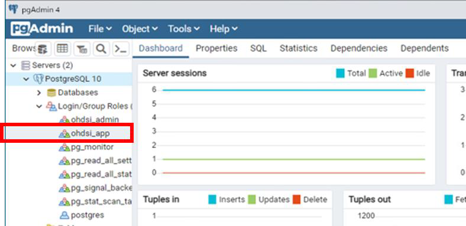
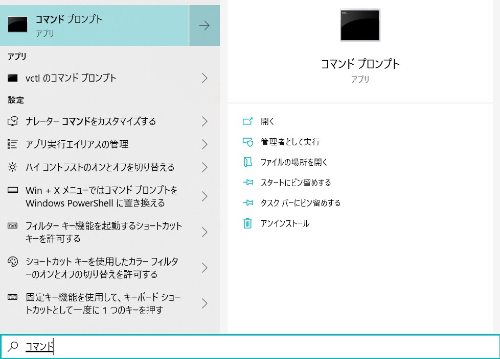
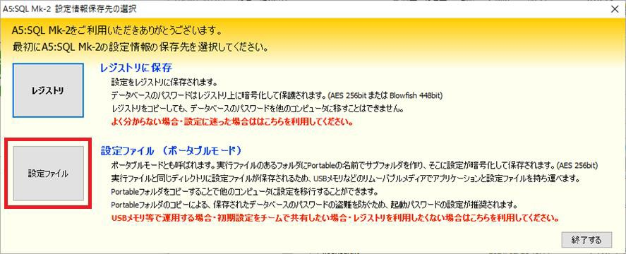
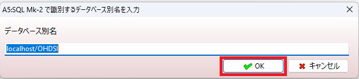
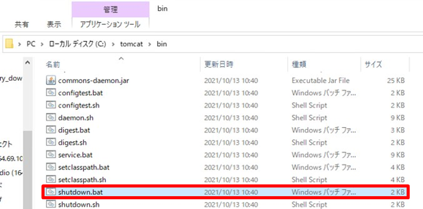

# **Atlas セットアップ手順**

### **目次**
[1．本手順について](#1本手順について)  
[2．Atlas セットアップの流れ](#2atlas-セットアップの流れ)  
[3．OHDSI WebAPI](#3ohdsi-webapi)  
　[3．1　Git のインストール](#31-git-のインストール)  
　[3．2　データベースプラットフォーム（PostgreSQL 10）のセットアップ](#32-データベースプラットフォームpostgresql-10のセットアップ)  
　　[3．2．1　PostgreSQL 10 のインストール](#321-postgresql-10-のインストール)  
　　[3．2．2　PostgreSQL 10 の設定](#322-postgresql-10-の設定)  
　　[3．2．3　データベースの作成](#323-データベースの作成)  
　　[3．2．4　OMOP 共通データモデルテーブルの作成](#324-omop-共通データモデルテーブルの作成)  
　[3．3　データベースクエリーツール（A5:SQL Mk-2）のダウンロード](#33-データベースクエリーツールa5sql-mk-2のダウンロード)  
　[3．4　Apache Maven のインストール](#34-apache-maven-のインストール)  
　[3．5　WebAPI の構築](#35-webapi-の構築)  
　[3．6　Apache Tomcat 8 のインストール](#36-apache-tomcat-8-のインストール)  
　[3．7　WebAPI の更新](#37-webapi-の更新)  
[4．Achilles のインストール](#4achilles-のインストール)  
　[4．1　R のインストール](#41-ｒのインストール)  
　[4．2　R tools のインストール](#42-r-tools-のインストール)  
　[4．3　R studio のインストール](#43-r-studio-のインストール)  
　[4．4　Achilles インストール](#44-achilles-インストール)  
[5．NodeJS のインストール](#5-nodejs-のインストール)  
[6．Atlas のインストール](#6-atlas-のインストール)  
　[6．1　Atlas のインストール](#61-atlas-のインストール)  
　[6．2　source テーブルへのレコード追加](#62-source-テーブルへのレコード追加)  
　[6．3　Atlas の環境設定](#63-atlasの環境設定)  
　[6．4　tomcat の起動](#64-tomcat-の起動)  
[7．補足：オフラインインストール手順](#7-補足オフラインインストール手順)  
　[7．1　WebAPI のオフラインインストール](#71-webapi-のオフラインインストール)  
　[7．2　R のオフラインインストール](#72-r-のオフラインインストール)  
　[7．3　Atlas のオフラインインストール](#73-atlas-のオフラインインストール)  

<br>

---
# **1．本手順について**
Atlas のセットアップ手順について説明します。  
本セットアップ手順では、以下の環境が準備されていることを前提としています。  

- Windows10（64 ビット）
- Java 8 Java Development Kit (JDK)

また本書でインストールするツールのバージョンを以下に記載しています。  
特にバージョンの指定がない場合は、最新版をダウンロードしてください。  
バージョン指定があるツールについて、以下の URL を参考にして記載しています。  

https://github.com/OHDSI/WebAPI/wiki/WebAPI-Installation-Guide

https://github.com/OHDSI/Achilles#getting-started

|ツール|本書のバージョン|備考（バージョン指定など）|
|:---|---:|:---|
|Git|2.33.1||
|PostgreSQL 10|10.18|PostgreSQL10|
|A5:SQL Mk-2|2.16.2||
|Apache Maven|3.8.3||
|Apache Tomcat 8|8.5.72||
|R|4.1.1|3.6.0 以降|
|R tools|4||
|Rstudio|2021.09.1+ 372||
|NodeJS|14.18.1||

<br>

セットアップに要する総作業時間は3日を想定しています。  

※テストデータ「Eunomia」のセットアップ手順は、[操作手順（CohortPathways 編）](https://github.com/RWD-data-environment-in-Hospital/Documents/blob/main/Atlas_operation_CohortPathways.md)を参照してください

<br>

---
# **2．Atlas セットアップの流れ**
本手順書では以下の流れで Atlas のセットアップを実施します。  


<br>

---
# **3．OHDSI WebAPI**
OHDSI WebAPI は、OHDSI CDM v5 に変換されたデータベースを操作するための一元化されたAPI を提供します。  
WebAPI には、環境内の CDM への接続方法を定義する構成の格納に使用される独自の専用データベースが用意されています。  
データベースは観察研究の設計と実行に使用される資産（Cohort Definitions, Concept Sets, 分析仕様）の保存に使用されます。  
WebAPI を利用する主要なWeb アプリケーションとして、Atlas が挙げられます。  
本手順は下記 URL のサイトを参考にしています。  

https://github.com/OHDSI/WebAPI/wiki/WebAPI-Installation-Guide

※本書は以下バージョンの画面を元に作成しており、最新版では画面が異なる場合があります。  
　その場合、同じ画面項目のみ同様の選択を行ってください。  
- Git：2.33.1
- PostgreSQL：10.18

<br>

---
## **3．1　Git のインストール**
Git:プロジェクトリポジトリをクローンするために、コンピュータにインストールします。  
Git のサイトを開き、「Download for Windows」をクリックします。  

https://git-scm.com/  
  
*出典：「Git」*

<br>

Standalone Installer の「64-bit Git for Windows Setup.」をクリックし、インストーラーをダウンロードします。  

  
*出典：「Git」*

<br>

ダウンロードが完了したら、「Git-2.33.1-64-bit.exe」をダブルクリックします。  

  

<br>

「このアプリがデバイスに変更を加えることを許可しますか？」には、「はい」を選択します。  

  

<br>

「Next」をクリックします。

  

<br>

インストールフォルダを選択して「Next」をクリックします。  
※ファルダがすでに存在する場合は、確認画面が出るので「はい」を選択します。  

  

<br>

デフォルトのままで「Next」をクリックします。

  

<br>

スタートメニューに登録するフォルダを選択して「Next」をクリックします。

  

<br>

Git から利用するエディタを選択する画面が出ますが、特にエディタは利用しな
いので、デフォルトのまま「Next」をクリックします。  

  

<br>

Git の新しいリポジトリでデフォルトのブランチ名の設定画面が出ます。  
特に変更しない場合は、デフォルトのまま「Next」をクリックする。

  

<br>

PATH の設定画面が出るので、（Recommended）となっている選択肢を選び
（デフォルト）、「Next」をクリックします。  

  

<br>

SSH 実行の選択画面が出るので、デフォルトのまま「Next」をクリックします。  

  

<br>

HTTPS トランスポートの設定画面では、OpenSSL を選択し（デフォルト）、「Next」をクリックします。  

  

<br>

テキストの改行設定について、「Checkout Windows-style, …」を選択し（デフォルト）、「Next」をクリックします。  


<br>

使用するコンソールの選択では、「Use MinTTY」を選択し（デフォルト）、「Next」をクリックします。  


<br>

Git のpull の設定について、「Default」を選択して（デフォルト）、「Next」クリックします。  


<br>

認証援助の設定（push の実行時に認証情報を入力する援助）では、デフォルトのまま「Next」をクリックします。  


<br>

その他のオプション設定では、デフォルトのまま「Next」を選択します。  


<br>

試験的なオプションの設定では、デフォルトのまま何もチェックを入れず「Install」をクリックします。  


<br>

インストールが終了すると下図の画面が出ます。  
リリースノートの確認が必要なければチェックを外して「Finish」をクリックします。  


<br>

Git がインストールされていることを確認します。  


以上で、Git のインストールは終了です。  

<br>

---
## **3．2　データベースプラットフォーム（PostgreSQL 10）のセットアップ**
WebAPI には、次のいずれかのプラットフォーム上のデータベースが必要です。  

- MS SQL 2012
- PostgreSQL 10
- Oracle 11gXE

WebAPI 3.0 以降では、SQL server と Oracle の利用を停止する予定となっています。  
そのため本手順書では、PostgreSQL 10 のインストールを実施します。  

<br>

## **3．2．1　PostgreSQL 10 のインストール**
PostgreSQL コアディストリビューションは、以下の URL からインストール可能です。  

http://www.postgresql.org/download/

「Windows」アイコンを選択し、「Download the installer」をクリックします。  

  
*出典：PostgreSQL: The world's most advanced open source database*

<br>

Version 10 のWindowsx86-64 をダウンロードします。  
※下記手順では 10.18 となっていますが、Version10 が選択できない場合、できるだけ近いバージョンを利用することをお勧めします  

  

<br>

ダウンロードが完了したら、「postgresql-10.18-2-windows-x64.exe」をダブルクリックし、「このアプリがデバイスに変更を加えることを許可しますか？」と出るので「はい」をクリックします。  

  

<br>

Wizard 画面が出るので「Next」をクリックします。

  

<br>

インストールフォルダはデフォルトのままで「Next」をクリックします。

  

<br>

セットアップコンポーネントについても、デフォルトのままで「Next」をクリックします。  

  

<br>

データディレクトリはデフォルトのままで「Next」をクリックします。  

※データディレクトリについては、D ドライブ以降を指定しても構いません。  
（データドライブがある場合、システムドライブ以外を指定することで、C ドライブの容量消費を抑えることができます）  

  

<br>

データベースのパスワードを設定します。  
任意のパスワードを入力して、「Next」をクリックします。  

  

<br>

ポート番号の設定は、デフォルトのまま「Next」をクリックします。  

  

<br>

詳細設定画面では、新しいデータベースクラスタで使用するロケールを選択できますが、デフォルトのまま「Next」をクリックします。

  

<br>

設定内容を確認したら、「Next」をクリックします。  

  

<br>

以上でインストールを開始するための準備が整ったので、「Next」をクリックしてインストールを実施します。  

  

<br>

インストール終了後の画面で、セットアップ完了後に Stack Builder を開始するかどうかのチェックボックスがありますが、特に開始する必要はないのでチェックを外して、「Finish」をクリックします。  

  

<br>

スタートメニュー内に「PostgreSQL 10」が追加されていることを確認します。  
以上でPostgreSQL 10 のインストールは完了です。  

<br>

## **3．2．2　PostgreSQL 10 の設定**  
※PostgreSQLのバージョンにより、画面構成が異なります  
　手順の画像はバージョン 10.18 です  

スタートメニューの「PostgreSQL 10」フォルダ内の「pgAdmin 4」を開きます。

  

<br>

起動後、master password の設定画面がでるので任意のパスワードを入力します。  

  

<br>

pgAdmin の画面が表示され、接続先 PostgreSQL を選択できるので、「PostgreSQL 10」をクリックします。

  

<br>

PostgreSQL 10 のインストール時に設定したパスワードを入力し、「OK」をクリックします。（3.2.1 参照）  
データベースに接続されます。

  

<br>

グループロールを作成します。サーバーアイコンを右クリックして、「Create」の「Login/Group Role...」を選択します。  

  

<br>

「General」タブを開き、項目を以下のように埋めます。  
- Name:　ohdsi_admin
- Comments:　OHDSI アプリケーションの管理グループ

  

<br>

「Privileges」タブを開き、「Inherit rights from the parent roles?」が「Yes」になっていることを確認して、「Save」をクリックします。  

  

<br>

「ohdsi_admin」というロールが作成されました。

  

<br>

同様にして、「ohdsi_app」ロールも作成します。  
設定については、上記の「ohdsi_admin」を参考にしてください。  

  

<br>

「General」タブの「Comments」欄には以下のように記載します。  
「OHDSI アプリケーションのアプリケーショングループ」  

  

<br>

続いてログインロールを作成します。  
画面左の「Login/Group Roles」を右クリックして、「Create」内の「Login/Group Role...」を選択します。  

  

<br>

「General」タブを開き、項目を以下のように埋めます。  
- Name:　ohdsi_admin_user|
- Comments:　OHDSI アプリケーションの管理ユーザーアカウント

  

<br>

「Definition」タブを開き、任意のパスワードを入力します。

  

<br>

「Privileges」タブを開き、以下のチェック項目を「Yes」に設定します。  
- Can login?  
- Superuser?  
- Create roles?  
- Create database?  
- Update catalog?  
- Inherit right from the parent roles?  

  

<br>

「Membership」タブは、「Member of」欄に「ohdsi_admin」を選択してチェックボックスにチェックが入っている状態であることを確認して、「Save」をクリックします。  

  

<br>

「ohdsi_admin_user」が作成されています。  

  

<br>

同様の手順で「ohdsi_app_user」も作成します。  

  

<br>

## **3．2．3　データベースの作成**
データベースの作成を実施します。  
pgAdmin 4 の画面左の「Databases」を右クリックし、「Create」内の「Database...」をクリックします。  

  

<br>

「General」タブを開き、各項目について以下のように記入します。  
- Database:　OHDSI  
- Owner:　ohdsi_admin  
- Comment:　OHDSI WebAPI データベース  

  

<br>

「Security」タブを開き、「ohdsi_admin」と「ohdsi_app」の権限を追加して「Save」をクリックします。  

  

<br>

「OHDSI」というデータベースが作成されました。  

  

<br>

次にスキーマを作成します。  
「OHDSI」を展開し、「Schemas」を右クリックして「Create」内の「Schema...」をクリックします。  

  

<br>

「General」タブを開き、以下のように項目内を記入します。  
- Name:　webapi
- Owner:　ohdsi_admin
- Comment: WebAPI 機能をサポートするテーブルを含むスキーマ

  

<br>

「Security」タブを開き、以下画面を参考にして権限に追加し、「Save」をクリックします。  

  

<br>

作成した「webapi」スキーマが追加されています。  

  

<br>

「webapi」スキーマを右クリックして「Properties...」をクリックします。  
「Default privileges」タブ内の項目を以下の画面のように設定します。  

「Tables」タブ  
  

「Sequences」タブ  
  

「Functions」タブ  
  

「Types」タブ  
  

<br>

以上で pgAdmin のセットアップは完了です。  
※ pgAdmin の画面を閉じる時に下記画面が表示された場合は、「このページを離れる」をクリックし、画面を閉じてください。  

  

<br>

## **3．2．4　OMOP 共通データモデルテーブルの作成**
psql を実行するための環境設定を実施します。  
※ＯＳやソフトのバージョンにより画面構成が異なる場合があります。  
環境変数 PATHを追加します。  
Windowsマークを右クリックし、「システム」をクリックします。

  

<br>

「システムの詳細設定」をクリックします。  

  

<br>

「システムのプロパティ」の「詳細設定」タブにある「環境変数」をクリックします。  

  

<br>

「システム環境変数」内の「Path」を選択して「編集」をクリックします。  

  

<br>

「新規」をクリックして、下記のパスを追加して「OK」をクリックします。  
```
C:\Program Files\PostgreSQL\10\bin
```

  

<br>

「環境変数」の画面についても「OK」をクリックします。  

  

<br>

環境変数の追加が終了したら、コマンドプロンプトから psql を実行できるかを確認します。  
PC を再起動してから、タスクバーの検索で「コマンド」と入力してコマンドプロンプトを起動します。  

  

<br>

下記のコマンドを入力します。  
```
> psql -V
```

  

<br>

「psql (PostgreSQL) 10.18」と表示されれば、コマンドプロンプトからpsql を実行することができることが確認できました。  

  

<br>

起動確認ができたら、下記のコマンドを入力してデータベースに接続します。  
```
> psql -U ohdsi_admin_user -d OHDSI
```

  

<br>

パスワードの入力が求められるので、pgAdmin 上で「ohdsi_admin_user」を作成する際に設定したパスワードを入力します。  

  

<br>

パスワードを入力後、接続されます。  

  

<br>

データベースに接続できたら、以下のようにコマンドを入力してCDM 用のスキーマを作成します。  
```
# Create schema cdmv5;
CREATE SCHEMA
```

  

<br>

以下のコマンドを参考にして、カレントスキーマを変更します。  
```
# Set search_path to "cdmv5";
SET
# select current_schema();
current_schema
```

  

<br>

GitHub に掲載されている CDM バージョンからzip ファイルをダウンロードします。（本手順では「CommonDataModel-5.3.1.zip」を選択しています）  

https://github.com/OHDSI/CommonDataModel/releases

該当バージョンの「Assets」をクリックして展開し、「Source code (zip)」をダウンロードします。  

  

<br>

「\CommonDataModel-5.3.1.zip\CommonDataModel-5.3.1\PostgreSQL」を開き、3つのテキストファイルをコピーします。  
下記のようにファイル名を変更して、「C:\Git\OHDSI\cdm」配下に貼り付けます。  
- OMOP CDM postgresql constraints.txt → constraints.txt  
- OMOP CDM postgresql ddl.txt → ddl.txt  
- OMOP CDM postgresql indexes.txt → indexes.txt  

  

<br>

DDL を実行する前に、データ型を修正します。  
「ddl.txt」をテキストエディタで開き、文字列置換を利用して以下のように一括置換を実施します。  

変更前：「DATETIME2」→変更後：「TIMESTAMP」  

  

<br>

「TIMESTAMP」に変換されていることを確認します。

  

<br>

修正後の DDL を使用して、テーブルを作成します。  
コマンドプロンプトに以下のように入力して、テキストファイルの SQL を実行します。  
```
# \i 'C:\\Git\\OHDSI\\cdm\\ddl.txt'
```

<br>

「CREATE TABLE」と表示されていればテーブルが作成できています。

  

<br>

次にインデックスを作成します。コマンドプロンプトに以下のように入力します。  

```
# \i 'C:\\Git\\OHDSI\\cdm\\indexes.txt'
```
  

<br>

以下のように表示されていれば、インデックスの作成に成功しています。  

  

<br>

以上で OMOP 共通データモデルテーブルの作成は完了です。  

<br>

---
## **3．3　データベースクエリーツール（A5:SQL Mk-2）のダウンロード**
データベースクエリーツールは、データベースの設定を確認するために使用します。  
本手順では、ツールとしてA5:SQL Mk-2 を使用します。  
A5:SQL Mk-2 のサイトを開き、「Vector からダウンロード」をクリックします。  

https://a5m2.mmatsubara.com/

  

<br>

「a5m2_2.16.2_x64.zip」をダウンロードします。  

  
*出典：松原正和「A5:SQL Mk-2」*

<br>

ローカルフォルダ内に「A5mk2」フォルダを作成します。  
ダウンロードした「a5m2_2.16.2_x64.zip」を解凍し、作成した「A5mk2」フォルダにコピーします。  

  

<br>

「A5M2.exe」をダブルクリックして、A5:SQL Mk-2 を起動します。  
以下画面が表示された場合「設定ファイル」を選択します。  

  
  

<br>

下記のメッセージが表示されるので、「はい」を選択します。  

  

<br>

任意のパスワードを設定します。  

  

<br>

手順3.4 で作成したデータベースを追加します。 

  

<br>

※※※※※※※※※※※※※※※※※※※※※※※※※※※※※※※※※※※※※※※※※※※※※※※※※※  

起動後、「データベースの追加と削除」画面が表示されなかった場合は、枠内の手順に従って「データベースの追加と削除」画面を表示します。  

「localhost」を右クリックして「データベースの追加と削除」を選択します。  

  

※※※※※※※※※※※※※※※※※※※※※※※※※※※※※※※※※※※※※※※※※※※※※※※※※※  

<br>

「データベースの追加と削除」画面左下の「追加」をクリックします。

  

<br>

追加するデータベースの接続タイプを選択する画面では、「PostgreSQL（直接接続）」を選択します。  

  

<br>

データベースの内容登録画面では、「ohdsi_app_user」を登録します。  
以下の画面のように項目を記入します。パスワード欄には手順3.4 において設定したパスワードを入力し、最後に「OK」を押します。  
- サーバー名:　localhost
- データベース名:　OHDSI
- ユーザーID:　ohdsi_app_user
- パスワード:　手順3．4 で設定したパスワード

  

<br>

識別するデータベース別名入力画面が表示されるので、データベース別名はそのままで「OK」をクリックします。

  

<br>

「データベースの追加と削除」画面に、「OHDSI」データベースが新たに追加されていることを確認して、「閉じる」をクリックします。  

  

<br>

追加したデータベースの接続確認を実施します。  
「OHDSI」を右クリックして「データベースを開く」をクリックします。  

  

<br>

データベースログイン画面で以下のように入力されていることを確認して、「接続」をクリックします。  

  

<br>

画面左側の OHDSI データベース内に画像のようにスキーマが表示されれば接続は成功です。  

  

<br>

以上で A5:SQL Mk-2 のセッティングは完了です。  

---
## **3．4　Apache Maven のインストール**
Apache Maven は Java サーブレットコンテナにインストールする Java プロジェクトを構築します。  
「Apache Maven」のサイトの「Download」をクリックします。  

https://maven.apache.org/

  
*出典：Apache Software Foundation「Apache」*

<br>

Apache-maven-3 の zip ファイルをクリックしてダウンロードします。  
下記手順では Apache-maven-3.8.3 となっていますが、バージョン3の最新モジュールをダウンロードします。  

  
*出典：Apache Software Foundation「Apache」*

<br>

C ドライブに「maven」フォルダを作成し、ダウンロードした「Apachemaven-3.8.3-bin.zip」を解凍後、作成した「maven」フォルダにコピーします。  
ダウンロードが完了したら、環境変数の設定を実施します。  

  

<br>

Windowsマークを右クリックし、「システム」をクリックします。

    

<br>

「システムのプロパティ」の「詳細設定」タブにある「環境変数」をクリックします。

  

<br>

「システムのプロパティ」の「環境変数」をクリックします。  

  

<br>

「システム環境変数」の「新規」をクリックして、以下のPath を新たに追加します。作成後、「OK」をクリックします。  
```
MAVEN_HOME=C:\maven
```

  

<br>

「システム環境変数」内に新たに「MAVEN_HOME=C:\maven」が追加されていることを確認します。  

  

<br>

続いて「Path」を選択して「編集」をクリックします。  

  

<br>

「環境変数名の編集」内の「新規」をクリックして、以下のPath を新たに追加します。作成後、「OK」をクリックします。  
```
Path=C:\maven\bin
```

  

<br>

「環境変数」の「OK」をクリックして、環境変数の設定は終了となります。  

  

<br>

以上で Apache Maven のインストールは完了です。  

<br>

---
## **3．5　WebAPI の構築**
ローカルディスクの「Git」フォルダ内に「OHDSI」フォルダを作成します。  

  

※プロキシサーバ経由の通信を行っている場合、[プロキシ設定手順の「3．GitBash 用プロキシ設定」](https://github.com/RWD-data-environment-in-Hospital/Documents/blob/main/Proxy_setting.md)を行ってください。  

<br>

スタートメニューから Git Bash を起動し、作成した「OHDSI」フォルダに移動
します。

  

<br>

WebAPI のクローンを作成します。  
Git Bash に次のように入力します。  
```
$ git clone https://github.com/OHDSI/WebAPI.git
```

  

<br>

クローンの作成が完了しました。  

  

<br>

「WebAPI」フォルダ内に「WebAPIConfig」フォルダを作成します。

  

<br>

「WebAPI」フォルダ内の「sample_settings.xml」をコピーして「WebAPIConfig」フォルダ内に張り付けて、  
「settings.xml」にファイルの名前を変更します。  

  

<br>

「settings.xml」ファイルを開き、赤枠の部分を修正します。  


<br>

(1)datasource.password  
app1 をpgAdmin 上で「ohdsi_app_user」を作成する際に設定したパスワードに書き換えます。  
下記例ではpostadmin に書き換えています。  

変更前  


変更後  


<br>

(2)flyway.datasource.password  
!PASSWORD!をpgAdmin 上で「ohdsi_admin_user」を作成する際に設定したパスワードに書き換えます。  
下記例ではadmin1 に書き換えています。

変更前  


変更後  


<br>

(3)security.origin  
*をlocalhost に書き換えます。

変更前  


変更後  


<br>

修正後、ファイルを保存します。

<br>

WebAPI をビルドします。  
Git Bash で「Git」-「OHDSI」-「webapi」フォルダに移動します。  

  

<br>

次のコマンドを入力します。  
```
$ mvn clean package -DskipUnitTests -DskipITtests -s WebAPIConfig/settings.xml -P webapi-postgresql
```

  

<br>

コマンド実行時に Warning が表示されることがありますが問題はありません。  
「BUILD SUCCESS」と表示されれば、ビルドは完了です。  

  

<br>

「ローカルディスク」-「Git」-「OHDSI」-「WebAPI」フォルダ内に「target」フォルダが作成され、「WebAPI.war」があることを確認します。  

  

<br>

以上で WebAPI のセットアップは完了です。

（※オフラインインストールを実施する場合、「手順7 補足」の「手順7．1　WebAPI のオフラインインストール」を参考に、記載されている手順を引き続き実施する必要があります。）  

---
## **3．6　Apache Tomcat 8 のインストール**
Tomcat のバージョンと Java のバージョンが一致していることを確認します。  
Tomcat のサイトを開き、「Download」を開きます。  

http://tomcat.apache.org/

  
*出典：Apache Software Foundation 「Apache Tomcat®」*

<br>

「Binary Distributions」内の「64-bit Windows zip」をクリックしてダウンロードします。  

  
*出典：Apache Software Foundation 「Apache Tomcat®」*

<br>

ダウンロードが完了したら、ファイルを解凍します。  
あらかじめ C ドライブに「tomcat」フォルダを作成しておき、「Apachetomcat-8.5.72-windows-x64.zip」を解凍して作成したフォルダ内にコピーします。

  

<br>

次に環境変数の設定を実施します。  
手順3.2 の環境変数の設定と同様の手順で「環境変数」画面を開き、以下の
Path を新たに追加します。  
```
CATALINA_HOME=C:\tomcat
```

  

<br>

「システム環境変数」内に「CATALINA_HOME=C:\tomcat」が追加されていることを確認します。

  

<br>

次に、「システム環境変数」内の「Path」を選択して「編集」をクリックします。  

  

<br>

「環境変数名の編集」の「新規」をクリックして、以下の Path を新たに作成し、「OK」をクリックします。  
```
Path=C:\tomcat\bin
```

    

<br>

「OK」をクリックして環境変数の設定は終了となります。  

    

<br>

ローカルディスクに作成した tomcat フォルダ内の conf フォルダにある「tomcat-users.xml」を開き、編集します。

  

<br>

下図の赤枠で囲っている箇所を図に記載されている内容に変更します。
```
<role rolename=”manager-gui”/>
<role rolename=”role1”/>
<user username=”tomcat” password=”s3cret” roles=”manager-gui”/>
```
  

<br>

次に、tomcat - webapps - manager - WEB-INF フォルダ内の「web.xml」を開きます。  

  

<br>

下図の赤枠部分を以下のように変更します。  
50MB max の記述部分を無効化し、250MB max の設定を追加します。  

変更前  
  

変更後  
  

<br>

続いて、コマンドプロンプトから tomcat を起動します。  
コマンドプロンプトを右クリックし「管理者として実行」を選択して起動し、下図のコマンドを入力します。  
```
C:\tomcat\bin> Catalina.bat run
```
  

<br>

Server startup in XXXXms の行が表示されれば起動が完了しています。  

  

<br>

下記 URL からブラウザにアクセスします。  

http://localhost:8080/manager  

ユーザー名とパスワード入力画面が表示された場合、「tomcat-users.xml」に設定した username/password を入力します。  

  

<br>

TomcatWeb アプリケーションマネージャが起動します。  

  

<br>

war ファイルの配備を実施します。  
「C - Git - OHDSI - WebAPI - target」フォルダにある「WebAPI.war」を「C - tomcat - webapps」フォルダへコピーします。  

  

<br>

「war ファイルの配備」欄の「ファイルを選択」ボタンをクリックして、コピ
ーした「WebAPI.war」ファイルを選択します。  

  

<br>

「配備」ボタンをクリックして、配備を実行します。  

  

<br>

A5:SQL Mk-2 を起動してデータベースを確認すると、「webapi」というスキーマとスキーマにはテーブルがあることを確認します。  

  

<br>

TomcatWeb アプリケーションマネージャで、WebAPI の実行中が「true」になっていることで、war ファイルの配備が完了していることを確認できます。  

  

<br>

以上でTomcat 8 のセットアップは完了です。  
C:\tomcat\bin にあるshutdown.bat を実行し、Tomcat8 を終了します。  

<br>

---
## **3．7　WebAPI の更新**
コマンドプロンプトを開き、以下のように入力してpsql を起動して「ohdsi_admin_user」にログインします。  

```
psql -U ohdsi_admin_user -d OHDSI
```

パスワード： pgAdmin 上で「ohdsi_admin_user」を作成する際に設定したパスワード  

  

<br>

psql コンソール上で以下の SQL を順次入力して実行します。  
記載の順番に全てのSQL を実行してください。  

  

<br>

**実行するコマンド**  

**■WebAPI Version 2.5.0 対応**  
```
# ALTER TABLE webapi.cohort_inclusion_result ADD mode_id int NOT NULL DEFAULT 0;
# ALTER TABLE webapi.cohort_inclusion_stats ADD mode_id int NOT NULL DEFAULT 0;
# ALTER TABLE webapi.cohort_summary_stats ADD mode_id int NOT NULL DEFAULT 0;
```

  

**■WebAPI Version 2.6.0 対応**  
```
# CREATE TABLE webapi.cc_results
(
    type VARCHAR(255) NOT NULL,
    fa_type VARCHAR(255) NOT NULL,
    cc_generation_id BIGINT NOT NULL,
    analysis_id INTEGER,
    analysis_name VARCHAR(1000),
    covariate_id BIGINT,
    covariate_name VARCHAR(1000),
    time_window VARCHAR(255),
    concept_id INTEGER,
    count_value BIGINT,
    avg_value DOUBLE PRECISION,
    stdev_value DOUBLE PRECISION,
    min_value DOUBLE PRECISION,
    p10_value DOUBLE PRECISION,
    p25_value DOUBLE PRECISION,
    median_value DOUBLE PRECISION,
    p75_value DOUBLE PRECISION,
    p90_value DOUBLE PRECISION,
    max_value DOUBLE PRECISION,
    cohort_definition_id BIGINT
);
```

  

<br>

```
# CREATE TABLE webapi.pathway_analysis_events
(
    pathway_analysis_generation_id BIGINT NOT NULL,
    target_cohort_id INTEGER NOT NULL,
    combo_id BIGINT NOT NULL,
    subject_id BIGINT NOT NULL,
    ordinal INTEGER,
    cohort_start_date TIMESTAMP NOT NULL,
    cohort_end_date TIMESTAMP NOT NULL
);
```

  

<br>

```
# CREATE TABLE webapi.pathway_analysis_stats
(
    pathway_analysis_generation_id BIGINT NOT NULL,
    target_cohort_id INTEGER NOT NULL,
    target_cohort_count INTEGER NOT NULL,
    pathways_count INTEGER NOT NULL
);
```

  

<br>

```
# CREATE INDEX idx_pathway_analysis_events_combo_id ON webapi.pathway_analysis_events (combo_id);
```

  

<br>

**■WebAPI v2.7.0 対応**  
```
# CREATE TABLE webapi.cohort_censor_stats(
cohort_definition_id int NOT NULL,
lost_count BIGINT NOT NULL
);
```

  

<br>

```
# ALTER TABLE webapi.cc_results ADD COLUMN strata_id BIGINT;
# ALTER TABLE webapi.cc_results ADD COLUMN strata_name VARCHAR(1000);
```

  

<br>

**■WebAPI v2.7.2 対応**
```
# CREATE TABLE webapi.pathway_analysis_codes
(
pathway_analysis_generation_id BIGINT NOT NULL,
code BIGINT NOT NULL,
name VARCHAR(2000) NOT NULL,
is_combo int NOT NULL
);
```

  

<br>


```
# CREATE TABLE webapi.pathway_analysis_paths
(
pathway_analysis_generation_id BIGINT NOT NULL,
target_cohort_id INTEGER NOT NULL,
step_1 BIGINT,
step_2 BIGINT,
step_3 BIGINT,
step_4 BIGINT,
step_5 BIGINT,
step_6 BIGINT,
step_7 BIGINT,
step_8 BIGINT,
step_9 BIGINT,
step_10 BIGINT,
count_value BIGINT NOT NULL
);
```

  

<br>

**■WebAPI v2.7.3 対応**
```
# DROP TABLE webapi.pathway_analysis_stats;
# CREATE TABLE webapi.pathway_analysis_stats
(
pathway_analysis_generation_id BIGINT NOT NULL,
target_cohort_id INTEGER NOT NULL,
target_cohort_count BIGINT NOT NULL,
pathways_count BIGINT NOT NULL
);
```

  

**■WebAPI v2.8.0 対応**
```
# ALTER TABLE webapi.cohort_inclusion ADD design_hash int NULL;
# ALTER TABLE webapi.cc_results ADD aggregate_id int NULL;
# ALTER TABLE webapi.cc_results ADD aggregate_name varchar(1000);
# ALTER TABLE webapi.cc_results ADD missing_means_zero int NULL;
```

  

<br>

```
# CREATE TABLE webapi.cohort_cache (
design_hash int NOT NULL,
SUBJECT_ID bigint NOT NULL,
cohort_start_date date NOT NULL,
cohort_end_date date NOT NULL
);
```

  

<br>

```
# CREATE TABLE webapi.cohort_censor_stats_cache (
design_hash int NOT NULL,
lost_count BIGINT NOT NULL
);
```

  

<br>

```
# CREATE TABLE webapi.cohort_inclusion_result_cache (
design_hash int NOT NULL,
mode_id int NOT NULL,
inclusion_rule_mask bigint NOT NULL,
person_count bigint NOT NULL
);
```

  

<br>

```
# CREATE TABLE webapi.cohort_inclusion_stats_cache (
design_hash int NOT NULL,
rule_sequence int NOT NULL,
mode_id int NOT NULL,
person_count bigint NOT NULL,
gain_count bigint NOT NULL,
person_total bigint NOT NULL
);
```

  

<br>

```
# CREATE TABLE webapi.cohort_summary_stats_cache (
design_hash int NOT NULL,
mode_id int NOT NULL,
base_count bigint NOT NULL,
final_count bigint NOT NULL
);
```

  

<br>

```
# CREATE TABLE webapi.cohort_sample_element(
cohort_sample_id int NOT NULL,
rank_value int NOT NULL,
person_id bigint NOT NULL,
age int,
gender_concept_id int
);
```

  

<br>

```
# CREATE TABLE webapi.concept_hierarchy
(
concept_id INT,
concept_name VARCHAR(400),
treemap VARCHAR(20),
concept_hierarchy_type VARCHAR(20),
level1_concept_name VARCHAR(255),
level2_concept_name VARCHAR(255),
level3_concept_name VARCHAR(255),
level4_concept_name VARCHAR(255)
);
```

  

<br>

以上で WebAPI のセッティングは完了です。

---
# **4．Achilles のインストール**
ATLAS 内でデータソース機能を使用するには、Achilles をセットアップして実行する必要があります。  
Achilles は、Common Data Model（CDM）準拠のデータベースのデータベースレベルの分析とレポートの提供を担います。  
本手順は下記のサイトを参考にしています。  

https://ohdsi.github.io/Hades/rSetup.html  
https://github.com/OHDSI/Achilles  
https://ohdsi.github.io/Achilles/  

---
## **4．1　Ｒのインストール**
下記のサイトにアクセスし、「Download R for Windows」、「base」の順にクリックし、下のスクリーンショットに示されている 「Download」 リンクをクリックします。（バージョン3.6.0 以降である必要があります）  
https://cran.r-project.org/

  
*出典：The R Foundation「The Comprehensive R Archive etwork」*  

<br>

ダウンロードが完了したら、「R-4.1.1-win.exe」実行します。  
言語の選択画面が出るので、「日本語」を選択して「OK」をクリックします。  

  

<br>

情報を読み終わった後、「次へ」をクリックします。  

  

<br>

インストール先の設定画面で、ProgramFiles がデフォルト指定されているが、「C:\R\R-4.1.1」のフォルダに変更して「次へ」をクリックします。  

  

<br>

コンポーネントの選択について、「32bit Files」のチェックを外して「次へ」をクリックします。  

  

<br>

起動時のオプションはデフォルトのまま「次へ」をクリックします。  

  

<br>

スタートメニューフォルダの指定についてもデフォルトのまま「次へ」をクリッ
クします。  

  

<br>

追加タスクの選択についてもデフォルトのまま「次へ」をクリックします。  

  

<br>

R のセットアップウィザード完了画面が出てくるので「完了」をクリックします。  

  

<br>

---
## **4．2　R tools のインストール**
下記のサイトにアクセスし、「Download R for Windows」、「Rtools」 の順にクリックし、RTools の最新バージョン（64-bit）を選択してダウンロードします。  
※下記手順は、バージョン 4.0

https://cran.r-project.org/
  
*出典：The R Foundation「The Comprehensive R Archive Network」*

<br>

ダウンロードが終了したら、ダブルクリックして実行します。  
インストール先の指定についてはデフォルトのまま「Next」をクリックします。  

  

<br>

追加タスクの選択についてもデフォルトのまま「Next」をクリックします。  

  

<br>

インストール開始画面が表示されるので、「Install」をクリックします。  

  

<br>

インストールが終了したので「FInish」をクリックします。  

  

<br>

---
## **4．3　R studio のインストール**
R studio のサイトにアクセスし、「Download」をクリックし、「DOWNLOADRSTUDIO FOR WINDOWS」をクリックします。  

https://www.rstudio.com/  

  

<br>

ダウンロード完了後、ファイルをダブルクリックして実行します。「次へ」をクリックします。  

  

<br>

インストール先のフォルダとしては、「C:\RStudio」を指定して「次へ」をクリックします。  

  

<br>

スタートメニューフォルダの選択画面ですが、デフォルトのまま「インストール」をクリックし、インストールを開始します。  

  

<br>

インストールが終了したら、「完了」をクリックします。  

  

<br>

スタートメニューを開き、RStudio と R を起動します。  
R のコンソールに以下のコマンドを入力します。  
```
> writeLines('PATH="${RTOOLS40_HOME}\\usr\\bin;${PATH}"', con ="~/.Renviron")
```

  

<br>

プロキシサーバ経由の通信を行っている場合、[プロキシ設定手順の「5. Ｒ用プロキシ設定」](https://github.com/RWD-data-environment-in-Hospital/Documents/blob/main/Proxy_setting.md)を行ってください。  
R コンソールを再起動して、下記のコマンドを入力します。  
```
> Sys.which("make")
"C:\\rtools40\\usr\\bin\\make.exe"
```
下記のように表示されれば、PATH が通っています。  

  

<br>

再び、R コンソールを再起動して下記のコマンドを入力します。  
```
install.packages("SqlRender")
```

  

<br>

CRAN のミラーサイトの選択画面が表示されるので、「0-Cloud [https]」を選択して「OK」をクリックします。  

  

<br>

インストールが完了しました。  

  

<br>

以下のコマンドを入力し、コマンド試行を実施します。  
```
> library(SqlRender)
> translate("SELECT TOP 10 * FROM person;","postgresql")
```

  

<br>

図のように表示されれば、動作していることが確認できます。

  

<br>

---
## **4．4　Achilles インストール**
初めに R コンソールを開き、下記のコマンドを入力して devtools をインストー
ルします。
```
> install.packages("devtools")
```

  

<br>

CRAN のミラーサイトの選択画面が表示されるので、「0-Cloud [https]」を選択して「OK」をクリックします。

  

<br>

以下画面が表示された場合、「はい」をクリックします。

  

<br>

インストールが完了しました。

  

<br>

次に、Achilles をインストールします。  
プロキシサーバ経由の通信を行っている場合、プロキシ設定手順書の「6. Ｒ・devtools 用プロキシ設定」を行ってください。  
下図と下記のコマンドを参考にしてコマンドを入力してください。  
```
> devtools::install_github("OHDSI/Achilles")
```

  

<br>

下図のように表示されれば、Achilles のインストールは完了です。

  

※オフラインインストールを実施する場合、上記の手順に加えて「手順7 補足」の「手順7.2 Atlas のオフラインインストール」に記載されている手順を引き続き実施してください。  

<br>

---
# **5　NodeJS のインストール**
ATLAS では、アプリケーションのすべての JavaScript 依存関係を取得するために、ノードパッケージマネージャー（npm）を使用します。  
ATLAS のインストール中に使用される npm ユーティリティを含む NodeJS をダウンロードします。  
NodeJS のサイトを開き、Windows 版インストーラー（赤枠）をダウンロードします。  

https://nodejs.org/en/download/

  
*出典：Portions of this site「Node.js」*

<br>

ダウンロードが完了したら、「node-v14.18.1-x64.msi」を実行します。

  

<br>

「I accept the terms in the License Agreement」のチェックボックスにチェックを入れて、「Next」をクリックします。

  

<br>

インストール先のフォルダ設定画面はデフォルトのまま「Next」をクリックします。

  

<br>

セットアップのカスタマイズ画面もデフォルトのまま「Next」をクリックします。  
（すべてローカルディスクにインストールされます。）

  

<br>

ネイティブモジュールをコンパイルするために必要なツールをオプションでインストールすることができますが、チェックを入れずデフォルトのまま「Next」をクリックします。  

  

<br>

「Install」をクリックして、インストールを開始します。  

  

<br>

インストールの終了画面が表示されたら「Finish」をクリックします。

  

以上で NodeJS のインストールは完了です。  

<br>

---
# **6　Atlas のインストール**
本手順は以下のサイトを参考にしています。  

https://github.com/OHDSI/Atlas/wiki/Atlas-Setup-Guide

---
## **6．1　Atlas のインストール**
Git\OHDSI のフォルダ内に「Atlas」フォルダを作成します。　　

  

<br>

スタートメニューを開き、Git Bash を起動して、下記のコマンドを入力して作成したAtlas フォルダに移動します。  
```
$ cd c:
$ cd Git
$ cd OHDSI
$ cd Atlas
```

  

<br>

Atlas のインストールを実施します。  
下記のサイトにアクセスして、「Atlas Installation」内の「Code Deployment」に「latest release of ATLAS」リンクがあるので、クリックして最新バージョンの Atlas が提供されているページに移動します。  

https://github.com/OHDSI/Atlas/wiki/Atlas-Setup-Guide

  

<br>

「Asset」内の「Source code (zip)」をクリックしてファイルをダウンロードします。  

  

<br>

ファイルのダウンロードが終了したら、zip ファイルを解凍して作成した「Atlas」フォルダにコピーします。  

  

<br>

Git Bash で下記のコマンドを入力して、ビルドします。
```
$ npm run build
```

  

<br>

ビルドが完了しました。

  
（※オフラインインストールを実施する場合、以降の手順については「手順７補足」の「7.3 Atlas のオフラインインストール」に従ってください。）  

<br>

ビルドした「Atlas」フォルダを、tomcat のフォルダ（c:\tomcat\webapps\）にコピーします。  

  

<br>

---
## **6．2　source テーブルへのレコード追加**
スタートメニューを開き、「SQL Shell (psql)」を起動します。

  

<br>

各項目について下記のように入力し、ログインします。  
```
Server          : localhost
Database        : OHDSI
Port            : 5432
Username        : ohdsi_app_user
Client Encoding : SJIS
パスワード      : 「3.2.1 PostgreSQL 10 のインストール」時に設定したパスワードを入力
```

  

<br>

以下のコマンドを入力し、「current_schema」を「webapi」に変更します。
```
# set search_path to "webapi";

```
続けて以下のコマンドを入力し、変更されたことを確認します。  
```
select current_schema();
```

  

<br>

下記の SQL を実行して、SOURCE テーブルにレコードを追加します。  
注意：password は正しいものに書き換えてください  

```
insert into source(
source_id,
source_name,
source_key,
source_connection,
source_dialect,
is_cache_enabled
)
values(
1,
'CDM V5 Database',
'cdmv5',
'jdbc:postgresql://127.0.0.1:5432/OHDSI?user=ohdsi_app_user&password=XXXX',
'postgresql',
true
)
;
```
上記の SQL に関しては以下のような注意点があります。  
① 10 行目の「1」は後述のSQL と一致させる必要があります。  
② 12 行目の「cdmv5」は接続スキーマ名です。  
③ 13 行目の「127.0.0.1:5432/OHDSI」は「ホストアドレス:ポート/データベース名」となります。  
④ 13 行目の「user=ohdsi_app_user」は接続ユーザー名を指します。  
⑤ 13 行目の「password=XXXX」は接続パスワードを指します。  
XXXX の部分には「3.2.1 PostgreSQL 10 のインストール」時に設定したパスワードを入力します。  

  

<br>

同様にして、下記のように SOURCE_DAIMON テーブルにレコードを4 つ追加しま
す。  
```
insert into source_daimon (
source_daimon_id,
source_id,
daimon_type,
table_qualifier,
priority
)
values (
1,
1, （⇒上述のSQL の1 の箇所と同じ値）
0,
'cdmv5', （⇒スキーマ名）
2
)
;
insert into source_daimon (
source_daimon_id,
source_id,
daimon_type,
table_qualifier,
priority
)
values (
2,
1,
1,
'cdmv5',
2
)
;
insert into source_daimon (
source_daimon_id,
source_id,
daimon_type,
table_qualifier,
priority
)
values (
3,
1,
2,
'webapi',
2
)
;
insert into source_daimon (
source_daimon_id,
source_id,
daimon_type,
table_qualifier,
priority
)
values (
4,
1,
3,
'webapi',
2
)
;
```
右上の×ボタンをクリックして psql を閉じます。  

<br>

---
## **6．3　Atlasの環境設定**
Atlasのサイトへ接続するための環境設定を行います。  
環境設定にはAtlasをセットアップした端末、またはサーバーのIPアドレスが必要となります。  
IPアドレスが不明な場合は、6.3.1の手順に従い、IPアドレスの確認を行ってください。  
IPアドレスが確認できている場合は、6.3.2へ進んでください。  

## **6．3．1　IP アドレスの確認**  
ネットワークプロパティ画面を表示します。  
 「インターネット プロトコル バージョン4（TCP/IPv４）」を選択し、「プロパティ」ボタンをクリックします。  

   

 <br>

表示されたIPアドレスを確認します。  

   

 ※「IP アドレスを自動的に取得する」となっている場合、端末を再起動する都度、IP アドレスが変更となるため、以降の設定やサーバーへのアクセスもその都度変更となってしまいます。  
 固定の IP アドレスを設定するようにしてください。  

<br>

## **6．3．2　Atlas の環境設定**
Apache Tomcat のインストールフォルダの配下にある、下図のフォルダを開きます。  

  

<br>

ファイル名「configlocal.js」として、新規ファイルを作成します。

  

<br>

「config-local.js」 ファイルに下記の内容を入力し、保存します。  
[Atlas Server IP] には、手順6.3.1で確認したIPアドレスを入力します。  
```
define([], function () {
    var configLocal = {};
    
    configLocal.api = {
        name: 'Atlas Server',
        url: 'http://[Atlas Server IP]/WebAPI/'
    };

    return configLocal;
});
```

以上で Atlas の環境設定は完了です。  

<br>

---
## **6．4　tomcat の起動**
次に tomcat を起動するために、コマンドプロンプトを起動します。  
コマンドプロンプトを右クリックし「管理者として実行」を選択して起動します。  

  

<br>

「C:\tomcat\bin」へ移動して、「catalina.bat run」と入力して実行します。  

  

<br>

起動が完了します。

  

以下 URL をブラウザで指定して起動します。（[Atlas Server IP] には、Atlas をセットアップしたサーバーの IP アドレスを入力してください）  

http://[Atlas Server IP]:8080/manager  

Tomcat のユーザー名とパスワードを入力します。  

  

<br>

「Tomcat Web アプリケーションマネージャ」が開き、「アプリケーション」欄内のパスに「/Atlas」が表示されているので、「/Atlas」をクリックします。  

  

<br>

Atlas の画面が表示されます。  

  

<br>

Tomcat を停止する場合には、「C:\tomcat\bin」内の「shutdown.bat」を実行します。

  

以上でAtlas のセットアップは完了です。  

※テストデータ「Eunomia」のセットアップ手順は、[操作手順（CohortPathways 編）](https://github.com/RWD-data-environment-in-Hospital/Documents/blob/main/Atlas_operation_CohortPathways.md)を参照してください

<br>
<br>

---
# **7　補足：オフラインインストール手順**
各ツールのオフラインでもインストール方法について説明します。  

<br>

---
## **7．1　WebAPI のオフラインインストール**
ビルドの完了までは通常の手順と同様になります。「手順3.5 WebAPI の構築」のビルド完了後の手順を以下に記載します。  
ビルドした WebAPI の target フォルダをオフライン環境の任意のフォルダへコピーします。  
「手順3.6 Tomcat インストール」で war ファイルを配備する際、コピーした target フォルダ内にある WebAPI.war を選択します。  

  

<br>

---
## **7．2　R のオフラインインストール**
Achilles のインストールまでは通常の手順と同様になります。「手順4.4 Achillesのインストール」のインストール完了後の手順を以下に記載します。  
Achilles のインストールが完了した PC で R コンソールを起動し、下記コマンドを実行します。  
```
> Install.packages(“miniCRAN”)
```

  

<br>

次に、下記のコマンドを入力します。  
```
> Install.packages(“igraph”)
```

  

<br>

実行後、「パッケージのソースからインストールを行いますか？」と表示されるので、「いいえ」をクリックして、バイナリファイルからのインストールを選択します。

  

<br>

次に、下記のコマンドを入力します。  
```
> Library(miniCRAN)
```

  

<br>

「igraph.zip」と「miniCRAN.zip」がダウンロードされていることを確認します。  

  

<br>

続いて、devtools のパッケージのダウンロードを実施します。  
下記のコマンドを入力します。  
```
> Setwd(.libPaths())
```

  

<br>

以下のコマンドについても順次入力します。  
```
> pkgname <- c("devtools")
> pkgs <- pkgDep(pkgname)
```
次にパッケージダウンロード先のフォルダを下記のように指定します。  
```
> setwd("C:\\tmp\\R_pkgs\\")
```
上記のコマンドで指定したディレクトリ内の download フォルダに対象のファイルをダウンロードするために、下記のようにコマンド入力します。  
```
> download.packages(pkgs, destdir="download\\", type="win.binary")
```

  
  

<br>

対象物のダウンロードが完了しました。

  

<br>

同様にして、Achilles の関連パッケージもダウンロードします。  
下記のコマンドを順次入力します。  
```
> setwd(.libPaths())
```
  

<br>

```
> pdb <- addPackageListingGithub(pdb=available.packages(),"OHDSI/Achilles")
```
  

<br>

```
> library(tools)
```
  

<br>

```
> base_pkgs <- package_dependencies(packages="Achilles",pdb,which="Depends")[[1]]
```
  

<br>

```
> pkgs <- pkgDep(base_pkgs)
```
  

<br>

ダウンロードするフォルダを指定します。  
```
> setwd("C:\\tmp\\R_pkgs\\")
```
  

<br>

上記のコマンドで指定したディレクトリ内のdownload フォルダに対象のファイ
ルをダウンロードします。  

```
> download.packages(pkgs, destdir="download\\", type="win.binary")
```

  
  

<br>

devtools と Achilles のパッケージがダウンロードされたことを確認します。  

  

<br>

追加で rjson と ParallelLogger をダウンロードします。  
下記のコマンドを順次入力します。  
```
> download.packages(”rjson", destdir="download\\", type="win.binary")
```

  

<br>

ダウンロードしたパッケージが入っているフォルダを、オフライン環境へコピー
するため、オフライン環境でR コンソールを起動し、下記コマンドを順次実行し
ます。  
```
> zipdir <- 'C:\\tmp\\R_pkgs\\packages'
```

  

<br>

```
> ziplist <- list.files(zipdir, pattern=".zip", recursive=T)
```

  

<br>

```
> pkglist <- as.character(lapply(ziplist, function(f) { paste(zipdir, '\\', f, sep="") }))
```

  

<br>

```
> install.packages(pkglist, repos = NULL, type="win.binary")
```

  

<br>

以上でインストールは完了です。  

  

<br>

---
## **7．3　Atlas のオフラインインストール**
ビルド完了までは通常手順と同様になります。  
「手順6.1 Atlas インストール」のビルド完了後の手順を以下に記載します。  
ビルドが完了した Atlas フォルダをオフライン環境の Tomcat フォルダ（tomcat\webapps\）へコピーします。  

  

以降の手順はオンラインインストールと同様で、Source テーブルへレコードを追加して Tomcat を起動します。  
手順6 を参照してください。