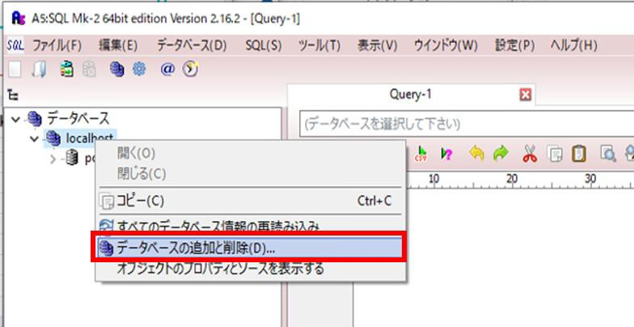

# **Atlas セットアップ手順**

### **目次**
[1．本手順について](#1本手順について)  
[2．Atlas セットアップの流れ](#2atlas-セットアップの流れ)  
[3．OHDSI WebAPI](#3ohdsi-webapi)  
　[3．1　Git のインストール](#31-git-のインストール)  
　[3．2　データベースプラットフォーム（PostgreSQL 10）のセットアップ](#32-データベースプラットフォームpostgresql-10のセットアップ)  
　　[3．2．1　PostgreSQL 10 のインストール](#321-postgresql-10-のインストール)  
　　3．2．2　PostgreSQL 10 の設定  
　　3．2．3　データベースの作成  
　　3．2．4　OMOP 共通データモデルテーブルの作成  
　3．3　データベースクエリーツール（A5:SQL Mk-2）のダウンロード  
　3．4　Apache Maven のインストール  
　3．5　WebAPI の構築  
　3．6　Apache Tomcat 8 のインストール  
　3．7　WebAPI の更新  
4．Achilles のインストール  
　4．1 Ｒのインストール  
　4．2 R tools のインストール  
　4．3 R studio のインストール  
　4．4 Achilles インストール  
5．NodeJS のインストール  
6．Atlas のインストール  
　6．1 Atlas のインストール  
　6．2 source テーブルへのレコード追加  
7．補足：オフラインインストール手順  
　7．1 WebAPI のオフラインインストール  
　7．2 R のオフラインインストール  
　7．3 Atlas のオフラインインストール  

---
# **1．本手順について**
Atlas のセットアップ手順について説明します。  
本セットアップ手順では、以下の環境が準備されていることを前提としています。  

- Windows10（64 ビット）
- Java 8 Java Development Kit (JDK)

また本書でインストールするツールのバージョンを以下に記載しています。  
特にバージョンの指定がない場合は、最新版をダウンロードしてください。  
バージョン指定があるツールについて、以下のURL を参考にして記載しています。  

https://github.com/OHDSI/WebAPI/wiki/WebAPI-Installation-Guide

https://github.com/OHDSI/Achilles#getting-started

|ツール|本書のバージョン|備考（バージョン指定など）|
|:---|---:|:---|
|Git|2.33.1||
|PostgreSQL 10|10.18|PostgreSQL10|
|A5:SQL Mk-2|2.16.2||
|Apache Maven|3.8.3||
|Apache Tomcat 8|8.5.72||
|R|4.1.1|3.6.0 以降|
|R tools|4||
|Rstudio|2021.09.1+ 372||
|NodeJS|14.18.1||

セットアップに要する総作業時間は3 日を想定しています。  

---
# **2．Atlas セットアップの流れ**
本手順書では以下の流れでAtlas のセットアップを実施します。  


---
# **3．OHDSI WebAPI**
OHDSI WebAPI は、OHDSI CDM v5 に変換されたデータベースを操作するための一元化されたAPI を提供します。  
WebAPI には、環境内のCDM への接続方法を定義する構成の格納に使用される独自の専用データベースが用意されています。データベースは観察研究の設計と実行に使用される資産（Cohort Definitions, Concept Sets, 分析仕様）の保存に使用されます。  
WebAPI を利用する主要なWeb アプリケーションとして、Atlas が挙げられます。  
本手順は下記URL のサイトを参考にしています。  

https://github.com/OHDSI/WebAPI/wiki/WebAPI-Installation-Guide

※本書は以下バージョンの画面を元に作成しており、最新版では画面が異なる場合が
あります。その場合、同じ画面項目のみ同様の選択を行ってください。  
- Git：2.33.1
- PostgreSQL：10.18

<br>

---
## **3．1　Git のインストール**
Git:プロジェクトリポジトリをクローンするために、コンピュータにインストー
ルします。  
Git のサイトを開き、「Download for Windows」をクリックします。  

https://git-scm.com/
  
*出典：「Git」*

<br>

ダウンロードが完了したら、「Git-2.33.1-64-bit.exe」をダブルクリックします。  

  

<br>

「このアプリがデバイスに変更を加えることを許可しますか？」には、「はい」を選択します。  

  

<br>

「Next」をクリックします。

  

<br>

インストールフォルダを選択して「Next」をクリックします。  
※ファルダがすでに存在する場合は、確認画面が出るので「はい」を選択します。  

  

<br>

デフォルトのままで「Next」をクリックします。

  

<br>

スタートメニューに登録するフォルダを選択して「Next」をクリックします。

  

<br>

Git から利用するエディタを選択する画面が出ますが、特にエディタは利用しな
いので、デフォルトのまま「Next」をクリックします。  

  

<br>

Git の新しいリポジトリでデフォルトのブランチ名の設定画面が出ます。特に変更しない場合は、デフォルトのまま「Next」をクリックする。

  

<br>

PATH の設定画面が出るので、（Recommended）となっている選択肢を選び
（デフォルト）、「Next」をクリックします。  

  

<br>

SSH 実行の選択画面が出るので、デフォルトのまま「Next」をクリックします。  

  

<br>

HTTPS トランスポートの設定画面では、OpenSSL を選択し（デフォルト）、「Next」をクリックします。  

  

<br>

テキストの改行設定について、「Checkout Windows-style, …」を選択し（デフォルト）、「Next」をクリックします。  


<br>

使用するコンソールの選択では、「Use MinTTY」を選択し（デフォルト）、「Next」をクリックします。  


<br>

Git のpull の設定について、「Default」を選択して（デフォルト）、「Next」クリックします。  


<br>

認証援助の設定（push の実行時に認証情報を入力する援助）では、デフォルトのまま「Next」をクリックします。  


<br>

その他のオプション設定では、デフォルトのまま「Next」を選択します。  


<br>

試験的なオプションの設定では、デフォルトのまま何もチェックを入れず「Install」をクリックします。  


<br>

インストールが終了すると下図の画面が出ます。  
リリースノートの確認が必要なければチェックを外して「Finish」をクリックします。  


<br>

Git がインストールされていることを確認します。  


以上で、Git のインストールは終了です。  

<br>

---
## **3．2　データベースプラットフォーム（PostgreSQL 10）のセットアップ**
WebAPI には、次のいずれかのプラットフォーム上のデータベースが必要です。  

- MS SQL 2012
- PostgreSQL 10
- Oracle 11gXE

WebAPI 3.0 以降では、SQL server とOracle の利用を停止する予定となっています。  
そのため本手順書では、PostgreSQL 10 のインストールを実施します。  

<br>

## **3．2．1　PostgreSQL 10 のインストール**
PostgreSQL コアディストリビューションは、以下のURL からインストール可能です。  

http://www.postgresql.org/download/

「Windows」アイコンを選択し、「Download the installer」をクリックします。  

  
*出典：PostgreSQL: The world's most advanced open source database*

<br>

Version 10 のWindowsx86-64 をダウンロードします。  
下記手順では10.18 となっていますが、Version10 の最新モジュールをダ
ウンロードします。  

  

<br>

ダウンロードが完了したら、「postgresql-10.18-2-windows-x64.exe」をダブルクリックし、「このアプリがデバイスに変更を加えることを許可しますか？」と出るので「はい」をクリックします。  

  

<br>

Wizard 画面が出るので「Next」をクリックします。

  

<br>

インストールフォルダはデフォルトのままで「Next」をクリックします。

  

<br>

セットアップコンポーネントについても、デフォルトのままで「Next」をクリックします。  

  

<br>

データディレクトリについては、C ドライブ以外を設定して「Next」をクリックします。

  

<br>

データベースのパスワードを設定します。任意のパスワードを入力して、「Next」をクリックします。  

  

<br>

ポート番号の設定は、デフォルトのまま「Next」をクリックします。  

  

<br>

詳細設定画面では、新しいデータベースクラスタで使用するロケールを選択できますが、デフォルトのまま「Next」をクリックします。

  

<br>

設定内容を確認したら、「Next」をクリックします。  

  

<br>

以上でインストールを開始するための準備が整ったので、「Next」をクリックしてインストールを実施します。  

  

<br>

インストール終了後の画面で、セットアップ完了後にStack Builder を開始するかどうかのチェックボックスがありますが、特に開始する必要はないのでチェックを外して、「Finish」をクリックします。  

  

<br>

スタートメニュー内に「PostgreSQL 10」が追加されていることを確認します。  
以上でPostgreSQL 10 のインストールは完了です。  

<br>

## **3．2．2　PostgreSQL 10 の設定**
スタートメニューの「PostgreSQL 10」フォルダ内の「pgAdmin 4」を開きます。

  

<br>

起動後、master password の設定画面がでるので任意のパスワードを入力します。  

  

<br>

pgAdmin の画面が表示され、接続先PostgreSQL を選択できるので、「PostgreSQL 10」をクリックします。

  

<br>

PostgreSQL 10 のインストール時に設定したパスワードを入力し、「OK」をクリックします。（3.2.1 参照）  
データベースに接続されます。

  

<br>

グループロールを作成します。サーバーアイコンを右クリックして、「Create」の「Login/Group Role...」を選択します。  

  

<br>

「General」タブを開き、項目を以下のように埋めます。  
- Name:　ohdsi_admin
- Comments:　OHDSI アプリケーションの管理グループ

  

<br>

「Privileges」タブを開き、「Inherit rights from the parent roles?」が「Yes」になっていることを確認して、「Save」をクリックします。  

  

<br>

「ohdsi_admin」というロールが作成されました。

  

<br>

同様にして、「ohdsi_app」ロールも作成します。  
設定については、上記の「ohdsi_admin」を参考にしてください。  

  

<br>

「General」タブの「Comments」欄には以下のように記載します。  
「OHDSI アプリケーションのアプリケーショングループ」  

  

<br>

続いてログインロールを作成します。  
画面左の「Login/Group Roles」を右クリックして、「Create」内の「Login/Group Role...」を選択します。  

  

<br>

「General」タブを開き、項目を以下のように埋めます。  
- Name:　ohdsi_admin_user|
- Comments:　OHDSI アプリケーションの管理ユーザーアカウント

  

<br>

「Definition」タブを開き、任意のパスワードを入力します。

  

<br>

「Privileges」タブを開き、以下のチェック項目を「Yes」に設定します。  
- Can login?  
- Superuser?  
- Create roles?  
- Create database?  
- Update catalog?  
- Inherit right from the parent roles?  

  

<br>

「Membership」タブは、「Member of」欄に「ohdsi_admin」を選択してチェックボックスにチェックが入っている状態であることを確認して、「Save」をクリックします。  

  

<br>

「ohdsi_admin_user」が作成されています。  

  

<br>

同様の手順で「ohdsi_app_user」も作成します。  

  

<br>

## **3．2．3　データベースの作成**
データベースの作成を実施します。  
pgAdmin 4 の画面左の「Databases」を右クリックし、「Create」内の「Database...」をクリックします。  

  

<br>

「General」タブを開き、各項目について以下のように記入します。  
- Database:　OHDSI  
- Owner:　ohdsi_admin  
- Comment:　OHDSI WebAPI データベース  

  

<br>

「Security」タブを開き、「ohdsi_admin」と「ohdsi_app」の権限を追加して「Save」をクリックします。  

  

<br>

「OHDSI」というデータベースが作成されました。  

  

<br>

次にスキーマを作成します。  
「OHDSI」を展開し、「Schemas」を右クリックして「Create」内の「Schema...」をクリックします。  

  

<br>

「General」タブを開き、以下のように項目内を記入します。  
- Name:　webapi
- Owner:　ohdsi_admin
- Comment: WebAPI 機能をサポートするテーブルを含むスキーマ

  

<br>

「Security」タブを開き、以下画面を参考にして権限に追加し、「Save」をクリックします。  

  

<br>

作成した「webapi」スキーマが追加されています。  

  

<br>

「webapi」スキーマを右クリックして「Properties...」をクリックします。  
「Default privileges」タブ内の項目を以下の画面のように設定します。  

「Tables」タブ
  

「Sequences」タブ
  

「Functions」タブ
  

「Types」タブ
  

<br>

以上でpgAdmin のセットアップは完了です。  
※pgAdmin の画面を閉じる時に下記画面が表示された場合は、「このページを離れる」をクリックし、画面を閉じてください。  

  

<br>

## **3．2．4　OMOP 共通データモデルテーブルの作成**
psql を実行するための環境設定を実施します。  
※ＯＳやソフトのバージョンにより画面構成が異なる場合があります。  
環境変数PATH を追加します。  
「エクスプローラー」を開き、左側の「PC」を右クリックして「プロパティ」を開きます。  

  

<br>

コントロールパネルの「システム」の「システムの詳細設定」をクリックします。  

  

<br>

「システムのプロパティ」の「環境変数」をクリックします。  

  

<br>

「システム環境変数」内の「Path」を選択して「編集」をクリックします。  

  

<br>

「新規」をクリックして、下記のパスを追加して「OK」をクリックします。  
```
C:\Program Files\PostgreSQL\10\bin
```

  

<br>

「環境変数」の画面についても「OK」をクリックします。  

  

<br>

環境変数の追加が終了したら、コマンドプロンプトからpsql を実行できるかを確認します。  
再起動してから、タスクバーの検索で「コマンド」と入力してコマンドプロンプトを起動します。  

  

<br>

下記のコマンドを入力します。  
```
> psql -V
```

  

<br>

「psql (PostgreSQL) 10.18」と表示されれば、コマンドプロンプトからpsql を実行することができることが確認できました。  

  

<br>

起動確認ができたら、下記のコマンドを入力してデータベースに接続します。  
```
> psql -U ohdsi_admin_user -d OHDSI
```

  

<br>

パスワードの入力が求められるので、pgAdmin 上で「ohdsi_admin_user」を作成する際に設定したパスワードを入力します。  

  

<br>

パスワードを入力後、接続されます。  

  

<br>

データベースに接続できたら、以下のようにコマンドを入力してCDM 用のスキーマを作成します。  
```
# Create schema cdmv5;
CREATE SCHEMA
```

  

<br>

以下のコマンドを参考にして、カレントスキーマを変更します。  
```
# Set search_path to "cdmv5";
SET
# select current_schema();
current_schema
```

  

<br>

GitHub に掲載されているCDM バージョンからzip ファイルをダウンロードします。（本手順では「CommonDataModel-5.3.1.zip」を選択しています）  

https://github.com/OHDSI/CommonDataModel/releases

該当バージョンの「Assets」をクリックして展開し、「Source code (zip)」をダウンロードします。  

  

<br>

「\CommonDataModel-5.3.1.zip\CommonDataModel-5.3.1\PostgreSQL」を開き、3つのテキストファイルをコピーします。  
下記のようにファイル名を変更して、「C:\Git\OHDSI\cdm」配下に貼り付けます。  
- OMOP CDM postgresql constraints.txt → constraints.txt  
- OMOP CDM postgresql ddl.txt → ddl.txt  
- OMOP CDM postgresql indexes.txt → indexes.txt  

  

<br>

DDL を実行する前に、データ型を修正します。  
「ddl.txt」をテキストエディタで開き、文字列置換を利用して以下のように一括換を実施します。  

変更前：「DATETIME2」→変更後：「TIMESTAMP」  

  

<br>

「TIMESTAMP」に変換されていることを確認します。

  

<br>

修正後のDDL を使用して、テーブルを作成します。  
コマンドプロンプトに以下のように入力して、テキストファイルのSQL を実行します。  
```
# \i 'C:\\Git\\OHDSI\\cdm\\ddl.txt'
```

<br>

「CREATE TABLE」と表示されていればテーブルが作成できています。

  

<br>

次にインデックスを作成します。コマンドプロンプトに以下のように入力します。  

```
# \i 'C:\\Git\\OHDSI\\cdm\\indexes.txt'
```
  

<br>

以下のように表示されていれば、インデックスの作成に成功しています。  

  

<br>

以上でOMOP 共通データモデルテーブルの作成は完了です。  

<br>

---
## **3．3　データベースクエリーツール（A5:SQL Mk-2）のダウンロード**
データベースクエリーツールは、データベースの設定を確認するために使用します。  
本手順書では、ツールとしてA5:SQL Mk-2 を使用します。  
A5:SQL Mk-2 のサイトを開き、「Vector からダウンロード」をクリックします。  

https://a5m2.mmatsubara.com/

  

<br>

「a5m2_2.16.2_x64.zip」をダウンロードします。  

  
*出典：松原正和「A5:SQL Mk-2」*

<br>

ローカルフォルダ内に「A5mk2」フォルダを作成します。  
ダウンロードした「a5m2_2.16.2_x64.zip」を解凍し、作成した「A5mk2」フォルダにコピーします。  

  

<br>

「A5M2.exe」をダブルクリックして、A5:SQL Mk-2 を起動します。  
以下画面が表示された場合「設定ファイル」を選択します。  

  
  

<br>

手順3.4 で作成したデータベースを追加します。  
起動後、「データベースの追加と削除」画面が表示されなかった場合は、点線枠内の手順に従って「データベースの追加と削除」画面を表示します。  

---
「データベースの追加と削除」画面の表示方法  
「localhost」を右クリックして「データベースの追加と削除」を選択します。  

  

---
「データベースの追加と削除」画面左下の「追加」をクリックします。

  

<br>

追加するデータベースの接続タイプを選択する画面では、「PostgreSQL（直接接続）」を選択します。  

  

<br>

データベースの内容登録画面では、「ohdsi_app_user」を登録します。  
以下の画面のように項目を記入します。パスワード欄には手順3.4 において設定したパスワードを入力し、最後に「OK」を押します。  
- サーバー名:　localhost
- データベース名:　OHDSI
- ユーザーID:　ohdsi_app_user
- パスワード:　手順3．4 で設定したパスワード

  

<br>

「データベースの追加と削除」画面に、「OHDSI」データベースが新たに追加されていることを確認して、「閉じる」をクリックします。  

  

<br>

追加したデータベースの接続確認を実施します。  
「OHDSI」を右クリックして「データベースを開く」をクリックします。  

  

<br>

データベースログイン画面で以下のように入力されていることを確認して、「接続」をクリックします。  

  

<br>

画面左側のOHDSI データベース内に画像のようにスキーマが表示されれば接続は成功です。  

  

<br>

以上でA5:SQL Mk-2 のセッティングは完了です。  

---
## **3．4　Apache Maven のインストール**
Apache Maven はJava サーブレットコンテナにインストールするJava プロジェクトを構築します。  
「Apache Maven」のサイトの「Download」をクリックします。  

https://maven.apache.org/

  
*出典：Apache Software Foundation「Apache」*

<br>

Apache-maven-3 のzip ファイルをクリックしてダウンロードします。  
下記手順ではApache-maven-3.8.3 となっていますが、バージョン3 の最新モジュールをダウンロードします。  

  
*出典：Apache Software Foundation「Apache」*

<br>

C ドライブに「maven」フォルダを作成し、ダウンロードした「Apachemaven-3.8.3-bin.zip」を解凍後、作成した「maven」フォルダにコピーします。  
ダウンロードが完了したら、環境変数の設定を実施します。  

  

<br>

「エクスプローラ」の「PC」を右クリックして、「プロパティ」を開きます。

  

<br>

「システムの詳細設定」内の「環境変数」をクリックする。

  

<br>

「システム環境変数」の「新規」をクリックして、以下のPath を新たに追加します。作成後、「OK」をクリックします。  
```
MAVEN_HOME=C:\maven
```

  

<br>

「システム環境変数」内に新たに「MAVEN_HOME=C:\maven」が追加されていることを確認します。  

  

<br>

続いて「Path」を選択して「編集」をクリックします。  

  

<br>

「環境変数名の編集」内の「新規」をクリックして、以下のPath を新たに追加します。作成後、「OK」をクリックします。  
```
Path=C:\maven\bin
```

  

<br>

「環境変数」の「OK」をクリックして、環境変数の設定は終了となります。  

  

<br>

以上でApache Maven のインストールは完了です。  

<br>

---
## **3．5　WebAPI の構築**
ローカルディスクの「Git」フォルダ内に「OHDSI」フォルダを作成します。  

  

プロキシサーバ経由の通信を行っている場合、プロキシ設定手順書の「3．GitBash 用プロキシ設定」を行ってください。  

<br>

スタートメニューからGit Bash を起動し、作成した「OHDSI」フォルダに移動
します。

  

<br>

WebAPI のクローンを作成します。Git Bash に次のように入力します。  
```
$ git clone https://github.com/OHDSI/WebAPI.git
```

  

<br>

クローンの作成が完了しました。  

  

<br>

「WebAPI」フォルダ内に「WebAPIConfig」フォルダを作成します。

  

<br>

「WebAPI」フォルダ内の「sample_settings.xml」をコピーして「WebapiConfig」フォルダ内に張り付けて、「settings.xml」にファイルの名前を変更します。  

  

<br>

「settings.xml」ファイルを開き、赤枠の部分を修正します。  


<br>

(1)datasource.password app1 をpgAdmin 上で「ohdsi_admin_user」を作成する際に設定したパスワードに書き換えます。  
下記例ではpostadmin に書き換えています。  

変更前  


変更後


<br>

(2)flyway.datasource.password !PASSWORD!をログインロールの作成の際に設定したパスワードに書き換えます。  
下記例ではadmin1 に書き換えています。

変更前


変更後


<br>

(3)security.origin *をlocalhost に書き換えます。

変更前  


変更後  


<br>

WebAPI をビルドします。  
Git Bash で「Git」-「OHDSI」-「webapi」フォルダに移動します。  

  

<br>

次のコマンドを入力します。  
```
$ mvn clean package -DskipUnitTests -DskipITtests -s WebAPIConfig/settings.xml - P webapi-postgresql
```

  

<br>

コマンド実行時にWarning が表示されることがありますが問題はありません。  
「BUILD SUCCESS」と表示されれば、ビルドは完了です。  

  

<br>

「ローカルディスク」-「Git」-「OHDSI」-「WebAPI」フォルダ内に「target」フォルダが作成され、「WebAPI.war」があることを確認します。  

  

<br>

以上でWebAPI のセットアップは完了です。

（※オフラインインストールを実施する場合、「手順7 補足」の「手順7．1　WebAPI のオフラインインストール」を参考に、記載されている手順を引き続き実施する必要があります。）  

---
## **3．6　Apache Tomcat 8 のインストール**
Tomcat のバージョンとJava のバージョンが一致していることを確認します。  
Tomcat のサイトを開き、「Download」を開きます。  

http://tomcat.apache.org/

  
*出典：Apache Software Foundation 「Apache Tomcat®」*

<br>

「Binary Distributions」内の「64-bit Windows zip」をクリックしてダウンロードします。  

  
*出典：Apache Software Foundation 「Apache Tomcat®」*

<br>

ダウンロードが完了したら、ファイルを解凍します。  
あらかじめCドライブに「tomcat」フォルダを作成しておき、Apachetomcat-
8.5.72-windows-x64.zip」を解凍して作成したフォルダ内にコピーしま
す。

  

<br>

次に環境変数の設定を実施します。  
手順3.2 の環境変数の設定と同様の手順で「環境変数」画面を開き、以下の
Path を新たに追加します。  
```
CATALINA_HOME=C:\tomcat
```

  

<br>

「システム環境変数」内に「CATALINA_HOME=C:\tomcat」が追加されていることを確認します。

  

<br>

次に、「システム環境変数」内の「Path」を選択して「編集」をクリックします。  

  

<br>

「環境変数名の編集」の「新規」をクリックして、以下のPath を新たに作成し、「OK」をクリックします。  
```
Path=C:\tomcat\bin
```

    

<br>

「OK」をクリックして環境変数の設定は終了となります。  

    

<br>

ローカルディスクに作成したtomcat フォルダ内のconf フォルダにある「tomcat-users.xml」を開き、編集します。

  

<br>

下図の赤枠で囲っている箇所を図に記載されている内容に変更します。
```
<role rolename=”manager-gui”/>
<role rolename=”role1”/>
<user username=”tomcat” password=”s3cret” roles=”manager-gui”/>
```
  

<br>

次に、tomcat - webapps - manager - WEB-INF フォルダ内の「web.xml」を開きます。  

  

<br>

下図の赤枠部分を以下のように変更します。  
50MB max の記述部分を無効化し、250MB max の設定を追加します。  

変更前  
  

変更後
  

<br>

続いて、コマンドプロンプトからtomcat を起動します。  
コマンドプロンプトを右クリックし「管理者として実行」を選択して起動し、下図のコマンドを入力します。  
```
C:\tomcat\bin> Catalina.bat run
```
  

<br>

Server startup in XXXXms の行が表示されれば起動が完了しています。  

  

<br>

下記URL からブラウザにアクセスします。  

http://localhost:8080/manager  

ユーザー名とパスワード入力画面が表示された場合、「tomcat-users.xml」に設定したusername/password を入力します。  

  

<br>

TomcatWeb アプリケーションマネージャが起動します。  

  

<br>

war ファイルの配備を実施します。  
「C - Git - OHDSI - WebAPI - target」フォルダにある「WebAPI.war」を「C - tomcat - webapps」フォルダへコピーします。  

  

<br>

「war ファイルの配備」欄の「ファイルを選択」ボタンをクリックして、コピ
ーした「WebAPI.war」ファイルを選択します。  

  

<br>

「配備」ボタンをクリックして、配備を実行します。  

  

<br>

A5:SQL Mk-2 を起動してデータベースを確認すると、「webapi」というスキーマとスキーマにはテーブルがあることを確認します。  

  

<br>

TomcatWeb アプリケーションマネージャで、WebAPI の実行中が「true」になっていることで、war ファイルの配備が完了していることを確認できます。  

  

<br>

以上でTomcat 8 のセットアップは完了です。  
C:\tomcat\bin にあるshutdown.bat を実行し、Tomcat8 を終了します。  

<br>

---
## **3．7　WebAPI の更新**
コマンドプロンプトを開き、以下のように入力してpsql を起動して「ohdsi_admin_user」にログインします。  

```
psql -U ohdsi_admin_user -d OHDSI
```

パスワード： pgAdmin 上で「ohdsi_admin_user」を作成する際に設定したパスワード  

  

<br>

psql コンソール上で以下のSQL を順次入力して実行します。  
記載の順番に全てのSQL を実行してください。  

  

<br>

**実行するコマンド**  

**■WebAPI Version 2.5.0 対応**  
```
# ALTER TABLE webapi.cohort_inclusion_result ADD mode_id int NOT NULL DEFAULT 0;
# ALTER TABLE webapi.cohort_inclusion_stats ADD mode_id int NOT NULL DEFAULT 0;
# ALTER TABLE webapi.cohort_summary_stats ADD mode_id int NOT NULL DEFAULT 0;
```

  

**■WebAPI Version 2.6.0 対応**  
```
# CREATE TABLE webapi.cc_results
(
    type VARCHAR(255) NOT NULL,
    fa_type VARCHAR(255) NOT NULL,
    cc_generation_id BIGINT NOT NULL,
    a  nalysis_id INTEGER,
    analysis_name VARCHAR(1000),
    covariate_id BIGINT,
    covariate_name VARCHAR(1000),
    time_window VARCHAR(255),
    concept_id INTEGER,
    count_value BIGINT,
    avg_value DOUBLE PRECISION,
    stdev_value DOUBLE PRECISION,
    min_value DOUBLE PRECISION,
    p10_value DOUBLE PRECISION,
    p25_value DOUBLE PRECISION,
    median_value DOUBLE PRECISION,
    p75_value DOUBLE PRECISION,
    p90_value DOUBLE PRECISION,
    max_value DOUBLE PRECISION,
    cohort_definition_id BIGINT
);
```

  

<br>

```
# CREATE TABLE webapi.pathway_analysis_events
(
    pathway_analysis_generation_id BIGINT NOT NULL,
    target_cohort_id INTEGER NOT NULL,
    combo_id BIGINT NOT NULL,
    subject_id BIGINT NOT NULL,
    ordinal INTEGER,
    cohort_start_date TIMESTAMP NOT NULL,
    cohort_end_date TIMESTAMP NOT NULL
);
```

  

<br>

```
# CREATE TABLE webapi.pathway_analysis_stats
(
    pathway_analysis_generation_id BIGINT NOT NULL,
    target_cohort_id INTEGER NOT NULL,
    target_cohort_count INTEGER NOT NULL,
    pathways_count INTEGER NOT NULL
);
```

  

<br>

```
# CREATE INDEX idx_pathway_analysis_events_combo_id ON webapi.pathway_analysis_events (combo_id);
```

  

<br>

**■WebAPI v2.7.0 対応**  
```
CREATE TABLE webapi.cohort_censor_stats(
cohort_definition_id int NOT NULL,
lost_count BIGINT NOT NULL
);
```

  

<br>

```
ALTER TABLE webapi.cc_results ADD COLUMN strata_id BIGINT;
ALTER TABLE webapi.cc_results ADD COLUMN strata_name
VARCHAR(1000);
```

  

<br>

**■WebAPI v2.7.2 対応**
```
CREATE TABLE webapi.pathway_analysis_codes
(
pathway_analysis_generation_id BIGINT NOT NULL,
code BIGINT NOT NULL,
name VARCHAR(2000) NOT NULL,
is_combo int NOT NULL
);
```

  

<br>


```
CREATE TABLE webapi.pathway_analysis_paths
(
pathway_analysis_generation_id BIGINT NOT NULL,
target_cohort_id INTEGER NOT NULL,
step_1 BIGINT,
step_2 BIGINT,
step_3 BIGINT,
step_4 BIGINT,
step_5 BIGINT,
step_6 BIGINT,
step_7 BIGINT,
step_8 BIGINT,
step_9 BIGINT,
step_10 BIGINT,
count_value BIGINT NOT NULL
);
```

  

<br>

**■WebAPI v2.7.3 対応**
```
DROP TABLE webapi.pathway_analysis_stats;
CREATE TABLE webapi.pathway_analysis_stats
(
pathway_analysis_generation_id BIGINT NOT NULL,
target_cohort_id INTEGER NOT NULL,
target_cohort_count BIGINT NOT NULL,
pathways_count BIGINT NOT NULL
);
```

  

**■WebAPI v2.8.0 対応**
```
ALTER TABLE webapi.cohort_inclusion ADD design_hash int NULL;
ALTER TABLE webapi.cc_results ADD aggregate_id int NULL;
ALTER TABLE webapi.cc_results ADD aggregate_name varchar(1000);
ALTER TABLE webapi.cc_results ADD missing_means_zero int NULL;
```

  

<br>

```
CREATE TABLE webapi.cohort_cache (
design_hash int NOT NULL,
SUBJECT_ID bigint NOT NULL,
cohort_start_date date NOT NULL,
cohort_end_date date NOT NULL
);
```

  

<br>

```
CREATE TABLE webapi.cohort_censor_stats_cache (
design_hash int NOT NULL,
lost_count BIGINT NOT NULL
);
```

  

<br>

```
CREATE TABLE webapi.cohort_inclusion_result_cache (
design_hash int NOT NULL,
mode_id int NOT NULL,
inclusion_rule_mask bigint NOT NULL,
person_count bigint NOT NULL
);
```

  

<br>

