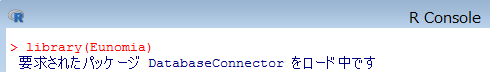
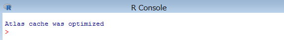

# **Eunomia テストデータのセットアップ**
※Eunomia テストデータのセットアップは、Atlas のセットアップが完了してから行ってください  

Eunomia とは、Atlas のテストデータとして用意されたデータセットです。  
Eunomia を利用することにより、ATLAS の機能を実際に使いながら学ぶことができます。  
<br>
### **目次**
[1　Eunomia からデータのエクスポート](#1-eunomia-からデータのエクスポート)  
[2　データベースへのインポート](#2-データベースへのインポート)  
[3　Achilles の実行](#3-achilles-の実行)  

<br>

---
# **1　Eunomia からデータのエクスポート**
以下の手順に従い、インポートするデータを Eunomia からエクスポートします。  
まず、エクスポートするテストデータを格納するフォルダを作成しておきます。  


<br>

※以降の記述は「D:\tmp\output」フォルダを作成した前提の内容となっています。  

続いて R コンソールを起動し、以下のコマンドを入力します。  
```
> library(Eunomia)
```



<br>

```
> folder <- "D:\\tmp\\output"
> exportToCsv(folder)
```


<br>

下図のメッセージが表示されたら実行は完了です。  


<br>

作成したフォルダを表示し、エクスポートしたデータが格納されている事を確認します。  


<br>

---
# **2　データベースへのインポート**
インポートを始める前に、エクスポートしたデータの内容を一部修正します。  

- CONCEPT_ANCESTOR.csv  
ファイルを開き「3.6e+07」を「36000000」に、「3.7e+07」を「37000000」に置き換えます。  

- DRUG_EXPOSURE.csv  
ファイルをエクセルで開きＡ列（drug_exposure_id）の内容を１からの連番に置き換えます。  

- MEASUREMENT.csv  
ファイルをエクセルで開きＡ列（mesurement_id）の内容を１からの連番に置き換えます。  

- OBSERVATION.csv  
ファイルをエクセルで開きＡ列（observation_id）の内容を１からの連番に置き換えます。  
ファイルの修正が完了したら、以下の手順に従い Eunomia からエクスポートしたデータをインポートします。  

psql を起動し、データベース「OHDSI」へ接続します。  
コマンドプロンプトを起動し以下のコマンドを入力します。  
```
psql -U ohdsi_admin_user -d OHDSI
```

  
※パスワードはセットアップ時に設定したパスワードを入力します。  

データベースへ接続したら、参照スキーマを設定します。  
```
# set search_path to "cdmv5";
```


<br>

以下のコマンドを入力し、データをインポートします。  
```
# \copy CDM_SOURCE from 'D:\\tmp\output\\CDM_SOURCE.csv' with delimiter ',' csv header
```


<br>

実行が成功すると、インポートした件数が表示されます。  


<br>

同様に以下のコマンドを入力して、データをインポートします。  

```
# \copy CONCEPT from 'D:\\tmp\output\\CONCEPT.csv' with delimiter ',' csv header
# \copy CONCEPT_ANCESTOR from 'D:\\tmp\output\\CONCEPT_ANCESTOR.csv' with delimiter ',' csv header
# \copy CONCEPT_RELATIONSHIP from 'D:\\tmp\output\\CONCEPT_RELATIONSHIP.csv' with delimiter ',' csv header
# \copy CONCEPT_SYNONYM from 'D:\\tmp\output\\CONCEPT_SYNONYM.csv' with delimiter ',' csv header
# \copy CONDITION_ERA from 'D:\\tmp\output\\CONDITION_ERA.csv' with delimiter ',' csv header
# \copy CONDITION_OCCURRENCE from 'D:\\tmp\output\\CONDITION_OCCURRENCE.csv' with delimiter ',' csv header
# \copy DOMAIN from 'D:\\tmp\output\\DOMAIN.csv' with delimiter ',' csv header
# \copy DRUG_ERA from 'D:\\tmp\output\\DRUG_ERA.csv' with delimiter ',' csv header
# \copy DRUG_EXPOSURE from 'D:\\tmp\output\\DRUG_EXPOSURE.csv' with delimiter ',' csv header
# \copy MEASUREMENT from 'D:\\tmp\output\\MEASUREMENT.csv' with delimiter ',' csv header
# \copy OBSERVATION from 'D:\\tmp\output\\OBSERVATION.csv' with delimiter ',' csv header
# \copy OBSERVATION_PERIOD from 'D:\\tmp\output\\OBSERVATION_PERIOD.csv' with delimiter ',' csv header
# \copy PERSON from 'D:\\tmp\output\\PERSON.csv' with delimiter ',' csv header
# \copy PROCEDURE_OCCURRENCE from 'D:\\tmp\output\\PROCEDURE_OCCURRENCE.csv' with delimiter ',' csv header
# \copy RELATIONSHIP from 'D:\\tmp\output\\RELATIONSHIP.csv' with delimiter ',' csv header
# \copy VISIT_OCCURRENCE from 'D:\\tmp\output\\VISIT_OCCURRENCE.csv' with delimiter ',' csv header
# \copy VOCABULARY from 'D:\\tmp\output\\VOCABULARY.csv' with delimiter ',' csv header FORCE NOT NULL vocabulary_version,vocabulary_reference
```

性別 CONCEPT の登録コマンドを実行します。  
```
# insert into cdmv5.concept values (8532,'FEMALE','Gender','Gender','Gender','S','F','1900-01-01','2099-12-31',NULL);
# insert into cdmv5.concept values (8507,'MALE','Gender','Gender','Gender','S','M','1900-01-01','2099-12-31',NULL);
```
以上でデータセットアップは完了です。

<br>

---
# **3　Achilles の実行**
Achilles は、Atlas 内で Data Source で表示されるデータの分析とレポート提供を実行しているツールです。  
Data Source 機能を使用するために Achilles の実行が必要となります。（Data Source の機能については、「Atlas 機能調査補足資料」を参照してください）  
データベースにデータをインポートした際や、登録されているデータを変更した場合に、Achilles を実行してください。  

R コンソールを起動し、以下のコマンドを入力し、Achilles を実行します。  
```
> library(Achilles)
```


<br>

```
> Sys.setenv("DATABASECONNECTOR_JAR_FOLDER"="C:\\tomcat\\webapps\\WebAPI\\WEB-INF\\lib")
```


<br>

```
> connectionDetails <- createConnectionDetails(
dbms="postgresql",
server="127.0.0.1/OHDSI",
user="ohdsi_app_user",
password="設定したパスワード",
port="5432")
```


<br>

```
> achilles(
connectionDetails,
cdmDatabaseSchema="cdmv5",
resultsDatabaseSchema="webapi",
vocabDatabaseSchema="cdmv5",
numThreads=1,
sourceName="CDM V5 Database",
cdmVersion="5.3.1",
optimizeAtlasCache=TRUE)
```


<br>

下記のメッセージが表示されたら実行完了です。



以上で Achilles の実行は完了です。