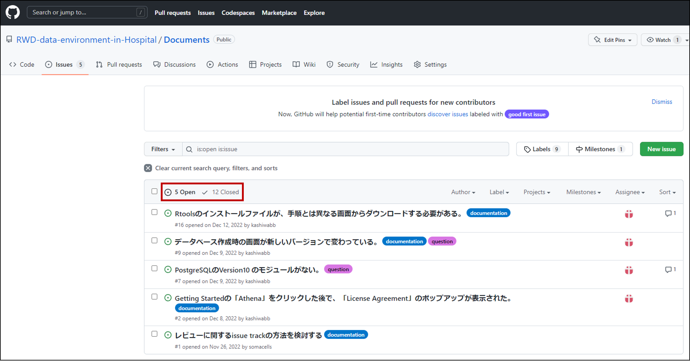

# **GitHub Issues について**  

OHDSIツールドキュメントの課題を GitHub の Issues で管理しています。  

下記リンクから、OHDSIツールドキュメントを対象とした課題を閲覧できます。  
https://github.com/RWD-data-environment-in-Hospital/Documents/issues
  

Issues の画面が表示されると、検討中の課題が並んでいます。  

赤枠で囲んだように、検討中の課題が5つ（5 Open）、閉じられた課題が12（12 Closed）あることがわかります。  
「12 Closed」をクリックすると、閉じられた課題を閲覧することができます。  
個々の課題をクリックすると、詳細を確認することができます。  