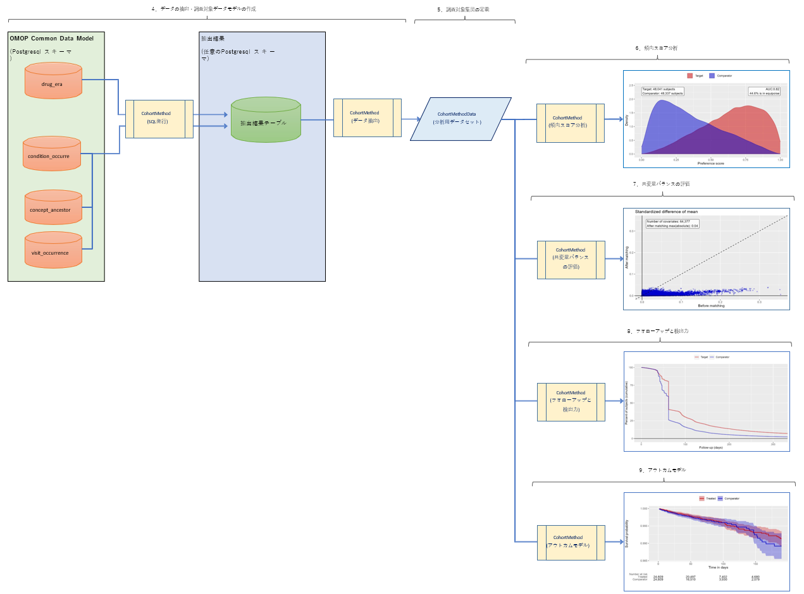

# **HADESパッケージ概要**

## **HADES（Health Analytics Data-to-Evidence Suite）とは**
母集団の特性評価、母集団レベルの因果効果の推定、患者レベルの予測など、大規模な分析のための20個のオープンソースRパッケージのセットです。  
RパッケージにはR関数が含まれています。  
R関数は、データから推定と統計、図、表のサポートまでの観察研究を実行するために使用できます。  
パッケージはCDMの観測データと直接相互作用し、カスタム分析へのクロスプラットフォーム互換性を提供するために使用できます。  

HADESを利用した分析では、Rの開発スキルが必要です。  

HADESに含まれているパッケージは、以下の通りです。本書では、CohortMethodを例として解説します。  

---
# **Population-level  estimation(母集団レベルの推定)**

## **【 CohortMethod 】**

OMOP共通データモデルの観測データベースで**新規ユーザーコホート研究を実行**するためのRパッケージです。  
傾向および結果モデルに大規模回帰を使用します。  

参考URL：[https://ohdsi.github.io/CohortMethod/](https://ohdsi.github.io/CohortMethod/)

<br>

---
## **【 SelfControlledCaseSeries 】**
OMOP共通データモデルの観測データベースで**Self-Controlled Case Series（SCCS）分析を実行**するためのRパッケージです。  
少数または多数の予測子を使用した自己制御のケースシリーズ分析には、年齢と季節性のスプラインが含まれます。  

参考URL：[https://ohdsi.github.io/SelfControlledCaseSeries/](https://ohdsi.github.io/SelfControlledCaseSeries/)

<br>

---
## **【 SelfControlledCohort 】**
**曝露されたコホート間で曝露された時間と曝露されていない時間を比較することによってリスクを推定する**方法を提供します。  

参考URL：[https://ohdsi.github.io/SelfControlledCohort/](https://ohdsi.github.io/SelfControlledCohort/)

<br>

---
## **【 EvidenceSynthesis 】**
**分散研究で複数のデータサイトにわたる因果効果の推定と研究診断を組み合わせる**ためのルーチン。これには、メタ分析とフォレストプロットを実行するための関数が含まれます。

参考URL：[https://ohdsi.github.io/EvidenceSynthesis/](https://ohdsi.github.io/EvidenceSynthesis/)

<br>

---
# **Patient-level  prediction(患者レベルの予測)**
## **【 PatientLevelPrediction 】**
OMOP共通データモデル形式のデータを使用して患者レベルの予測モデルを構築および検証するためのRパッケージです。  
多様な機械学習アルゴリズムを使用して、ユーザー指定の結果の予測モデルを構築・評価します。  

参考URL：[https://ohdsi.github.io/PatientLevelPrediction/](https://ohdsi.github.io/PatientLevelPrediction/)

<br>

---
# **Evidence Quality(エビデンスの質)**
## **【 EmpiricalCalibration 】**
観察研究の**推定値の経験的推定を行う**ためのルーチンが含まれています。  
ネガティブコントロール仮説のセットを使用して、**特定の観察研究のセットアップの経験的な帰無分布を推定**することができます。  
この経験的帰無分布は、論文[Interpreting observational studies: why empirical calibration is needed to correct p-values.]で説明されているように、帰無仮説が真であるときにランダムおよびシステマティックエラーの両方を考慮して推定効果サイズを観察する確率を反映した校正されたp-値を計算するために使用できます。 ([http://dx.doi.org/10.1002/sim.5925](http://dx.doi.org/10.1002/sim.5925))を参照してください。  

参考URL：[https://ohdsi.github.io/EmpiricalCalibration/](https://ohdsi.github.io/EmpiricalCalibration/)

<br>

---
## **【 MethodEvaluation 】**
**ある結果に対する薬剤の効果の大きさ（相対リスク）を推定することを目的とした手法の性能を評価するためのリソース**が含まれています。  
これらのリソースには、実データ上で手法を評価するためのリファレンスセット や、陰性対照薬とアウトカムのペアに基づいて実データに模擬効果を挿入するための関数が含まれています。  
さらに、検出可能な最小の相対リスクを計算する機能や、予測精度、エラー、バイアスなどの性能統計を計算する機能も含まれています。  

参考URL：[https://ohdsi.github.io/MethodEvaluation/](https://ohdsi.github.io/MethodEvaluation/)

<br>

---
## **【 CohortDiagnostics 】**
CDM内のデータベースに対して**コホート定義を評価するため、様々な研究診断を行う**ためのRパッケージで、その多くは特定の研究デザインに特化したものではありません。  

参考URL：[https://ohdsi.github.io/CohortDiagnostics/](https://ohdsi.github.io/CohortDiagnostics/)

<br>

---
# **Supporting  packages(サポートパッケージ)**
## **【 Cyclops 】**
Cyclops (Cyclic coordinate descent for Logistic、 Poisson and survival analysis) は、**大規模な正則化回帰を行う**ためのRパッケージです。  

参考URL：[https://ohdsi.github.io/Cyclops/](https://ohdsi.github.io/Cyclops/)

<br>

---
## **【 DatabaseConnector 】**
このRパッケージは、**様々なDBMSに接続するための機能**を提供します。  
  SqlRenderパッケージとともに、DatabaseConnectorの主な目的は、データベースプラットフォーム間で統一されたインターフェイスを提供することです。  

参考URL：[https://ohdsi.github.io/DatabaseConnector/](https://ohdsi.github.io/DatabaseConnector/)

<br>

---
## **【 SqlRender 】**
**パラメータ化されたSQLをレンダリングし、異なるSQL言語に変換する**ためのRパッケージです。  
SqlRenderはスタンドアローンのJavaライブラリやコマンドラインの実行ファイルとしても使用できます。

参考URL：[https://ohdsi.github.io/SqlRender/](https://ohdsi.github.io/SqlRender/)

<br>

---
## **【 ParallelLogger 】**
**プログレスバーを備えた並列計算をサポート**し、エラー時に停止または続行するオプションを備えています。  
また、コンソールやディスクへのロギング機能も備えており、ロギングは並列スレッドでも保持されます。  
追加機能として、遅延実行による関数呼び出しの自動化をサポートしています（例：関数の並列実行）。  

参考URL：[https://ohdsi.github.io/ParallelLogger/](https://ohdsi.github.io/ParallelLogger/)

<br>

---
## **【 FeatureExtraction 】**
OMOP共通データモデルのデータを用いて、コホートの特徴量（共変量）を生成するためのRパッケージです。  

参考URL：[https://ohdsi.github.io/FeatureExtraction/](https://ohdsi.github.io/FeatureExtraction/)

<br>

---
## **【Andromeda】**
AsynchroNous Disk-based Representation of MassivE DAta (ANDROMEDA): 大規模なデータオブジェクトを保存するためのRパッケージです。  
アンドロメダは、データオブジェクトをローカルドライブに保存しつつ、データを効率的に操作することができます。  

参考URL：[https://ohdsi.github.io/Andromeda/](https://ohdsi.github.io/Andromeda/)

<br>

---
## **【 BigKnn 】**
**検索エンジン「Lucene」([https://lucene.apache.org/](https://lucene.apache.org/))を用いて、大規模なk-nearest neighbor(KNN)分類器を実装した**Rパッケージです。 


参考URL：[https://ohdsi.github.io/Andromeda/](https://ohdsi.github.io/Andromeda/)

<br>

---
## **【 ROhdsiWebApi 】**  
**WebAPIインスタンスと連携する**ためのRパッケージです。

参考URL：[https://ohdsi.github.io/ROhdsiWebApi/](https://ohdsi.github.io/ROhdsiWebApi/)

<br>

---
## **【 OhdsiSharing 】**
**OHDSIパートナー間でデータを共有する**ためのRパッケージです。  

参考URL：[https://ohdsi.github.io/OhdsiSharing/](https://ohdsi.github.io/OhdsiSharing/)

<br>

---
## **【 Hydra 】**
**JSON形式の仕様に基づいて、パッケージのスケルトンを実行可能なRスタディパッケージにハイドレートするためのRパッケージとJavaライブラリ**です。  

参考URL：[https://ohdsi.github.io/Hydra/](https://ohdsi.github.io/Hydra/)

<br>

---
## **【 Eunomia 】**
**OMOPのCDM(共通データモデル)の標準データセットで、テストやデモンストレーションを目的**としています。  
Eunomiaは「the Book of OHDSI」 ([https://ohdsi.github.io/TheBookOfOhdsi/](https://ohdsi.github.io/TheBookOfOhdsi/)) の多くの演習で使用されています。  

参考URL：[https://ohdsi.github.io/Eunomia/](https://ohdsi.github.io/Eunomia/)

<br>

---
## **【 CirceR 】**
**OMOPのCDM(共通データモデル)の標準データセットで、テストやデモンストレーションを目的**としています。  
**OMOP共通データ・モデルのクエリを作成するためのライブラリである
「Circe」[https://www.github.com/OHDSI/circe-be](https://www.github.com/OHDSI/circe-be) のRラッパー**です。これらのクエリは、コホート定義 (CohortExpression) やカスタム機能 (CriteriaFeature) で使用されます。


参考URL：[https://ohdsi.github.io/CirceR/](https://ohdsi.github.io/CirceR/)

<br>

---
# **CohortMethod 使用例（CohortMethodパッケージを用いた単一研究）**
## **目次**
[1．本書について](#1本書について)  
[2．参考資料](#2参考資料)  
[3．CohortMethod 処理の流れ](#3cohortmethod-処理の流れ)  
[4．データの抽出・調査対象データモデルの作成](#4データの抽出・調査対象データモデルの作成)  
[5．調査対象集団の定義](#5調査対象集団の定義)  
[6．傾向スコア分析](#6傾向スコア分析)  
[7．共変量バランスの評価](#7共変量バランスの評価)  
[8．フォローアップと検出力](#8フォローアップと検出力)  
[9．アウトカムモデル](#9アウトカムモデル)  

---
# **1．本書について**
本書では、CohortMethodパッケージを使用して、単一の新規ユーザーコホート研究を実行する方法について説明します。  

ここでは、コキシブと非選択的非ステロイド性抗炎症薬（NSAIDs）の消化管出血による入院への影響という、よく研究されているテーマを選んで、模範的な研究を行うために必要なすべてのステップを説明します。  

わかりやすくするために、ここでは1種類のコキシブ（celecoxib）と1種類の非選択的NSAID（diclofenac）に焦点を当てています。  

<br>

---
# **2．参考資料**
- CohortMethodパッケージWebサイト  
[https://ohdsi.github.io/CohortMethod/](https://ohdsi.github.io/CohortMethod/)  
- CohortMethodパッケージマニュアル  
[https://raw.githubusercontent.com/OHDSI/CohortMethod/master/extras/CohortMethod.pdf](https://raw.githubusercontent.com/OHDSI/CohortMethod/master/extras/CohortMethod.pdf)  
- Single studies using the CohortMethod package  
[https://ohdsi.github.io/CohortMethod/articles/SingleStudies.html](https://ohdsi.github.io/CohortMethod/articles/SingleStudies.html)  

<br>

---
# **3．CohortMethod 処理の流れ**


<br>

---
# **4．データの抽出・調査対象データモデルの作成**
参考URL：[https://ohdsi.github.io/CohortMethod/articles/SingleStudies.html#data-extraction-1](https://ohdsi.github.io/CohortMethod/articles/SingleStudies.html#data-extraction-1)

OMOP共通データモデルから必要なすべてのデータを抽出します。  

※ボックス内の記述について  
- ボックス内は、Rコンソールでのコマンド入力を表します。  
- #が付いている行はコメント・解説のため、入力の必要はありません。  
- [　]内は、環境に合わせて変更します。

<br>

---
## **サーバーへの接続の構成**
データがあるサーバに接続する方法設定します。  
CohortMethodはDatabaseConnectorパッケージを使用し、createConnectionDetails関数を提供しています。  
さまざまなデータベース管理システム(DBMS)に必要な特定の設定については、Rコンソール上で「?createConnectionDetails」と入力します。  
例えば、次のコードを使用してPostgreSQLデータベースに接続することができます。  

```
setwd('[ワークフォルダ]')

library(CohortMethod)

Sys.setenv("DATABASECONNECTOR_JAR_FOLDER"="C:\\tomcat\\webapps\\WebAPI\\WEB-INF\\lib")
connectionDetails <- createConnectionDetails(dbms="[postgresql]",
    server="[コンピュータ名・IPアドレス]/[スキーマ名]",
    user="[接続ユーザー]",
    password="[接続パスワード]"
)

cdmDatabaseSchema <- "[データベーススキーマ名]"
resultsDatabaseSchema <- "[抽出結果出力先データベーススキーマ名]" 
options(sqlRenderTempEmulationSchema = NULL)
```
最後の2行では、cdmDatabaseSchemaとresultSchema変数を定義しています。  
これらは後でRにCDM形式のデータがどこにあるか、どこに中間テーブルを書きたいかを伝えるために使います。  
Microsoft  SQL  Serverの場合、データベーススキーマはデータベースとスキーマの両方を指定する必要があることに注意してください。  

<br>

---
## **暴露と結果(複数)の準備**
この研究では、曝露と転帰を定義する必要があります。  
外部のコホート定義ツールを使用することもできますが、この例では、OMOP   CDMに対してSQLステートメントを記述して、関心のあるイベントのテーブルを生成します。結果として得られるテーブルは、CDMのコホートテーブルと同じ構造でなければなりません。  
つまり、cohort_definition_id、cohort_start_date、cohort_end_date、subject_id  の各フィールドを持つことになります。  

今回の例では、coxibVsNonselVsGiBleed.sqlというファイルを作成し、以下の内容としました。  
<span style="color: red; ">※ファイルの文字コードはUTF-8で保存してください。</span>  
```
/***********************************
File coxibVsNonselVsGiBleed.sql
***********************************/
IF OBJECT_ID('@resultsDatabaseSchema.coxibVsNonselVsGiBleed', 'U') IS NOT NULL
DROP TABLE @resultsDatabaseSchema.coxibVsNonselVsGiBleed;
CREATE TABLE @resultsDatabaseSchema.coxibVsNonselVsGiBleed (
cohort_definition_id INT,
cohort_start_date DATE,
cohort_end_date DATE,
subject_id BIGINT
);
INSERT INTO @resultsDatabaseSchema.coxibVsNonselVsGiBleed (
cohort_definition_id,
cohort_start_date,
cohort_end_date,
subject_id
)
SELECT 1, -- Exposure
drug_era_start_date,
drug_era_end_date,
person_id
FROM @cdmDatabaseSchema.drug_era
WHERE drug_concept_id = 1118084;-- celecoxib
INSERT INTO @resultsDatabaseSchema.coxibVsNonselVsGiBleed (
cohort_definition_id,
cohort_start_date,
cohort_end_date,
subject_id
)
SELECT 2, -- Comparator
drug_era_start_date,
drug_era_end_date,
person_id
FROM @cdmDatabaseSchema.drug_era
WHERE drug_concept_id = 1124300; --diclofenac
INSERT INTO @resultsDatabaseSchema.coxibVsNonselVsGiBleed (
cohort_definition_id,
cohort_start_date,
cohort_end_date,
subject_id
)
SELECT 3, -- Outcome
condition_start_date,
condition_end_date,
condition_occurrence.person_id
FROM @cdmDatabaseSchema.condition_occurrence
INNER JOIN @cdmDatabaseSchema.visit_occurrence
ON condition_occurrence.visit_occurrence_id = visit_occurrence.visit_occurrence_id
WHERE condition_concept_id IN (
SELECT descendant_concept_id
FROM @cdmDatabaseSchema.concept_ancestor
WHERE ancestor_concept_id = 192671 -- GI - Gastrointestinal hemorrhage
)
AND visit_occurrence.visit_concept_id IN (9201, 9203);
```
上記は、SqlRenderパッケージで使用できるパラメータ化されたSQLです。（@resultsDatabaseSchema、@cdmDatabaseSchema）  
パラメータ化したSQLを使用することで、CDMスキーマと結果スキーマの名前を事前に指定する必要がありません。  
これにより、異なるスキーマ上でSQLを実行したい場合には、パラメータ値を変更するだけで、SQLコードまで変更する必要がなくなります。  
また、SqlRenderパッケージの翻訳機能を利用することで、Postgresql以外にも、さまざまなデータベース環境でSQLコードを実行できるようになります。  

<br>

作成したSQLファイルを実行します。  
SqlRenderパッケージで2つのパラメータを実際の値に置き換え、connectionDetailsで指定したデータベースに対してSQLを送信します。  
```
library(SqlRender)
sql <- readSql("coxibVsNonselVsGiBleed.sql")
sql <- render(sql,
cdmDatabaseSchema = cdmDatabaseSchema,
resultsDatabaseSchema = resultsDatabaseSchema)
sql <- translate(sql, targetDialect = connectionDetails$dbms)
```

<br>

実行結果を確認します。  
以下のSQLを実行し、問題がなければ、対象となるイベントがテーブルに表示され、タイプごとのイベントの数がわかります。  
```
connection <- connect(connectionDetails)
executeSql(connection, sql)
sql <- paste("SELECT cohort_definition_id, COUNT(*) AS count",
"FROM @resultsDatabaseSchema.coxibVsNonselVsGiBleed",
"GROUP BY cohort_definition_id")
sql <- render(sql, resultsDatabaseSchema = resultsDatabaseSchema)
sql <- translate(sql, targetDialect = connectionDetails$dbms)
querySql(connection, sql)
```
⇩≪結果≫
```
##      cohort_concept_id   count
## 1                    1   50000
## 2                    2   50000
## 3                    3   15000
```

<br>

---
## **サーバからのデータの抽出**
CohortMethodに、イベントに基づいてコホートを定義し、共変量を構築し、分析に必要なすべてのデータを抽出するように指示することができます。  

<br>

重要：標的薬剤と比較対象薬剤は、子孫概念を含めて共変量に含まれていてはいけません。  
共変量設定のexcludedCovariateConceptIdsに薬剤とその子孫を手動で追加する必要があります。  
下記の例では、NSAID クラスのコンセプト ID を指定し、addDescendantsToExclude = TRUE を指定することで、すべての NSAID を共変量から除外しています。  
```
nsaids <- 21603933
cdmVersion <- 5
# 共変量設定を作成します
covSettings <- createDefaultCovariateSettings(excludedCovariateConceptIds = nsaids,
addDescendantsToExclude = TRUE)
#データを抽出します。
cohortMethodData <- getDbCohortMethodData(connectionDetails = connectionDetails,
cdmDatabaseSchema = cdmDatabaseSchema,
targetId = 1,
comparatorId = 2,
outcomeIds = 3,
studyStartDate = "",
studyEndDate = "",
exposureDatabaseSchema = resultsDatabaseSchema,
exposureTable = "coxibVsNonselVsGiBleed",
outcomeDatabaseSchema = resultsDatabaseSchema,
outcomeTable = "coxibVsNonselVsGiBleed",
cdmVersion = cdmVersion,
firstExposureOnly = TRUE,
removeDuplicateSubjects = TRUE,
restrictToCommonPeriod = FALSE,
washoutPeriod = 180,
covariateSettings = covSettings)
```

<br>

抽出したデータの表示
```
cohortMethodData
```
⇩≪結果≫
```
## # CohortMethodData object
##
## Target cohort ID: 1
## Comparator cohort ID: 2
## Outcome cohort ID(s): 3
##
## Inherits from CovariateData:
## # CovariateData object
##
## All cohorts
##
## Inherits from Andromeda:
## # Andromeda object
## # Physical location: C:\Users\mschuemi\AppData\Local\Temp\RtmponKEpH\file2864201706.sqlite
##
## Tables:
## $analysisRef (analysisId, analysisName, domainId, startDay, endDay, isBinary, missingMeansZero)
## $cohorts (rowId, personSeqId, personId, treatment, cohortStartDate, daysFromObsStart, daysToCohortEnd, daysToObsEnd)
## $covariateRef (covariateId, covariateName, analysisId, conceptId)
## $covariates (rowId, covariateId, covariateValue)
## $outcomes (rowId, outcomeId, daysToEvent)
```

<br>

多くのパラメータがありますが、それらはすべてCohortMethodのマニュアルに記載されています。  
createDefaultCovariateSettings関数は、FeatureExtractionパッケージのマニュアルに記載されています。  
この関数に先ほど作成したテーブルを指定し、そのテーブル内のどの概念IDがターゲット、コンパレータ、アウトカムを特定しているかを示しています。  
指標日以前に発見されたすべての条件、薬物曝露、処置に関する共変量を含む、デフォルトの共変量セットを構築するように指示する。  
共変量のセットをカスタマイズするには、vignette("UsingFeatureExtraction", package="FeatureExtraction")と入力して、FeatureExtractionパッケージのヴィネットを参照してください。  

<br>

コホート、アウトカム、共変量に関するすべてのデータは、サーバーから抽出され、cohortMethodDataオブジェクトに格納されます。  
このオブジェクトはAndromedaパッケージを使用して、データが大きくてもRがメモリ不足にならないような方法で情報を保存します。  
summary()関数を使って、抽出したデータの詳細情報を見ることができます。  
```
summary(cohortMethodData)
```
⇩≪結果≫
```
## CohortMethodData object summary
##
## Target cohort ID: 1
## Comparator cohort ID: 2
## Outcome cohort ID(s): 3
##
## Target persons: 50000
## Comparator persons: 50000
##
## Outcome counts:
## Event count Person count
## 3 13474 7009
##
## Covariates:
## Number of covariates: 64377
## Number of non-zero covariate values: 43920369
```

<br>

---
## **新規使用者の定義**
新規使用者は、薬剤（標的または比較対象のいずれか）を初めて使用した場合と定義され、一般的には、本当に初めての使用であることを確認するためにウォッシュアウト期間（初回使用前の最低日数）が使用されます。  
CohortMethodパッケージを使用する場合、3つのオプションで新規使用に必要な要件を実施することができます。  

1．コホート定義ツールなどを使用して、データベース内にコホートを作成するとき。  
2．上記の例のように、getDbCohortMethodData関数を使用してコホートを読み込む際に、firstExposureOnly、removeDuplicateSubjects、restrictToCommonPeriod、washoutPeriodの各引数を使用することができます。  
3．firstExposureOnly、removeDuplicateSubjects、restrictToCommonPeriod、washoutPeriodの各引数を用いて、createStudyPopulation関数（後述）を用いて研究集団を定義する場合。  

オプション1の利点は、入力コホートがCohortMethodパッケージの外で既に完全に定義されており、例えば、外部のコホート特性評価ツールをこのパッケージで使用されているのと同じコホートに使用できることです。  
オプション2と3の利点は、例えばCDMのdrug_eraテーブルを直接使用できるようにするなど、自分で初回使用に限定する手間が省けることです。  
オプション2は、初回使用のデータのみが取得されるため、オプション3よりも効率的ですが、オプション3は効率的ではありませんが、元のコホートと研究対象集団を比較することができます。  

<br>

---
# **5．調査対象集団の定義**
参考URL：[https://ohdsi.github.io/CohortMethod/articles/SingleStudies.html#defining-the-study-population-1](https://ohdsi.github.io/CohortMethod/articles/SingleStudies.html#defining-the-study-population-1)  

<br>

通常、曝露コホートと転帰コホートは、それぞれ独立して定義されます。  
効果量の推定値を算出したい場合は、これらのコホートをさらに制限してまとめる必要があります。  
例えば、曝露前に転帰を有していた曝露対象者を除外し、定義されたリスクウィンドウ内にある転帰のみを保持します。  
そのためには、createStudyPopulation関数を使用します。  
```
# 調査対象母集団を作成します。
studyPop <- createStudyPopulation(cohortMethodData = cohortMethodData,
outcomeId = 3,
firstExposureOnly = FALSE,
restrictToCommonPeriod = FALSE,
washoutPeriod = 0,
removeDuplicateSubjects = "keep all",
removeSubjectsWithPriorOutcome = TRUE,
minDaysAtRisk = 1,
riskWindowStart = 0,
startAnchor = "cohort start",
riskWindowEnd = 30,
endAnchor = "cohort end")
```

<br>

ここでは、firstExposureOnlyとremoveDuplicateSubjectsをFALSEに設定し、washoutPeriodを0に設定していることに注意してください。  
これは、getDbCohortMethodData関数を使用する際に、これらの引数ですでにフィルタリングしているからです。  
読み込み時に restrictToCommonPeriod を FALSE に設定しましたが、両方の薬剤が記録された時間のみに比較を強制したくないので、ここでも同様に設定します。  
使用するアウトカムIDを指定し、リスクウィンドウの開始日より前のアウトカムを持つ人々を削除します。  
リスクウィンドウは、コホート開始日（指標日、riskWindowStart = 0 and startAnchor = "cohort start"）から始まり、リスクウィンドウはコホート終了から30日後に終了すると定義されます。（riskWindowEnd = 30 and endAnchor = "cohort end"）  
なお，リスクウィンドウは観察終了日または研究終了日で切り捨てられます。  
また、リスクのある時間がない被験者も削除します。  

<br>

調査対象者に何人の人が残っているかを見るには、getAttritionTable関数を使うことができます。
```
# 母集団の減少表を取得します。
getAttritionTable(studyPop)
```
⇩≪結果≫
```
## # A tibble: 5 x 5
## description targetPersons comparatorPersons targetExposures comparatorExposures
## <chr> <dbl> <dbl> <dbl> <dbl>
## 1 Original cohorts 150109 814723 263358 1395611
## 2 First exp. only & removed s ... 69006 582090 69006 582090
## 3 Random sample 50000 50000 50000 50000
## 4 No prior outcome 48088 48394 48088 48394
## 5 Have at least 1 days at ris ... 48041 48337 48041 48337
```

<br>

よく使われる追加のフィルタリング手順としては、傾向モデルのマッチングやトリミングがあります。  

<br>

---
# **6．傾向スコア分析**
参考URL：[https://ohdsi.github.io/CohortMethod/articles/SingleStudies.html#propensity-scores-1](https://ohdsi.github.io/CohortMethod/articles/SingleStudies.html#propensity-scores-1)

<br>

CohortMethodでは、潜在的な交絡因子を調整するために傾向スコアを使用することができます。  
CohortMethodでは、一握りの定義済み共変量を使用する従来の方法ではなく、被験者の記録にある条件、手順、薬剤に基づいて自動的に構築された数千から数百万の共変量を使用するのが一般的です。  

<br>

---
## **傾向モデルのフィッティング**
getDbcohortMethodData()関数によって構築された共変量を使用して、傾向モデルを適合させることができます。  
createPs()関数は、Cyclopsパッケージを使用して、大規模な正則化ロジスティック回帰を適合させます。  
```
# 正則化されたロジスティック回帰を使用して傾向スコアを作成します。
ps <- createPs(cohortMethodData = cohortMethodData, population = studyPop)
```

<br>

傾向モデルをフィットさせるために、Cyclopsには事前の分散を指定するハイパーパラメータの値を設定する必要があります。  
デフォルトでは、Cyclopsはクロスバリデーションを用いて最適なハイパーパラメータを推定します。  
しかし、これには非常に⾧い時間がかかることに注意してください。  
createPs()の事前パラメータとコントロールパラメータを使って、クロスバリデーションを高速化するために複数のCPUを使うなど、Cyclopsの動作を指定することができます。  

<br>

---
## **傾向スコア診断を行う**
傾向スコアモデルの受信者操作曲線下の面積（AUC）を計算することができます。  
```
# 傾向スコアのROC曲線下面積を計算します。
computePsAuc(ps)
```
⇩≪結果≫
```
## [1] 0.81
```

<br>

傾向スコア分布をプロットすることもできますが、ここでは選好スコア分布を使用します。  
```
# 傾向スコア（またはプリファレンス）の分布をプロットします。
plotPs(ps,
scale = "preference",
showCountsLabel = TRUE,
showAucLabel = TRUE,
showEquiposeLabel = TRUE)
```

<br>

上記を実行すると、Rコンソール上に以下のようなグラフが描画されます。  


<br>

※Rコンソール上で画面を切り替える場合は、「コンソールに戻る」ボタンまたは「ウィンドウ」メニューを使用します。  


<br>

係数がゼロ以外の共変量を表示することにより、傾向モデル自体を検査することもできます。  
```
#  傾向モデルを取得します。係数がゼロではない共変量の係数と名前を返します。
getPsModel(ps, cohortMethodData)
```
⇩≪結果≫
```
## # A tibble: 6 x 3
## coefficient covariateId covariateName ##  <dbl>  <dbl> <chr>
## 1  -1.75 21602430413 ...gh 0 days relative to index: UTEROTONICS
## 2  1.48 2007006 index year: 2007
## 3  1.25 4253901210 ... to index: Juvenile rheumatoid arthritis
## 4  -1.15 44967547602 ...ative to index: LIPOPEN ULTRA CREAM BASE
## 5  1.15 2008006 index year: 2008
## 6  -1.08  3003 age group: 15 - 19
```

<br>

傾向モデルを当てはめる際に正則化を使用する利点の1つは、ほとんどの係数がゼロに縮小し、モデルから脱落することです。  
残りの変数を調べて、そこにあるべきではないものがないかどうかを調べることをお勧めします。たとえば、除外するのを忘れた対象薬物のバリエーションなどです。  

<br>

---
## **傾向スコアの使用**
傾向スコアを使って、母集団をトリミング、層別、マッチ、または計量することができます。  
例えば、preference  scoreが0.25から0.75の間の被験者のみを残して、equipoiseにトリミングすることができます。  

```
#  プリファレンススコアを利用して、臨床的に平衡状態にない被験者をトリミングします。
trimmedPop <- trimByPsToEquipoise(ps)

#  傾向スコア（またはプリファレンス）の分布をプロットします。
plotPs(trimmedPop, ps, scale = "preference")
```

上記を実行すると、Rコンソール上に以下のようなグラフが描画されます。  


<br>

代わりに（あるいは追加で）、傾向スコアに基づいて母集団を層別化することもできます。
```
#  提供された傾向スコアを使用して、人を層別します。追加の層別変数を使用することもできます。
stratifiedPop <- stratifyByPs(ps, numberOfStrata = 5)

#  傾向スコア（またはプリファレンス）の分布をプロットします。
plotPs(stratifiedPop, ps, scale = "preference")
```

<br>

上記を実行すると、Rコンソール上に以下のようなグラフが描画されます。


<br>

傾向スコアに基づいて被験者をマッチングすることもできます。  
この例では、1対1のマッチングを使用しています。  
```
#  提供された傾向スコアを使用して、対象者と比較対象者を照合します。
matchedPop <- matchOnPs(ps, caliper = 0.2, caliperScale = "standardized logit", maxRatio = 1)

#  傾向スコア（またはプリファレンス）の分布をプロットします。
plotPs(matchedPop, ps)
```

<br>

上記を実行すると、Rコンソール上に以下のようなグラフが描画されます。


<br>

なお、層化とマッチングの両方において、年齢や性別などの追加のマッチング基準を、それぞれstratifyByPsAndCovariates()関数とmatchOnPsAndCovariates()関数を使って指定することができます。  

トリミングやマッチングの母集団への影響は、getAttritionTable関数を使って見ることができます。  
```
# 母集団の減少表を取得します。
getAttritionTable(matchedPop)
```
⇩≪結果≫
```
## # A tibble: 6 x 5				
## description			targetPersons	comparatorPersons	targetExposures	comparatorExposures
## <chr>					<dbl>			<dbl>			<dbl>		<dbl>
## 1 Original cohorts			150109			814723			263358		1395611
## 2 First exp. only & removed s ...	69006			582090			69006		582090
## 3 Random sample	50000	50000			50000			50000		50000
## 4 No prior outcome	48088	48394			48088			48394		48394
## 5 Have at least 1 days at ris ...	48041				48337			48041			48337
## 6 Matched on propensity score	24609			24609			24609		24609
```

<br>

また、人員摩耗図を描くこともできます。  
```
#  何人がどのような理由で調査対象から除外されたかを示す摩耗図を描画します。
drawAttritionDiagram(matchedPop)
```

<br>

上記を実行すると、Rコンソール上に以下のような図が描画されます。


<br>

---
## **7．共変量バランスの評価**
参考URL：[https://ohdsi.github.io/CohortMethod/articles/SingleStudies.html#evaluating-covariate-balance-1
](https://ohdsi.github.io/CohortMethod/articles/SingleStudies.html#evaluating-covariate-balance-1
)

傾向スコアの使用が実際に2つのコホートをより比較可能にしているかどうかを評価するために、トリミング、マッチング、層別化の前と後の共変量バランスを計算することができます。  
```
#  すべての共変量について、マッチング／トリミングの前後で、治療群と比較群の有病率を計算します。
balance <- computeCovariateBalance(matchedPop, cohortMethodData)

#  共変量バランスの散布図を作成し、マッチング前後のすべての変数をx軸とy軸にそれぞれ表示します。
plotCovariateBalanceScatterPlot(balance, showCovariateCountLabel = TRUE, showMaxLabel = TRUE)
```

<br>

上記を実行すると、Rコンソール上に以下のようなグラフが描画されます。


<br>

```
#  マッチング前に最大の不均衡を持つ変数と、マッチング後に最大の不均衡を持つ変数を示すプロットを作成します。
plotCovariateBalanceOfTopVariables(balance)
```

<br>

上記を実行すると、Rコンソール上に以下のような図が描画されます。

「マッチング前」の母集団とは、getDbCohortMethodData関数によって抽出された母集団であり、これはさらなるフィルタリングステップの前のものです。

<br>

---
## **特定の母集団の特徴を調べる**
論文には、マッチング/層別化/トリミングの前後で、いくつかの厳選された母集団の特徴を示す表を掲載するのが通例です。  
これは通常、最初の表であり、「Table 1」と呼ばれます。  
この表を作成するには、createCmTable1関数を使用することができます。  
```
#  出版物や報告書に掲載するための、コホートの特徴をまとめた表を作成します。  
createCmTable1(balance)  
```
⇩≪結果≫


<br>

---
## **データベースへの集団コホートの挿入**
外部のコホート特性評価ツールを使用する場合など、さまざまな理由で研究集団をデータベースに再挿入する必要があるかもしれません。  
この目的のために、insertDbPopulation関数を使用できます。  
```
# 母集団をデータベースに挿入します。
insertDbPopulation(population = matchedPop,
        cohortIds = c(101,100),
        connectionDetails = connectionDetails,
        cohortDatabaseSchema = resultsDatabaseSchema, cohortTable = "coxibVsNonselVsGiBleed",
        createTable = FALSE,
        cdmVersion = cdmVersion)
```

<br>

この関数は、CDMのコホートテーブルと同じ構造のテーブルに母集団を保存します。  
ここでは、元のコホートを作成したのと同じテーブルに保存します。  

<br>

---
# **8．フォローアップと検出力**
参考URL：[https://ohdsi.github.io/CohortMethod/articles/SingleStudies.html#follow-up-and-power-1](https://ohdsi.github.io/CohortMethod/articles/SingleStudies.html#follow-up-and-power-1)

<br>

結果モデルの適合を開始する前に、特定の効果サイズを検出するのに十分な検出力があるかどうかを知りたいと思うかもしれません。  
研究集団が完全に定義された後にこれらの検出力の計算を行うことは理にかなっており、様々な包含および除外基準（過去の結果がないなど）による損失、マッチングおよび(または)トリミングによる損失を考慮に入れます。  
レトロスペクティブ研究ではサンプルサイズが固定されており（データはすでに収集されている）、真の効果サイズは不明であるため、 CohortMethodパッケージは代わりに最小検出可能相対リスク（MDRR）を計算する関数を提供しています。  

<br>

```
#  研究母集団に対する最小検出可能相対リスク（MDRR）と期待される標準誤差（SE）を計算します。
computeMdrr(population = studyPop,
        modelType = "cox",
        alpha = 0.05,
        power = 0.8,
        twoSided = TRUE)
```
⇩≪結果≫


<br>

この例では、studyPopオブジェクトを使用したので、マッチングやトリミングを行う前の母集団です。  
マッチング後のMDRRを知りたい場合は、先に作成したmatchedPopオブジェクトを代わりに使用します。  
```
computeMdrr(population = matchedPop,
        modelType = "cox",
        alpha = 0.05,
        power = 0.8,
        twoSided = TRUE)
```
⇩≪結果≫


<br>

一致させた集団のMDRRが高く、検出力が低いとはいえ、騙されてはいけません。  
一致させることで交絡が排除される可能性が高いため、一致させないよりも好ましいと言えます。  

<br>

利用可能な追跡調査の量をよりよく理解するために、追跡調査の時間の分布を調べることもできます。  
フォローアップ時間をリスクのある時間と定義したので、アウトカムの発生によって打ち切られることはありません。  
getFollowUpDistributionで簡単に概要を知ることができます。  
```
#  フォローアップ時間の分布を分位数として取得します。
getFollowUpDistribution(population = matchedPop)
```
⇩≪結果≫


<br>

出力結果は、調査母集団の各分位が何日フォローアップを受けたかを示しています。また、分布をプロットすることもできます。  
```
#  治療群ごとに層別化されたフォローアップ時間の分布をプロットします。
plotFollowUpDistribution(population = matchedPop)
```

<br>

上記を実行すると、Rコンソール上に以下のようなグラフが描画されます。


<br>

---
# **9．アウトカムモデル**
参考URL：[https://ohdsi.github.io/CohortMethod/articles/SingleStudies.html#outcome-models-1](https://ohdsi.github.io/CohortMethod/articles/SingleStudies.html#outcome-models-1)

<br>


アウトカムモデルとは、どのような変数がアウトカムと関連するかを記述したモデルのことです。  

<br>

---
## **単純なアウトカム・モデルの適合**
理論的には、傾向スコアを使用せずにアウトカム・モデルを当てはめることができます。  
この例では、Cox回帰を使ってアウトカム・モデルを当てはめています。  
```
#  アウトカムモデルを作成し、相対リスクを計算します。
outcomeModel <- fitOutcomeModel(population = studyPop,
                  modelType = "cox")
outcomeModel
```
⇩≪結果≫
```
## Model type: cox
## Stratified: FALSE
## Use covariates: FALSE
## Use inverse probability of treatment weighting: FALSE
## Status: OK
##
##      Estimate lower .95 upper .95 logRr seLogRr
## treatment 1.012159 0.830005 1.238075 0.012086 0.102
```

<br>

しかし、もちろん、傾向スコアで行われたマッチングを利用したいと思います。
```
#  アウトカムモデルを作成し、相対リスクを計算します。
outcomeModel <- fitOutcomeModel(population = matchedPop,
                modelType = "cox",
                stratified = TRUE)
outcomeModel
```
⇩≪結果≫
```
## Model type: cox
## Stratified: TRUE
## Use covariates: FALSE
## Use inverse probability of treatment weighting: FALSE
## Status: OK
##
##      Estimate lower .95 upper .95 logRr seLogRr
## treatment 0.84130 0.60336 1.16346 -0.17281 0.1675
```

<br>

ここでは、サブポピュレーションを、先に傾向スコアでマッチングして作成したmatchedPopオブジェクトに含まれるものだけと定義していることに注意してください。  
また、ここでは層化Coxモデルを使用し、傾向スコアのマッチセットで条件付けを行います。  

<br>

マッチングや層別の代わりに、IPTW（Inverse Probability of Treatment Weighting）を行うこともできます。
```
#  アウトカムモデルを作成し、相対リスクを計算します。
outcomeModel <- fitOutcomeModel(population = ps,
        modelType = "cox",
        inversePtWeighting = TRUE)
outcomeModel
```
⇩≪結果≫
```
## Model type: cox
## Stratified: FALSE
## Use covariates: FALSE
## Use inverse probability of treatment weighting: TRUE 
## Status: OK
##
##      Estimate lower .95 upper .95 logRr seLogRr
## treatment 1.012159 0.830005 1.238075 0.012086 0.102
```

<br>

---
## **交互作用項の追加**
母集団の異なるグループ間で効果が異なるかどうかに興味があるかもしれません。  
これを調べるために、モデルに交互作用項を含めることができます。  
この例では、3つの交互作用項を加えています。  
```
# ベクトルを作成します
interactionCovariateIds <- c(8532001, 201826210, 21600960413)
                # 8532001 = Female(女性)
                # 201826210 = Type 2 Diabetes(2型糖尿病)
                # 21600960413 = Concurent use of antithrombotic agents(抗血栓剤の同時使用)

#  アウトカムモデルを作成し、相対リスクを計算します
outcomeModel <- fitOutcomeModel(population = matchedPop,
        modelType = "cox",
        stratified = TRUE,
        interactionCovariateIds = interactionCovariateIds)
outcomeModel
```
⇩≪結果≫


<br>

grepCovariateNamesを使用して共変量IDを見つけることができることに注意してください。  

<br>

共変量のバランスが目的のサブグループでも達成されているかどうかを確認することが賢明です。  
例えば、女性の部分集団における共変量のバランスを確認することができます。  
```
#  すべての共変量について、マッチング／トリミングの前後で、治療群と比較群の有病率を計算します。
balanceFemale <- computeCovariateBalance(population = matchedPop,
        cohortMethodData = cohortMethodData,
        subgroupCovariateId = 8532001)
                # 8532001 = Female(女性)

#  共変量バランスの散布図を作成し、マッチング前後のすべての変数をx軸とy軸にそれぞれ表示します。
plotCovariateBalanceScatterPlot(balanceFemale)
```

<br>

上記を実行すると、Rコンソール上に以下のようなグラフが描画されます。


<br>

---
## **結果モデルへの共変量の追加**
最後の改良点は、傾向モデルの適合に使用したのと同じ共変量を結果モデルの適合にも使用することです。  
こうすることで、モデルの誤指定に対するロバスト性が高まり、バイアスを除去できる可能性が高くなります。  
これには、Cyclopsパッケージの正則化Cox回帰を使用します。(治療変数は正則化から自動的に除外されることに注意してください)  
```
#  アウトカムモデルを作成し、相対リスクを計算します
outcomeModel <- fitOutcomeModel(population = matchedPop,
                cohortMethodData = cohortMethodData,
                modelType = "cox",
                stratified = TRUE,
                useCovariates = TRUE)
outcomeModel
```
⇩≪結果≫
```
## Model type: cox
## Stratified: TRUE
## Use covariates: TRUE
## Use inverse probability of treatment weighting: FALSE
## Status: OK
## Prior variance: 0.0548363196687061 ##
##	Estimate lower .95 upper .95 logRr seLogRr
## treatment 0.82652 0.53234 1.26979 -0.19053 0.2218
```

<br>

---
## **アウトカムモデルの検証**
アウトカムモデルの詳細を検査することができます。
```
# 回帰係数を抽出します。
exp(coef(outcomeModel))
```
⇩≪結果≫
```
## 900000010805
## 0.8265208
```

<br>
<br>

```
# 回帰係数の信頼区間を求めます。
exp(confint(outcomeModel))
```
⇩≪結果≫
```
## [1] 0.5323388 1.2697883
```

<br>

また、アウトカムモデルに組み込まれた共変量も確認できます。  

<br>

```
#  アウトカムモデルを取得し、アウトカムモデルに含まれるすべての変数のベータ値を表示します。
getOutcomeModel(outcomeModel, cohortMethodData)
```
⇩≪結果≫
```
## coefficient id  name
## 1 -0.1905302 9e+11 Treatment
```

<br>

---
## **カプラン・マイヤープロット**
カプラン・マイヤープロット(生存率曲線)を作成することができます。
```
#  カプラン・マイヤープロット(生存率曲線)を作成します。
plotKaplanMeier(matchedPop, includeZero = FALSE)
```

<br>

上記を実行すると、Rコンソール上に以下のようなグラフが描画されます。  

<br>


<br>

なお、Kaplan-Meierプロットは、適用されている可能性のある層別化、マッチング、またはトリミングを自動的に調整します。  

<br>

---
## **Time-to-eventプロット**
Time-to-eventプロット(生存時間解析)では、指標日の前後のイベントや、定義されたtime-at-risk   windowの中と外のイベントを表示することができます。  
このプロットは、暴露に関連した転帰の時間的パターンを知ることができます。  
```
#  ターゲットコホートとコンパレータコホートの指標日前後の時間経過に伴うイベント数をプロットします。
plotTimeToEvent(cohortMethodData = cohortMethodData,
        outcomeId = 3,
        firstExposureOnly = FALSE,
        washoutPeriod = 0,
        removeDuplicateSubjects = FALSE,
        minDaysAtRisk = 1,
        riskWindowStart = 0,
        startAnchor = "cohort start",
        riskWindowEnd = 30,
        endAnchor = "cohort end")
```

<br>

上記を実行すると、Rコンソール上に以下のようなグラフが描画されます。  


<br>
<br>
<br>
<br>
<br>