# **HADES セットアップ手順**

### **目次**
[1　HADES セットアップについて](#1-hades-セットアップについて)  
[2　インストール時の共通手順について](#2-インストール時の共通手順について)  
[3　事前インストールについて](#3-事前インストールについて)  
　[3．1　remotes のインストール](#31-remotes-のインストール)  
　[3．2　drat のインストール](#32-drat-のインストール)  
　[3．3　devtools のインストール](#33-devtools-のインストール)  
[4　HADES パッケージのインストール](#4-hades-パッケージのインストール)  
　[4．1　CohortMethod のインストール](#41-cohortmethod-のインストール)  
　[4．2　SelfControlledCaseSeries のインストール](#42-selfcontrolledcaseseries-のインストール)  
　[4．3　SelfControlledCohort のインストール](#43-selfcontrolledcohort-のインストール)  
　[4．4　EvidenceSynthesis のインストール](#44-evidencesynthesis-のインストール)  
　[4．5　PatientLevelPrediction のインストール](#45-patientlevelprediction-のインストール)  
　[4．6　EmpiricalCalibration のインストール](#46-empiricalcalibration-のインストール)  
　[4．7　MethodEvaluation のインストール](#47-methodevaluation-のインストール)  
　[4．8　CohortDiagnostics のインストール](#48-cohortdiagnostics-のインストール)  
　[4．9　Cyclops のインストール](#49-cyclops-のインストール)  
　[4．10　DatabaseConnector のインストール](#410-databaseconnector-のインストール)  
　[4．11　SqlRender のインストール](#411-sqlrender-のインストール)  
　[4．12　ParallelLogger のインストール](#412-parallellogger-のインストール)  
　[4．13　FeatureExtraction のインストール](#413-featureextraction-のインストール)  
　[4．14　Andromeda のインストール](#414-andromeda-のインストール)  
　[4．15　BigKnn のインストール](#415-bigknn-のインストール)  
　[4．16　ROhdsiWebApi のインストール](#416-rohdsiwebapi-のインストール)  
　[4．17　OhdsiSharing のインストール](#417-ohdsisharing-のインストール)  
　[4．18　Hydra のインストール](#418-hydra-のインストール)  
　[4．19　Eunomia のインストール](#419-eunomia-のインストール)  
　[4．20　CirceR のインストール](#420-circer-のインストール  )  
[5　オフラインインストールについて](#5-オフラインインストールについて)  
　[5．1　ダウンロードの準備](#51-ダウンロードの準備)  
　[5．2　パッケージの指定・ダウンロード（１）](#52-パッケージの指定・ダウンロード１)  
　[5．3　パッケージの指定・ダウンロード（２）](#53-パッケージの指定・ダウンロード２)  
　[5．4　パッケージの複写・インストール](#54-パッケージの複写・インストール)  

[補足．R 実行環境のインストールについて](#補足r-実行環境のインストールについて)  
[1　R のインストール](#1-ｒのインストール)  
[2　R tool のインストール](#2-r-tool-のインストール)  
[3　R studio のインストール](#3-r-studio-のインストール)    

<br>

---
# **1　HADES セットアップについて**
HADES はR で作成されたパッケージ群で構成されています。  
よってHADES のセットアップは、個々のパッケージ毎にR コンソールからインストールコマンドを実行する事で実施します。  
本手順書は、HADES に含まれる各パッケージのインストールコマンドについて記載します。  
なお、本手順書はオンラインインストールを前提として記載し、オフラインインストールの手順は「5 オフラインインストールについて」で補足するものとします。  
また、R 実行環境については、Atlas セットアップ手順書の4．1～4．3 に従って構築されたものとします。  
Atlas セットアップ手順書、または本手順書の補足を参照ください。  

<br>

---
# **2　インストール時の共通手順について**
R コンソールよりインストールコマンドを発行した際に、下図に示すダウンロード先を選択する画面が表示される場合があります。  
この画面が表示された場合は、任意のダウンロード先を選択して「OK」ボタンをクリックしてください。  

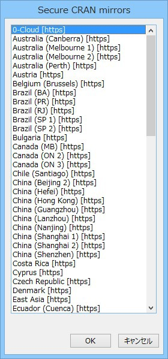

<br>

---
# **3　事前インストールについて**
一部のパッケージにおいて、インストールの際に必要となるパッケージがあります。  
下記に挙げる「remotes」「drat」「devtools」パッケージについて、手順に従い、事前にインストールしておきます。  

<br>

---
## **3．1　remotes のインストール**
下記のコマンドをR コンソールより実行します。  
```
> install.packages("remotes")
```

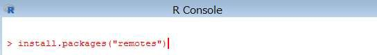

<br>

インストールが完了すると、下記の内容が表示されます。  


<br>

---
## **3．2　drat のインストール**
下記のコマンドをR コンソールより実行します。  
```
> install.packages("drat")
```


<br>

インストールが完了すると、下記の内容が表示されます。


<br>

---
## **3．3　devtools のインストール**
下記のコマンドをR コンソールより実行します。  
```
> install.packages("devtools")
```


<br>

下図の画面が表示されたら、「はい」をクリックします。  

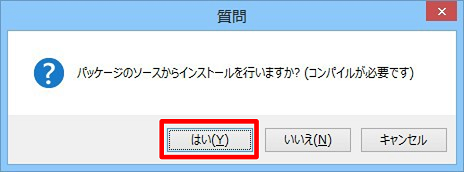

<br>

インストールが完了すると、下記の内容が表示されます。  


<br>

以上で以前インストールは完了となります。  
これよりパッケージ毎の個別のインストール手順となります。  
各パッケージのインストールには、ファイルのダウンロードも含め、5～10 分程度の時間が必要となります。  

<br>

---
# **4　HADES パッケージのインストール**
## **4．1　CohortMethod のインストール**
下記のコマンドをR コンソールより実行します。（「remotes」パッケージが必要です）  
```
> remotes::install_github("ohdsi/CohortMethod")
```


<br>

下図の画面が表示されたら、「1」を入力します。  

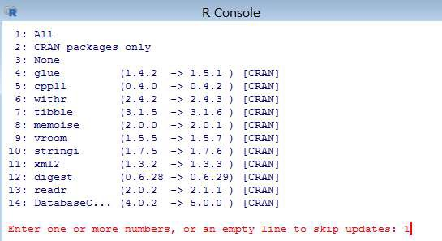

<br>

下図の画面が表示されたら、「はい」を選択します。  


<br>

インストールが完了すると、下記の内容が表示されます。  


<br>

---
## **4．2　SelfControlledCaseSeries のインストール**
下記のコマンドをR コンソールより実行します。（「remotes」パッケージが必要です）  
```
> remotes::install_github("ohdsi/SelfControlledCaseSeries")
```


<br>

インストールが完了すると、下記の内容が表示されます。


<br>

---
## **4．3　SelfControlledCohort のインストール**
下記のコマンドをR コンソールより実行します。（「remotes」パッケージが必要です）  
```
> remotes::install_github("ohdsi/SelfControlledCohort")
```


<br>

インストールが完了すると、下記の内容が表示されます。  

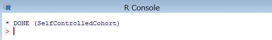

<br>

---
## **4．4　EvidenceSynthesis のインストール**
下記のコマンドをR コンソールより実行します。  
```
> install.packages("EvidenceSynthesis")
```


<br>

インストールが完了すると、下記の内容が表示されます。  

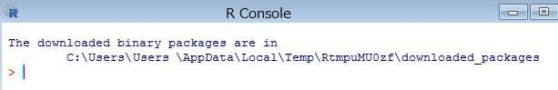

<br>

---
## **4．5　PatientLevelPrediction のインストール**
下記のコマンドをR コンソールより実行します。（「drat」パッケージが必要です）  
```
> drat::addRepo("OHDSI")
```


<br>

続けて、下記のコマンドをR コンソールより実行します。  
```
> install.packages("PatientLevelPrediction")
```


<br>

下図の画面が表示されたら、「はい」をクリックします。


<br>

インストールが完了すると、下記の内容が表示されます。  

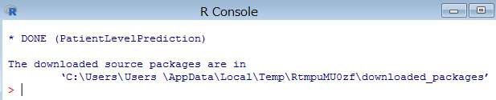

<br>

---
## **4．6　EmpiricalCalibration のインストール**
下記のコマンドをR コンソールより実行します。  
```
> install.packages("EmpiricalCalibration")
```

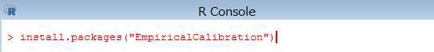

<br>

インストールが完了すると、下記の内容が表示されます。  


<br>

---
## **4．7　MethodEvaluation のインストール**
下記のコマンドをR コンソールより実行します。（「remotes」パッケージが必要です）  
```
> remotes::install_github("ohdsi/MethodEvaluation")
```

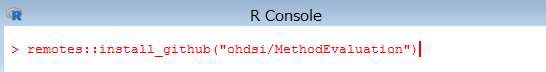

<br>

インストールが完了すると、下記の内容が表示されます。  


<br>

---
## **4．8　CohortDiagnostics のインストール**
下記のコマンドをR コンソールより実行します。（「remotes」パッケージが必要です）  
```
> remotes::install_github("OHDSI/CohortDiagnostics")
```

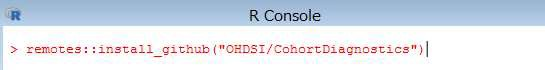

<br>

下図の画面が表示されたら、「1」を入力します。  


<br>

下図の画面が表示されたら、「はい」をクリックします。  


<br>

インストールが完了すると、下記の内容が表示されます。  

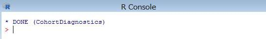

<br>

---
## **4．9　Cyclops のインストール**
下記のコマンドをR コンソールより実行します。  
```
> install.packages("Cyclops")
```

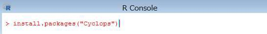

<br>

インストールが完了すると、下記の内容が表示されます。


<br>

---
## **4．10　DatabaseConnector のインストール**
下記のコマンドをR コンソールより実行します。  
```
> install.packages("DatabaseConnector")
```

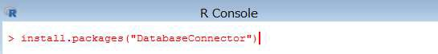

<br>

インストールが完了すると、下記の内容が表示されます。  

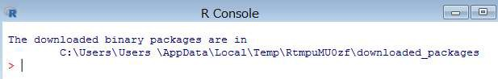

<br>

---
## **4．11　SqlRender のインストール**
下記のコマンドをR コンソールより実行します。  
```
> install.packages("SqlRender")
```

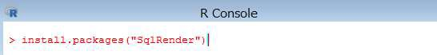

<br>

インストールが完了すると、下記の内容が表示されます。


<br>

---
## **4．12　ParallelLogger のインストール**
下記のコマンドをR コンソールより実行します。  
```
> install.packages("ParallelLogger")
```

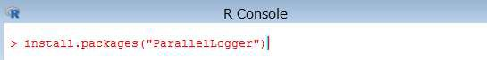

<br>

インストールが完了すると、下記の内容が表示されます。


<br>

---
## **4．13　FeatureExtraction のインストール**
下記のコマンドをR コンソールより実行します。（「drat」パッケージが必要です）  
```
> drat::addRepo("OHDSI")
```


<br>

続いて、下記のコマンドをR コンソールより実行します。  
```
> install.packages("FeatureExtraction")
```

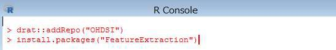

<br>

インストールが完了すると、下記の内容が表示されます。  

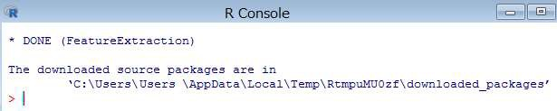

<br>

---
## **4．14　Andromeda のインストール**
下記のコマンドをR コンソールより実行します。（「devtools」パッケージが必要です）  
```
> devtools::install_github("ohdsi/Andromeda")
```


<br>

インストールが完了すると、下記の内容が表示されます。


<br>

---
## **4．15　BigKnn のインストール**
下記のコマンドをR コンソールより実行します。（「remotes」パッケージが必要です）  
```
> remotes::install_github("ohdsi/BigKnn")
```

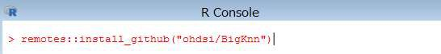

<br>

インストールが完了すると、下記の内容が表示されます。

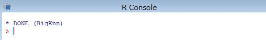

<br>

## **4．16　ROhdsiWebApi のインストール**
下記のコマンドをR コンソールより実行します。（「remotes」パッケージが必要です）
```
> remotes::install_github("OHDSI/ROhdsiWebApi")
```

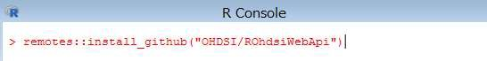

<br>

インストールが完了すると、下記の内容が表示されます。  


<br>

---
## **4．17　OhdsiSharing のインストール**
下記のコマンドをR コンソールより実行します。（「drat」パッケージが必要です）  
```
> drat::addRepo("OHDSI")
```


<br>

続けて、下記のコマンドをR コンソールより実行します。  
```
> install.packages("OhdsiSharing")
```

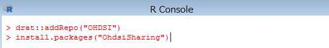

<br>

インストールが完了すると、下記の内容が表示されます。  


<br>

---
## **4．18　Hydra のインストール**
下記のコマンドをR コンソールより実行します。（「remotes」パッケージが必要です）  
```
> remotes::install_github("ohdsi/Hydra")
```


<br>

インストールが完了すると、下記の内容が表示されます。

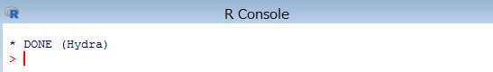

<br>

---
## **4．19　Eunomia のインストール**
下記のコマンドをR コンソールより実行します。（「devtools」パッケージが必要です）  
```
> devtools::install_github("ohdsi/Eunomia")
```

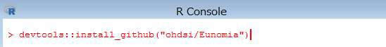

<br>

インストールが完了すると、下記の内容が表示されます。


<br>

---
## **4．20　CirceR のインストール**
下記のコマンドをR コンソールより実行します。（「remotes」パッケージが必要です）  
```
> remotes::install_github("ohdsi/CirceR")
```

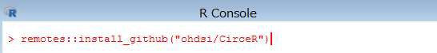

<br>

インストールが完了すると、下記の内容が表示されます。  


<br>

---
# **5　オフラインインストールについて**
オフライン環境の端末にHADES パッケージのセットアップを行う場合、HADES パッケージのインストールが完了した端末において、インストールされたパッケージ情報からダウンロード対象とするパッケージを指定し、必要なファイルをダウンロードします。  
ファイルダウンロード後、オフライン環境の端末にファイルを移設し、パッケージのインストールを実施する手順となります。  

<br>

---
## **5．1　ダウンロードの準備**
下記のコマンドをR コンソールより実行します。  
```
> install.packages("miniCRAN")
```

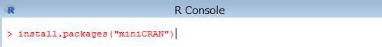

<br>

インストールが完了すると、下記の内容が表示されます。  


<br>

続いて、下記のコマンドをR コンソールより実行します。
```
> install.packages("igraph")
```
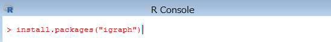

<br>

インストールが完了すると、下記の内容が表示されます。


<br>

インストール完了後、下記コマンドをR コンソールより実行します。  
```
> library(miniCRAN)
> library(tools)
```


<br>

ダウンロード先のフォルダを準備しておきます。  
以降の例では「c:\tmp\R_pkgs\download\」にダウンロードファイルを格納する想定としています。  


<br>

---
## **5．2　パッケージの指定・ダウンロード（１）**
※以下の手順は「EvidenceSynthesis」「EmpiricalCalibration」「Cyclops」「DatabaseConnector」「SqlRender」「ParallelLogger」「Andromeda」を対象としています。  
下記のコマンドをR コンソールより実行します。  
```
> setwd(.libPaths())
```


<br>

続いて、下記のコマンドをR コンソールより実行し、ファイルリストを取得するパッケージを指定します。（ここでは「EvidenceSynthesis」を指定しています）
```
> pkgname <- c("EvidenceSynthesis")
> pkgs <- pkgDep(pkgname)
```


<br>

続いて、下記のコマンドをR コンソールより実行し、パッケージをダウンロードする先のフォルダ名を指定します。  
※フォルダを作成してからコマンドを実行してください。  
```
> setwd("C:\\tmp\\R_pkgs\\")
```


<br>

下記のコマンドをR コンソールより実行し、パッケージをダウンロードします。
```
> download.packages(pkgs, destdir="download\\", type="win.binary")
```

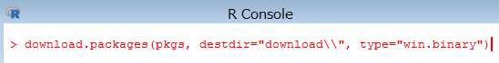

<br>

指定したフォルダにファイルがダウンロードされます。


<br>

R コンソールから実行するコマンド「pkgname <- c("[パッケージ名]")」における[パッケージ名]の部分を変更して実行することで、別のパッケージの準備もできます。  
また、格納先フォルダは、同一のフォルダのままで構いません。（複数のパッケージ情報を１つのフォルダにまとめて格納する事ができます）

<br>

---
## **5．3　パッケージの指定・ダウンロード（２）**
※以下の手順は「CohortMethod」「SelfControlledCaseSeries」「SelfControlledCohort」「PatientLevelPrediction」「MethodEvaluation」「CohortDiagnostics」「FeatureExtraction」「BigKnn」「ROhdsiWebApi」「OhdsiSharing」「Hydra」「Eunomia」「CirceR」を対象としています。  

下記のコマンドをR コンソールより実行します。  
```
> setwd(.libPaths())
```


<br>

続けて、下記のコマンドをR コンソールより実行し、ファイル格納先フォルダを指定します。
```
> wfld <- "c:\\tmp\\R_pkgs\\"
> sfld <- "download\\"
```


<br>

下記のコマンドをR コンソールより実行し、ダウンロードしたパッケージを圧縮して指定のフォルダに格納します。
```
> zip(paste0(wfld,sfld,"CohortMethod",".zip"),"CohortMethod")
```

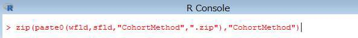

<br>

対象のファイルが圧縮されます。


<br>

次に、パッケージの依存関係を取得するため、下記のコマンドをR コンソールより実行します。  
```
> pdb <- addPackageListingGithub(pdb=available.packages(),"ohdsi/CohortMethod")
> bpkgs <- package_dependencies(packages="CohortMethod",pdb,which="Depends")[[1]]
> pkgs <- pkgDep(bpkgs)
```


<br>

続けて、下記のコマンドをR コンソールより実行し、パッケージをダウンロードする先のフォルダ名を指定します。
※フォルダを作成してからコマンドを実行してください。
```
> setwd("C:\\tmp\\R_pkgs\\")
```


<br>

続けて、下記のコマンドをR コンソールより実行し、パッケージをダウンロードします。  
```
> download.packages(pkgs, destdir="download\\", type="win.binary")
```

<br>

必要なファイルが、指定したフォルダにダウンロードされます。

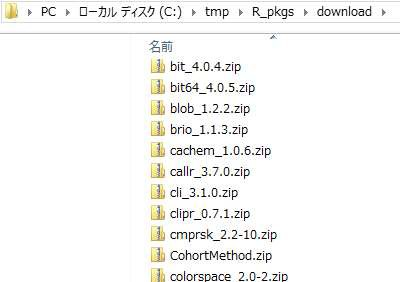

<br>

5．2　の手順と同様に、R コンソールから実行する下記コマンドの [パッケージ名]の部分を変更して実行することで、別のパッケージの準備もできます。
格納先フォルダも、５．２ の手順と同一のフォルダのままで構いません（複数のパッケージ
情報を１つのフォルダにまとめて格納する事ができます）。
```
> zip(paste0(wfld,sfld,"[パッケージ名]",".zip"),"[パッケージ名]")
> pdb <- addPackageListingGithub(pdb=available.packages(),"ohdsi/[パッケージ名]")
> bpkgs <- package_dependencies(packages="[パッケージ名]",pdb,which="Depends")[[1]]
```
---
## **5．4　パッケージの複写・インストール**
5.2・5.3 の手順で準備したファイルをオフライン環境の端末の任意のフォルダへコピーします。  
以降の例では「d:\tmp\R_pkgs\download\」にファイルをコピーした想定としています。  

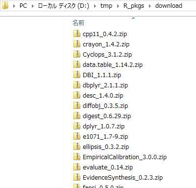

<br>

下記のコマンドをR コンソールから実行し、コピーしたファイルのリストを作成します。
```
> zipdir <- 'd:\\tmp\\R_pkgs\\download
> ziplist <- list.files(zipdir, pattern=".zip", recursive=T)
> pkglist <- as.character(lapply(ziplist, function(f) { paste(zipdir, '\\', f, sep="") }))
```


<br>

続いて、下記のコマンドをR コンソールから実行し、作成したリストに含まれるファイル（パッケージ）をインストールします。  
```
> install.packages(pkglist, repos = NULL, type="win.binary")
```

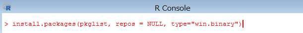

<br>

フォルダ内にあるパッケージが順次インストールされます。  


<br>

オフラインインストールの手順は以上となります。  

<br>

---
# **補足．R 実行環境のインストールについて**
## **1　Ｒのインストール**
下記のサイトにアクセスし、「Download R for Windows」、「base」の順にクリックし、下のスクリーンショットに示されている 「Download」 リンクをクリックします。（バージョン3.6.0 以降である必要があります）  

https://cran.r-project.org/  

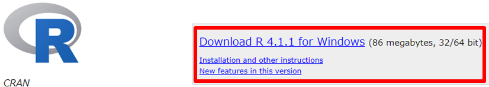
*出典：The R Foundation「The Comprehensive R Archive Network」*

<br>

ダウンロードが完了したら、「R-4.1.1-win.exe」実行します。  
言語の選択画面が出るので、「日本語」を選択して「OK」をクリックします。  

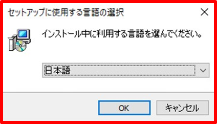

<br>

情報を読み終わった後、「次へ」をクリックします。


<br>

インストール先の設定画面で、デフォルトではProgramFiles へインストールする設定になっていますが、「C:\R\R-4.1.1」のフォルダに変更して「次へ」をクリックします。  


<br>

コンポーネントの選択について、「32bit Files」のチェックを外して「次へ」をクリックします。  


起動時のオプションはデフォルトのまま「次へ」をクリックします。


<br>

スタートメニューフォルダの指定についてもデフォルトのまま「次へ」をクリックします。  

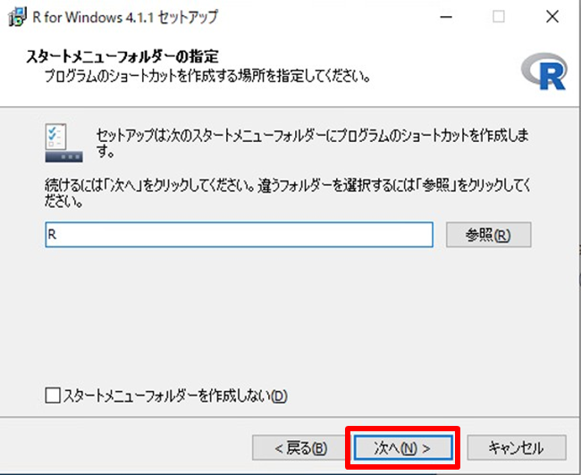

<br>

追加タスクの選択についてもデフォルトのまま「次へ」をクリックします。  


<br>

R のセットアップウィザード完了画面が出てくるので「完了」をクリックします。

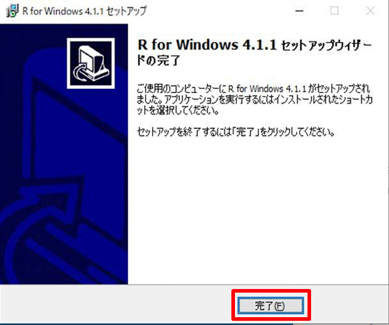

<br>

---
## **2　R tool のインストール**
下記のサイトにアクセスし、「Download R for Windows」、「Rtools」 の順にクリックし、RTools の最新バージョン（64-bit）を選択してダウンロードします。  

https://cran.r-project.org/


*出典：The R Foundation「The Comprehensive R Archive Network」*

<br>

ダウンロードが終了したら、ダブルクリックして実行します。  
インストール先の指定についてはデフォルトのまま「Next」をクリックします。  


<br>

追加タスクの選択についてもデフォルトのまま「Next」をクリックします。  


<br>

インストール開始画面が表示されるので、「Install」をクリックします。  


<br>

インストールが終了したので「FInish」をクリックします。  


<br>

---
## **3　R studio のインストール**
R studio のサイトにアクセスし、「Download」をクリックし、「DOWNLOAD RSTUDIO FOR WINDOWS」をクリックします。  

https://www.rstudio.com/


*出典：RStudio, PBC「RStudio」*

<br>

ダウンロード完了後、ファイルをダブルクリックして実行します。「次へ」をクリックします。  


<br>

インストール先のフォルダに「C:\RStudio」を指定して「次へ」をクリックします。  


<br>

スタートメニューフォルダの選択画面ですが、デフォルトのまま「インストール」をクリックし、インストールを開始します。  


<br>

インストールが終了したら、「完了」をクリックします。  


<br>

ここまでのインストールが完了したら、環境変数の設定を行います。  
スタートメニューを開いてR を起動し、R コンソールに以下のコマンドを入力します。  
```
> writeLines('PATH="${RTOOLS40_HOME}\\usr\\bin;${PATH}"', con = "~/.Renviron")
```


<br>

コマンド入力後、R コンソールを再起動して、下記のコマンドを入力します。  
```
> Sys.which(“make”)
```
下記のように表示されれば、環境変数の設定は完了です。
```
"C:\\rtools40\\usr\\bin\\make.exe"
```

<br>

以上でR 実行環境のインストールは完了となります。  