# **プロキシ 設定手順**

### **目次**
1． 本手順について  
2． Windows 環境変数  
3． GitBash 用プロキシ設定  
4． Apache Maven 用プロキシ設定  
5． R 用プロキシ設定  
6． R・devtools 用プロキシ設定  

---
## **1．本手順について**
プロキシ設定手順について説明します。  
本セットアップ手順では、以下の環境が準備されていることを前提としています。  
- Windows10（64 ビット）
- Java 8 Java Development Kit (JDK)

また本手順の設定で使用するツールのバージョンを以下に記載しています。  
最新版のツールの場合、画面構成等が異なる可能性があります。  

|ツール|本手順のバージョン|備考（バージョン指定など）|
|:---|---:|:---|
|Git|2.33.1||
|Apache Maven|3.8.3||
|R|4.1.1|3.6.0 以降|
|R tools|4||
|Rstudio|2021.09.1+ 372||

---
## **2．Windows 環境変数**
Windows 環境変数へ変数を追加します。  
なお、本手順で記載する<span style="color: orange; ">[proxy]</span></span>はプロキシサーバー名（またはアドレス）、<span style="color: orange; ">[port]</span>はポート番号に読み替えて入力を行ってください。  

「エクスプローラ」の「PC」を右クリックして、「プロパティ」を開きます。  

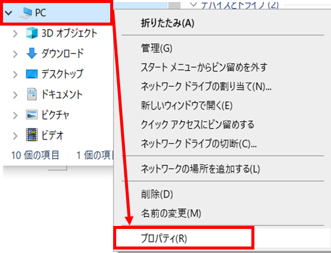

「システムの詳細設定」内の「環境変数」をクリックします。  

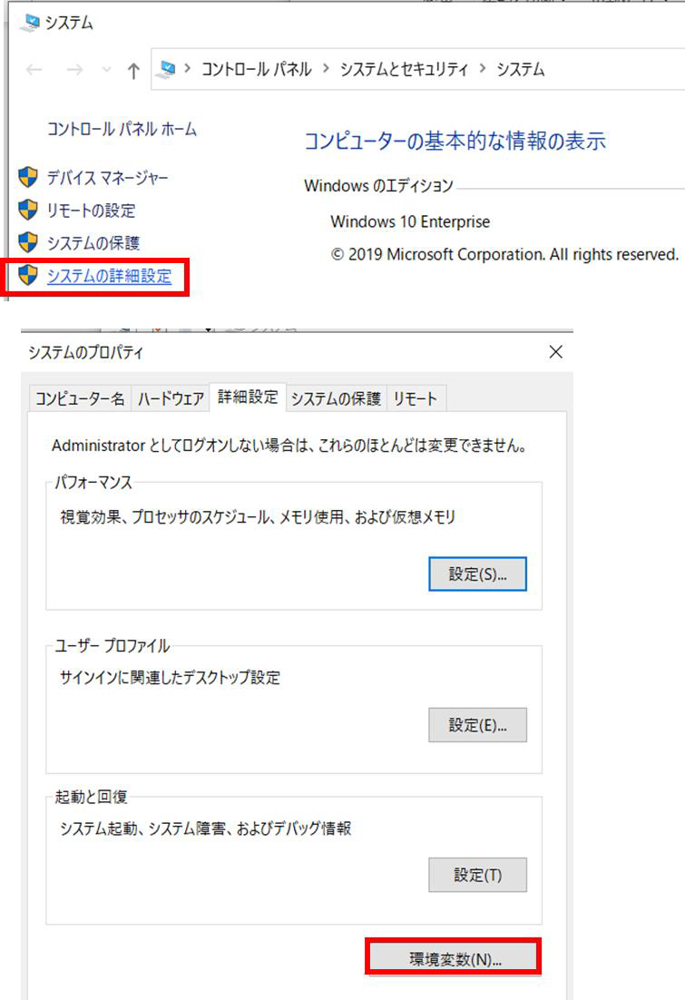

「システム環境変数」の「新規」をクリックして、以下の２つの変数を新たに追加します。作成後、「OK」をクリックします。
- 変数名：http_proxy
- 変数値：http://<span style="color: orange; ">[proxy]</span>:<span style="color: orange; ">[port]</span>
- 変数名：https_proxy
- 変数値：http://<span style="color: orange; ">[proxy]</span>:<span style="color: orange; ">[port]</span>　　　※http_proxy と同じ値

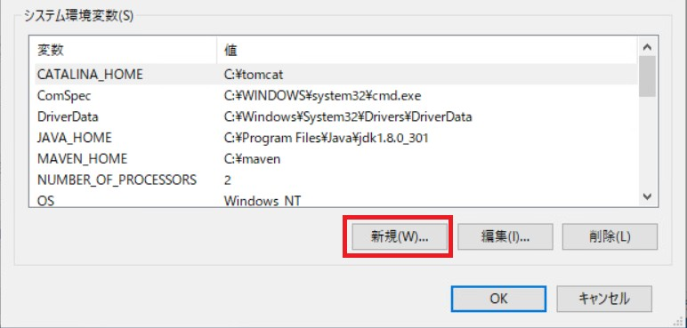
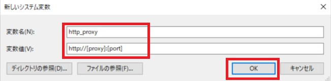
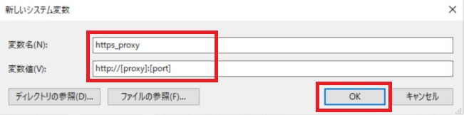

「システム環境変数」内に新たに  
http_proxy=http://<span style="color: orange; ">[proxy]</span>:<span style="color: orange; ">[port]</span>  
https_proxy=http://<span style="color: orange; ">[proxy]</span>:<span style="color: orange; ">[port]</span>  
が追加されていることを確認します。  

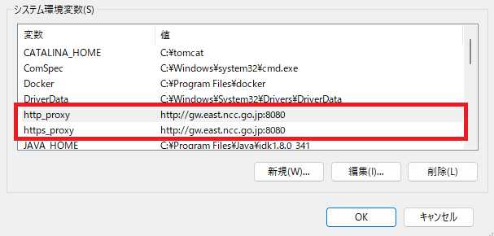

## **3． GitBash 用プロキシ設定**
Atlas セットアップ手順「3.5 WebAPI の構築」で、「OHDSI」フォルダを作成後、「git clone」などのコマンドを実行する前に実行します。  
スタートメニューからGit Bash を起動し、下記コマンドを実行します。  
```
$ git config --global http.proxy http://[proxy]:[port]
```

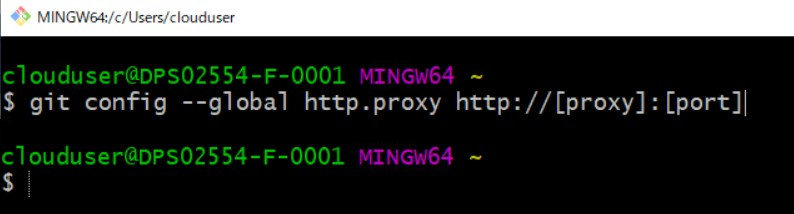

---
## **4．Apache Maven 用プロキシ設定**
Apache Maven インストールフォルダ(本手順では「c:\maven」)にある「conf」フォルダ内の「settings.xml」ファイルを開き、下記の設定行を追加します。  

＜下記の設定行を「settings.xml」に追加＞
```
<proxy>
<active>true</active>
<protocol>http</protocol>
<host>[proxy]</host>
<port>[port]</port>
</proxy>
```

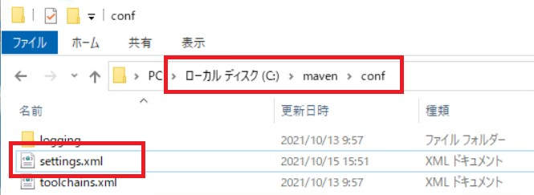

＜修正前＞
```
<!-- proxies
| This is a list of proxies which can be used on this machine to connect to the network.
| Unless otherwise specified (by system property or command-line switch), the first proxy
| specification in this list marked as active will be used.
|-->
<proxies>
<!-- proxy
| Specification for one proxy, to be used in connecting to the network.
|
<proxy>
<id>optional</id>
<active>true</active>
<protocol>http</protocol>
<username>proxyuser</username>
<password>proxypass</password>
<host>proxy.host.net</host>
<port>80</port>
<nonProxyHosts>local.net|some.host.com</nonProxyHosts>
</proxy>
-->
</proxies>
```

＜修正後＞
```
<!-- proxies
| This is a list of proxies which can be used on this machine to connect to the network.
| Unless otherwise specified (by system property or command-line switch), the first proxy
| specification in this list marked as active will be used.
|-->
<proxies>

    <proxy>
    <active>true</active>
    <protocol>http</protocol>
    <host>[proxy]</host>
    <port>[port]</port>
    </proxy>

<!-- proxy
| Specification for one proxy, to be used in connecting to the network.
|
<proxy>
<id>optional</id>
<active>true</active>
<protocol>http</protocol>
<username>proxyuser</username>
<password>proxypass</password>
<host>proxy.host.net</host>
<port>80</port>
<nonProxyHosts>local.net|some.host.com</nonProxyHosts>
</proxy>
-->
</proxies>
```

---
## **5．Ｒ用プロキシ設定**
Atlas セットアップ手順「4.3 R studio のインストール」で実施します。  
R インストール後に１回のみ実施してください。  
スタートメニューを開き、Ｒコンソールを起動します。  
コンソールに以下のコマンドを入力します。

```
> file.edit('~/.Renviron')
```

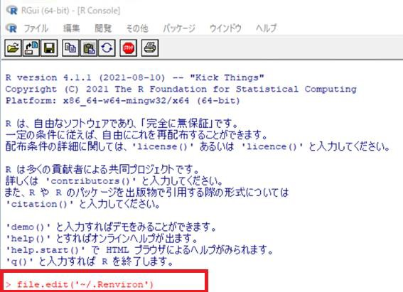

R エディタが起動しますので、以下２行を追加します。
```
http_proxy="http://[proxy]:[port]"
https_proxy="http://[proxy]:[port]"
```

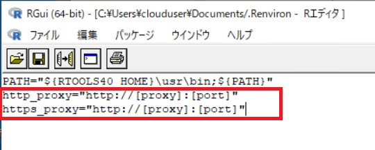

入力後、×ボタンでR エディタ画面を閉じます。  
変更内容の保存確認メッセージが表示されますので、「はい」をクリックします。  

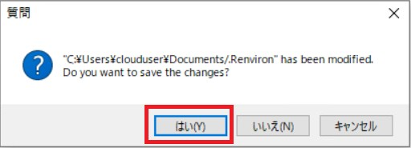

Atlas 手順「4.3 R studio のインストール」の手順を、続けて実行してください。  

## **6．R・devtools 用プロキシ設定**
Atlas セットアップ手順「4.4 Achilles インストール」で実施します。
スタートメニューを開き、Ｒコンソールを起動します。  
以下のコマンドを入力します。  
```
> library(devtools)
```

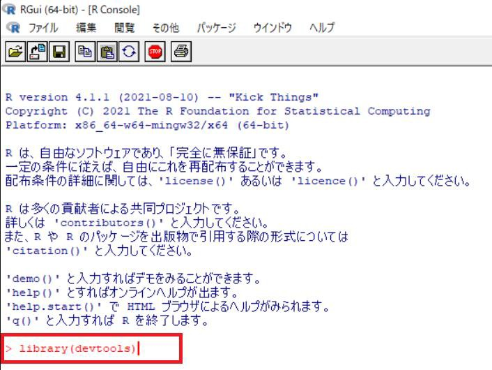


続けて以下コマンドを入力します。
```
> library(httr)
> set_config(use_proxy(url="http://[proxy]", port=[port],))
```

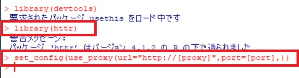

Atlas 手順「4.3 R studio のインストール」のAchilles インストール手順を、続けて実行してください。