# **Usagi 操作手順**

### **目次**
[1．概要](#1概要)
- [1－1．Usagi について](#1－1usagiについて)
- [1－2．操作の流れ](#1－2操作の流れ)

[2．利用準備](#2利用準備)
- [2－1．Athena サイトからファイルをダウンロード](#2－1athenaサイトからファイルをダウンロード)
- [2－2．ソースデータの準備](#2－2ソースデータの準備)

[3．Usagiの起動・初期準備](#3usagiの起動・初期準備)
- [3－1．Usagi の起動](#3－1usagiの起動)
- [3－2．Author の設定](#3－2authorの設定)
- [3－3．Index の作成指示](#3－3indexの作成指示)

[4．Usagi の起動・ソースデータの取込](#4usagiの起動・ソースデータの取込)
- [4－1．ソースデータの取込](#4－1ソースデータの取込)
- [4－2．マッピング設定画面の項目説明](#4－2マッピング設定画面の項目説明)

[5．マッピング作業](#5マッピング作業)
- [5－1．マッピング結果画面の表示内容](#5－1マッピング結果画面の表示内容)
- [5－2．マッピング作業](#5－2マッピング作業)
- [5－3．マッピング候補の検索](#5－3マッピング候補の検索)
- [5－4．コメントの入力](#5－4コメントの入力)
- [5－5．参考）CONCEPT の親子関係を確認する方法](#5－5参考conceptの親子関係を確認する方法)

[6．承認作業](#6承認作業)
- [6－1．承認](#6－1承認)
- [6－2．承認解除](#6－2承認解除)

[7．作業状況の保存、読込](#7作業状況の保存読込)
- [7－1．作業状況の保存](#7－1作業状況の保存)
- [7－2．作業状況の読込](#7－2作業状況の読込)

[8．マッピングデータの出力](#8マッピングデータの出力)
- [8－1．マッピングデータの出力手順](#8－1マッピングデータの出力手順)
- [8－2．出力データ補足](#8－2出力データ補足)

[9．参考）マッピング手順例](#9参考マッピング手順例)

 

---
# **1．概要**
## **1－1．Usagi について**
Usagi は独自に定義した各種項目（薬品、病名など）を CONCEPT テーブルへマッピングするための補助ツールとなります。

Athena サイトからダウンロードした CONCEPT テーブルや、マッピング元となるローカルデータを入力として、それらを紐づけた CSV ファイル「SOURCE_TO_CONCEPT_MAP」を出力できます。

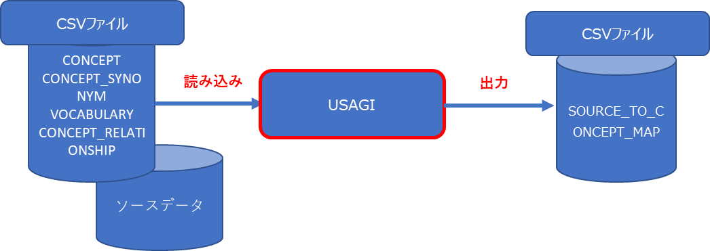  

※当手順では、マッピング元となるデータについて、以下の呼称を用います。
- ソースデータ  
元システムで登録・利用されているデータ群。

- ソースコード  
元システムで薬品名・病名などに付与されている管理番号。

- ソースネーム  
元システムの薬品名・病名などを英訳した名称。マッピング対象となる項目。

 

---
## **1－2．操作の流れ**
マッピング操作の流れを下記に示します。
詳細な手順は各ボックス下部に記載されている章を参照してください。

  

 

---
# **2．利用準備**
## **2－1．Athena サイトからファイルをダウンロード**
Usagi を利用するにあたり、下記の CONCEPT、および VOCABULARY の情報が必要となるため、Athena サイトで取得します。  
取得した以下4つのファイルは任意のフォルダにまとめて格納します。

- CONCEPT.CSV  
CONCEPT のコードと名称、その他の関連情報を定義

- CONCEPT_SYNONYM.CSV  
CONCEPT の別名と説明を定義

- VOCABULARY.CSV  
VOCABULARY のコードと名称、その他の関連情報を定義

- CONCEPT_RELATIONSHIP.CSV  
任意の2つの CONCEPT 間の直接的な関係と、関係の性質またはタイプを定義  

※Athena サイトで内容の更新があった場合は、都度、取得をしてください。

 

---
## **2－2．ソースデータの準備**
CONCEPT テーブルへのマッピング元情報となるソースデータを CSV 形式で準備します。
- CSV ファイルの1行目は項目名を記載したヘッダレコードとしてください。
- データレコードは2行目以降に記載します。
- 突合のための一意となるソースコード(※)、及びソースネーム(※)があれば、フォーマットに特に決まりはありません。
- ソースネームが英語以外の場合、あらかじめ英訳を行う必要があります。

それぞれのファイルの保存場所は任意となりますが、Usagi が配置されているフォルダに格納しておくと選択がしやすくなります。

 

---
# **3．Usagi の起動・初期準備**
## **3－1．Usagi の起動**
Usagi を起動します。  
起動手順は「Usagi セットアップ手順」を参照ください。

 

---
## **3－2．Author の設定**
Usagi v1.4 以降では起動時に Author の入力を求められます。  
Author はマッピング項目を「Approve」した際、「Status Provenance」項目に保持されます。  
任意の名称を入力してください。

  

「Remember me?」にチェックをいれて「Save」ボタンをクリックすると、名称が保存されます。  

 

ここで入力した名称は、Usagi 格納フォルダのテキストファイル「authorName.txt」に保存されます。  
名称を変更したい場合、テキストファイルを開いて直接修正します。

  

 

---
## **3－3．Index の作成指示**
Author 入力後、Index の作成指示を行う画面が表示されます。  
「Pick folder」ボタンをクリックすると、フォルダ選択の画面が表示されます。  

2－1 で Athena サイトから取得した4ファイルを格納したフォルダを指定し、「Select folder」ボタンをクリックします。

  

 

Vocabulary location に選択したフォルダが表示されてる事を確認し、「Build index」ボタンをクリックします。  
Index の作成が完了すると、メッセージ画面が表示されるので、Usagi を一度終了し、再度起動します。  
※Build index には長時間（2～3時間）要します。

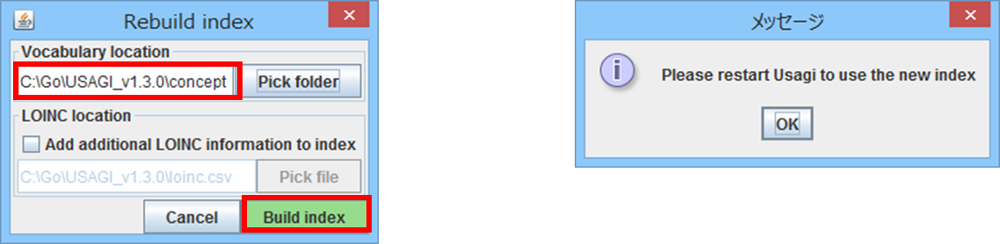  

 

Index の作成が完了すると、Usagi 格納フォルダ配下に以下フォルダ・ファイルが自動で作成されます。

  
※derivedIndex フォルダは、「4-1．ソースデータの取込」時に作成されます。  

 

※補足　Rebuild index について  
CONCEPT や VOCABULARY の内容に変更・更新があった場合等、Usagi の Index を再作成したい場合は、「Help」メニューより「Rebuild index」を選択する事で「3－3．Index の作成指示」を再度行う事が出来ます。

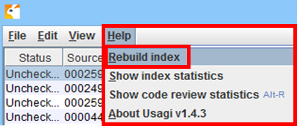  

 

---
# **4．Usagi の起動・ソースデータの取込**
## **4－1．ソースデータの取込**
Index の作成が完了したら、マッピング用のソースデータの取込を行います。  
Usagi を起動し、「File」メニューから「Import codes」を選択します。

  

 

ファイル選択の画面が表示されますので、2－2 で準備した、ソースデータの CSV ファイルを選択し、「開く」ボタンをクリックすると、データの取込が行われます。

  

 

---
## **4－2．マッピング設定画面の項目説明**
取込が完了するとマッピング設定画面が表示され、CSV ファイルの内容が表示されます。  
この画面で CONCEPT テーブルとのマッピング設定を行います。

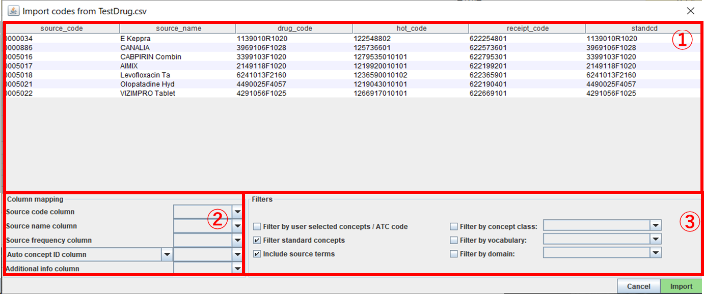  

① 取り込んだ CSV ファイルの内容が表示されます。

② Column mapping ソースデータに含まれる項目の参照指定を行います。  

  - Source code column  
元システムのソースコードが格納されている項目を選択します。

  - Source name column  
マッピング元となるソースネーム（英字の薬品名、病名など）が格納されている項目を選択します。（必須）

  - Source frequency column  
元システムでの当該項目の利用頻度情報の項目を選択します。  
参考情報のためマッピングには影響しません。

  - Auto concept ID column  
元システムにおいて既に CONCEPT_ID との紐付けが完了している場合、CONCEPT_ID との紐付けをする事でマッピング制限をかけます。

  - ATC column  
CONCEPT テーブルに登録された情報のうち、Vocabulary が「ATC」のものを対象としてマッピングを行います。  
※[Auto concept ID column]から[ATC column]に切り替えて項目を指定します。

  - Additional info column  
元システムでの当該項目の補足情報（日本語の薬品名・病名や、マッピング時に参照したい情報など）の項目を選択します。  
複数項目選択できます。参考情報のためマッピングには影響しません。

③ Filters マッピングの際、CONCEPT テーブルのデータのマッピング対象条件の指定を行います。

  - Filter by user selected concepts / ATC code  
②で「Auto concept ID column」「ATC column」を指定した場合チェックします。

  - Filter standard concepts  
マッピング対象を、STANDARD CONCEPT に制限したい場合チェックします。

  - Include source terms
マッピング対象とする CONCEPT の絞り込みに、元システムの名称を含ませる場合チェックします。（基本的にチェックのままとしておく）

  - Filter by concept class  
マッピング対象とする CONCEPT CLASS を選択します。（※）

  - Filter by vocabulary  
マッピング対象とする VOCABULARY を選択します。（※）

  - Filter by domain  
マッピング対象とする DOMAIN を選択します。（※）  

※3－3 で作成した Index に含まれる内容が表示されますので、その内容から選択します。

ソースデータ項目の選択、及び Filters 設定を行った後、「Import」ボタンをクリックすると取込が行われます。（データ量により15～30分かかります）  
※具体的なマッピング手順の例は、「9．参考）マッピング手順例」を参照ください。

 

---
# **5．マッピング作業**
## **5－1．マッピング結果画面の表示内容**
取込が完了すると初期画面に戻り、取り込んだ内容が表示されます。

  

① マッピング結果が表示されます。

② Source code  
　①で選択したレコードについて、現在マッピング候補となっている CONCEPT の内容が表示されます。

③ Search  
　①で選択したレコードについて、その他の候補も含めた候補一覧が表示されます。

 

---
## **5－2．マッピング作業**
- **マッピング候補を追加する場合**  
下図の「③ Results」からレコードを選択し、「Add concept」ボタンをクリックします。

  

下図の「② Target concepts」に選択したレコードが追加されます。

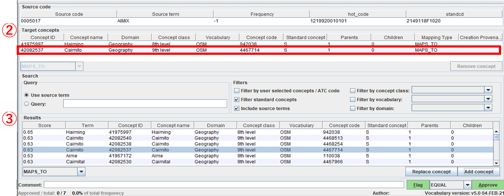  

 

- **マッピング候補を置き換える場合**  
下図の「③ Results」からレコードを選択し、「Replace concept」ボタンをクリックします。

  

下図の「② Target concepts」が選択したレコードと完全に置き換わります。

  

 

- **マッピング候補を削除する場合**  
下図の「② Target concepts」からレコードを選択し、「Remove concept」ボタンをクリックします。

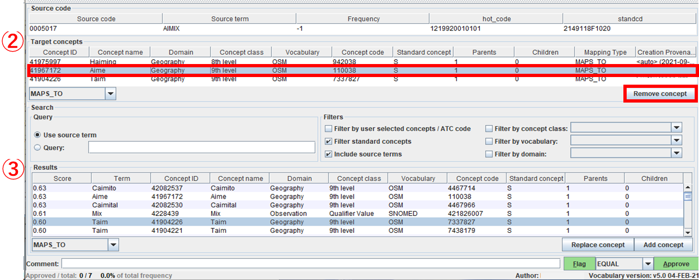  

下図の「② Target concepts」から選択したレコードが削除されます。

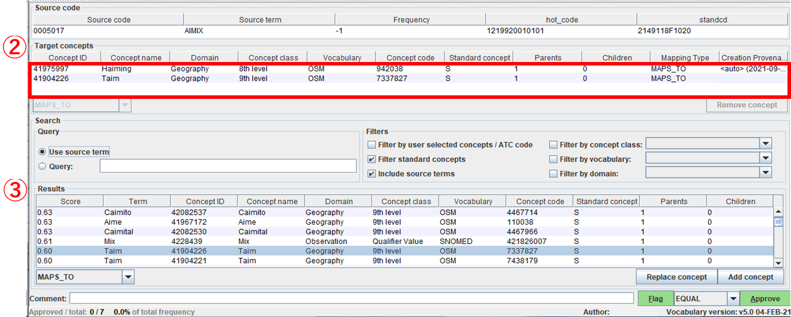  

 

---
## **5－3．マッピング候補の検索**
下図の「③ Search」条件を変更する事で、Result に表示されるレコードを変更できます。

  

※Filters 項目の詳細は「4－2．マッピング設定画面」を参照

「Query」にキーワードを入力する事で条件を追加して検索することも可能です。  
キーワードはあいまい検索されます。  
また、AND や OR などの演算子による複数単語検索は行えません。

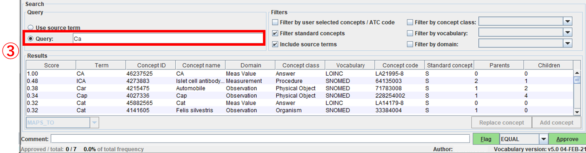  

 

---
## **5－4．コメントの入力**
備忘録を残したい場合、①から該当のレコードを選択し画面下部の Comment に入力します。  
入力内容は①に即時反映されます。

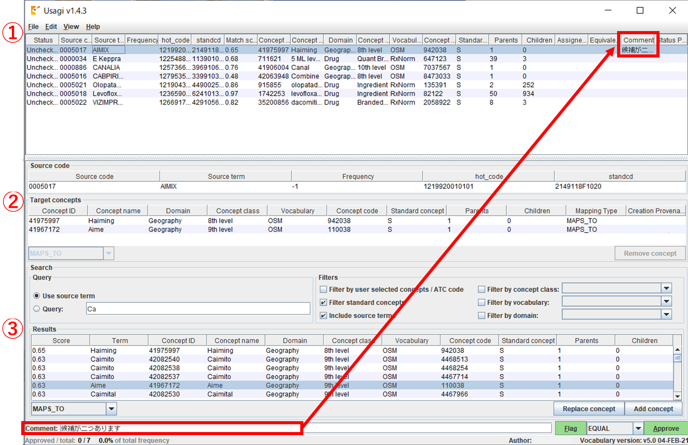  

 

---
## **5－5．参考）CONCEPT の親子関係を確認する方法**
マッピング時に以下操作で CONCEPT の親子関係を確認することができます。  
CONCEPT の補足情報となります。マッピング作業の参考にしてください。

 

下図の「② Target concepts」から親子関係を確認したいレコードを選択します。

  

 

「View」メニューから「Concept information」を選択します。

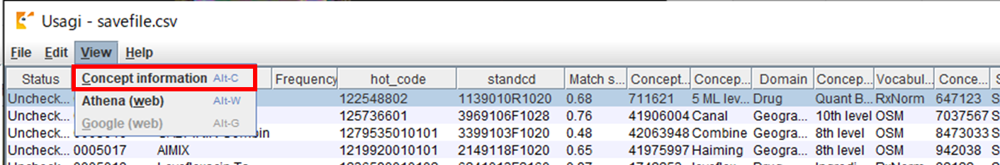  

 

選択した「④ Current concept」に対する親 CONCEPT の情報が「⑤ Parent concepts」へ、子 CONCEPT の情報が「⑥ Children concepts」へ表示されます。

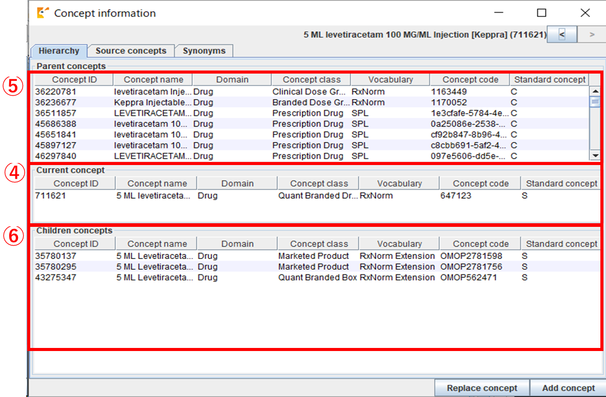  

 

---
# **6．承認作業**
## **6－1．承認**
候補の中から妥当な CONCEPT 情報を選択したら、①から承認したいレコードを選択します。

  

 

画面下部の「Approve」ボタンをクリックし、マッピング内容を承認します。

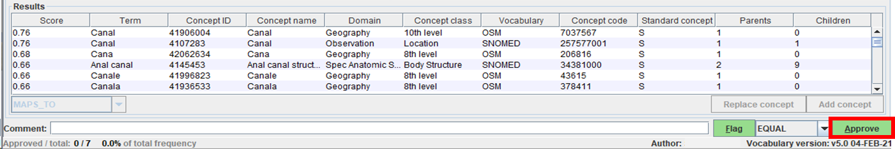  

 

承認済みデータは①の Status / Equivalence /Status Provenance などに値がセットされ、背景色が緑になります。

  

 

---
# **6－2．承認解除**
承認済みデータを解除したい場合、①から解除対象のレコードを選択します。

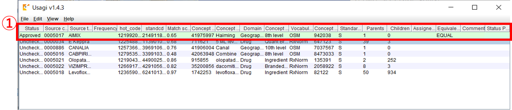  

 

画面下部の「Unapprove」ボタンをクリックし、マッピング内容の承認を解除します。

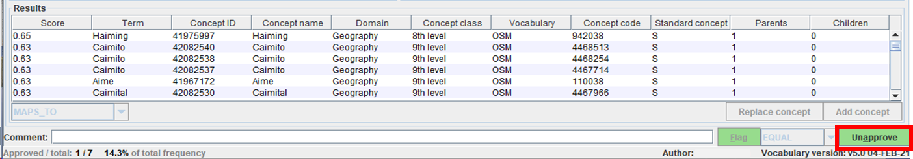  

 

画面①の該当レコードの承認状態が、未承認状態に戻ります。

  

 

---
# **7．作業状況の保存、読込**
## **7－1．作業状況の保存**
マッピングの途中で作業を中断したい場合などに、作業状況を保存することが可能です。  
「File」メニューから「Save」を選択します。

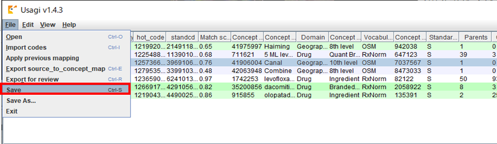  

 

ファイル保存の画面が表示されます。  
任意の場所、任意のファイル名を指定し「保存」ボタンをクリックすると作業状況の保存が行われます。

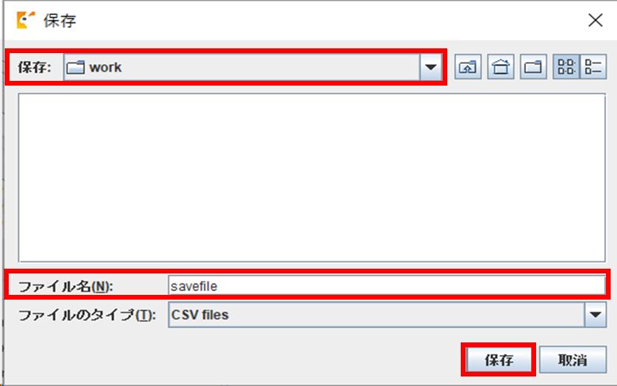  

 

---
## **7－2．作業状況の読込**
保存済みのファイルから作業状況を読み込みます。  
Usagi を起動し、「File」メニューから「Open」を選択します。

  

 

ファイル選択の画面が表示されますので、7－1 で保存した CSV ファイルを選択し、「開く」ボタンをクリックすると、データの読み込みが行われます。

  

 

読み込みが完了すると前回保存時の状態で画面が表示されます。  
保存した状態の続きから作業を再開できます。

  

 

---
# **8．マッピングデータの出力**
## **8－1．マッピングデータの出力手順**
マッピング結果を出力する場合は、「File」メニューより「Export source_to_concept_map」を選択します。

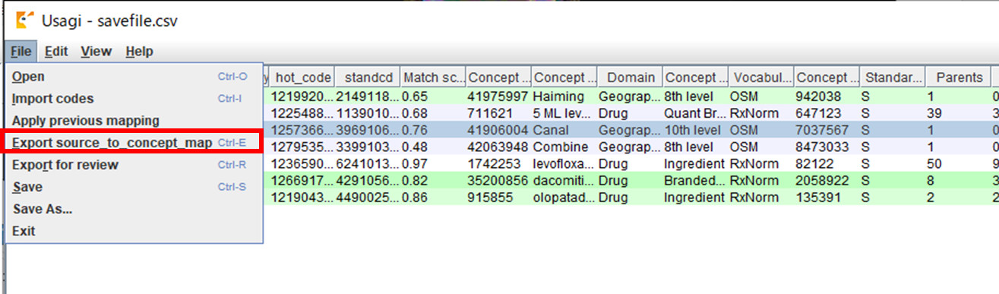  

 

出力確認メッセージが表示されます。  
出力したい内容に合わせボタンをクリックします。

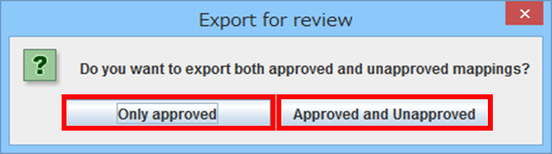  

- Only approved  
承認済みレコードのみ出力
- Approved and Unapproved  
承認済み及び未承認レコードを出力

次に、「Source_vocabulary」の入力画面が表示されます。  
出力データの「source_vocabulary_id」列に出力する値を指定し、「Export」ボタンをクリックします。  
※1回の CSV ファイル出力について、1種類しか指定できないため出力単位を考慮する必要があります。

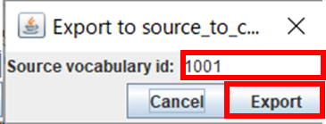  

 

最後に出力先フォルダとファイル名を入力し、「保存」ボタンを押す事で CSV ファイルが出力されます。

  

 

---
## **8－2．出力データ補足**
出力データの内容  
出力データ（source_to_concept_map）の構成要素を下記に示します。

<!--    -->

|No|列名|説明|画面項目|
|:---|:---|:---|:---|
|1|source_code|元システムのソースコード　※マッピング設定で「Source code column」に指定した項目|➀Source code|
|2|source_concept_id|Source Concept への外部キー　※「0（未定義）」||
|3|source_vocabulary_id|EXPORT 時に「Source vocabulary id」に指定した項目||
|4|source_code_description|元システムのソースネーム　※マッピング設定で「Source name column」に指定した項目|➀Source term|
|5|target_concept_id|マッピング対象となった Concept ID|➀Concept ID|
|6|target_vocabulary_id|マッピング対象の Concept の Vocabulary id|➀Vocabulary|
|7|valid_start_date|マッピング例（当レコード）の開始日。初期値：1970/1/1||
|8|valid_end_date|マッピング例（当レコード）の終了日。初期値：2099/12/31||
|9|invalid reason|マッピング例（当レコード）の終了理由||

 

*CSV 出力例*

Usagi 画面項目と、出力される CSV ファイルとの項目の関連図は、下記の通りとなります。

  

 

---
# **9．参考）マッピング手順例**
Usagi による、具体的なマッピング手順の一例として、薬品をマッピングする手順の一例を以下に示します。

 

①ソースデータの準備  
  - 薬品の管理番号（ソースコード）と薬品英字名（ソースネーム）、マッピング作業時に参照したい情報を含むCSVデータを準備します。（【２－２．ソースデータの準備】に相当する内容となります）

  

 

②マッピング設定画面  
  - ソースデータのマッピング設定を行います。（【４．Usagi の起動・ソースデータの取込】に相当する内容となります）

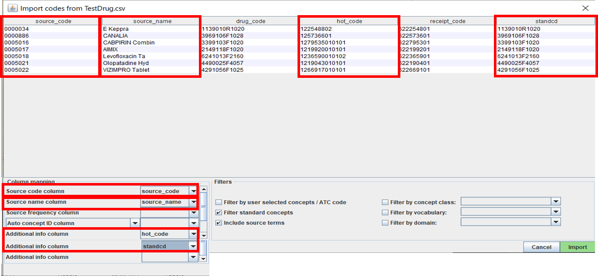  

赤枠で囲まれている「Source code column」「Source name column」をソースデータの項目から選択します。  
「Additional info column」は参考情報となりますので、必要に応じて選択します。  
「Import」ボタンをクリックすることで、ソースデータの取込、およびマッピングが実行されます。

 

③マッピング結果画面
- マッピング結果を確認し、必要に応じてマッピング候補を変更します。（【５．マッピング作業】に相当する内容となります）

  

当例では「VIZIMPRO Tablet」という英字薬品名に対し、「dacomitinib 15 MG Oral Tablet[Vizimpro]」がマッピングされました。  
画面下部の「Results」にはその他候補が表示されます。  

また、「Search」では「Query」や「Filters」の条件を再設定する事で、「Results」に表示される候補を再検索する事も可能です。  

マッピング結果が正しくないと判断された場合など、必要に応じて「Results」に表示された内容からマッピング候補の追加・入れ替えを行います。