# **Usagi セットアップ手順**

### **目次**
[1．本手順について](#1本手順について)  

[2．Usagiのセットアップ](#2usagiのセットアップ)  
- [2．1．Athenaへの会員登録](#21athenaへの会員登録)  
- [2．2．Usagiのインストール](#22usagiのインストール)  
- [2．3．Usagiの起動・停止](#23usagiの起動・停止)  
  - [2．3．1．Usagiの起動](#231usagiの起動)  
  - [2．3．2．Usagiの停止](#232usagiの停止)  

[参考：Athenaからのvocabularyの入手方法](#参考athenaからのvocabularyの入手方法)  

<br>

---
# 1．**本手順について**
Usagiをセットアップするための手順を説明します。  
本セットアップ手順は、以下の環境が準備されていることを前提としています。  
- Windows10（64ビット）  
- Java（バージョン1.8以降）

作業の所要時間は約1時間です。

<br>

---
# 2．**Usagiのセットアップ**
Usagiの動作環境を構築します。  
[<ins>GithubのOHDSI/Usagi</ins>](https://github.com/OHDSI/Usagi)にアクセスして、セットアップを進めていきます。  

  

<br>

---
# **2．1．Athenaへの会員登録**
[<ins>GithubのOHDSI/Usagi</ins>](https://github.com/OHDSI/Usagi)ページの［Getting Started］項目内の[<ins>Athena</ins>](https://athena.ohdsi.org/search-terms/start)（赤枠）をクリックします。  

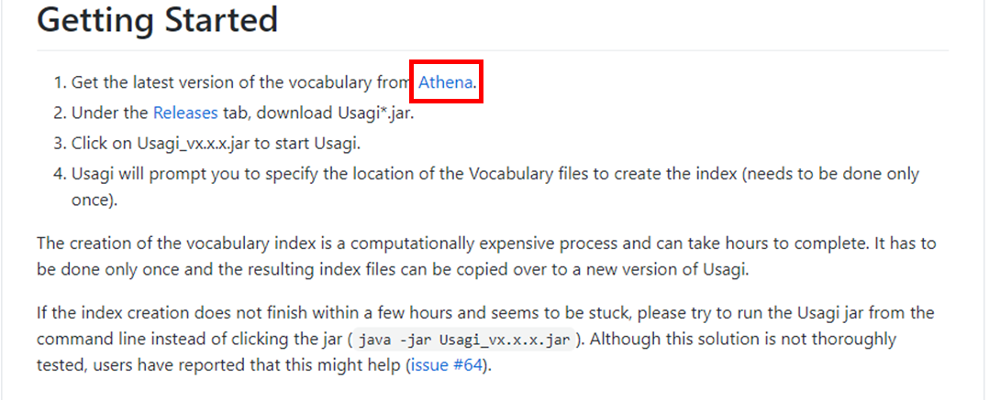  

<br>

右上の［LOGIN］をクリックします。  
Athenaを初めて使用する際には会員登録が必要です。  

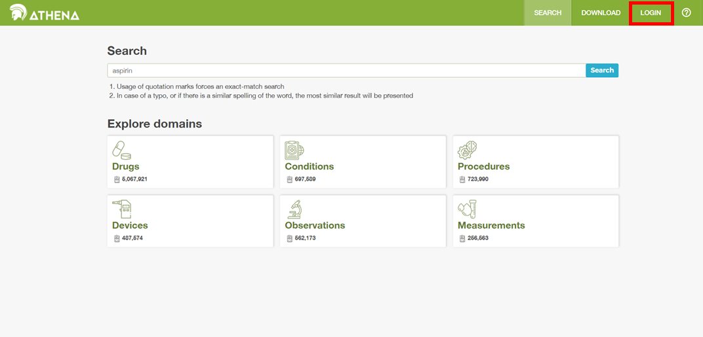  
*Odysseus Data Services, Inc. 「Athena」*  

<br>

会員登録後にログインし、各領域の語彙を入手することができるようになります。  

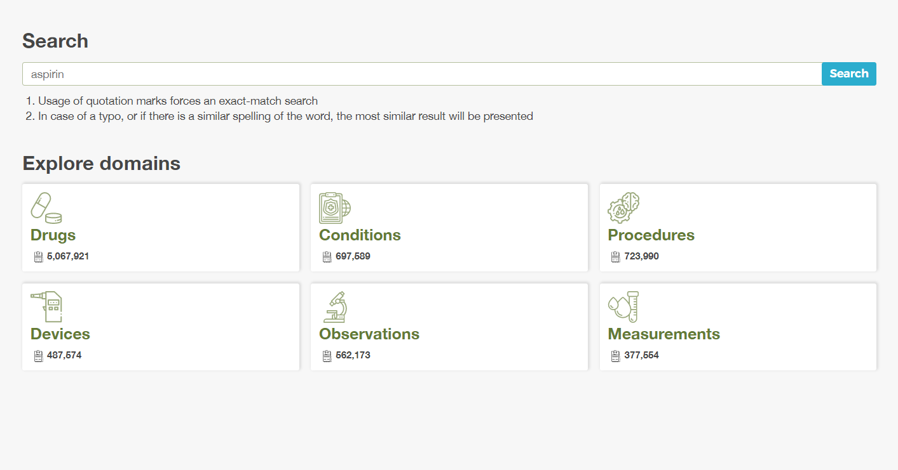  
*Odysseus Data Services, Inc. 「Athena」*  

<br>

---
# **2．2．Usagiのインストール**
[<ins>GithubのOHDSI/Usagi</ins>](https://github.com/OHDSI/Usagi)ページの［Getting Started］項目内の[<ins>Releases</ins>](https://github.com/OHDSI/Usagi/releases)（赤枠）をクリックします。  

  

<br>

Usagi_v1.4.3.jar（赤枠）をクリックし、ファイルをダウンロードします。  
（バージョンが異なる場合、参考資料とファイル名も異なるため注意してください。）  

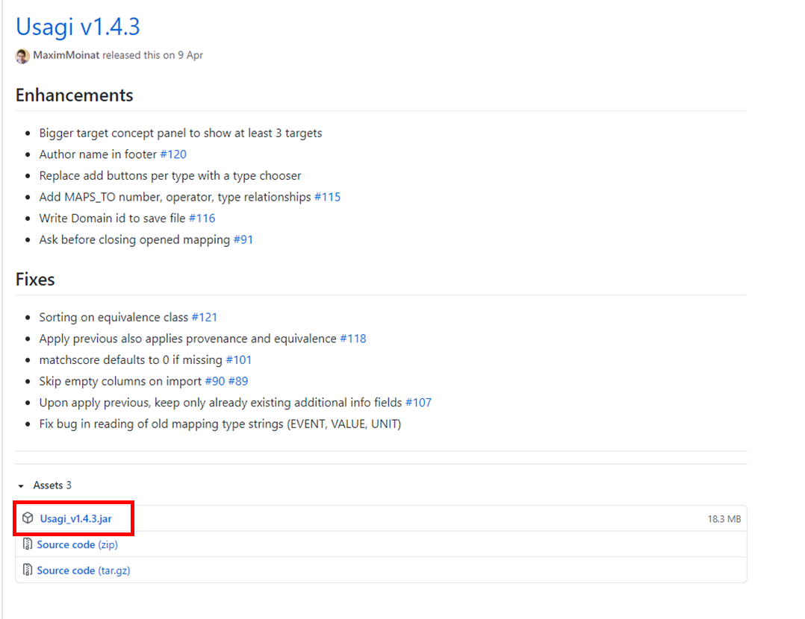  

<br>

ダウンロードしたファイルをクリックした後、「この種類のファイルはコンピューターに損害を与える可能性があります。」と表示されますが、「保存」をクリックし、任意の場所に保存します。

  

<br>

---
# **2．3．Usagiの起動・停止**
## **2．3．1．Usagiの起動**
Windows10の環境では、jarファイルを開くためにバッチを作成する必要があります。  
以下でバッチの作成とUsagiの起動について説明します。  
２．２．でダウンロードしたUsagiのjarファイルを任意のフォルダに格納します。  
同一フォルダ内に新規テキストを作成します。  

  

<br>

テキストを開き、
```
java -jar Usagi_v1.4.3.jar
```
を記載します。（Usagiのファイルのバージョンは必要に応じて変更してください）  

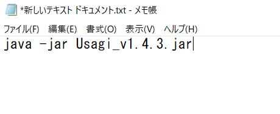  

<br>

テキストファイルの拡張子を .bat　に変更して保存します。（ファイル名は任意です）  

  

<br>

バッチファイルをダブルクリックすると、Usagiが起動します。  
起動時にAuthor記入欄が表示されます。Authorを指定する場合は任意の名前を入力し、［Save］をクリックしてください。  
指定しない場合は、［×］をクリックすると次の画面に遷移します。  

  

<br>

Authorを指定すると画面下（赤枠）にAuthorが表示されます。  
以上の操作でUsagiの起動は完了です。  
※Usagi起動時に、下図の様に「Rebuild index」と言う画面が表示されますが、ここでは「Cancel」をクリックしてください。  

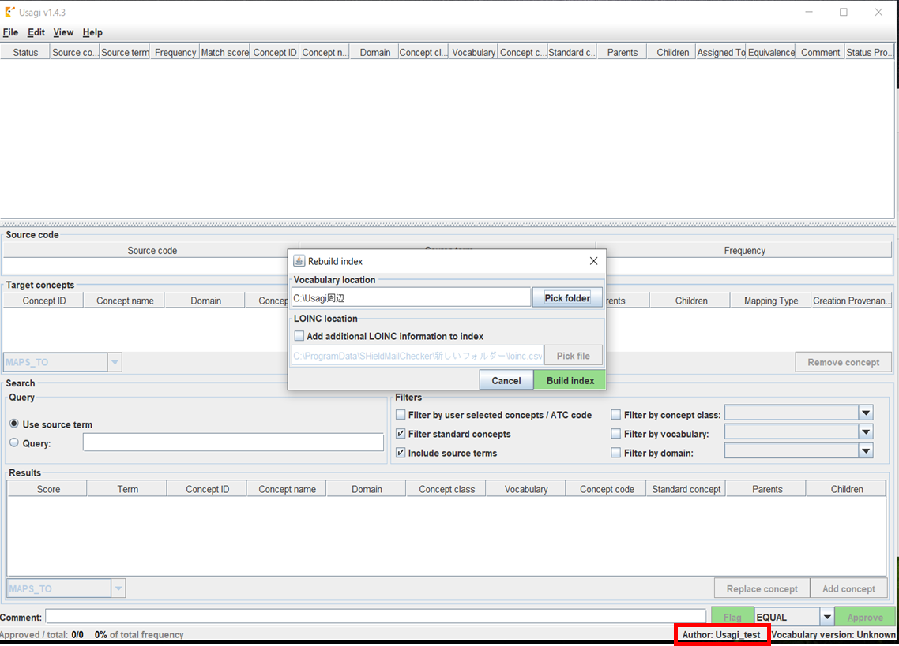  

<br>

---
## **2．3．2．Usagiの停止**
Usagiの画面左上の［File］タブ内の［Exit］（赤枠）をクリックしてUsagiを終了します。  

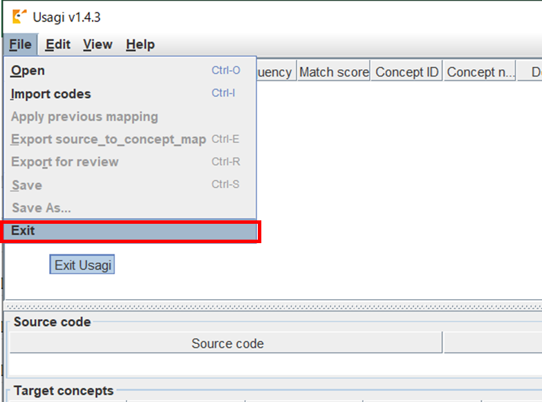  

<br>

---
# **参考：Athenaからのvocabularyの入手方法**
Athenaを開き、ログインします。
ログイン後、画面右上の［DOWNLOAD］をクリックします。  

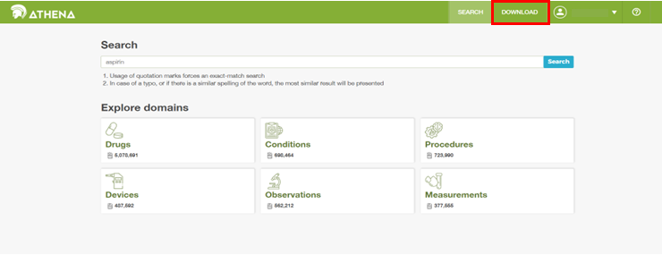  
*Odysseus Data Services, Inc. 「Athena」*  

<br>

［DOWNLOAD]をクリックすると、以下の画面が表示されます。  

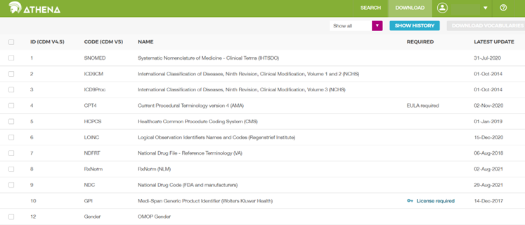  
*Odysseus Data Services, Inc. 「Athena」*  

<br>

本書では以下のvocabularyのダウンロードを実施しています。  
各研究に応じて、ダウンロードするvocabularyは取捨選択してください。  
注意：「Required」欄に「License required」と記載があるvlcabularyは、ダウンロード時にライセンスが求められる場合があります。  

| ID | CODE | NAME |
|---:|:---|:---|
| 1 | SNOMED | Systematic Nomenclature of Medicine - Clinical Terms (IHTSDO) |
| 2 | ICD9CM | International Classification |
| 3 | ICD9Proc | International Classification of Diseases, Ninth Revision, ClinicalModification, Volume 3 (NCHS) |
| 4 | CPT4 | Current Procedural Terminology version 4 (AMA) |
| 5 | HCPCS | Healthcare Common Procedure Coding System (CMS) |
| 6 |  LOINC | Logical Observation Identifiers Names and Codes (RegenstriefInstitute) |
| 7 | NDFRT | National Drug File - Reference Terminology (VA) |
| 8 | RxNorm | RxNorm (NLM) |
| 9 | NDC | National Drug Code (FDA and manufacturers) |
| 12 | Gender | OMOP Gender |
| 13 | Race | Race and Ethnicity Code Set (USBC) |
| 14 | CMS Place ofService | Place of Service Codes for Professional Claims (CMS) |
| 16 | Multum | Cerner Multum (Cerner) |
| 17 | Read | NHS UK Read Codes Version 2 (HSCIC) |
| 21 | ATC | WHO Anatomic Therapeutic Chemical Classification |
| 28 | VANDF | Veterans Health Administration National Drug File |
| 31 | SMQ | Standardised MedDRA Queries (MSSO) |
| 32 | VA Class | VA National Drug File Class (VA) |
| 33 | Cohort | Legacy OMOP HOI or DOI cohort |
| 34 | ICD10 | International Classification of Diseases, Tenth Revision (WHO) |
| 35 | ICD10PCS | ICD-10 Procedure Coding System (CMS) |
| 40 | DRG | Diagnosis-related group (CMS) |
| 41 | MDC | Major Diagnostic Categories (CMS) |
| 42 | APC | Ambulatory Payment Classification (CMS) |
| 43 | RevenueCode | UB04/CMS1450 Revenue Codes (CMS) |
| 44 | Ethnicity | OMOP Ethnicity |
| 46 | MeSH | Medical Subject Headings (NLM) |
| 47 | NUCC | National Uniform Claim Committee Health Care Provider Taxonomy Code Set (NUCC) |
| 48 | MedicareSpecialty | Medicare provider/supplier specialty codes (CMS) |
| 50 | SPL | Structured Product Labeling (FDA) |
| 53 | GCN_SEQNO | Clinical Formulation ID (FDB) |
| 55 | OPCS4 | OPCS Classification of Interventions and Procedures version 4 (NHS) |
| 57 | HESSpecialty | Hospital Episode Statistics Specialty (NHS) |
| 60 | PCORNet | National Patient-Centered Clinical Research Network (PCORI) |
| 65 | Currency | International Currency Symbol (ISO 4217) |
| 70 | ICD10CM | International Classification of Diseases, Tenth Revision, Clinical Modification (NCHS) |
| 71 | ABMS | Provider Specialty (American Board of Medical Specialties) |
| 75 | dm+d | Dictionary of Medicines and Devices (NHS) |
| 76 | BDPM | Public Database of Medications (Social-Sante) |
| 80 | EphMRAATC | Anatomical Classification of Pharmaceutical Products (EphMRA) |
| 81 | NFC | New Form Code (EphMRA) |
| 82 | RxNormExtension | RxNorm Extension (OHDSI) |
| 86 | MMI | Modernizing Medicine (MMI)
| 87 | SpecimenType | OMOP Specimen Type |
| 88 | CVX | CDC Vaccine Administered CVX (NCIRD) |
| 90 | ICDO3 | International Classification of Diseases for Oncology, Third Edition (WHO) |
| 94 | GGR | Commented Drug Directory (BCFI) |
| 109 | MEDRT | Medication Reference Terminology MED-RT (VA) |
| 111 | EpisodeType | OMOP Episode Type |
| 112 | SNOMEDVeterinary | SNOMED Veterinary |
| 113 | JMDC | Japan Medical Data Center Drug Code (JMDC) |
| 115 | Provider | OMOP Provider |
| 116 | Supplier | OMOP Supplier |
| 117 | HemOnc | HemOnc |
| 118 | NAACCR | Data Standards & Data Dictionary Volume II (NAACCR) |
| 123 | CTD | Comparative Toxicogenomic Database |
| 128 | OMOPExtension | OMOP Extension (OHDSI)
| 134 | CIViC | Clinical Interpretation of Variants in Cancer (civicdb.org) |
| 136 | ClinVar | ClinVar (NCBI) |
| 138 | NCIt | NCI Thesaurus (National Cancer Institute) |
| 141 | CancerModifier | Diagnostic Modifiers of Cancer (OMOP) |
| 142 | OPS | Operations and Procedures Classification (OPS) |
| 143 | CCAM | Common Classification of Medical Acts |
| 145 | OncoKB | Oncology Knowledge Base (MSK) |
| 146 | OMOPGenomic | OMOP Genomic vocabulary |
| 147 | OncoTree | OncoTree (MSK) |

<br>

ダウンロード方法を説明します。  
上記に記載したvocabularyのチェック欄（左側赤枠）をクリックしてチェックを入れ、画面右上の紫色の［DOWNLOAD VOCABULARIES］をクリックします。  

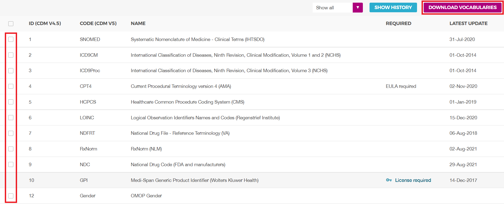  
*Odysseus Data Services, Inc. 「Athena」*  

<br>

［DOWNLOAD SUMMARY］が表示されるので、［name bundle］欄に任意の名前を入力してください。  
（［name bundle］に入力した名前は、［DOWNLOAD HISTORY］に表示されるファイル名になります）  
［Notify me about changes in these vocabularies］にチェックを入れて、［DOWNLOAD］をクリックします。  

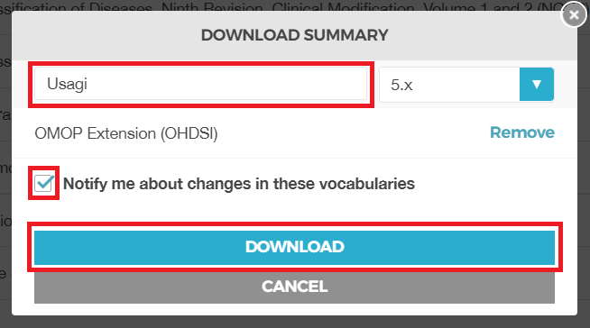  
*Odysseus Data Services, Inc. 「Athena」*  

<br>

vocabularyのダウンロードが準備中であるというメッセージが表示されます。  
[SHOW HISTORY]をクリックします。  

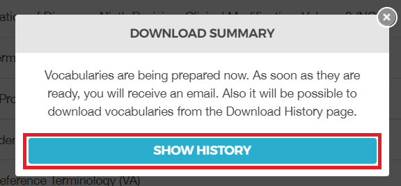  
*Odysseus Data Services, Inc. 「Athena」*  

<br>

ダウンロードの準備が完了するまで状態が「PENDING」となります。

  
*Odysseus Data Services, Inc. 「Athena」*  

<br>

ダウンロードの準備が完了すると、Athenaからメールが届きます。（ダウンロードクリックから数分程度かかります）  
メール受領後、Athena画面右上の［REFRESH］をクリックします。

  
*Odysseus Data Services, Inc. 「Athena」*  

<br>

［name bundle］で指定した名称の項目の［DOWNLOAD］をクリックするとvocabularyがダウンロードされます。  

  
*Odysseus Data Services, Inc. 「Athena」*  

<br>

ダウンロードしたvocabularyには下記のファイルが含まれています。  
これらのファイルはUsagiのIndexの作成で使用します。（【Usagi操作手順書】【3-3】参照）  
|ファイル名|  
|:---|  
|CONCEPT.csv|  
|CONCEPT_ANCESTOR.csv|  
|CONCEPT_CLASS.csv|  
|CONCEPT_CPT4.csv|  
|CONCEPT_RELATIONSHIP.csv|  
|CONCEPT_SYNONYM.csv|  
|DOMAIN.csv|  
|DRUG_STRENGTH.csv|  
|RELATIONSHIP.csv|  
|VOCABULARY.csv|  

<br>

Athena上でvocabularyにアップデートがあった場合には、Athenaより「Vocabulary versionupdate」という件名で登録したメールアドレス宛に通知が来ます。  

メール本文に新しいバージョンがリリースされたvocabulary名が記載されており、対象のvocabularyを最新化するために、Athenaのサイトから上記の方法に従って再度ダウンロードする必要があります。  

ダウンロード後は、改めてUsagiでvocabularyファイルの読込を実施してください。  

Usagiへの読込については、【Usagi操作手順書】の【3-3】を参照してください。  
