# **White Rabbit、Rabbit-in-a-Hat 操作手順**
## **目次**  
[1．本手順について](#1本手順について)  

[2．White Rabbit、Rabbit-in-a-Hatの関係図](#2white-rabbitrabbit-in-a-hatの関係図)  

[3．White Rabbit](#3white-rabbit)  
- [3．1．操作の流れ](#31操作の流れ)  
- [3．2．操作手順](#32操作手順)  
  - [3．2．1．【必須】データベースorテキストファイル選択](#321必須データベースorテキストファイル選択)  
  - [3．2．2．【必須】読み込みデータの選択](#322必須読み込みデータの選択)  
  - [3．2．3．【必須】データ（Scan report）の出力](#323必須データscan-reportの出力)  
  - [3．2．4．【オプション】スキャン条件の設定](#324オプションスキャン条件の設定)  
  - [3．2．5．【オプション】Fake data generation](#325オプションfake-data-generation)  

[4．Rabbit-in-a-Hat](#4rabbit-in-a-hat)  
- [4．1．操作の流れ](#41操作の流れ)  
- [4．2．操作手順](#42操作手順)  
  - [4．2．1．【必須】Scan reportの読み込み](#421必須scan-reportの読み込み)  
  - [4．2．2．【必須】ＣＤＭのバージョン選択](#422必須ｃｄｍのバージョン選択)  
  - [4．2．3．【必須】マッピング](#423必須マッピング)  
    - 1．テーブル間マッピング  
    - 2．テーブル内の項目間マッピング  
  - [4．2．4．【必須】データ出力](#424必須データ出力)  
- [4．3．【参考】機能紹介](#43参考機能紹介)  
  - [4．3．1．Mark Highlighted As Complete](#431mark-highlighted-as-complete)  
  - [4．3．2．Discard Value Counts](#432discard-value-counts)  
  - [4．3．3．Stem table](#433stem-table)  
  - [4．3．4．CDMのカスタマイズ](#434cdmのカスタマイズ)  

---
# **1．本手順について**
White Rabbit、Rabbit-in-a-Hatを操作するための手順について説明します。  
本操作手順は、以下の環境が準備されていることを前提としています。  
- Windows10（64ビット）
- Java（バージョン1.8以降）  
- [<ins>White Rabbitのインストール</ins>](https://github.com/OHDSI/WhiteRabbit/releases/tag/v0.10.3)

---
# **2．White Rabbit、Rabbit-in-a-Hatの関係図**
入力ソースデータは、電子カルテデータになります。  
OMOP CDMの各リソースへマッピング支援するのが、Rabbit-in-a-Hatです。
Rabbit-in-a-Hatでマッピング作業を進めるために、White Rabbitでは入力データをRabbi-in-a-Hatで取り込み可能な形式に加工します。  

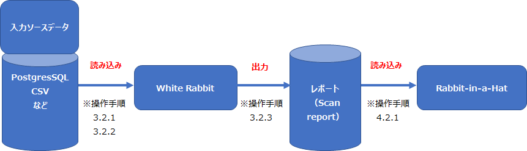

---
# **3．White Rabbit**

---
## **3．1．操作の流れ**
操作の流れを以下に示します。

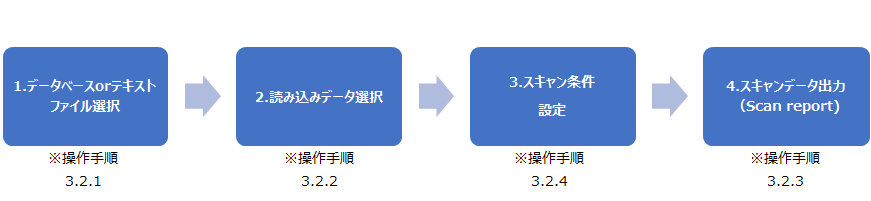

---
## **3．2．操作手順**
White Rabbitの操作方法について説明します。  
データ出力において必要な操作には【必須】、任意の操作には【オプション】と記載しています。  

### **3．2．1．【必須】データベースorテキストファイル選択**
Rabbit-in-a-Hatに入力するデータと出力されるデータについて、設定を実施します。  

**入力データ**  
[Locations]タブを開き、[Working Folder]の[Source data location]で、データを読み込むためのセッティングを実施します。  

[Data type]では、データの形式（データベース、またはテキストファイル）（①）を選択します。  
CSVファイルを読み込ませる場合、「Delimited text files」を選択してください。  
[Data type]にてデータベースを選択した場合は、
サーバーの場所（②）、ユーザー名（③）、パスワード（④）、データベース名（⑤）を入力し、[Test Connection]ボタン（⑥）をクリックします。  

接続に成功すると⑦のメッセージが表示されます。  

**出力データ**  
[Locations]タブを開き、[Working Folder]の[Pick folder]ボタンをクリックし、生成されるファイル（Scan report）の格納先フォルダーを選択します。

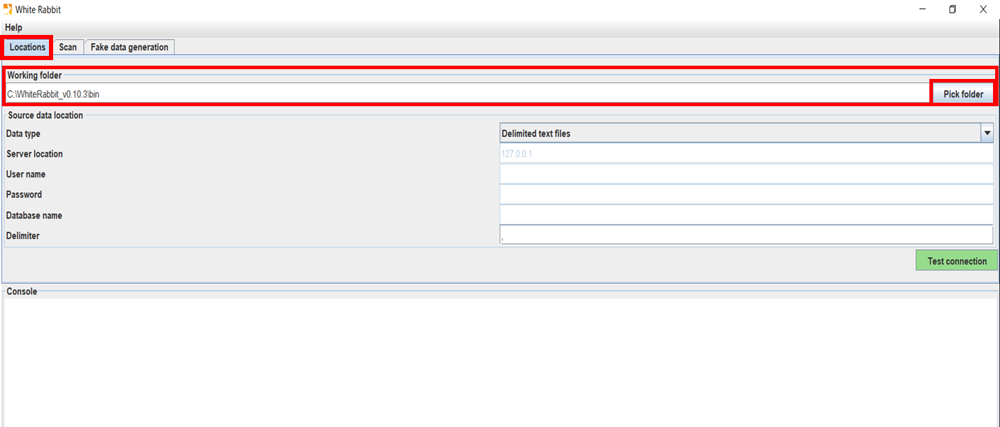

以上でデータベース or テキストファイルの選択作業は終了です。

## **3．2．2．【必須】読み込みデータの選択**
Rabbit-in-a-Hatでマッピングしたいデータの選択を実施します。  
[Scan]タブを開きます。  
[Tables to scan]では、Scan reportを作成したいテーブル・ファイルを選択、条件設定をします。  

3．2．1でデータベース接続を選択した場合は、  
- [Add all in DB]ボタン（①）で、選択したデータベースの全テーブルを追加することができます。  
- [Add]ボタン（②）で、データベース内のテーブルを選択して追加することができます。  
- [Remove]ボタン（③）で、追加済みのテーブルを選択して削除することができます。

3．2．1でテキストファイルを選択した場合は、  
- [Add]ボタン（②）を押し、ローカルに保存されたテキストファイルを選択して追加することができます。  
- [Remove]ボタン（③）で、追加済みのテーブルを選択して削除することができます。

## **3．2．3．【必須】データ（Scan report）の出力**
[Scan tables]ボタン（①）を選択すると追加したテーブルが読み込まれ、読み込みが成功するとコンソールに Scan report generated と表示されます。（②）  
3．2．1で指定したファルダに、「ScanReport.xlsx」が生成されています。  

## **3．2．4．【オプション】スキャン条件の設定**
読み込みデータを選択後、出力データ（Scan report）の形式を設定したい場合に[Scan field values]にチェックを入れることで、下記の項目に関して設定が可能です。  
チェックを入れなかった場合は出力データに生データの項目が表示されなくなり、Rabbit-in-a-Hat上の操作でも生データの情報は表示されなくなります。  
Rabbit-in-a-Hatで生データの情報を確認しながらマッピングしたい場合は、こちらの条件設定を実施する必要があります。  

|条件（英語）|条件（日本語）|実行内容|  
|:---|:---|:---|  
|Min cell count|最小セル数（①）|ソースデータ数が設定値以上のときデータ値をレポートに表示、設定値未満の場合はtruncatedと表示|  
|Max distinctvalues|最大個別値（②）|設定した数の個別の値がスキャンレポートに表示、設定値未満の値は表示されず、truncatedが表示|  
|Rows per table|テーブル当たりの行数（③）|テーブル内の設定数行の値の並びがランダム化|
|Numeric stats|数値統計（④）|平均、標準偏差、最小値、四分位数、最大値を、すべての整数、実数、日付のデータ型に対して統計実施||
|Numeric stats reservoir size|数値統計保有サイズ（⑤）|統計実施可能なデータ数|

## **3．2．5．【オプション】Fake data generation**
Fake data generation では、テストデータを作成することができます。  
3．2．3で生成された「ScanReport.xlsx」を読み込むことで、元のソースデータの値がランダムに並べられたソースデータが生成されます。

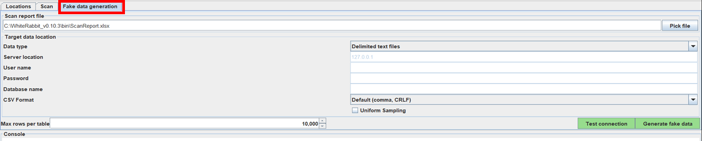

White Rabbitでの作業説明は以上です。

---
# **4．Rabbit-in-a-Hat**

---
## **4．1．操作の流れ**

Rabbit-in-a-Hatの操作の流れを以下に示します。

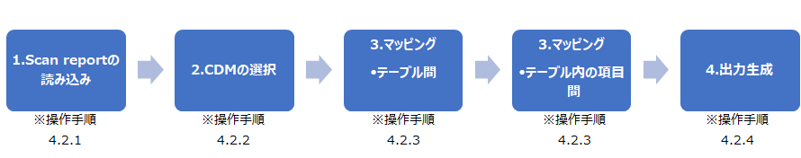

本手順では、CDM Version6.0のpersonテーブルとのマッピングを例に挙げて操作説明を進めていきます。  

---
## **4．2．操作手順**
Rabbit-in-a-Hatの操作方法について説明します。
マッピングにおいて必要な操作には【必須】、任意の操作には【オプション】と記載しています。

### **4．2．1．【必須】Scan reportの読み込み**
[File]タブの[Open Scan Report]（①）から、White Rabbitで生成された「ScanReport.xlsx」を選択します。  
選択後、ファイルが読み込まれて左側の[Source]にWhite Rabbitで読み込んだデータのテーブル名がオレンジ色の箱に表示されます。（②） 

**＜読み込み前＞**
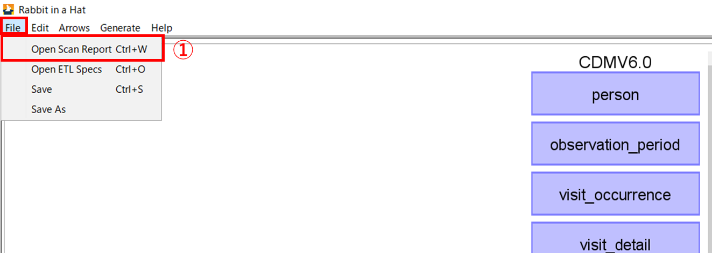

**＜読み込み後＞**
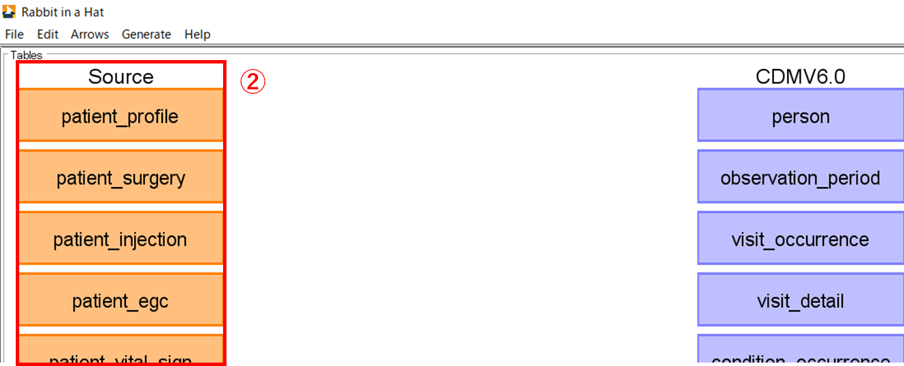

### **4．2．2．【必須】ＣＤＭのバージョン選択**
[Edit]タブの[Set Target Database]（①）より、CDMのバージョンを選択可能することができます。  
本手順では、CDM v6.0を選択します。（デフォルトですでに設定されています）

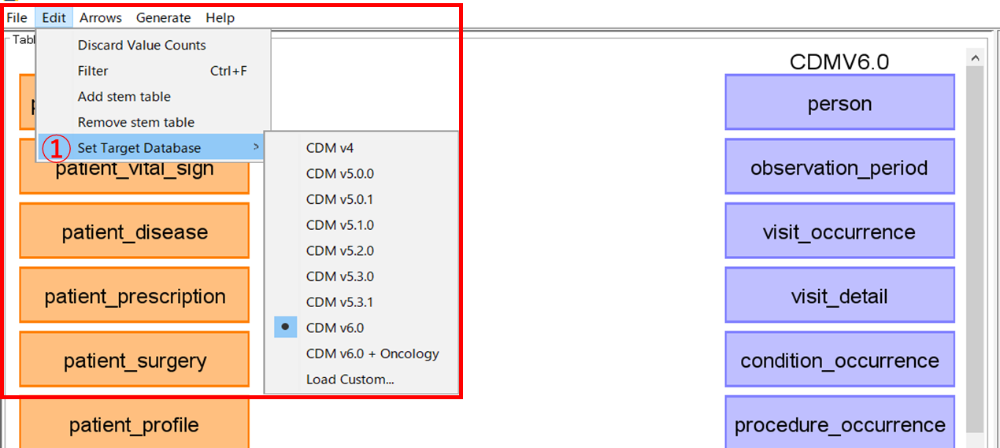

### **4．2．3．【必須】マッピング**
テーブル・項目を関連づけるために矢印を使って箱同士を結び付けます。箱はドラッグアンドドロップで移動することができます。  

マッピングには2種類あります。  
- 1．テーブル間マッピング  
- 2．テーブル内の項目間マッピング

**1．テーブル間マッピング**  
Sourceテーブルにカーソルを合わせると矢印が表示されます。（①）  
関連づけたいCDMのテーブルに向けて矢印を移動し、つなげる（②）ことでマッピングができます。  
矢印は１つのソーステーブルから複数のCDMテーブルに対して接続可能です。  
また、複数のテーブルから１つのCDMのテーブルに接続することも可能です。  

personとpatient_profileを矢印でつなぎマッピングをします。  

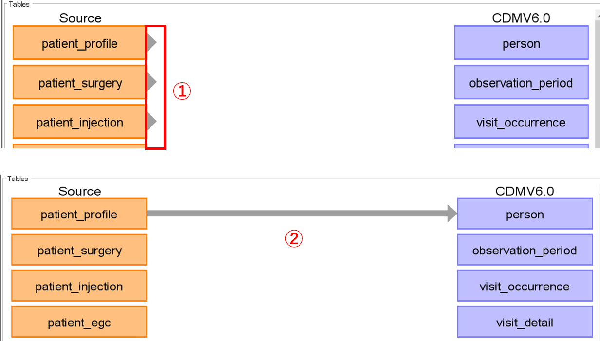

矢印をクリックすると、マッピング画面の右側に[Detail]欄が表示されます。  
ここでは、ソーステーブル(Scan report)とターゲットテーブル（CDM）が表示される（③）ほかLogic（④）にはマッピングに関するロジックに関する伝達事項、Comments（⑤）には特記事項がある場合に自由に記載可能です。  

箱をクリックすると、マッピング画面右側に[Details]欄が表示され、各テーブルの詳細情報が記載されています。  
テーブル名（⑥）、テーブルの行数（⑦）、項目名（⑧）、項目のデータ型（⑨）を確
認することができます。  

画面下には[Comments]欄（⑩）があり、記載事項があれば記入することが可能です。  

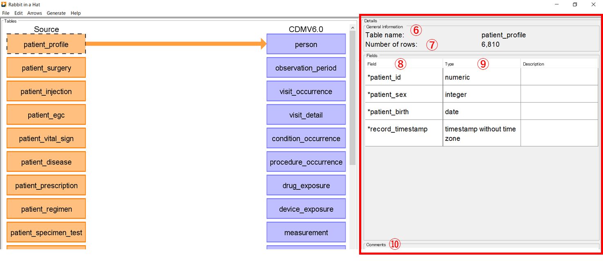

**2．テーブル内の項目間マッピング**  
1でマッピングした矢印をダブルクリックすると、双方のテーブルの各項目が表示されます。（①）

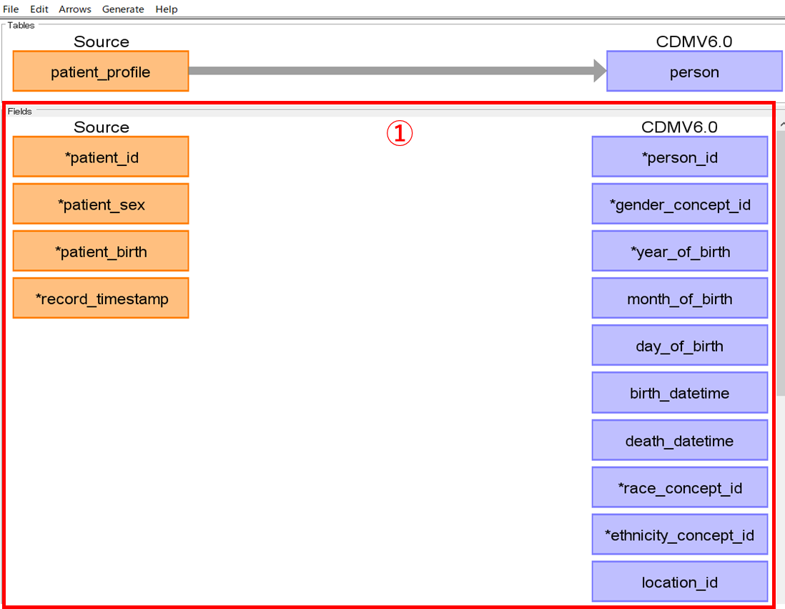

下図のように各項目をマッピングしていきます。  
マッピングの方法は、１と同様の操作です。（見えやすくするために、箱は初期位置から移動させています。）  

<patient_profileとpersonの項目間のマッピング>
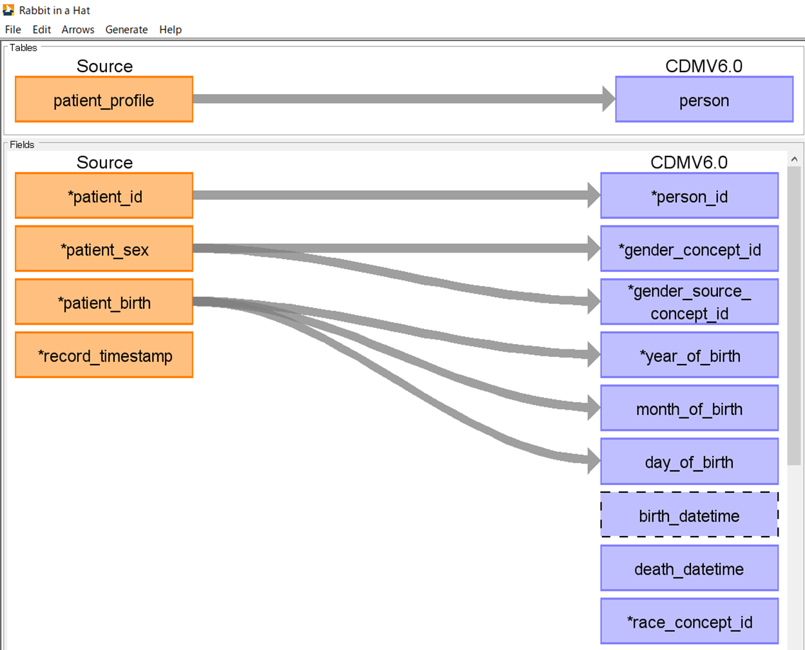

項目の箱をクリックするとマッピング画面右側に[Details]欄が表示されて、詳細情報を確認することができます。  

項目名（②）、データ型（③）、データの固有値（④）、生データ（⑤）が表示されます。
下部には[Comments]欄（⑥）があり、特記事項があれば記入することが可能です。

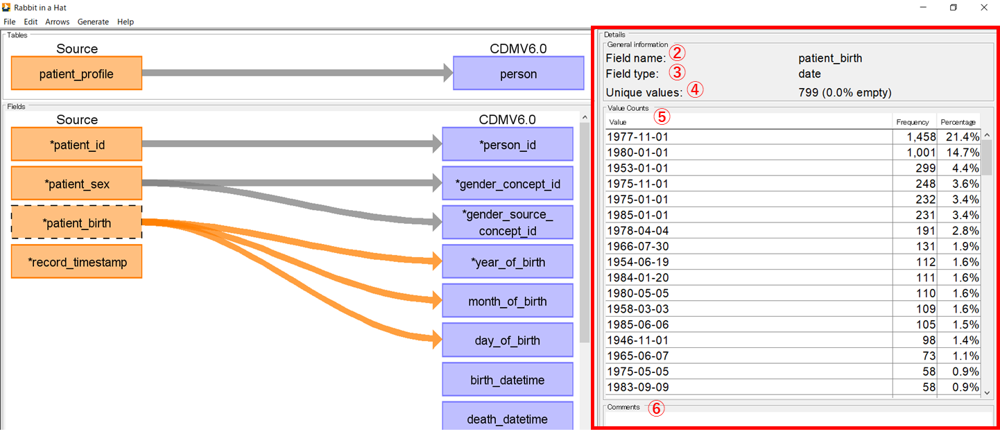

以上でpatient_profileテーブルとpersonテーブルのマッピング操作は終了です。

### **4．2．4．【必須】データ出力**
マッピングしたデータを出力する場合は、[File]タブの[Save As]をクリックし（①）、任意の場所にGZIP形式で保存（②）します。  

[File]タブの[Open ETL specs]（①）からGZIPファイルを開くことで（②）、マッピング処理が保持された状態で再開することができます。（③）

他にも、必要に応じて以下のデータを出力することができます。

|ドキュメントの種類|概要|
|:---|:---|
|ETL Document（①）|テーブル間マッピング図表、テーブル内項目マッピング図表をWord、HTML、Markdown形式で出力|
|Overview Table（②）|各テーブルのテーブル名、データ型などの詳細情報をCSV形式で出力|
|ETL TestFramework（③）|ETLプロセスが指定どおりに機能していることを確認するためのテストフレームワーク（Ｒ）を出力|
|SQL Skeleton Files（④）|各テーブルのSQLデータ|

---
## **4．3．【参考】機能紹介**
Rabbit-in-a-Hatで使用できる機能を紹介します。必須機能ではありません。  

### **4．3．1．Mark Highlighted As Complete**
矢印の色を変えて、マッピングが完了しているか否かを判別できるようにするものです。  
矢印をクリックして選択後（①）に[Arrows]タブの[Mark Highlighted As Complete]をクリック（②）します。  
処理を実施した矢印の色が変化して、他と差別化可能（③）となります。  
[Mark Highlighted As Incomplete]（④）で元の色の矢印に戻すことが可能です。  

### **4．3．2．Discard Value Counts**
ソースデータの集計値やCDMの項目内のコンセプト情報を破棄します。  
テーブル名をダブルクリックしてテーブル内の項目を選択後、[Edit]タブの[Discard Value Counts]（①）をクリックすると、[Value Counts]欄に表示されていた集計値が消えます。（②）  

この処理を実施したデータを保存した場合、破棄状態も保持されます。  

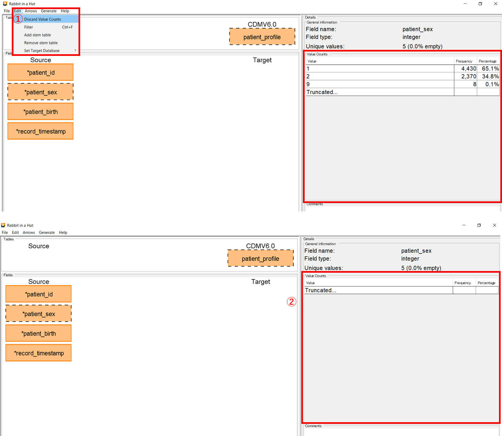

### **4．3．3．Stem table**  
あるSourceテーブルが複数のCDMテーブルにマッピングする必要がある場合に、Stem tableを使用することでマッピングを繰り返す手間がなくなり、実装を容易にすることが可能になります。  
しかし、Stem table内の項目はCDMのバージョンごとに決まっており、CDMへのマッピング先の追加はできません。  
また、項目同士のマッピングについて不明瞭な点があること、Stem table省力化のための機能であることから現段階では、使用する必要はないと考えられます。  
使用方法を以下に記載します。  
[Edit]タブの[Add stem table]を選択する（①）と、紫色のstem_tableの箱がtables画面の中央上部に表示されます。（②）  
デフォルトでは、図に示されるように７つのテーブルに接続済みです。（③）  

### **4．3．4．CDMのカスタマイズ**
CDMは下図に示されるバージョンのほかに、カスタマイズすることも可能です。  
カスタマイズするためには、github上に共有されている「CDMV5.csv」の形式に則ったCSVファイルを作成する必要があります。  

[Edit]タブの[Set Target Database]（①）から[Load custom...]（②）を選択し、作成した新たなCDMファイルを選択します。  
このとき、ファイル名がCDM名として表示されます。（③）

<CDMV5の形式に従って作成したCDM_custom>

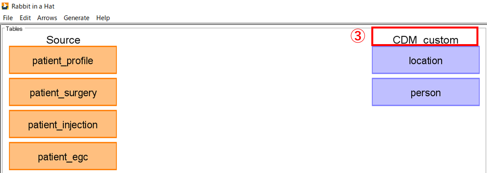