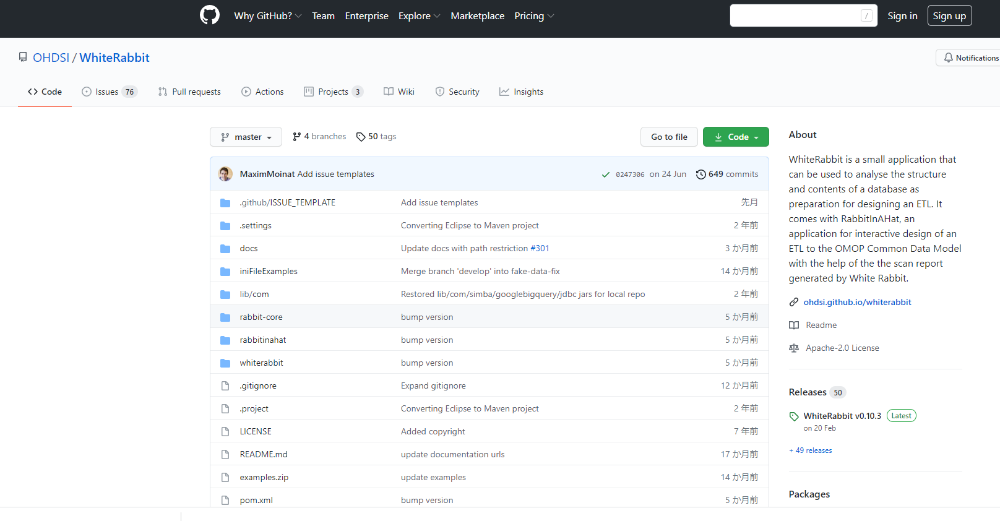
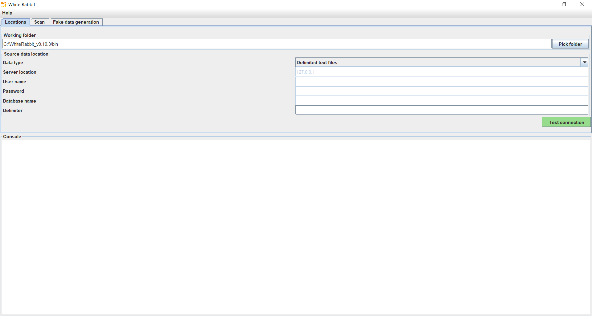
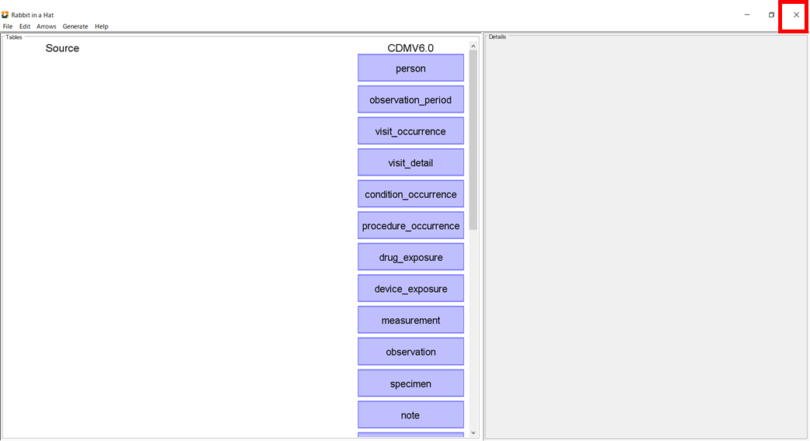

# **White Rabbit・Rabbit-in-a-Hat セットアップ手順**
## **目次**
[1．本手順について](#1本手順について)  

[2．White Rabbit・Rabbit-in-a-Hatのセットアップ](#2white-rabbit・rabbit-in-a-hatのセットアップ)  
- [2．1．White Rabbit・Rabbit-in-a-Hatのインストール](#21white-rabbit・rabbit-in-a-hatのインストール)  

- [2．2．White Rabbitの起動・停止](#22white-rabbitの起動・停止)  
  - [2．2．1．White Rabbitの起動](#221white-rabbitの起動)  
  - [2．2．2．White Rabbitの停止](#222white-rabbitの停止)  
- [2．3．Rabbit-in-a-Hatの起動・停止](#23rabbit-in-a-hatの起動・停止)  

  - [2．3．1．Rabbit-in-a-Hatの起動](#231rabbit-in-a-hatの起動)  
  - [2．3．2．Rabbit-in-a-Hatの停止](#232rabbit-in-a-hatの停止)

 

---
# **1．本手順について**
White Rabbitをセットアップするための手順を説明します。  
本セットアップ手順は、以下の環境が準備されていることを前提としています。  

- Windows10（64ビット）
- Java（バージョン1.8以降）

作業の所要時間は約1時間です。  

 

---
# **2．White Rabbit・Rabbit-in-a-Hatのセットアップ**
White Rabbit・Rabbit-in-a-Hatの動作環境を構築します。  
[<ins>GithubのOHDSI/WhiteRabbit</ins>](https://github.com/OHDSI/WhiteRabbit)にアクセスして、セットアップを進めていきます。

 

---
## **2．1．White Rabbit・Rabbit-in-a-Hatのインストール**
GithubのOHDSI/USAGIページの［Getting Started］項目内の[<ins>Releases,</ins>](https://github.com/OHDSI/WhiteRabbit/releases)（赤枠）をクリックします。

 

WhiteRabbit_v0.10.3.zip（赤枠）をクリックしてダウンロードします。  
本ファイル内には、White RabbitとRabbit-in-a-Hatのファイルが格納されています。  
（バージョンが異なる場合、参考資料とファイル名も異なるためご注意ください。）  

ダウンロードが完了したらファイルを右クリックし、［すべて展開］を選択して、任意の展開先を参照して解凍し、保存します。

 

---
## **2．2．White Rabbitの起動・停止**
### **2．2．1．White Rabbitの起動**
２．１でダウンロードしたファイルの［bin］フォルダを開きます。

［bin］フォルダ内のwhiteRabbit.batをダブルクリックすると、White Rabbitが起動して画面が表示されます。

 

---
### **2．2．2．White Rabbitの停止**
White Rabbit終了時は、画面右上の［×］をクリックして画面を閉じます。

 

---
## **2．3．Rabbit-in-a-Hatの起動・停止**
### **2．3．1．Rabbit-in-a-Hatの起動**
2．2と同様の手順で起動することができます。  
3．2でダウンロードしたファイルの［bin］フォルダを開きます。

 

RabbitInAHat.batをダブルクリックすると、Rabbit-in-a-Hatが起動して画面が表示されます。

 

---
### **2．3．2．Rabbit-in-a-Hatの停止**
Rabbit-in-a-Hat終了時は、画面右上の［×］をクリックして画面を閉じます。

